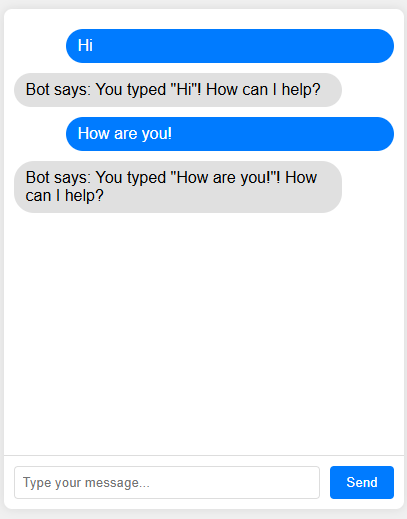

# Tutorial: Building a Simple Chatbot with HTML, CSS, and JavaScript

Welcome to this tutorial where you'll learn how to build a simple chatbot from scratch. This project is a great way to get started with web development, as it covers the three fundamental technologies of the web: HTML for structure, CSS for styling, and JavaScript for interactivity.

## Final Result

Here is what you will be building:



## Step 1: Setting up the HTML Structure

First, we'll create the basic structure of our chatbot using HTML. HTML (HyperText Markup Language) is the standard language for creating web pages.

Create a file named `index.html` and add the following code:

```html
<!DOCTYPE html>
<html lang="en">
<head>
    <meta charset="UTF-8">
    <meta name="viewport" content="width=device-width, initial-scale=1.0">
    <title>Simple Chatbot</title>
</head>
<body>
    <div class="chat-container">
        <div id="chat-messages" class="chat-messages"></div>
        <div class="input-container">
            <input type="text" id="user-input" placeholder="Type your message...">
            <button id="send-button">Send</button>
        </div>
    </div>
</body>
</html>
```

### Explanation of the HTML code

* `<!DOCTYPE html>`: Declares the document type.
* `<html>`: The root element of an HTML page.
* `<head>`: Contains meta-information about the HTML page, like the title.
* `<title>`: Sets the title of the page, which appears in the browser tab.
* `<body>`: Contains the visible content of the HTML page.
* `<div class="chat-container">`: A container for the entire chatbot interface.
* `<div id="chat-messages">`: This is where the chat messages will be displayed.
* `<div class="input-container">`: A container for the user input field and the send button.
* `<input type="text" id="user-input">`: A text field where the user can type their message.
* `<button id="send-button">`: A button to send the message.

At this point, if you open `index.html` in a browser, you will see a simple text box and a button. It's not pretty yet, but that's what CSS is for!

## Step 2: Styling with CSS

Now let's add some style to our chatbot using CSS (Cascading Style Sheets). CSS is used to control the presentation, formatting, and layout of web pages.

Add the following `<style>` block inside the `<head>` section of your `index.html` file, just before the closing `</head>` tag.

```html
<head>
    ...
    <title>Simple Chatbot</title>
    <style>
        body { font-family: Arial, sans-serif; background-color: #f0f0f0; display: flex; justify-content: center; align-items: center; height: 100vh; margin: 0; }
        .chat-container { background-color: white; border-radius: 8px; box-shadow: 0 0 10px rgba(0, 0, 0, 0.1); width: 400px; height: 500px; display: flex; flex-direction: column; }
        .chat-messages { flex: 1; padding: 10px; overflow-y: auto; border-bottom: 1px solid #ddd; }
        .message { margin: 10px 0; padding: 8px 12px; border-radius: 20px; max-width: 80%; }
        .user-message { background-color: #007bff; color: white; align-self: flex-end; margin-left: auto; }
        .bot-message { background-color: #e0e0e0; color: black; align-self: flex-start; margin-right: auto; }
        .input-container { display: flex; padding: 10px; }
        #user-input { flex: 1; padding: 8px; border: 1px solid #ddd; border-radius: 4px; margin-right: 10px; }
        #send-button { padding: 8px 16px; background-color: #007bff; color: white; border: none; border-radius: 4px; cursor: pointer; }
        #send-button:hover { background-color: #0056b3; }
    </style>
</head>
```

### Explanation of the CSS code

* We are styling the `body` to center the chat container on the page.
* `.chat-container` is styled to look like a chat window with a border, shadow, and rounded corners.
* `.chat-messages` is the area where messages will appear. `overflow-y: auto;` allows scrolling if there are many messages.
* `.message`, `.user-message`, and `.bot-message` define the appearance of the chat bubbles for the user and the bot.
* The rest of the styles are for the input field and send button to make them look nice and user-friendly.

Refresh your `index.html` in the browser. Now it should look much more like a real chat application!

## Step 3: Adding JavaScript for Interactivity

Finally, let's add JavaScript to make our chatbot functional. JavaScript is a programming language that allows you to implement complex features on web pages.

Add the following `<script>` block at the end of your `<body>` section, just before the closing `</body>` tag.

```html
<body>
    ...
    <script>
        const chatMessages = document.getElementById('chat-messages');
        const userInput = document.getElementById('user-input');
        const sendButton = document.getElementById('send-button');

        function addMessage(text, isUser) {
            const messageDiv = document.createElement('div');
            messageDiv.classList.add('message');
            if (isUser) {
                messageDiv.classList.add('user-message');
            } else {
                messageDiv.classList.add('bot-message');
            }
            messageDiv.textContent = text;
            chatMessages.appendChild(messageDiv);
            chatMessages.scrollTop = chatMessages.scrollHeight;
        }

        sendButton.addEventListener('click', () => {
            const message = userInput.value.trim();
            if (message) {
                addMessage(message, true);
                userInput.value = '';

                setTimeout(() => {
                    const botReply = `Bot says: You typed "${message}"! How can I help?`;
                    addMessage(botReply, false);
                }, 1000);
            }
        });

        userInput.addEventListener('keypress', (event) => {
            if (event.key === 'Enter') {
                sendButton.click();
            }
        });
    </script>
</body>
```

### Explanation of the JavaScript code

* We first get references to our HTML elements (`chat-messages`, `user-input`, `send-button`) using `document.getElementById`.
* The `addMessage` function creates a new `div` for a message, styles it as a user or bot message, adds the text, and appends it to the chat messages area.
* We add a 'click' event listener to the `sendButton`. When clicked, it takes the user's message, displays it, and then simulates a bot reply after a 1-second delay using `setTimeout`.
* We also add a 'keypress' event listener to the `userInput` to allow sending a message by pressing the 'Enter' key.

Now, open `index.html` in your browser one last time. You should have a fully functional, if simple, chatbot!

## Conclusion and Next Steps

Congratulations! You have successfully built a simple chatbot using HTML, CSS, and JavaScript.

From here, you can try to:

* Create separate files for your CSS (`styles.css`) and JavaScript (`script.js`) and link them to your HTML. This is a best practice for organizing your code.
* Improve the bot's intelligence by adding more complex logic to its replies.
* Add more features, like timestamps for messages or user avatars.

Happy coding!

## Question


Which part of the code is resposible for the scrolling of the chat messages?
