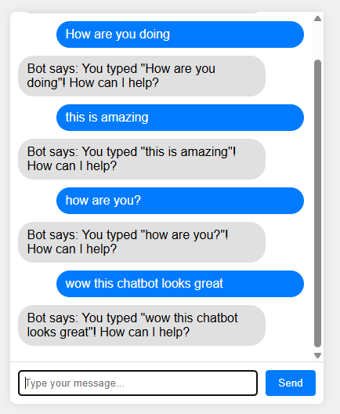

# Week 02 - Code 03: From React CDN to TypeScript React Project

## Learning Objectives

By the end of this tutorial, you will:

1. Understand why we need Node.js and npm for modern web development
2. Set up a proper development environment
3. Transition from CDN-based React to a proper React project
4. Learn the basics of TypeScript
5. Build a chatbot using React with TypeScript

## Table of Contents

1. [Understanding TypeScript - What and Why?](#understanding-typescript---what-and-why)
2. [Why Node.js and npm?](#why-nodejs-and-npm)
3. [Installing Node.js and npm](#installing-nodejs-and-npm)
4. [Understanding Package Management](#understanding-package-management)
5. [Creating a React TypeScript Project](#creating-a-react-typescript-project)
6. [Building Our Chatbot](#building-our-chatbot)
7. [Comparison: All Three Approaches](#comparison-all-three-approaches)

## Understanding TypeScript - What and Why?

Before we dive into the complex world of Node.js and npm, let's first understand **TypeScript** - the language we'll be using.

### What is TypeScript?

TypeScript is **JavaScript with types**. It's like adding safety features to a car - the car still drives the same way, but it helps prevent accidents.

### Simple Example - JavaScript vs TypeScript

**JavaScript (can cause runtime errors):**

```javascript
function calculateAge(birthYear) {
    return 2025 - birthYear;
}

// These will all "work" but might give unexpected results
calculateAge(1990);        // ✅ 35 (correct)
calculateAge("1990");      // ✅ 35 (works by accident)
calculateAge("hello");     // ❌ NaN (runtime error)
calculateAge();            // ❌ NaN (runtime error)
```

**TypeScript (catches errors before running):**

```typescript
function calculateAge(birthYear: number): number {
    return 2025 - birthYear;
}

calculateAge(1990);        // ✅ 35 (correct)
calculateAge("1990");      // ❌ TypeScript error: string not allowed
calculateAge("hello");     // ❌ TypeScript error: string not allowed  
calculateAge();            // ❌ TypeScript error: missing parameter
```

### Why Use TypeScript?

1. **Catch Bugs Early**: Errors are found while writing code, not when users use your app
2. **Better IDE Support**: Auto-completion, refactoring, navigation
3. **Self-Documenting Code**: Types serve as documentation
4. **Easier Refactoring**: Confident code changes across large projects
5. **Team Collaboration**: Clear contracts between different parts of code

### TypeScript in React Context

**JavaScript React:**

```javascript
function Welcome(props) {
    return <h1>Hello, {props.name}!</h1>;
}

// Could be used incorrectly:
<Welcome name={123} />        // Works, but displays "Hello, 123!"
<Welcome />                   // Works, but displays "Hello, !"
```

**TypeScript React:**

```typescript
interface WelcomeProps {
    name: string;
}

function Welcome(props: WelcomeProps) {
    return <h1>Hello, {props.name}!</h1>;
}

// TypeScript prevents mistakes:
<Welcome name={123} />        // ❌ Error: number not allowed
<Welcome />                   // ❌ Error: name is required
<Welcome name="Alice" />      // ✅ Correct usage
```

### The Learning Strategy

Now that you understand **what** TypeScript is and **why** it's useful, let's learn **how** to set up the tools needed to use it effectively.

## Why Node.js and npm?

### The Problem with CDN Approach

In our previous React example (`code02_react`), we used React from CDN:

```html
<script crossorigin src="https://unpkg.com/react@18/umd/react.development.js"></script>
<script crossorigin src="https://unpkg.com/react-dom@18/umd/react-dom.development.js"></script>
<script src="https://unpkg.com/@babel/standalone/babel.min.js"></script>
```

**Problems with this approach:**

1. **Internet Dependency**: Your app won't work offline
2. **Performance**: Loading libraries from CDN is slower
3. **Version Control**: Hard to ensure everyone uses the same versions
4. **Limited Features**: Can't use advanced build tools, TypeScript, or modern JavaScript features
5. **No Package Management**: Can't easily add new libraries
6. **Development Tools**: No hot reload, debugging tools, or optimization

### The Solution: Node.js and npm

**Node.js** is a JavaScript runtime that allows you to run JavaScript outside the browser.
**npm** (Node Package Manager) is a tool that comes with Node.js for managing packages (libraries).

**Benefits:**

1. **Offline Development**: All dependencies are downloaded locally
2. **Build Tools**: Compile TypeScript, bundle files, optimize for production
3. **Package Management**: Easy to add, update, and manage dependencies
4. **Development Server**: Hot reload, error reporting, debugging tools
5. **Modern JavaScript**: Use latest JavaScript/TypeScript features
6. **Code Organization**: Split code into multiple files and components

## Installing Node.js and npm

- **Please refer to the installation guide**

## Understanding Package Management

### What is a Package?

A **package** is a reusable piece of code that someone else has written. Examples:
- `react`: The React library
- `typescript`: The TypeScript compiler
- `axios`: HTTP client for making API requests

### package.json

This file is like a "recipe" for your project. It contains:
- Project information (name, version, description)
- List of dependencies (packages your project needs)
- Scripts (commands you can run)

Example `package.json`:
```json
{
  "name": "my-chatbot",
  "version": "1.0.0",
  "dependencies": {
    "react": "^18.2.0",
    "react-dom": "^18.2.0"
  },
  "scripts": {
    "start": "react-scripts start",
    "build": "react-scripts build"
  }
}
```

### .nvmrc (Node Version Specification)

If you're using nvm, you can create a `.nvmrc` file in your project root to specify which Node.js version to use:

```
18.17.0
```

This allows team members to use the same Node.js version:

```bash
# Use the version specified in .nvmrc
nvm use

# Install the version if not already installed
nvm install
```

**Benefits:**

- **Consistency**: All team members use the same Node.js version
- **Compatibility**: Ensures the project works with the tested Node.js version
- **Documentation**: Makes Node.js requirements explicit
    "start": "react-scripts start",
    "build": "react-scripts build"
  }
}

```

### npm Commands

```bash
npm install package-name    # Install a package
npm install                 # Install all packages in package.json
npm start                   # Run the start script
npm run build              # Run the build script
npm update                 # Update packages
```

## Creating a React TypeScript Project

Now let's create our project! We'll use `create-react-app`, a tool that sets up everything for us.

### Step 1: Create the Project

Open your terminal and navigate to the `code03_typescript_react` folder:

```bash
# Navigate to the project directory
cd "week02\code03_typescript_react"

# Create a new React TypeScript project
npx create-react-app chatbot-app --template typescript

# Navigate into the project
cd chatbot-app
```

### Step 2: Understanding the Project Structure

After creation, you'll see this structure:

```
chatbot-app/
├── public/
│   ├── index.html      # Main HTML file
│   └── favicon.ico     # Website icon
├── src/
│   ├── App.tsx         # Main App component
│   ├── index.tsx       # Entry point
│   ├── App.css         # App styles
│   └── index.css       # Global styles
├── package.json        # Project configuration
└── tsconfig.json       # TypeScript configuration
```

### Step 3: Start the Development Server

```bash
npm start
```

This will:

- Start a development server on <http://localhost:3000>
- Open your browser automatically
- Watch for file changes and reload automatically

## TypeScript in React - Advanced Concepts

Now that you understand the basics of TypeScript and have your development environment set up, let's explore how TypeScript enhances React development specifically.

### Typing React Components

**Props Interface:**

```typescript
interface ChatMessageProps {
    message: string;
    sender: 'user' | 'bot';
    timestamp: Date;
    onEdit?: (newMessage: string) => void; // Optional function
}

function ChatMessage({ message, sender, timestamp, onEdit }: ChatMessageProps) {
    return (
        <div className={`message ${sender}-message`}>
            <p>{message}</p>
            <span>{timestamp.toLocaleTimeString()}</span>
            {onEdit && <button onClick={() => onEdit('new text')}>Edit</button>}
        </div>
    );
}
```

### Typing React Hooks

**useState with Types:**

```typescript
// Explicit typing
const [count, setCount] = useState<number>(0);
const [user, setUser] = useState<User | null>(null);
const [messages, setMessages] = useState<Message[]>([]);

// TypeScript can often infer types
const [input, setInput] = useState(''); // inferred as string
const [isLoading, setIsLoading] = useState(false); // inferred as boolean
```

**useEffect with Proper Cleanup:**

```typescript
useEffect(() => {
    const handleKeyPress = (event: KeyboardEvent) => {
        if (event.key === 'Enter') {
            handleSend();
        }
    };

    window.addEventListener('keypress', handleKeyPress);
    
    // Cleanup function
    return () => {
        window.removeEventListener('keypress', handleKeyPress);
    };
}, []);
```

### Event Handling Types

```typescript
// Form events
const handleSubmit = (event: React.FormEvent<HTMLFormElement>) => {
    event.preventDefault();
    // Handle form submission
};

// Input events
const handleInputChange = (event: React.ChangeEvent<HTMLInputElement>) => {
    setInput(event.target.value);
};

// Button clicks
const handleClick = (event: React.MouseEvent<HTMLButtonElement>) => {
    console.log('Button clicked at', event.clientX, event.clientY);
};

// Keyboard events
const handleKeyPress = (event: React.KeyboardEvent<HTMLInputElement>) => {
    if (event.key === 'Enter') {
        handleSend();
    }
};
```

### Benefits You'll Experience

1. **Autocomplete**: Your editor will suggest available properties and methods
2. **Error Prevention**: Catch typos and wrong types before running
3. **Refactoring Safety**: Rename variables/functions across entire project safely
4. **Documentation**: Interfaces serve as inline documentation
5. **Team Collaboration**: Clear contracts between components

## Building Our Chatbot

Let's recreate our chatbot using React with TypeScript. We'll build it step by step, transforming our `index-react.html` into a proper TypeScript React project.

### Step 1: Clean Up the Default Project

First, let's replace the default App.tsx content with our chatbot.

1. Delete the contents of `src/App.tsx`
2. Delete the contents of `src/App.css` (we'll add our own styles)
3. Keep `src/index.tsx` and `src/index.css` as they are

### Step 2: Define Types

Create proper TypeScript interfaces for our chatbot data:

```typescript
// Types for our chatbot
interface Message {
    id: number;
    text: string;
    sender: 'user' | 'bot';
    timestamp: Date;
}

interface ChatbotState {
    messages: Message[];
    input: string;
}
```

### Step 3: Transform HTML Styles to CSS

In `src/App.css`, replace the content with our chatbot styles:

```css
/* App.css - Chatbot Styles */
body {
    font-family: Arial, sans-serif;
    background-color: #f0f0f0;
    display: flex;
    justify-content: center;
    align-items: center;
    height: 100vh;
    margin: 0;
}

.chat-container {
    background-color: white;
    border-radius: 8px;
    box-shadow: 0 0 10px rgba(0, 0, 0, 0.1);
    width: 400px;
    height: 500px;
    display: flex;
    flex-direction: column;
}

.chat-messages {
    flex: 1;
    padding: 10px;
    overflow-y: auto;
    border-bottom: 1px solid #ddd;
}

.message {
    margin: 10px 0;
    padding: 8px 12px;
    border-radius: 20px;
    max-width: 80%;
}

.user-message {
    background-color: #007bff;
    color: white;
    align-self: flex-end;
    margin-left: auto;
}

.bot-message {
    background-color: #e0e0e0;
    color: black;
    align-self: flex-start;
    margin-right: auto;
}

.input-container {
    display: flex;
    padding: 10px;
}

.user-input {
    flex: 1;
    padding: 8px;
    border: 1px solid #ddd;
    border-radius: 4px;
    margin-right: 10px;
}

.send-button {
    padding: 8px 16px;
    background-color: #007bff;
    color: white;
    border: none;
    border-radius: 4px;
    cursor: pointer;
}

.send-button:hover {
    background-color: #0056b3;
}
```

### Step 4: Create the TypeScript Chatbot Component

Now, let's create our complete `App.tsx` with proper TypeScript:

**Important Note about React Imports in Modern React:**

- ✅ **Keep React import** when using hooks (`useState`, `useEffect`) or React types
- ❌ **Remove React import** for simple components that only use JSX
- This project uses React 19+ with the new JSX Transform

```typescript
// src/App.tsx
import React, { useState, useEffect, useRef } from 'react';
import './App.css';

// TypeScript Interface Definitions
interface Message {
    id: number;
    text: string;
    sender: 'user' | 'bot';
    timestamp: Date;
}

// Main Chatbot Component
function App(): React.JSX.Element {
    // STATE MANAGEMENT with TypeScript
    const [messages, setMessages] = useState<Message[]>([
        {
            id: 1,
            text: "How can I help?",
            sender: "bot",
            timestamp: new Date()
        }
    ]);

    const [input, setInput] = useState<string>("");

    // REF for auto-scrolling
    const messagesRef = useRef<HTMLDivElement>(null);

    // SIDE EFFECTS - Auto-scroll when messages change
    useEffect(() => {
        if (messagesRef.current) {
            messagesRef.current.scrollTop = messagesRef.current.scrollHeight;
        }
    }, [messages]);

    // EVENT HANDLERS with proper TypeScript typing
    const handleSend = (): void => {
        if (input.trim() === "") return;

        // Add user message
        const newUserMessage: Message = {
            id: Date.now(),
            text: input,
            sender: "user",
            timestamp: new Date()
        };

        setMessages(prevMessages => [...prevMessages, newUserMessage]);
        setInput("");

        // Simulate bot response
        setTimeout(() => {
            const botReply: Message = {
                id: Date.now() + 1,
                text: `Bot says: You typed "${input}"! How can I help?`,
                sender: "bot",
                timestamp: new Date()
            };
            setMessages(prevMessages => [...prevMessages, botReply]);
        }, 1000);
    };

    const handleInputChange = (event: React.ChangeEvent<HTMLInputElement>): void => {
        setInput(event.target.value);
    };

    const handleKeyPress = (event: React.KeyboardEvent<HTMLInputElement>): void => {
        if (event.key === "Enter") {
            handleSend();
        }
    };

    // RENDER JSX
    return (
        <div className="chat-container">
            <div className="chat-messages" ref={messagesRef}>
                {messages.map((message: Message) => (
                    <div
                        key={message.id}
                        className={`message ${message.sender === "user" ? "user-message" : "bot-message"}`}
                    >
                        {message.text}
                    </div>
                ))}
            </div>
            <div className="input-container">
                <input
                    type="text"
                    className="user-input"
                    value={input}
                    onChange={handleInputChange}
                    onKeyPress={handleKeyPress}
                    placeholder="Type your message..."
                />
                <button className="send-button" onClick={handleSend}>
                    Send
                </button>
            </div>
        </div>
    );
}

export default App;
```

### Step 5: Code Transformation Comparison

Let's see how our code transformed from the CDN version to TypeScript:

| Aspect | CDN React (index-react.html) | TypeScript React (App.tsx) |
|--------|------------------------------|----------------------------|
| **Component Definition** | `function Chatbot() { ... }` | `function App(): JSX.Element { ... }` |
| **State Declaration** | `const [messages, setMessages] = useState([...])` | `const [messages, setMessages] = useState<Message[]>([...])` |
| **Event Handlers** | `const handleSend = () => { ... }` | `const handleSend = (): void => { ... }` |
| **Props/Interfaces** | No formal structure | `interface Message { ... }` |
| **Event Types** | Generic event objects | `React.ChangeEvent<HTMLInputElement>` |
| **Imports** | Global React from CDN | `import React from 'react'` (only when needed) |
| **Styling** | Inline `<style>` tag | Separate CSS file import |
| **File Extension** | `.html` with `<script type="text/babel">` | `.tsx` files |
| **Testing** | No built-in testing | Jest + React Testing Library included |

### Step 6: Key TypeScript Improvements

**1. Type Safety:**

```typescript
// Before (JavaScript/CDN)
const handleSend = () => {
    // Could accidentally pass wrong types
    setMessages([...messages, { text: 123, sender: "invalid" }]);
};

// After (TypeScript)
const handleSend = (): void => {
    // TypeScript catches type errors at compile time
    const newMessage: Message = {
        id: Date.now(),
        text: input,        // ✅ Must be string
        sender: "user",     // ✅ Must be 'user' | 'bot'
        timestamp: new Date() // ✅ Must be Date
    };
};
```

**2. Better IDE Support:**

- Auto-completion for all properties
- Inline error detection
- Safe refactoring across files
- Go to definition functionality

**3. Self-Documenting Code:**

```typescript
// The interface serves as documentation
interface Message {
    id: number;           // Unique identifier
    text: string;         // Message content
    sender: 'user' | 'bot'; // Only these two values allowed
    timestamp: Date;      // When message was created
}
```

### Step 7: Run Your TypeScript Chatbot

1. Start the development server:

   ```bash
   npm start
   ```

2. Open your browser to `http://localhost:3000`

3. You should see your chatbot working exactly like the CDN version, but with:
   - Better performance (pre-compiled)
   - Type safety
   - Hot reload for development
   - Production-ready build process

### Final Result

### Expected Final Result

Your TypeScript React chatbot should look and function exactly like this:



**Visual Appearance:**

- Clean white chat container with rounded corners and subtle shadow
- Blue user messages aligned to the right side
- Gray bot messages aligned to the left side  
- Input field at the bottom with a blue "Send" button
- Professional, modern chat interface

**Example Conversation Flow:**

```text
User: "How are you doing"
Bot: "Bot says: You typed 'How are you doing'! How can I help?"

User: "this is amazing" 
Bot: "Bot says: You typed 'this is amazing'! How can I help?"

User: "how are you?"
Bot: "Bot says: You typed 'how are you?'! How can I help?"

User: "wow this chatbot looks great"
Bot: "Bot says: You typed 'wow this chatbot looks great'! How can I help?"
```

**Features Working:**

- ✅ User can type messages and press Enter or click Send
- ✅ Bot responds with echo messages
- ✅ Messages are properly styled (blue for user, gray for bot)  
- ✅ Auto-scroll to newest messages
- ✅ Responsive chat interface
- ✅ TypeScript type checking in development
- ✅ Hot reload when you make code changes

### Step 8: Update Tests (Optional but Recommended)

Create React App includes testing by default. Let's update the default test to work with our chatbot:

**Update `src/App.test.tsx`:**

```typescript
import { render, screen } from '@testing-library/react';
import App from './App';

test('renders chatbot input field', () => {
  render(<App />);
  const inputElement = screen.getByPlaceholderText(/type your message/i);
  expect(inputElement).toBeInTheDocument();
});

test('renders send button', () => {
  render(<App />);
  const buttonElement = screen.getByText(/send/i);
  expect(buttonElement).toBeInTheDocument();
});

test('renders initial bot message', () => {
  render(<App />);
  const botMessage = screen.getByText(/how can i help/i);
  expect(botMessage).toBeInTheDocument();
});
```

**Key Changes in the Test File:**

- ❌ **Removed** `import React from 'react'` (not needed for tests)
- ✅ **Updated** test cases to match our chatbot functionality
- ✅ **Added** multiple test cases for different UI elements

**Run the tests:**

```bash
npm test
```

The tests should pass, confirming your chatbot is working correctly!

### Step 8: Additional Features You Can Add

With TypeScript, you can easily extend your chatbot:

**1. Message Status:**

```typescript
interface Message {
    id: number;
    text: string;
    sender: 'user' | 'bot';
    timestamp: Date;
    status?: 'sending' | 'sent' | 'delivered'; // Optional status
}
```

**2. User Information:**

```typescript
interface User {
    id: string;
    name: string;
    avatar?: string;
}

interface Message {
    id: number;
    text: string;
    sender: 'user' | 'bot';
    timestamp: Date;
    user?: User; // Optional user info
}
```

**3. Message Types:**

```typescript
type MessageType = 'text' | 'image' | 'file';

interface Message {
    id: number;
    text: string;
    type: MessageType;
    sender: 'user' | 'bot';
    timestamp: Date;
}
```

### What We've Accomplished

✅ **Transformed CDN React to TypeScript React**
✅ **Added comprehensive type safety**
✅ **Improved code organization with separate files**
✅ **Enhanced development experience**
✅ **Created a production-ready structure**
✅ **Maintained all original functionality**

## Comparison: All Three Approaches

| Aspect | CDN Approach (Code 02) | Proper Setup (Code 03) |
|--------|------------------------|-------------------------|
| **Setup Time** | Immediate | 5-10 minutes initial setup |
| **Internet Required** | Yes, always | Only during initial install |
| **File Organization** | Single HTML file | Multiple organized files |
| **Build Process** | None | Compilation, bundling, optimization |
| **Error Checking** | Runtime only | Compile-time + runtime |
| **Development Tools** | Basic | Hot reload, debugging, etc. |
| **Package Management** | Manual CDN links | npm with version control |
| **Performance** | Slower (CDN + Babel in browser) | Faster (pre-compiled) |
| **Production Ready** | No | Yes |
| **Scalability** | Poor | Excellent |

## Key Takeaways

1. **Node.js and npm** are essential for modern web development
2. **Package management** makes dependency handling much easier
3. **TypeScript** adds type safety and better developer experience
4. **Build tools** optimize your code for production
5. **Component-based architecture** makes code more maintainable

## Next Steps

After completing this tutorial, you should:

1. Be comfortable with npm and package management
2. Understand the benefits of TypeScript
3. Know how to create and structure a React TypeScript project
4. Be ready to build more complex applications

## Troubleshooting

### Common Issues

1. **Node.js not found**: Restart your terminal after installation
2. **Permission errors on macOS/Linux**: Use `sudo` or fix npm permissions, or use nvm (recommended)
3. **Port 3000 already in use**: Use `npm start -- --port 3001`
4. **TypeScript errors**: Read the error messages carefully - they're usually helpful!
5. **nvm command not found**: Restart terminal after nvm installation, or run `source ~/.bashrc`
6. **Wrong Node.js version**: If using nvm, run `nvm use` in project directory

### nvm-Specific Troubleshooting

**For macOS/Linux:**

```bash
# If nvm command not found after installation
source ~/.bashrc
# or
source ~/.zshrc

# Check if nvm is properly installed
command -v nvm

# If still not working, add to your shell profile:
echo 'export NVM_DIR="$HOME/.nvm"' >> ~/.bashrc
echo '[ -s "$NVM_DIR/nvm.sh" ] && \. "$NVM_DIR/nvm.sh"' >> ~/.bashrc
```

**For Windows (nvm-windows):**

- Make sure you ran the installer as Administrator
- Restart Command Prompt/PowerShell after installation
- Use `nvm version` to verify installation

### Getting Help

- Check the error messages in the terminal
- Look at the browser developer console
- Read the documentation: [React](https://react.dev/), [TypeScript](https://www.typescriptlang.org/), [nvm](https://github.com/nvm-sh/nvm)
- Ask for help with specific error messages

### Common Tutorial Implementation Issues

When following this tutorial, you may encounter these specific errors:

#### Error 1: JSX Namespace Issue

```text
ERROR in src/App.tsx:14:17
TS2503: Cannot find namespace 'JSX'.
> 14 | function App(): JSX.Element {
```

**Solution:** Use `React.JSX.Element` instead of `JSX.Element`:

```typescript
// Instead of this:
function App(): JSX.Element {

// Use this:
function App(): React.JSX.Element {

// Or simply omit the return type (TypeScript will infer it):
function App() {
```

#### Error 2: Webpack Dev Server Deprecation Warnings

```text
(node:50444) [DEP_WEBPACK_DEV_SERVER_ON_AFTER_SETUP_MIDDLEWARE] DeprecationWarning: 'onAfterSetupMiddleware' option is deprecated.
(node:50444) [DEP_WEBPACK_DEV_SERVER_ON_BEFORE_SETUP_MIDDLEWARE] DeprecationWarning: 'onBeforeSetupMiddleware' option is deprecated.
```

**Solution:** These are just warnings and don't affect functionality. They occur because:

- Create React App uses an older version of webpack dev server
- The warnings will be fixed in future updates to Create React App
- Your app will work perfectly despite these warnings
- You can safely ignore them for development

**Why These Errors Occur:**

1. **JSX Namespace**: Newer versions of TypeScript and React have changed how JSX types are handled
2. **Webpack Warnings**: Create React App sometimes lags behind the latest webpack versions

**Prevention Tips:**

- Always check the latest Create React App documentation
- Use `React.JSX.Element` for explicit return types
- Consider using `npx create-react-app@latest` for the newest version
