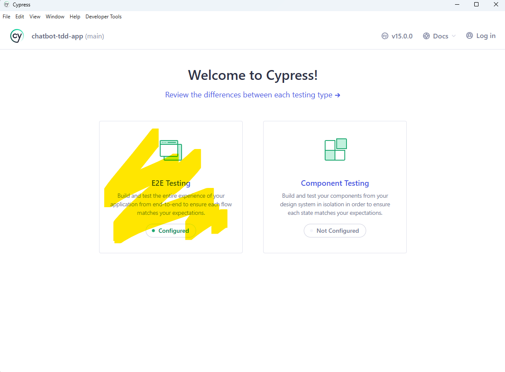
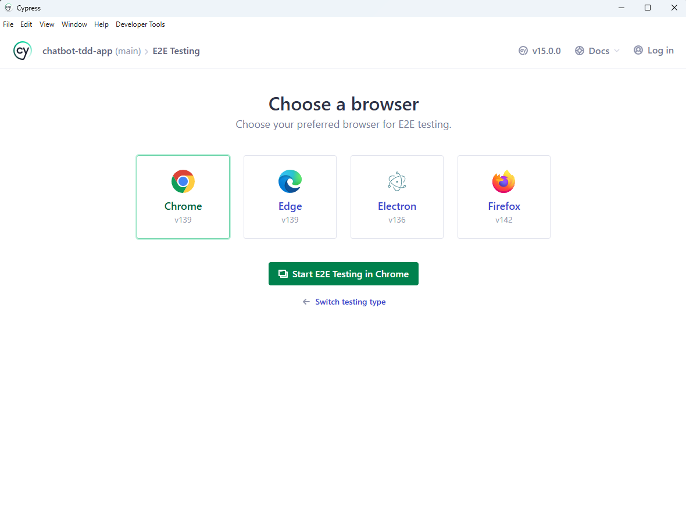
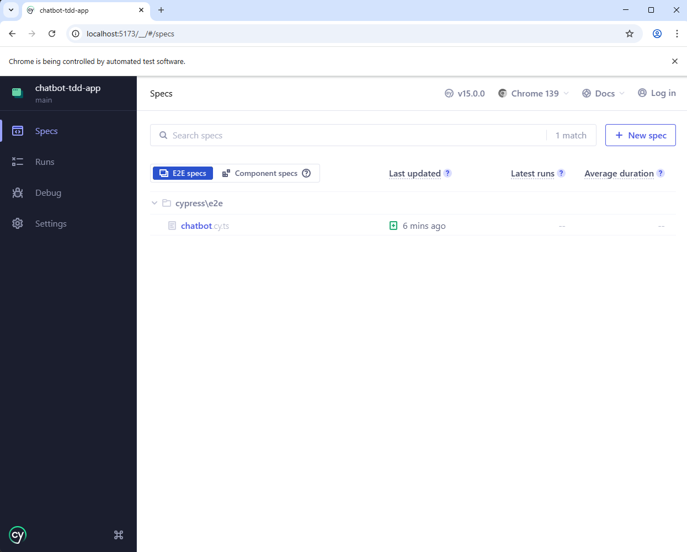
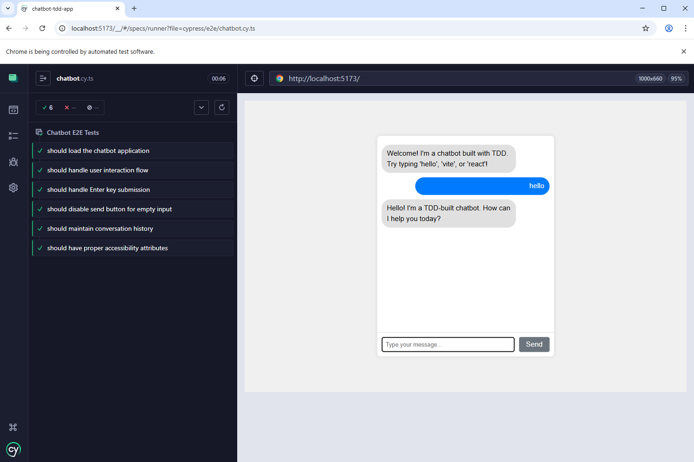

# Week 02 - Code 05: Test-Driven Development with TypeScript, Vite & React

## The TDD Journey: Building Quality Software from the Inside Out

```text
Traditional Development:
Write Code → Test Later → Debug Forever → Fear Changes
     ↓           ↓            ↓              ↓
   Fast       Stressful    Time Sink     Brittle Code

TDD Approach:
Write Test → Write Code → Refactor → Repeat
     ↓           ↓           ↓          ↓
   Think      Minimal    Improve    Confidence
```

## Learning Objectives

By the end of this tutorial, you will:

1. Understand Test-Driven Development (TDD) principles and methodology
2. Experience the Red-Green-Refactor cycle firsthand
3. Build the same chatbot from Week 02-04 using TDD approach
4. Write unit tests, integration tests, and end-to-end tests
5. Use Jest, React Testing Library, and Cypress for comprehensive testing
6. Understand how TDD improves code quality and developer confidence
7. Learn testing best practices for React TypeScript applications

## 📍 How to Track Your Progress

**Important for Students:** Each test file in this tutorial includes a step number comment at the top:

```typescript
// 🧪 Step 5: TDD Red Phase - Message Utils Test
// � Step 6: TDD Strategies - Triangulation  
// �📝 Step 7: Message Types Test (Inside-Out Approach)
// 🤖 Step 8: Bot Response Logic
// 🪝 Step 9: Message Creation Hook
// 📄 Step 10: Message Component Tests
// ⌨️ Step 11: Chat Input Component Tests
// 💬 Step 12: Main Chat Component Tests
```

**Why This Helps:**

- **Copy & Paste Safely:** When you copy code from the tutorial, the step number tells you exactly where you are
- **Progress Tracking:** Easily see which step you're working on without scrolling through the tutorial
- **Debugging:** If tests fail, you know exactly which tutorial step to reference
- **Team Collaboration:** Share your progress with others by mentioning the step number

**Step Number Legend:**

- 🧪 = Utility/Helper Functions (Steps 5-6)
- 📝 = Core Types & Logic (Steps 7-8)
- 🪝 = React Hooks (Step 9)
- 📄 = React Components (Steps 10-13)
- 🎯 = Integration & Advanced Testing (Steps 14-16)

## Table of Contents

1. [Understanding Test-Driven Development](#understanding-test-driven-development)
2. [Setting Up the TDD Environment](#setting-up-the-tdd-environment)
3. [TDD Fundamentals: Red-Green-Refactor](#tdd-fundamentals-red-green-refactor)
4. [Building Our Chatbot with TDD](#building-our-chatbot-with-tdd)
5. [Unit Testing with Jest](#unit-testing-with-jest)
6. [Component Testing with React Testing Library](#component-testing-with-react-testing-library)
7. [Integration Testing](#integration-testing)
8. [End-to-End Testing with Cypress](#end-to-end-testing-with-cypress)
9. [Advanced TDD Techniques](#advanced-tdd-techniques)
10. [TDD Best Practices and Common Pitfalls](#tdd-best-practices-and-common-pitfalls)

## Understanding Test-Driven Development

### What is TDD?

**Test-Driven Development (TDD)** is a software development process where you write tests before writing the actual code. It's not just about testing—it's a design methodology that helps you build better, more maintainable software.

### The Problem with Code-First Development

**Traditional Approach Problems:**

- ❌ High level of defects discovered late
- ❌ Lengthy testing phases after development
- ❌ Poor code maintainability
- ❌ Fear of making changes (brittle code)
- ❌ Running out of time for proper testing
- ❌ Expensive bug fixes in production

### The TDD Solution

**TDD Benefits:**

- ✅ Reduces bugs through early detection
- ✅ Improves code quality and design
- ✅ Makes refactoring safer
- ✅ Ensures code meets requirements
- ✅ Builds developer confidence
- ✅ Creates comprehensive test library
- ✅ Acts as living documentation
- ✅ Achieves excellent code coverage

### The Red-Green-Refactor Cycle

**🔴 RED: Write a Failing Test**

- Write the smallest possible test that fails
- Think about the desired behavior first
- Focus on the interface, not implementation

**🟢 GREEN: Make It Pass**

- Write the minimal code to make the test pass
- Don't worry about perfection
- Just make it work

**🔵 REFACTOR: Improve the Code**

- Clean up both test and production code
- Remove duplication
- Improve readability
- Tests ensure nothing breaks

## 📋 TDD Tutorial Progress Tracker

**Use this checklist to track your progress:**

- [ ] **Phase 1: Setup** (Steps 1-4)
  - [ ] [🚀 Step 1: Create TDD Project](#🚀-step-1-create-tdd-project)
  - [ ] [📦 Step 2: Install Testing Dependencies](#📦-step-2-install-testing-dependencies)  
  - [ ] [⚙️ Step 3: Configure Testing Environment](#⚙️-step-3-configure-testing-environment)
  - [ ] [✅ Step 4: Verify Setup](#✅-step-4-verify-setup)

- [ ] **Phase 2: TDD Fundamentals** (Steps 5-6)
  - [ ] [🧪 Step 5: Testing a Simple Utility Function](#🧪-step-5-testing-a-simple-utility-function)
  - [ ] [🔄 Step 6: TDD Strategies - Triangulation](#🔄-step-6-tdd-strategies---triangulation)

- [ ] **Phase 3: Core Logic** (Steps 7-9)
  - [ ] [📝 Step 7: Message Types (Inside-Out Approach)](#📝-step-7-message-types-inside-out-approach)
  - [ ] [🤖 Step 8: Bot Response Logic](#🤖-step-8-bot-response-logic)
  - [ ] [🪝 Step 9: Message Creation Hook](#🪝-step-9-message-creation-hook)

- [ ] **Phase 4: React Components** (Steps 10-13)
  - [ ] [📄 Step 10: Message Component](#📄-step-10-message-component)
  - [ ] [⌨️ Step 11: Chat Input Component](#⌨️-step-11-chat-input-component)
  - [ ] [💬 Step 12: Main Chat Component](#💬-step-12-main-chat-component)
  - [ ] [🎯 Step 13: App Component Integration](#🎯-step-13-app-component-integration)

- [ ] **Phase 5: Advanced Testing** (Steps 14-16)
  - [ ] [🧪 Step 14: Integration Testing](#🧪-step-14-integration-testing)
  - [ ] [� Step 15: End-to-End Testing with Cypress](#🌐-step-15-end-to-end-testing-with-cypress)
  - [ ] [🚀 Step 16: Advanced TDD Techniques](#🚀-step-16-advanced-tdd-techniques)

---

## Setting Up the TDD Environment

### Prerequisites

Before starting, ensure you have completed Week 02-04 or have Node.js installed.

### 🚀 Step 1: Create TDD Project

**Code 1.1: Project Setup Commands**

```bash
# Navigate to the TDD directory
cd "week02\code05_tdd_TypeScript_vite_react"

# Create a new Vite React TypeScript project
# Select React + TypeScript
npm create vite@latest chatbot-tdd-app --template react-ts

# Navigate into the project
cd chatbot-tdd-app

# Install dependencies
npm install
```

### 📦 Step 2: Install Testing Dependencies

**Code 2.1: Testing Dependencies Installation**

```bash
# Install Jest and React Testing Library (Vite doesn't include Jest by default)
npm install --save-dev @testing-library/react @testing-library/jest-dom @testing-library/user-event

# Install Jest and TypeScript support
npm install --save-dev jest ts-jest @types/jest

# Install Cypress for E2E testing
npm install --save-dev cypress

# Install additional testing utilities
npm install --save-dev jest-environment-jsdom identity-obj-proxy
```

### ⚙️ Step 3: Configure Testing Environment

**Code 3.1: Update package.json Scripts**

```json
{
  "scripts": {
    "dev": "vite",
    "build": "tsc && vite build",
    "preview": "vite preview",
    "test": "jest",
    "test:watch": "jest --watch",
    "test:coverage": "jest --coverage",
    "test:e2e": "cypress open",
    "test:e2e:headless": "cypress run"
  }
}
```

**Code 3.2: Create jest.config.js**

See "extra readings"

```javascript
// Jest configuration for React TypeScript project
export default {
  // Use ts-jest preset for TypeScript support
  preset: 'ts-jest',
  // Use jsdom to simulate browser environment for React components
  testEnvironment: 'jsdom',
  // Run setup file after Jest environment is set up
  setupFilesAfterEnv: ['<rootDir>/src/setupTests.ts'],
  // Mock CSS imports so tests don't break on style imports
  moduleNameMapper: {
    '\\.(css|less|scss|sass)$': 'identity-obj-proxy',
  },
  // Transform TypeScript and TSX files using ts-jest
  transform: {
    '^.+\\.tsx?$': 'ts-jest',
  },
  // Define where Jest should look for test files
  testMatch: [
    '<rootDir>/src/**/__tests__/**/*.{ts,tsx}', // Tests in __tests__ folders
    '<rootDir>/src/**/*.{test,spec}.{ts,tsx}',  // Files ending with .test or .spec
  ],
  // Collect coverage from these files
  collectCoverageFrom: [
    'src/**/*.{ts,tsx}',     // Include all TypeScript files
    '!src/**/*.d.ts',        // Exclude type definition files
    '!src/main.tsx',         // Exclude entry point
    '!src/vite-env.d.ts',    // Exclude Vite environment types
  ],
};
```

**🤔 Why Do We Need jest.config.js? - Essential Understanding**

You might wonder: "Why can't we just run `npm test` and have everything work automatically?" Great question! Here's why we need this configuration file:

**🎯 The Problem:**

Vite projects are optimized for modern web development, but Jest (our testing framework) was designed before some of these modern tools existed. They speak different "languages":

```text
🏗️ Vite Project Speaks:
├── TypeScript (.ts/.tsx files)
├── Modern ES Modules (import/export)
├── CSS/SCSS imports
├── JSX syntax
└── Browser environment

🧪 Jest Speaks:
├── JavaScript by default
├── CommonJS modules (require/module.exports)
├── Node.js environment
└── No built-in JSX understanding
```

**🔧 What jest.config.js Does - Breaking It Down:**

Think of `jest.config.js` as a "translator" that helps Jest understand your modern Vite project:

**1. TypeScript Support (`preset: 'ts-jest'`):**

```javascript
// Without this: Jest sees .ts files and says "I don't understand this!"
// With this: Jest uses ts-jest to convert TypeScript → JavaScript before testing

preset: 'ts-jest'  // Tells Jest: "Use the ts-jest translator for TypeScript files"
```

**2. Browser Environment Simulation (`testEnvironment: 'jsdom'`):**

```javascript
// Problem: React components expect a browser (DOM, window, document)
// Reality: Jest runs in Node.js (no DOM, no window)

testEnvironment: 'jsdom'  // Creates a fake browser environment for testing
```

**3. CSS Import Handling (`moduleNameMapper`):**

```javascript
// Your components do this:
import './Button.css';  // Jest says: "What's a .css file?!"

// This fixes it:
moduleNameMapper: {
  '\\.(css|less|scss|sass)$': 'identity-obj-proxy'  // "Fake" CSS imports for testing
}
```

**4. File Transformation (`transform`):**

```javascript
// Jest needs to know: "How do I process .tsx files?"
transform: {
  '^.+\\.tsx?$': 'ts-jest'  // "Use ts-jest to handle any .ts or .tsx file"
}
```

**5. Test Discovery (`testMatch`):**

```javascript
// Jest asks: "Where are the test files?"
testMatch: [
  '<rootDir>/src/**/__tests__/**/*.{ts,tsx}',  // Look in __tests__ folders
  '<rootDir>/src/**/*.{test,spec}.{ts,tsx}'    // Look for .test.ts files
]
```

**🔍 Real-World Analogy:**

Imagine you're a Spanish speaker visiting Japan:

```text
🇪🇸 You (Vite Project):
- Speak Spanish (TypeScript)
- Use Spanish customs (ES Modules)
- Expect Spanish environment (Browser)

🇯🇵 Local System (Jest):
- Understands Japanese (JavaScript)
- Uses Japanese customs (CommonJS)
- Operates in Japanese context (Node.js)

📖 jest.config.js = Your Translator:
- Converts your Spanish → Japanese
- Explains your customs to locals
- Helps you navigate the environment
```

**🚨 What Happens Without jest.config.js:**

```bash
# You run: npm test
# Jest tries to run your tests but...

❌ "Cannot understand TypeScript files"
❌ "Don't know what import/export means"
❌ "CSS files crash the tests"
❌ "JSX syntax is foreign to me"
❌ "No browser environment available"

Result: Tests fail before they even start! 😱
```

**✅ With jest.config.js:**

```bash
# You run: npm test
# Jest reads the config file and...

✅ "I'll use ts-jest to handle TypeScript"
✅ "I'll convert ES modules to CommonJS"
✅ "I'll mock CSS imports so they don't break"
✅ "I'll process JSX through the TypeScript compiler"
✅ "I'll create a fake browser environment"

Result: Tests run smoothly! 🎉
```

**💡 Key Insight:**

`jest.config.js` bridges the gap between modern development tools and testing frameworks. It's like having a universal adapter that makes incompatible systems work together perfectly.

**🎯 The Bottom Line:**

Without this file, you'd spend hours troubleshooting why your tests won't even start. With it, Jest becomes a powerful ally that understands your modern React TypeScript project and helps you build confidence through testing.

**Code 3.2.1: Create tsconfig.jest.json**

```json
{
  "extends": "./tsconfig.app.json",
  "compilerOptions": {
    "jsx": "react-jsx",
    "esModuleInterop": true,
    "allowSyntheticDefaultImports": true,
    "module": "commonjs",
    "verbatimModuleSyntax": false,
    "noEmit": false,
    "isolatedModules": false
  },
  "include": [
    "src/**/*",
    "src/**/*.test.ts",
    "src/**/*.test.tsx",
    "src/**/*.spec.ts", 
    "src/**/*.spec.tsx"
  ]
}
```

**🤔 Why Do We Need tsconfig.jest.json? - Advanced Configuration Understanding**

You might notice that we have both `jest.config.js` AND `tsconfig.jest.json`. Why two configuration files? Here's the deeper technical reasoning:

**🎯 The Core Problem:**

Your main TypeScript configuration (`tsconfig.app.json`) is optimized for **modern web bundling** with Vite, but Jest needs **different TypeScript settings** to run tests properly in a Node.js environment.

```text
🏗️ Production Build (tsconfig.app.json):
├── Target: Modern browsers
├── Module system: ESNext (import/export)
├── JSX: react-jsx (optimized)
├── Strict syntax: verbatimModuleSyntax: true
├── No emit: true (bundler handles output)
└── Environment: Browser

🧪 Testing Environment (tsconfig.jest.json):
├── Target: Node.js test runner
├── Module system: CommonJS (require/exports)
├── JSX: react-jsx (for test components)
├── Flexible syntax: verbatimModuleSyntax: false
├── Allow emit: false (ts-jest handles compilation)
└── Environment: Node.js with jsdom simulation
```

**🔧 Breaking Down Each Configuration Setting:**

**1. Configuration Inheritance (`extends`):**

```json
"extends": "./tsconfig.app.json"  // Start with your app config as base
```

This means: "Take all the settings from my main app config, then override specific ones for testing."

**2. Module System Compatibility (`module: "commonjs"`):**

```json
// Your app uses:
import { useState } from 'react';     // ESNext modules (modern)

// Jest needs:
const { useState } = require('react'); // CommonJS modules (Node.js)

"module": "commonjs"  // Tells TypeScript: "Convert imports to require() for Jest"
```

**3. Import/Export Flexibility (`verbatimModuleSyntax: false`):**

```json
// Your main app has strict module syntax:
"verbatimModuleSyntax": true   // Every import must be exactly what you mean

// Tests need flexibility:
"verbatimModuleSyntax": false  // Allow mixed import styles for testing utilities
```

**4. Isolated Module Processing (`isolatedModules: false`):**

```json
// Production build:
"isolatedModules": true   // Each file must be compilable independently

// Testing environment:
"isolatedModules": false  // Allow more flexible cross-file dependencies for test utilities
```

**5. TypeScript Compilation Control (`noEmit: false`):**

```json
// Production (Vite handles compilation):
"noEmit": true   // Don't output compiled JavaScript

// Testing (ts-jest needs compilation):
"noEmit": false  // Allow TypeScript compilation for test processing
```

**🔍 Real-World Problem This Solves:**

Without `tsconfig.jest.json`, you'd encounter these specific errors:

```bash
# Error 1: JSX Processing
❌ error TS6142: Module './Component' was resolved to 'Component.tsx', but '--jsx' is not set.

# Error 2: Module System Mismatch  
❌ error TS1371: This import is never used as a value and must use 'import type'.

# Error 3: Strict Module Syntax
❌ error TS1484: 'SomeType' is a type and must be imported using a type-only import when 'verbatimModuleSyntax' is enabled.

# Error 4: Compilation Issues
❌ Cannot use JSX unless the '--jsx' flag is provided.
```

**✅ With tsconfig.jest.json:**

```bash
✅ Jest can process .tsx files correctly
✅ TypeScript understands both import styles
✅ Module system matches Node.js expectations  
✅ Test utilities work seamlessly
✅ All tests run without TypeScript conflicts
```

**🎯 How Jest Uses This File:**

```javascript
// In jest.config.js:
transform: {
  '^.+\\.tsx?$': ['ts-jest', {
    tsconfig: 'tsconfig.jest.json'  // "Use THIS config for tests"
  }]
}
```

This tells Jest: "When you encounter TypeScript files during testing, use the `tsconfig.jest.json` configuration to compile them."

**💡 Key Architecture Insight:**

This is a common pattern in modern development:

```text
📁 Project Structure:
├── tsconfig.json          → Base configuration
├── tsconfig.app.json      → Production build settings  
├── tsconfig.jest.json     → Testing environment settings
├── tsconfig.node.json     → Build tools settings
└── jest.config.js         → Points to tsconfig.jest.json
```

Each tool gets **exactly the TypeScript configuration it needs** without compromising the others.

**🚨 What Happens Without This File:**

```bash
# Jest tries to use your main TypeScript config...
# But it's optimized for browsers, not Node.js testing!

❌ Module import/export conflicts
❌ JSX processing failures  
❌ Strict syntax checking breaks test utilities
❌ TypeScript compilation errors in test files
❌ Hours of debugging configuration mismatches

Result: Tests fail due to configuration, not code issues! 😱
```

**✅ With tsconfig.jest.json:**

```bash
# Jest gets its own perfectly-tuned TypeScript config

✅ Clean module resolution
✅ Proper JSX handling for test components
✅ Flexible import syntax for test utilities  
✅ Seamless TypeScript compilation
✅ Focus on writing tests, not fighting config

Result: Tests run smoothly, developers stay productive! 🎉
```

**🎯 The Professional Takeaway:**

Separating TypeScript configurations by environment is a **professional development practice**. It ensures that each tool (bundler, testing framework, build scripts) gets the exact configuration it needs without interference from other tools.

**Code 3.3: Create setupTests.ts**

```typescript
// Import Jest DOM matchers for enhanced testing assertions
// This adds custom matchers like toBeInTheDocument(), toHaveClass(), etc.
import '@testing-library/jest-dom';

// Global mock for scrollIntoView - jsdom doesn't implement this browser API
// This prevents errors when components use scrollIntoView (like our Chat component will)
Object.defineProperty(Element.prototype, 'scrollIntoView', {
  value: jest.fn(),
  writable: true,
});
```

**Why do we need `setupTests.ts`? - Detailed Explanation**

The `setupTests.ts` file is a special configuration file that Jest automatically loads before running any tests. Think of it as the "preparation room" that gets everything ready for your tests to run smoothly.

**🎯 The Problem It Solves:**

Imagine you're testing React components. By default, Jest comes with basic testing capabilities, but when testing web components, you need extra tools to check things like:

- "Is this button actually visible on the page?"
- "Does this input field have the right CSS class?"
- "Is this error message showing up when it should?"

**🔧 What `setupTests.ts` Does:**

1. **Enhanced Matchers**: `@testing-library/jest-dom` provides additional Jest matchers specifically for DOM testing:

```typescript
// ❌ Without @testing-library/jest-dom - you'd have to write complex checks:
const button = screen.getByRole('button');
expect(button.parentElement?.contains(button)).toBe(true); // Hard to understand!

// ✅ With @testing-library/jest-dom - simple and readable:
const button = screen.getByRole('button');
expect(button).toBeInTheDocument(); // Clear and intuitive!
```

**Available Enhanced Matchers:**

- `toBeInTheDocument()` - checks if element exists in DOM
- `toHaveClass('my-class')` - checks if element has specific CSS class
- `toHaveAttribute('href', '/link')` - checks element attributes
- `toBeDisabled()` - checks if form elements are disabled
- `toBeVisible()` - checks if element is visible to users
- `toHaveTextContent('Hello')` - checks element's text content
- `toHaveValue('input value')` - checks form input values
- And many more!

2. **Browser API Mocking**: We also mock `scrollIntoView` because:

```typescript
// The Problem: React components often use browser APIs
const scrollToBottom = () => {
  messagesEndRef.current?.scrollIntoView({ behavior: 'smooth' });
};

// But jsdom (testing environment) doesn't implement all browser APIs
// Without the mock: TypeError: scrollIntoView is not a function
// With the mock: Tests run smoothly! ✅
```

3. **Global Test Setup**: Any code here runs before each test file, perfect for:

```typescript
// Example of what you might add to setupTests.ts:

// Import the enhanced matchers
import '@testing-library/jest-dom';

// Set up fake timers for all tests (if needed)
beforeEach(() => {
  jest.useFakeTimers();
});

// Clean up after each test
afterEach(() => {
  jest.useRealTimers();
  // Clear any mocks
  jest.clearAllMocks();
});

// Mock setup (like our fetch mocks for API calls)
// Global configurations
// Custom matchers or utilities
```

3. **TypeScript Support**: Ensures TypeScript recognizes the new matcher types.

```typescript
// ❌ Without setupTests.ts - TypeScript Error:
expect(button).toBeInTheDocument(); 
// Error: Property 'toBeInTheDocument' does not exist on type 'Assertion'

// ✅ With setupTests.ts - TypeScript knows about the new matchers:
expect(button).toBeInTheDocument(); // ✓ Works perfectly!
```

**🚨 What Happens Without This File:**

1. **Limited Testing Capabilities**: You'd only have basic Jest matchers

```typescript
// You'd be stuck with basic assertions like:
expect(element.className).toContain('active'); // Less readable
// Instead of:
expect(element).toHaveClass('active'); // Much clearer!
```

2. **TypeScript Errors**: Assertions like `expect(element).toBeInTheDocument()` would fail with TypeScript errors

3. **Repetitive Setup Code**: You'd have to import and configure testing utilities in every test file

**🎯 Real-World Example:**

Let's say you're testing a login form:

```typescript
// In your test file - with setupTests.ts configured:
it('should show error message for invalid login', () => {
  render(<LoginForm />);
  
  const usernameInput = screen.getByLabelText('Username');
  const submitButton = screen.getByRole('button', { name: 'Login' });
  
  // These enhanced matchers make tests much more readable:
  expect(usernameInput).toBeInTheDocument();     // Clear: element exists
  expect(submitButton).toBeEnabled();            // Clear: button is clickable
  
  // Submit empty form
  fireEvent.click(submitButton);
  
  const errorMessage = screen.getByText('Username is required');
  expect(errorMessage).toBeVisible();            // Clear: error is shown to user
  expect(errorMessage).toHaveClass('error');     // Clear: has error styling
});
```

**🔄 How Jest Uses This File:**

1. Jest starts up
2. Jest automatically finds and runs `setupTests.ts`
3. This imports all the enhanced matchers and sets up the environment
4. Jest then runs your actual test files
5. Your tests can now use all the enhanced matchers

**💡 Key Takeaway:**

Think of `setupTests.ts` as your testing toolkit's instruction manual. It tells Jest: "Hey, when you run tests, make sure you have these extra tools available!" This way, every test file in your project automatically gets access to better, more readable testing utilities without having to import them individually.

### ✅ Step 4: Verify Setup

```bash
# Run the test command to ensure everything is configured
npm test
```

**Troubleshooting Common Issues:**

If you get `'jest' is not recognized` error:

1. Make sure Jest is installed: `npm install --save-dev jest ts-jest @types/jest`
2. Check that your `package.json` has the test script: `"test": "jest"`
3. Try running: `npx jest` instead of `npm test`

If you get module resolution errors:

1. Ensure `jest.config.js` is in your project root
2. Check that `moduleNameMapper` is correctly configured for CSS imports
3. Verify TypeScript files are being transformed with `ts-jest`

If you get "Unknown option" validation warnings:

1. **Common mistake**: Using `moduleNameMapping` instead of `moduleNameMapper`
2. **Fix**: Change `moduleNameMapping:` to `moduleNameMapper:` in `jest.config.js`
3. **Verify**: The correct property name is `moduleNameMapper` (without 's' at the end)

If you get "No tests found" (this is expected at this stage):

1. This is normal - we haven't written any tests yet!
2. Use `npm test -- --passWithNoTests` to verify Jest configuration is working
3. Jest should exit with code 0 instead of code 1 when using this flag

## TDD Fundamentals: Red-Green-Refactor

Let's start with a simple example to understand the TDD cycle.

### 🧪 Step 5: Testing a Simple Utility Function

**🔴 RED: Write the failing test first**

**Code 5.1: Create messageUtils.test.ts**

```typescript
// 🧪 Step 5: TDD Red Phase - Message Utils Test
// Import the function we want to test (doesn't exist yet - this will fail)
import { formatMessage } from '../messageUtils';

// Describe block groups related tests together
describe('formatMessage', () => {
  // Individual test case using 'it' function
  it('should format a simple message', () => {
    // Arrange: Set up test data
    const text = 'Hello World';    // Message text to format
    const sender = 'user';         // Who sent the message
    
    // Act: Call the function we're testing
    const result = formatMessage(text, sender);
    
    // Assert: Check that the result matches our expectations
    expect(result).toEqual({
      text: 'Hello World',              // Should preserve original text
      sender: 'user',                   // Should preserve sender
      timestamp: expect.any(Date),      // Should have a Date (any Date is fine)
      id: expect.any(String)            // Should have a string ID (any string is fine)
    });
  });
});
```

**Run the test - it should FAIL:**

```bash
npm test
# Error: Cannot find module '../messageUtils'
```

**🟢 GREEN: Write minimal code to make it pass**

**Code 5.2: Create messageUtils.ts**

```typescript
// 🧪 Step 5: Message Utils Implementation (GREEN Phase)
// Define the TypeScript interface for our formatted message
export interface FormattedMessage {
  text: string;      // The message content
  sender: string;    // Who sent it ('user' or 'bot')
  timestamp: Date;   // When it was created
  id: string;        // Unique identifier
}

// Function to format a message with metadata
export function formatMessage(text: string, sender: string): FormattedMessage {
  return {
    text,                                    // Keep original text
    sender,                                  // Keep original sender
    timestamp: new Date(),                   // Add current timestamp
    id: Math.random().toString(36)           // Generate simple random ID
  };
}
```

**Run the test - it should PASS:**

```bash
npm test
# ✓ should format a simple message
```

**🔵 REFACTOR: Improve the code - Detailed Explanation**

Now that our test is passing, we can safely improve the code quality without fear of breaking anything. This is the beauty of TDD - the test acts as a safety net!

**🤔 What's Wrong with Our Current Code?**

```typescript
// Current code - works but has problems:
id: Math.random().toString(36)  // Generates IDs like: "0.abc123"
```

**Problems:**

1. **Short IDs**: Only ~7 characters, higher chance of duplicates
2. **Starts with "0."**: Always begins with zero and decimal point  
3. **No timestamp**: Can't tell when message was created from ID
4. **Collision risk**: Two messages could get same ID (very rare but possible)

**✨ Let's Make It Better:**

```typescript
// Improved function with better ID generation
export function formatMessage(text: string, sender: string): FormattedMessage {
  return {
    text,                                                           // Keep original text
    sender,                                                         // Keep original sender
    timestamp: new Date(),                                          // Add current timestamp
    id: `${Date.now()}-${Math.random().toString(36).substr(2, 9)}` // Better ID: timestamp + random string
  };
}
```

**📋 Complete Final Code for messageUtils.ts:**

```typescript
// 🔧 Step 6: Message Utils Implementation (After TDD Refactor)
// Define the TypeScript interface for our formatted message
export interface FormattedMessage {
  text: string;      // The message content
  sender: string;    // Who sent it ('user' or 'bot')
  timestamp: Date;   // When it was created
  id: string;        // Unique identifier
}

// Improved function with better ID generation
export function formatMessage(text: string, sender: string): FormattedMessage {
  return {
    text,                                                          // Keep original text
    sender,                                                        // Keep original sender
    timestamp: new Date(),                                         // Add current timestamp
    id: `${Date.now()}-${Math.random().toString(36).substr(2, 9)}` // Better ID: timestamp + random string
  };
}
```

```

**🔍 Breaking Down the Improved ID Generation:**

```typescript
// Let's understand this piece by piece:
`${Date.now()}-${Math.random().toString(36).substr(2, 9)}`

// Part 1: Date.now()
Date.now()  // Returns: 1693737600000 (current timestamp in milliseconds)

// Part 2: Math.random().toString(36).substr(2, 9)
Math.random()           // Returns: 0.abc123def456  (random decimal)
.toString(36)           // Converts to: "0.abc123def456" (base 36: 0-9, a-z)
.substr(2, 9)           // Extracts: "abc123def" (skip "0.", take 9 chars)

// Combined result:
"1693737600000-abc123def"  // Timestamp + dash + random string
```

**🎯 Why This is Better:**

1. **Uniqueness**: Timestamp ensures no two messages at different times can have same ID
2. **Readable**: Can see when message was created (1693737600000 = specific millisecond)
3. **Longer**: 13+ characters instead of ~7, much lower collision risk
4. **Debuggable**: When debugging, you can tell message order by timestamp
5. **No leading zeros**: Starts with meaningful timestamp

**🧪 The Refactor Safety Check:**

```bash
npm test
# ✓ should format a simple message
```

**✅ Test still passes!** This confirms our refactor didn't break existing functionality.

**💡 Key Refactor Principle:**
> "Make the code better while keeping the exact same behavior"

The test ensures we didn't accidentally:

- Change what the function returns
- Break the interface
- Introduce new bugs

### 🔄 Step 6: TDD Strategies - Triangulation

**1. Faking It:**
Start with the simplest implementation, even hardcoded values.

**2. Obvious Implementation:**
If the solution is clear, implement it directly.

**3. Triangulation:**
Add more tests to drive out generalization.

Let's add more tests to triangulate:

```typescript
// Test suite for formatMessage function with multiple test cases
describe('formatMessage', () => {
  // Test 1: Basic functionality
  it('should format a simple message', () => {
    const text = 'Hello World';
    const sender = 'user';
    
    const result = formatMessage(text, sender);
    
    // Verify all expected properties are present and correct
    expect(result).toEqual({
      text: 'Hello World',              // Text should be preserved exactly
      sender: 'user',                   // Sender should be preserved exactly
      timestamp: expect.any(Date),      // Should have a timestamp (any Date)
      id: expect.any(String)            // Should have an ID (any string)
    });
  });

  // Test 2: Different sender type (triangulation)
  it('should format bot messages differently', () => {
    const text = 'How can I help?';
    const sender = 'bot';              // Testing with 'bot' instead of 'user'
    
    const result = formatMessage(text, sender);
    
    // Check specific properties individually
    expect(result.sender).toBe('bot');           // Should preserve 'bot' sender
    expect(result.text).toBe('How can I help?'); // Should preserve bot text
  });

  // Test 3: Uniqueness requirement (triangulation)
  it('should generate unique IDs for each message', () => {
    // Create two messages with same content
    const message1 = formatMessage('First', 'user');
    const message2 = formatMessage('Second', 'user');
    
    // IDs should be different even for similar messages
    expect(message1.id).not.toBe(message2.id);
  });
});
```

## Building Our Chatbot with TDD

Now let's build our chatbot application using TDD. We'll start with the smallest pieces and build up.

### 📝 Step 7: Message Types (Inside-Out Approach)

**🔴 RED: Test the Message interface**

**Code 7.1: Create Message.test.ts**

```typescript
// 📝 Step 7: Message Types Test (Inside-Out Approach)
// Import the types and functions we want to test
import { Message, isValidMessage } from '../Message';

// Test suite for Message type and validation
describe('Message', () => {
  // Test 1: Valid message should pass validation
  it('should validate a correct message', () => {
    // Create a properly formatted message object
    const message: Message = {
      id: 'test-id',               // Unique identifier
      text: 'Hello',               // Message content
      sender: 'user',              // Must be 'user' or 'bot'
      timestamp: new Date()        // Creation time
    };

    // Should return true for valid message
    expect(isValidMessage(message)).toBe(true);
  });

  // Test 2: Invalid message with empty text should fail
  it('should reject message with empty text', () => {
    // Create message with empty text (invalid)
    const message = {
      id: 'test-id',
      text: '',                    // Empty text should be invalid
      sender: 'user',
      timestamp: new Date()
    };

    // Should return false for invalid message
    expect(isValidMessage(message)).toBe(false);
  });

  // Test 3: Invalid sender should fail validation
  it('should reject message with invalid sender', () => {
    // Create message with invalid sender
    const message = {
      id: 'test-id',
      text: 'Hello',
      sender: 'invalid',           // Not 'user' or 'bot' - invalid
      timestamp: new Date()
    };

    // Should return false for invalid sender
    expect(isValidMessage(message)).toBe(false);
  });
});
```

**🟢 GREEN: Implement the Message type**

**Create `src/types/Message.ts`:**

```typescript
// 📝 Step 7: Message Types Implementation (GREEN Phase)
// Define the TypeScript interface for a chat message
export interface Message {
  id: string;                    // Unique identifier for the message
  text: string;                  // The actual message content
  sender: 'user' | 'bot';        // Union type: only 'user' or 'bot' allowed
  timestamp: Date;               // When the message was created
}

// Type guard function to validate if an object is a valid Message
export function isValidMessage(message: any): message is Message {
  return (
    typeof message === 'object' &&                                    // Must be an object
    typeof message.id === 'string' &&                                 // ID must be string
    typeof message.text === 'string' &&                               // Text must be string
    message.text.length > 0 &&                                        // Text cannot be empty
    (message.sender === 'user' || message.sender === 'bot') &&        // Sender must be 'user' or 'bot'
    message.timestamp instanceof Date                                  // Timestamp must be Date object
  );
}
```

### 🤖 Step 8: Bot Response Logic

**Create:** `src/services/__tests__/botService.test.ts`

**🔴 RED: Test the bot response function**

**Create `src/services/__tests__/botService.test.ts`:**

```typescript
// 🤖 Step 8: Bot Response Logic Tests
// Import the function we want to test
import { getBotResponse } from '../botService';

// Test suite for bot response service
describe('botService', () => {
  // Nested describe for organizing getBotResponse tests
  describe('getBotResponse', () => {
    // Test 1: Bot should respond to "hello"
    it('should respond to hello', () => {
      const response = getBotResponse('hello');
      // Response text should contain "Hello" (case-insensitive check)
      expect(response.text).toContain('Hello');
    });

    // Test 2: Bot should respond to "hi" similarly
    it('should respond to hi', () => {
      const response = getBotResponse('hi');
      // Both "hello" and "hi" should get Hello response
      expect(response.text).toContain('Hello');
    });

    // Test 3: Bot should handle different cases
    it('should be case insensitive', () => {
      const response = getBotResponse('HELLO');  // Test uppercase input
      // Should still respond with Hello regardless of input case
      expect(response.text).toContain('Hello');
    });

    // Test 4: Bot should respond to vite-related questions
    it('should respond to vite questions', () => {
      const response = getBotResponse('tell me about vite');
      // Response should mention vite (convert to lowercase for case-insensitive check)
      expect(response.text.toLowerCase()).toContain('vite');
    });

    // Test 5: Bot should have default response for unknown inputs
    it('should have a default response for unknown inputs', () => {
      const response = getBotResponse('xyz123');  // Random input
      // Should have some response (not empty)
      expect(response.text).toBeDefined();
      expect(response.text.length).toBeGreaterThan(0);
    });

    // Test 6: Response should include delay for realistic chat experience
    it('should return response with delay', () => {
      const response = getBotResponse('hello');
      // Delay should be reasonable (> 0 but < 3 seconds)
      expect(response.delay).toBeGreaterThan(0);
      expect(response.delay).toBeLessThan(3000);
    });
  });
});
```

**🟢 GREEN: Implement the bot service**

**Create `src/services/botService.ts`:**

```typescript
// 🤖 Step 8: Bot Service Implementation (GREEN Phase)
// Define the interface for bot responses
export interface BotResponse {
  text: string;    // The response message
  delay: number;   // Milliseconds to wait before showing response
}

// Main function to generate bot responses based on user input
export function getBotResponse(userMessage: string): BotResponse {
  // Normalize input: convert to lowercase and remove whitespace
  const message = userMessage.toLowerCase().trim();
  
  // Check for greeting keywords
  if (message.includes('hello') || message.includes('hi')) {
    return {
      text: "Hello! I'm a TDD-built chatbot. How can I help you today?",
      delay: 1000    // 1 second delay
    };
  }
  
  // Check for vite-related questions
  if (message.includes('vite')) {
    return {
      text: "Vite is amazing! ⚡ Super fast development and builds. This bot was built using TDD!",
      delay: 800     // Slightly faster response
    };
  }
  
  // Check for react-related questions
  if (message.includes('react')) {
    return {
      text: "React with TypeScript is powerful! And with TDD, we build it right the first time. 🚀",
      delay: 1200    // Slightly longer response
    };
  }
  
  // Check for goodbye
  if (message.includes('bye')) {
    return {
      text: "Goodbye! Thanks for trying this TDD-built chatbot! 👋",
      delay: 600     // Quick goodbye
    };
  }
  
  // Default response for unrecognized input
  return {
    text: `You said: "${userMessage}". This response was generated by TDD-tested code! ⚡`,
    delay: 1000    // Standard delay
  };
}
```

**🔵 REFACTOR: Extract response patterns - Newbie-Friendly Explanation**

Our tests are passing, but the current code has problems. Let's improve it!

**🤔 What's Wrong with Our Current botService Code?**

```typescript
// Current code works but is messy:
export function getBotResponse(userMessage: string): BotResponse {
  const message = userMessage.toLowerCase().trim();
  
  // Repeated if-statements - hard to maintain
  if (message.includes('hello') || message.includes('hi')) {
    return { text: "Hello! I'm a TDD-built chatbot...", delay: 1000 };
  }
  if (message.includes('vite')) {
    return { text: "Vite is amazing! ⚡...", delay: 800 };
  }
  if (message.includes('react')) {
    return { text: "React with TypeScript...", delay: 1200 };
  }
  // ... more if statements
}
```

**Problems:**

1. **Code Duplication**: Each if-statement follows same pattern
2. **Hard to Maintain**: Adding new responses means more if-statements
3. **Hard to Test**: Each response is embedded in the logic
4. **No Organization**: Responses scattered throughout the function

**✨ Let's Refactor - Step by Step:**

**Step 1: Extract Response Data**

```typescript
// Before: Responses mixed with logic
if (message.includes('hello')) {
  return { text: "Hello! I'm a chatbot...", delay: 1000 };
}

// After: Separate data from logic
const responsePatterns = [
  {
    keywords: ['hello', 'hi'],
    response: "Hello! I'm a TDD-built chatbot. How can I help you today?",
    delay: 1000
  }
];
```

**Step 2: Create Data Structure**

```typescript
// Define structure for response patterns (makes it easier to add new responses)
interface ResponsePattern {
  keywords: string[];    // Array of trigger words
  response: string;      // What to respond with  
  delay: number;         // How long to wait before responding
}

// Configuration array of all possible responses (easy to maintain and extend)
const responsePatterns: ResponsePattern[] = [
  {
    keywords: ['hello', 'hi'],  // Greeting keywords
    response: "Hello! I'm a TDD-built chatbot. How can I help you today?",
    delay: 1000                 // 1 second delay
  },
  {
    keywords: ['vite'],         // Vite-related keywords
    response: "Vite is amazing! ⚡ Super fast development and builds. This bot was built using TDD!",
    delay: 800                  // Faster response for tech topics
  },
  {
    keywords: ['react'],        // React-related keywords
    response: "React with TypeScript is powerful! And with TDD, we build it right the first time. 🚀",
    delay: 1200                 // Slightly longer for detailed tech response
  },
  {
    keywords: ['bye'],          // Farewell keywords
    response: "Goodbye! Thanks for trying this TDD-built chatbot! 👋",
    delay: 600                  // Quick goodbye
  }
];
```

**Step 3: Simplify the Logic**

```typescript
// Improved bot response function using pattern matching
export function getBotResponse(userMessage: string): BotResponse {
  // Normalize input: convert to lowercase and remove whitespace
  const message = userMessage.toLowerCase().trim();
  
  // Find the first pattern that matches any keyword in the user message
  const pattern = responsePatterns.find(p => 
    p.keywords.some(keyword => message.includes(keyword))  // Check if any keyword is found
  );
  
  // If we found a matching pattern, use it
  if (pattern) {
    return {
      text: pattern.response,
      delay: pattern.delay
    };
  }
  
  // Default response if no patterns match
  return {
    text: `You said: "${userMessage}". This response was generated by TDD-tested code! ⚡`,
    delay: 1000
  };
}
```

**📋 Complete Final Code for botService.ts:**

```typescript
// 🤖 Step 8: Bot Service Implementation (After TDD Refactor)
// Refactored version with extracted response patterns

// Define the interface for bot responses
export interface BotResponse {
  text: string;    // The response message
  delay: number;   // Milliseconds to wait before showing response
}

// Define structure for response patterns (makes it easier to add new responses)
interface ResponsePattern {
  keywords: string[];    // Array of trigger words
  response: string;      // What to respond with
  delay: number;         // How long to wait before responding
}

// Configuration array of all possible responses (easy to maintain and extend)
const responsePatterns: ResponsePattern[] = [
  {
    keywords: ['hello', 'hi'],  // Greeting keywords
    response: "Hello! I'm a TDD-built chatbot. How can I help you today?",
    delay: 1000                 // 1 second delay
  },
  {
    keywords: ['vite'],         // Vite-related keywords
    response: "Vite is amazing! ⚡ Super fast development and builds. This bot was built using TDD!",
    delay: 800                  // Faster response for tech topics
  },
  {
    keywords: ['react'],        // React-related keywords
    response: "React with TypeScript is powerful! And with TDD, we build it right the first time. 🚀",
    delay: 1200                 // Slightly longer for detailed tech response
  },
  {
    keywords: ['bye'],          // Farewell keywords
    response: "Goodbye! Thanks for trying this TDD-built chatbot! 👋",
    delay: 600                  // Quick goodbye
  }
];

// Improved bot response function using pattern matching
export function getBotResponse(userMessage: string): BotResponse {
  // Normalize input: convert to lowercase and remove whitespace
  const message = userMessage.toLowerCase().trim();
  
  // Find the first pattern that matches any keyword in the user message
  const pattern = responsePatterns.find(p => 
    p.keywords.some(keyword => message.includes(keyword))  // Check if any keyword is found
  );
  
  // If we found a matching pattern, use it
  if (pattern) {
    return {
      text: pattern.response,
      delay: pattern.delay
    };
  }
  
  // Default response if no patterns match
  return {
    text: `You said: "${userMessage}". This response was generated by TDD-tested code! ⚡`,
    delay: 1000
  };
}
```

**🔍 Understanding the New Logic:**

```typescript
// Let's break down this line:
const pattern = responsePatterns.find(p => 
  p.keywords.some(keyword => message.includes(keyword))
);

// Step by step:
// 1. responsePatterns.find() - Look through all patterns
// 2. p.keywords.some() - Check if ANY keyword in the pattern matches
// 3. message.includes(keyword) - Does user message contain this keyword?
// 4. Returns first matching pattern or undefined
```

**🎯 Why This Refactor is Amazing:**

**1. Easy to Add New Responses:**

```typescript
// Just add to the array - no code changes needed!
{
  keywords: ['typescript', 'ts'],
  response: "TypeScript adds type safety to JavaScript! 🔒",
  delay: 900
}
```

**2. Easy to Modify Existing Responses:**

```typescript
// Change just the data, not the logic
{
  keywords: ['hello', 'hi', 'hey', 'greetings'], // Add more keywords
  response: "Hello there! 👋",                   // Update response
  delay: 500                                     // Change delay
}
```

**3. Testable Separately:**

```typescript
// Can test data separately from logic
expect(responsePatterns[0].keywords).toContain('hello');
expect(responsePatterns[0].delay).toBe(1000);
```

**4. No Code Duplication:**

- One function handles all pattern matching
- Adding responses = adding data, not code

**🧪 Verify Our Refactor:**

```bash
npm test
# ✓ All tests still pass!
```

**💡 Key Takeaway:**
> "Separate data from logic" - Store configuration in arrays/objects, keep logic generic

This makes code:

- **Easier to maintain** (change data, not code)
- **More flexible** (add features by adding data)
- **More testable** (test data and logic separately)

### 🪝 Step 9: Message Creation Hook

**🤔 What is a Hook?**

A **Hook** in React is like a special tool that lets you "hook into" React's power. Think of it like this:

**🏠 Real-World Analogy:**

- Your house (component) needs electricity (state/logic)
- Instead of building a power plant in every room, you "hook into" the main electrical system
- Hooks let components "plug into" React's built-in features

**🔌 What Hooks Do:**

1. **useState** → Gives your component memory (remembers things)
2. **useEffect** → Lets your component do things when stuff changes
3. **Custom Hooks** (like our `useMessages`) → Bundle up complex logic for reuse

**💡 Why Use Custom Hooks?**

**❌ Without Custom Hook (messy):**

```typescript
// Every component that needs messages has to write this:
const [messages, setMessages] = useState([]);
const addMessage = (text, sender) => {
  const newMessage = {
    id: `${Date.now()}-${Math.random().toString(36).substr(2, 9)}`,
    text, sender, timestamp: new Date()
  };
  setMessages(prev => [...prev, newMessage]);
};
// Copy this code everywhere = BAD! 😱
```

**✅ With Custom Hook (clean):**

```typescript
// Just one line in any component:
const { messages, addMessage } = useMessages();
// Logic is centralized = GOOD! 🎉
```

**🎯 Benefits of Custom Hooks:**

- **DRY Principle**: Don't Repeat Yourself - write once, use everywhere
- **Testing**: Test the hook logic separately from UI
- **Reusability**: Any component can use message functionality
- **Maintainability**: Fix bugs in one place, affects all components
- **Separation of Concerns**: UI components focus on display, hooks handle logic

**📝 Hook Rules (Important!):**

1. Always start with `use` (naming convention)
2. Only call hooks at the top level (not in loops/conditions)
3. Only call from React components or other custom hooks

Now let's build our custom `useMessages` hook using TDD!

**Create:** `src/hooks/__tests__/useMessages.test.ts`

**🔴 RED: Test the custom hook**

**Create `src/hooks/__tests__/useMessages.test.ts`:**

```typescript
// 🪝 Step 9: Message Creation Hook Tests
// Import React Testing Library utilities for testing hooks
import { renderHook, act } from '@testing-library/react';
// Import the custom hook we want to test
import { useMessages } from '../useMessages';

// Test suite for the useMessages hook
describe('useMessages', () => {
  // Test 1: Check that the hook initializes with empty state
  it('should initialize with empty messages', () => {
    // Render the hook in isolation
    const { result } = renderHook(() => useMessages());
    
    // Assert that messages array starts empty
    expect(result.current.messages).toEqual([]);
  });

  // Test 2: Verify we can add user messages correctly
  it('should add a user message', () => {
    // Render the hook
    const { result } = renderHook(() => useMessages());
    
    // Use act() to wrap state updates for proper testing
    act(() => {
      // Add a user message using the hook's function
      result.current.addMessage('Hello', 'user');
    });
    
    // Check that one message was added
    expect(result.current.messages).toHaveLength(1);
    // Verify the message text is correct
    expect(result.current.messages[0].text).toBe('Hello');
    // Verify the sender is set correctly
    expect(result.current.messages[0].sender).toBe('user');
  });

  // Test 3: Verify we can add bot messages correctly
  it('should add a bot message', () => {
    // Render the hook
    const { result } = renderHook(() => useMessages());
    
    // Add a bot message
    act(() => {
      result.current.addMessage('Hi there', 'bot');
    });
    
    // Verify one message was added with correct sender
    expect(result.current.messages).toHaveLength(1);
    expect(result.current.messages[0].sender).toBe('bot');
  });

  // Test 4: Ensure each message gets a unique identifier
  it('should generate unique IDs for messages', () => {
    // Render the hook
    const { result } = renderHook(() => useMessages());
    
    // Add two messages
    act(() => {
      result.current.addMessage('First', 'user');
      result.current.addMessage('Second', 'user');
    });
    
    // Verify that the IDs are different (important for React keys)
    expect(result.current.messages[0].id).not.toBe(result.current.messages[1].id);
  });
});
```

**🟢 GREEN: Implement the hook**

**Create `src/hooks/useMessages.ts`:**

```typescript
// 🪝 Step 9: useMessages Hook Implementation (GREEN Phase)
// Import React's useState hook for managing component state
import { useState } from 'react';
// Import our Message type for type safety
import type { Message } from '../types/Message';

// Custom hook to manage a collection of messages
export function useMessages() {
  // State to hold an array of Message objects, starting empty
  const [messages, setMessages] = useState<Message[]>([]);

  // Function to add a new message to the collection
  const addMessage = (text: string, sender: 'user' | 'bot') => {
    // Create a new message object with all required properties
    const newMessage: Message = {
      // Generate unique ID using timestamp + random string for React keys
      id: `${Date.now()}-${Math.random().toString(36).substr(2, 9)}`,
      text,     // The message content
      sender,   // Who sent it: 'user' or 'bot'
      timestamp: new Date()  // When the message was created
    };

    // Update state by adding the new message to the end of the array
    // Using spread operator to create new array (immutable update)
    setMessages(prev => [...prev, newMessage]);
  };

  // Return the current state and functions for external components to use
  return {
    messages,     // Current array of messages
    addMessage    // Function to add new messages
  };
}
```

## Component Testing with React Testing Library

Now let's test our React components using React Testing Library.

### 📄 Step 10: Message Component

**Create:** `src/components/__tests__/MessageComponent.test.tsx`

**🔴 RED: Test the Message component**

**Create `src/components/__tests__/MessageComponent.test.tsx`:**

```typescript
// 📄 Step 10: Message Component Tests
// Import React Testing Library utilities for component testing
import { render, screen } from '@testing-library/react';
// Import the component we want to test
import { MessageComponent } from '../MessageComponent';
// Import the Message type for creating test data
import type { Message } from '../../types/Message';

// Test suite for the MessageComponent
describe('MessageComponent', () => {
  // Mock data: Create a sample user message for testing
  const mockUserMessage: Message = {
    id: 'test-1',                              // Unique identifier
    text: 'Hello there!',                      // Message content
    sender: 'user',                            // Sender type
    timestamp: new Date('2024-01-01T12:00:00Z') // Fixed timestamp for consistent testing
  };

  // Mock data: Create a sample bot message for testing
  const mockBotMessage: Message = {
    id: 'test-2',                              // Different ID from user message
    text: 'Hi! How can I help?',               // Bot response content
    sender: 'bot',                             // Bot sender type
    timestamp: new Date('2024-01-01T12:01:00Z') // One minute later
  };

  // Test 1: Verify user messages render with correct content and styling
  it('should render user message with correct styling', () => {
    // Render the component with user message data
    render(<MessageComponent message={mockUserMessage} />);
    
    // Find the rendered message text in the DOM
    const messageElement = screen.getByText('Hello there!');
    // Assert the message appears in the document
    expect(messageElement).toBeInTheDocument();
    // Assert it has the correct CSS class for user styling
    expect(messageElement).toHaveClass('user-message');
  });

  // Test 2: Verify bot messages render with correct content and different styling
  it('should render bot message with correct styling', () => {
    // Render the component with bot message data
    render(<MessageComponent message={mockBotMessage} />);
    
    // Find the bot's message text
    const messageElement = screen.getByText('Hi! How can I help?');
    // Assert the content is rendered
    expect(messageElement).toBeInTheDocument();
    // Assert it has different CSS class for bot styling
    expect(messageElement).toHaveClass('bot-message');
  });

  // Test 3: Ensure component has proper accessibility attributes for screen readers
  it('should have proper accessibility attributes', () => {
    // Render with user message
    render(<MessageComponent message={mockUserMessage} />);
    
    // Find element by its semantic role (list item in a chat)
    const messageElement = screen.getByRole('listitem');
    // Verify it has descriptive aria-label for accessibility
    expect(messageElement).toHaveAttribute('aria-label', 'Message from user');
  });
});
```

**🟢 GREEN: Implement the MessageComponent**

**Create `src/components/MessageComponent.tsx`:**

```typescript
// 📄 Step 10: MessageComponent Implementation (GREEN Phase)
// Import React for JSX and component definition
import React from 'react';
// Import our Message type for prop validation
import type { Message } from '../types/Message';

// Define the props interface for type safety
interface MessageComponentProps {
  message: Message;  // The message object to display
}

// Functional component to render a single message
export function MessageComponent({ message }: MessageComponentProps): React.JSX.Element {
  return (
    <li 
      // Dynamic CSS class based on sender: 'message user-message' or 'message bot-message'
      className={`message ${message.sender}-message`}
      // Semantic HTML role for screen readers
      role="listitem"
      // Descriptive aria-label for accessibility
      aria-label={`Message from ${message.sender}`}
    >
      {/* Display the message text content */}
      {message.text}
    </li>
  );
}
```

### ⌨️ Step 11: Chat Input Component

**Create:** `src/components/__tests__/ChatInput.test.tsx`

**🔴 RED: Test the ChatInput component**

**Create `src/components/__tests__/ChatInput.test.tsx`:**

```typescript
// ⌨️ Step 11: Chat Input Component Tests
// Import React Testing Library utilities for component testing
import { render, screen } from '@testing-library/react';
// Import userEvent for realistic user interactions (typing, clicking)
import userEvent from '@testing-library/user-event';
// Import the ChatInput component we want to test
import { ChatInput } from '../ChatInput';

// Test suite for ChatInput component - covers user input and message sending
describe('ChatInput', () => {
  // Test 1: Basic rendering - verify UI elements are present
  it('should render input and send button', () => {
    // Create a mock function to track if onSend is called
    const mockOnSend = jest.fn();
    // Render the component with the mock prop
    render(<ChatInput onSend={mockOnSend} />);
    
    // Assert that the input field exists with correct placeholder
    expect(screen.getByPlaceholderText(/type your message/i)).toBeInTheDocument();
    // Assert that the send button exists and is accessible by screen readers
    expect(screen.getByRole('button', { name: /send/i })).toBeInTheDocument();
  });

  // Test 2: Button click interaction - verify messages are sent when button is clicked
  it('should call onSend when button is clicked', async () => {
    // Set up userEvent for realistic user interactions
    const user = userEvent.setup();
    // Create mock function to verify callback is called correctly
    const mockOnSend = jest.fn();
    render(<ChatInput onSend={mockOnSend} />);
    
    // Find the input field and send button elements
    const input = screen.getByPlaceholderText(/type your message/i);
    const sendButton = screen.getByRole('button', { name: /send/i });
    
    // Simulate user typing a message
    await user.type(input, 'Hello world');
    // Simulate user clicking the send button
    await user.click(sendButton);
    
    // Verify that onSend was called with the correct message text
    expect(mockOnSend).toHaveBeenCalledWith('Hello world');
  });

  // Test 3: Keyboard interaction - verify Enter key sends messages (common UX pattern)
  it('should call onSend when Enter is pressed', async () => {
    const user = userEvent.setup();
    const mockOnSend = jest.fn();
    render(<ChatInput onSend={mockOnSend} />);
    
    // Find the input field
    const input = screen.getByPlaceholderText(/type your message/i);
    
    // Type a message
    await user.type(input, 'Hello world');
    // Simulate pressing Enter key (common chat interface behavior)
    await user.keyboard('{Enter}');
    
    // Verify the message was sent via keyboard shortcut
    expect(mockOnSend).toHaveBeenCalledWith('Hello world');
  });

  // Test 4: Input clearing behavior - ensure input resets after sending
  it('should clear input after sending', async () => {
    const user = userEvent.setup();
    const mockOnSend = jest.fn();
    render(<ChatInput onSend={mockOnSend} />);
    
    // Type assert to HTMLInputElement to access .value property
    const input = screen.getByPlaceholderText(/type your message/i) as HTMLInputElement;
    
    // Type and send a message
    await user.type(input, 'Hello world');
    await user.keyboard('{Enter}');
    
    // Verify input field is cleared after sending (good UX)
    expect(input.value).toBe('');
  });

  // Test 5: Empty message prevention - avoid sending blank messages
  it('should not send empty messages', async () => {
    const user = userEvent.setup();
    const mockOnSend = jest.fn();
    render(<ChatInput onSend={mockOnSend} />);
    
    // Try to send without typing anything
    const sendButton = screen.getByRole('button', { name: /send/i });
    await user.click(sendButton);
    
    // Verify onSend was NOT called (prevents spam/empty messages)
    expect(mockOnSend).not.toHaveBeenCalled();
  });

  // Test 6: Button state management - disable send button when input is empty
  it('should disable send button when input is empty', () => {
    const mockOnSend = jest.fn();
    render(<ChatInput onSend={mockOnSend} />);
    
    // Check initial state - button should be disabled when no text
    const sendButton = screen.getByRole('button', { name: /send/i });
    expect(sendButton).toBeDisabled();
    
    // This provides visual feedback to users about when they can send
  });
});
```

**🤔 Understanding ChatInput Test Patterns - Deep Dive**

The ChatInput tests demonstrate several important testing concepts that are crucial for building robust React applications:

**1. Mock Functions (`jest.fn()`):**

```typescript
const mockOnSend = jest.fn();
// Creates a "spy" function that:
// - Tracks if it was called
// - Records what arguments it received
// - Allows us to verify component behavior
```

**Why use mocks?** In unit testing, we want to test the ChatInput component in isolation. We don't care about what the actual `onSend` function does - we just want to verify that ChatInput calls it correctly.

**2. User Interaction Testing:**

```typescript
const user = userEvent.setup();
await user.type(input, 'Hello world');
await user.click(sendButton);
```

**Why `userEvent` instead of `fireEvent`?**

- `fireEvent` triggers events directly (artificial)
- `userEvent` simulates actual user behavior (realistic)
- `userEvent` includes focus changes, key sequences, and timing that real users experience

**3. Accessibility-First Testing:**

```typescript
screen.getByRole('button', { name: /send/i })
screen.getByPlaceholderText(/type your message/i)
```

**Why query by role/label instead of class/id?** This approach:

- Tests how screen readers and assistive technology interact with your component
- Ensures your component is accessible to all users
- Makes tests more resilient to CSS changes

**4. Edge Case Testing:**

```typescript
// Test empty input handling
expect(mockOnSend).not.toHaveBeenCalled();

// Test button disabled state
expect(sendButton).toBeDisabled();
```

**Why test edge cases?** Real users will:

- Try to send empty messages
- Click disabled buttons
- Use keyboard shortcuts
- Expect visual feedback

**5. State Verification:**

```typescript
const input = screen.getByPlaceholderText(/type your message/i) as HTMLInputElement;
expect(input.value).toBe('');
```

**Why check input clearing?** Good UX means:

- Users don't have to manually clear the input
- No accidental duplicate messages
- Clear visual feedback that message was sent

**🎯 Testing Philosophy: "Test Behavior, Not Implementation"**

Notice our tests focus on:

- ✅ "When user types and clicks send, does onSend get called?"
- ✅ "When user presses Enter, does it send the message?"
- ✅ "Does the input clear after sending?"

Not on:

- ❌ "Does the component use useState internally?"
- ❌ "Does handleSend function exist?"
- ❌ "What's the exact CSS class structure?"

This makes tests more valuable and less brittle!

**🟢 GREEN: Implement the ChatInput component**

**Create `src/components/ChatInput.tsx`:**

```typescript
// ⌨️ Step 11: ChatInput Component Implementation (GREEN Phase)
import React, { useState } from 'react';

interface ChatInputProps {
  onSend: (message: string) => void;
}

export function ChatInput({ onSend }: ChatInputProps): React.JSX.Element {
  const [input, setInput] = useState('');

  const handleSend = () => {
    if (input.trim() === '') return;
    
    onSend(input.trim());
    setInput('');
  };

  const handleKeyPress = (event: React.KeyboardEvent<HTMLInputElement>) => {
    if (event.key === 'Enter' && !event.shiftKey) {
      event.preventDefault();
      handleSend();
    }
  };

  return (
    <div className="input-container">
      <input
        type="text"
        value={input}
        onChange={(e) => setInput(e.target.value)}
        onKeyPress={handleKeyPress}
        placeholder="Type your message..."
        className="user-input"
      />
      <button
        onClick={handleSend}
        disabled={input.trim() === ''}
        className="send-button"
      >
        Send
      </button>
    </div>
  );
}
```

### 💬 Step 12: Main Chat Component

**Create:** `src/components/__tests__/Chat.test.tsx`

**🔴 RED: Test the main Chat component**

**Create `src/components/__tests__/Chat.test.tsx`:**

```typescript
// 💬 Step 12: Main Chat Component Tests
import { render, screen, waitFor } from '@testing-library/react';
import userEvent from '@testing-library/user-event';
import { Chat } from '../Chat';

// Mock the bot service
jest.mock('../../services/botService', () => ({
  getBotResponse: jest.fn(() => ({
    text: 'Mocked bot response',
    delay: 100
  }))
}));

// Global mock for scrollIntoView
beforeAll(() => {
  Element.prototype.scrollIntoView = jest.fn();
});

describe('Chat', () => {
  it('should render welcome message only once', () => {
    render(<Chat />);
    
    const welcomeMessages = screen.getAllByText(/welcome.*TDD/i);
    expect(welcomeMessages).toHaveLength(1);
  });

  it('should render chat container', () => {
    render(<Chat />);
    
    expect(screen.getByRole('main')).toHaveClass('chat-container');
  });

  it('should add user message when sent', async () => {
    const user = userEvent.setup();
    render(<Chat />);
    
    const input = screen.getByPlaceholderText(/type your message/i);
    await user.type(input, 'Hello');
    await user.keyboard('{Enter}');
    
    expect(screen.getByText('Hello')).toBeInTheDocument();
  });

  it('should add bot response after user message', async () => {
    const user = userEvent.setup();
    render(<Chat />);
    
    const input = screen.getByPlaceholderText(/type your message/i);
    await user.type(input, 'Hello');
    await user.keyboard('{Enter}');
    
    await waitFor(() => {
      expect(screen.getByText('Mocked bot response')).toBeInTheDocument();
    });
  });

  it('should scroll to bottom when new message is added', async () => {
    const user = userEvent.setup();
    render(<Chat />);
    
    // Clear any previous calls from component mount
    jest.clearAllMocks();
    
    const input = screen.getByPlaceholderText(/type your message/i);
    await user.type(input, 'Hello');
    await user.keyboard('{Enter}');
    
    expect(Element.prototype.scrollIntoView).toHaveBeenCalled();
  });
});
```

**� Common Issue: scrollIntoView Error**

If you encounter errors like:

```
TypeError: messagesEndRef.current?.scrollIntoView is not a function
```

**🤔 Why This Happens:**

The `scrollIntoView` method is a browser DOM API that doesn't exist in the jsdom testing environment. When your Chat component tries to scroll to the bottom on mount (via `useEffect`), the test fails because `scrollIntoView` is undefined.

**🔧 Solution: Global Mock Setup**

Add this **before** your describe block to mock `scrollIntoView` for all tests:

```typescript
// Import React Testing Library utilities for component testing
import { render, screen, waitFor } from '@testing-library/react';
import userEvent from '@testing-library/user-event';
import { Chat } from '../Chat';

// Mock the bot service
jest.mock('../../services/botService', () => ({
  getBotResponse: jest.fn(() => ({
    text: 'Mocked bot response',
    delay: 100
  }))
}));

// Global mock for scrollIntoView - jsdom doesn't implement this browser API
// We need this mock for ALL tests since the Chat component calls scrollToBottom on mount
beforeAll(() => {
  Element.prototype.scrollIntoView = jest.fn();
});

describe('Chat', () => {
  // ... rest of your tests
});
```

**🎯 Why This Works:**

1. **Global Setup**: `beforeAll()` runs once before any tests in this file
2. **Prototype Mocking**: We mock the method on `Element.prototype` so all DOM elements have it
3. **Covers All Tests**: Since Chat component scrolls on mount, every test that renders Chat needs this mock

**🔍 Alternative: Individual Test Mocking**

If you only want to mock for specific tests:

```typescript
it('should scroll to bottom when new message is added', async () => {
  const user = userEvent.setup();
  render(<Chat />);
  
  // Clear any previous calls from component mount
  jest.clearAllMocks();
  
  // Your test code here...
  
  expect(Element.prototype.scrollIntoView).toHaveBeenCalled();
});
```

**💡 Key Lesson:**

When testing components that use browser APIs (like `scrollIntoView`, `localStorage`, `fetch`), you need to mock them because the testing environment (jsdom) doesn't implement all browser features.

**�🟢 GREEN: Implement the Chat component**

**Create `src/components/Chat.tsx`:**

```typescript
// 💬 Step 12: Chat Component Implementation (FIXED)
import React, { useEffect, useRef } from 'react';
import { useMessages } from '../hooks/useMessages';
import { getBotResponse } from '../services/botService';
import { MessageComponent } from './MessageComponent';
import { ChatInput } from './ChatInput';

export function Chat(): React.JSX.Element {
  const { messages, addMessage } = useMessages();
  const messagesEndRef = useRef<HTMLDivElement>(null);
  const isInitialized = useRef(false); // ✅ Track if welcome message was added

  const scrollToBottom = () => {
    messagesEndRef.current?.scrollIntoView({ behavior: 'smooth' });
  };

  useEffect(() => {
    scrollToBottom();
  }, [messages]);

  // ✅ FIXED: Use useRef to prevent duplicate welcome messages in StrictMode
  useEffect(() => {
    if (!isInitialized.current) {
      addMessage(
        "Welcome! I'm a chatbot built with TDD. Try typing 'hello', 'vite', or 'react'!",
        'bot'
      );
      isInitialized.current = true;
    }
  }, [addMessage]);

  const handleSendMessage = (text: string) => {
    // Add user message immediately
    addMessage(text, 'user');

    // Get bot response and add it after delay
    const botResponse = getBotResponse(text);
    setTimeout(() => {
      addMessage(botResponse.text, 'bot');
    }, botResponse.delay);
  };

  return (
    <main className="chat-container" role="main">
      <div className="chat-messages">
        <ul role="log" aria-label="Chat messages">
          {messages.map((message) => (
            <MessageComponent key={message.id} message={message} />
          ))}
        </ul>
        <div ref={messagesEndRef} />
      </div>
      
      <ChatInput onSend={handleSendMessage} />
    </main>
  );
}
```

## 🔧 Understanding the StrictMode Fix

**🚨 Common Issue: Duplicate Welcome Messages**

If you see **two welcome messages** when you run your app, this is due to **React StrictMode** in development. Here's why and how we fixed it:

### **❌ The Problem:**

```typescript
// This approach can cause duplicates in StrictMode
useEffect(() => {
  if (messages.length === 0) {
    addMessage("Welcome message", 'bot');
  }
}, [addMessage, messages.length]);
```

**Why it happens:**

- **🔄 React StrictMode**: Intentionally runs effects twice in development
- **⚡ Race Condition**: Effect runs before messages state updates
- **📱 Production vs Development**: Only happens in development mode

### **✅ The Solution: useRef Tracking**

```typescript
const isInitialized = useRef(false);

useEffect(() => {
  if (!isInitialized.current) {
    addMessage("Welcome message", 'bot');
    isInitialized.current = true; // ← Prevents duplicate execution
  }
}, [addMessage]);
```

**Why this works:**

- **🎯 Persistent Reference**: `useRef` value persists across re-renders
- **🚫 Duplicate Prevention**: Only runs once, even in StrictMode
- **⚡ Immediate Effect**: Flag is set before any re-renders can occur

**💡 Key Learning:** This is a perfect example of why TDD is valuable - your tests should catch this duplicate message issue, ensuring your app works correctly in both development and production!

### 🎯 Step 13: App Component Integration

**Create:** `src/__tests__/App.test.tsx`

**🔴 RED: Test the complete App**

**Create `src/__tests__/App.test.tsx`:**

```typescript
// 🚀 Step 13: App Component Integration Tests
import { render, screen } from '@testing-library/react';
import userEvent from '@testing-library/user-event';
import App from '../App';

describe('App', () => {
  it('should render the chat application', () => {
    render(<App />);
    
    expect(screen.getByRole('main')).toBeInTheDocument();
    expect(screen.getByText(/welcome/i)).toBeInTheDocument();
  });

  it('should handle complete chat flow', async () => {
    const user = userEvent.setup();
    render(<App />);
    
    const input = screen.getByPlaceholderText(/type your message/i);
    await user.type(input, 'hello');
    await user.keyboard('{Enter}');
    
    // Check user message appears
    expect(screen.getByText('hello')).toBeInTheDocument();
    
    // Check bot response appears (with original bot service, not mocked)
    await screen.findByText(/Hello.*TDD.*chatbot/i, {}, { timeout: 2000 });
  });
});
```

**🟢 GREEN: Implement the App component**

**Create/Replace `src/App.tsx`:**

```typescript
// 🚀 Step 13: App Component Implementation (GREEN Phase)
import React from 'react';
import { Chat } from './components/Chat';
import './App.css';

function App(): React.JSX.Element {
  return (
    <div className="App">
      <Chat />
    </div>
  );
}

export default App;
```

**Add CSS (Create/Replace `src/App.css`):**

```css
/* App.css - TDD Chatbot Styles */
* {
  margin: 0;
  padding: 0;
  box-sizing: border-box;
}

body {
  font-family: Arial, sans-serif;
  background-color: #f0f0f0;
  display: flex;
  justify-content: center;
  align-items: center;
  height: 100vh;
  margin: 0;
}

.App {
  width: 100%;
  height: 100%;
  display: flex;
  justify-content: center;
  align-items: center;
}

.chat-container {
  background-color: white;
  border-radius: 8px;
  box-shadow: 0 0 10px rgba(0, 0, 0, 0.1);
  width: 400px;
  height: 500px;
  display: flex;
  flex-direction: column;
}

.chat-messages {
  flex: 1;
  padding: 10px;
  overflow-y: auto;
  border-bottom: 1px solid #ddd;
}

.chat-messages ul {
  list-style: none;
  margin: 0;
  padding: 0;
}

.message {
  margin: 10px 0;
  padding: 8px 12px;
  border-radius: 20px;
  max-width: 80%;
  display: block;
}

.user-message {
  background-color: #007bff;
  color: white;
  margin-left: auto;
  text-align: right;
}

.bot-message {
  background-color: #e0e0e0;
  color: black;
  margin-right: auto;
}

.input-container {
  display: flex;
  padding: 10px;
}

.user-input {
  flex: 1;
  padding: 8px;
  border: 1px solid #ddd;
  border-radius: 4px;
  margin-right: 10px;
}

.send-button {
  padding: 8px 16px;
  background-color: #007bff;
  color: white;
  border: none;
  border-radius: 4px;
  cursor: pointer;
}

.send-button:hover:not(:disabled) {
  background-color: #0056b3;
}

.send-button:disabled {
  background-color: #6c757d;
  cursor: not-allowed;
}
```

## 🧪 Step 14: Integration Testing

Now let's test how our components work together.

**Create `src/__tests__/integration/ChatFlow.test.tsx`:**

```typescript
import { render, screen, waitFor } from '@testing-library/react';
import userEvent from '@testing-library/user-event';
import App from '../../App';

describe('Chat Integration', () => {
  it('should handle complete conversation flow', async () => {
    const user = userEvent.setup();
    render(<App />);

    // Check initial welcome message
    expect(screen.getByText(/welcome.*TDD/i)).toBeInTheDocument();

    // Send hello message
    const input = screen.getByPlaceholderText(/type your message/i);
    await user.type(input, 'hello');
    await user.keyboard('{Enter}');

    // Verify user message appears
    expect(screen.getByText('hello')).toBeInTheDocument();

    // Wait for bot response
    await waitFor(() => {
      expect(screen.getByText(/Hello.*TDD.*chatbot/i)).toBeInTheDocument();
    }, { timeout: 2000 });

    // Send vite message
    await user.type(input, 'vite');
    await user.keyboard('{Enter}');

    // Verify vite response
    await waitFor(() => {
      expect(screen.getByText(/Vite.*amazing.*TDD/i)).toBeInTheDocument();
    }, { timeout: 2000 });

    // Check that we have multiple messages
    const messages = screen.getAllByRole('listitem');
    expect(messages.length).toBeGreaterThan(3); // Welcome + hello + response + vite + response
  });

  it('should handle empty input properly', async () => {
    const user = userEvent.setup();
    render(<App />);

    const sendButton = screen.getByRole('button', { name: /send/i });
    
    // Button should be disabled initially
    expect(sendButton).toBeDisabled();

    // Clicking disabled button should not add message
    await user.click(sendButton);
    
    // Should only have welcome message
    const messages = screen.getAllByRole('listitem');
    expect(messages).toHaveLength(1);
  });

  it('should maintain message order', async () => {
    const user = userEvent.setup();
    render(<App />);

    const input = screen.getByPlaceholderText(/type your message/i);

    // Send first message
    await user.type(input, 'First message');
    await user.keyboard('{Enter}');

    // Wait for bot response
    await waitFor(() => {
      expect(screen.getByText(/First message.*TDD/i)).toBeInTheDocument();
    });

    // Send second message
    await user.type(input, 'Second message');
    await user.keyboard('{Enter}');

    // Check message order
    const messages = screen.getAllByRole('listitem');
    const messageTexts = messages.map(msg => msg.textContent);
    
    expect(messageTexts).toContain('First message');
    expect(messageTexts).toContain('Second message');
    // Welcome message should be first
    expect(messageTexts[0]).toMatch(/welcome.*TDD/i);
  });
});
```

## 🌐 Step 15: End-to-End Testing with Cypress

**Create `cypress.config.ts`:**

```typescript
import { defineConfig } from 'cypress'

export default defineConfig({
  e2e: {
    baseUrl: 'http://localhost:5173',
    setupNodeEvents(on, config) {
      // implement node event listeners here
    },
  },
})
```

**Create `cypress/e2e/chatbot.cy.ts`:**

```typescript
describe('Chatbot E2E Tests', () => {
  beforeEach(() => {
    cy.visit('/');
  });

  it('should load the chatbot application', () => {
    cy.get('[role="main"]').should('be.visible');
    cy.contains(/welcome.*TDD/i).should('be.visible');
  });

  it('should handle user interaction flow', () => {
    // Type and send a message
    cy.get('input[placeholder*="Type your message"]')
      .type('hello');
    
    cy.get('button').contains('Send').click();

    // Verify user message appears
    cy.contains('hello').should('be.visible');

    // Wait for and verify bot response
    cy.contains(/Hello.*TDD.*chatbot/i, { timeout: 2000 })
      .should('be.visible');
  });

  it('should handle Enter key submission', () => {
    cy.get('input[placeholder*="Type your message"]')
      .type('vite{enter}');

    cy.contains('vite').should('be.visible');
    cy.contains(/Vite.*amazing.*TDD/i, { timeout: 2000 })
      .should('be.visible');
  });

  it('should disable send button for empty input', () => {
    cy.get('button').contains('Send')
      .should('be.disabled');

    cy.get('input[placeholder*="Type your message"]')
      .type('hello');

    cy.get('button').contains('Send')
      .should('not.be.disabled');

    cy.get('input[placeholder*="Type your message"]')
      .clear();

    cy.get('button').contains('Send')
      .should('be.disabled');
  });

  it('should maintain conversation history', () => {
    // Send multiple messages
    cy.get('input[placeholder*="Type your message"]')
      .type('hello{enter}');

    cy.contains(/Hello.*TDD.*chatbot/i, { timeout: 2000 });

    cy.get('input[placeholder*="Type your message"]')
      .type('vite{enter}');

    cy.contains(/Vite.*amazing.*TDD/i, { timeout: 2000 });

    // Check that all messages are still visible
    cy.contains('hello').should('be.visible');
    cy.contains('vite').should('be.visible');
    cy.contains(/Hello.*TDD.*chatbot/i).should('be.visible');
    cy.contains(/Vite.*amazing.*TDD/i).should('be.visible');
  });

  it('should have proper accessibility attributes', () => {
    cy.get('[role="main"]').should('exist');
    cy.get('[role="log"]').should('exist');
    cy.get('input').should('have.attr', 'placeholder');
    
    // Send a message to create list items
    cy.get('input[placeholder*="Type your message"]')
      .type('hello{enter}');

    cy.get('[role="listitem"]').should('exist');
  });
});
```

### 🛠️ Cypress Setup and Support Files

**Create Cypress support directory and files:**

**Create `cypress/support/e2e.ts`:**

```typescript
// ***********************************************************
// This example support/e2e.ts is processed and
// loaded automatically before your test files.
//
// This is a great place to put global configuration and
// behavior that modifies Cypress.
//
// You can change the location of this file or turn off
// automatically serving support files with the
// 'supportFile' configuration option.
//
// You can read more here:
// https://on.cypress.io/configuration
// ***********************************************************

// Import commands.ts using ES2015 syntax:
import './commands'
```

**Create `cypress/support/commands.ts`:**

```typescript
/// <reference types="cypress" />
// ***********************************************
// This example commands.ts shows you how to
// create various custom commands and overwrite
// existing commands.
//
// For more comprehensive examples of custom
// commands please read more here:
// https://on.cypress.io/custom-commands
// ***********************************************

declare global {
  namespace Cypress {
    interface Chainable {
      // Add custom command type definitions here
      // Example: login(email: string, password: string): Chainable<void>
    }
  }
}

export {};
```

## 📚 Understanding Cypress Files Structure

### 🔧 File-by-File Breakdown

#### 1. **`cypress.config.ts`** - Main Cypress Configuration

```typescript
import { defineConfig } from 'cypress'

export default defineConfig({
  e2e: {
    baseUrl: 'http://localhost:5173',  // ← Your Vite dev server URL
    setupNodeEvents(on, config) {
      // implement node event listeners here
    },
  },
})
```

**What it does:**

- **🌐 Base URL**: Tells Cypress where your app runs (`localhost:5173` is Vite's default)
- **🔧 E2E Config**: Configures end-to-end testing settings
- **🪝 Node Events**: Hook for advanced Cypress plugins (currently empty)

#### 2. **`cypress/e2e/chatbot.cy.ts`** - Your Test Scenarios

This is the **main test file** that contains 6 comprehensive tests:

**🧪 Test Breakdown:**

##### **Test 1: Application Loading**

```typescript
it('should load the chatbot application', () => {
  cy.get('[role="main"]').should('be.visible');           // ← Chat container exists
  cy.contains(/welcome.*TDD/i).should('be.visible');      // ← Welcome message appears
});
```

##### **Test 2: User Interaction Flow**

```typescript
it('should handle user interaction flow', () => {
  cy.get('input[placeholder*="Type your message"]').type('hello');  // ← Type message
  cy.get('button').contains('Send').click();                       // ← Click send
  cy.contains('hello').should('be.visible');                       // ← User message appears
  cy.contains(/Hello.*TDD.*chatbot/i, { timeout: 2000 })          // ← Bot responds
    .should('be.visible');
});
```

##### **Test 3: Keyboard Interaction**

```typescript
it('should handle Enter key submission', () => {
  cy.get('input[placeholder*="Type your message"]')
    .type('vite{enter}');  // ← {enter} simulates Enter key press
});
```

##### **Test 4: Button State Management**

```typescript
it('should disable send button for empty input', () => {
  cy.get('button').contains('Send').should('be.disabled');      // ← Initially disabled
  // ...tests enabling/disabling based on input
});
```

##### **Test 5: Conversation History**

```typescript
it('should maintain conversation history', () => {
  // Sends multiple messages and verifies all remain visible
});
```

##### **Test 6: Accessibility Testing**

```typescript
it('should have proper accessibility attributes', () => {
  cy.get('[role="main"]').should('exist');    // ← ARIA roles
  cy.get('[role="log"]').should('exist');     // ← Semantic HTML
  cy.get('[role="listitem"]').should('exist'); // ← List structure
});
```

#### 3. **`cypress/support/e2e.ts`** - Global Setup

```typescript
// Import commands.ts using ES2015 syntax:
import './commands'
```

**What it does:**

- **🔄 Auto-loaded**: Runs before every test file
- **🌍 Global Setup**: Perfect for app-wide configurations
- **📦 Import Commands**: Loads your custom Cypress commands

#### 4. **`cypress/support/commands.ts`** - Custom Commands

```typescript
declare global {
  namespace Cypress {
    interface Chainable {
      // Add custom command type definitions here
    }
  }
}
```

**What it's for:**

- **🛠️ Custom Commands**: Define reusable test actions
- **📝 TypeScript Support**: Type definitions for custom commands
- **♻️ DRY Principle**: Avoid repeating complex test sequences

**Example custom command you could add:**

```typescript
Cypress.Commands.add('sendChatMessage', (message: string) => {
  cy.get('input[placeholder*="Type your message"]').type(message);
  cy.get('button').contains('Send').click();
});

// Then use in tests:
cy.sendChatMessage('hello');
```

#### 5. **`cypress/downloads/`** - Downloaded Files

- **📁 Purpose**: Stores files downloaded during tests
- **🧪 Testing Downloads**: Verify file downloads work correctly
- **🗂️ Auto-created**: Cypress creates this automatically

## 🎯 How These Files Work Together

```
cypress.config.ts
    ↓
Sets baseUrl & config
    ↓
cypress/support/e2e.ts
    ↓
Loads global setup
    ↓
cypress/support/commands.ts
    ↓
Provides custom commands
    ↓
cypress/e2e/chatbot.cy.ts
    ↓
Runs actual tests using config & commands
```

## 💡 Why E2E Testing Matters

**🧪 Unit Tests**: Test individual functions  
**🔗 Integration Tests**: Test component interactions  
**🌐 E2E Tests**: Test the **complete user experience**

Your Cypress tests verify:

- ✅ App loads correctly
- ✅ Users can interact with the chatbot
- ✅ Messages appear and persist
- ✅ Accessibility standards are met
- ✅ Real browser behavior (not just simulated)

This completes your **Testing Pyramid** - you now have comprehensive test coverage from the smallest units to the full user experience!

### 🚀 Running Cypress E2E Tests

**Step 1: Start Your Development Server**

```bash
# In one terminal, start the development server
npm run dev
```

This will start your app at `http://localhost:5173/`

**Step 2: Open Cypress Browser Interface**

```bash
# In another terminal, open Cypress
npm run test:e2e
```

You need to allow the network (if prompt)

You'll see the Cypress welcome screen:



**Step 3: Use Cypress Browser**

1. **Select "E2E Testing"** in the Cypress launchpad
2. **Choose your browser** (Chrome recommended)



3. **Click "Start E2E Testing"**
4. **Navigate to your test specs**



5. **Click on `chatbot.cy.ts`** to run your tests
6. **Watch the tests execute** in real-time!



**What you'll see in the test execution:**

- ✅ **All 6 tests passing** with green checkmarks
- 🌐 **Live chatbot app** running in the right panel
- 📝 **Test commands** listed on the left (should load, handle user interaction, etc.)
- 💬 **Real conversation** happening in your app as tests run
- 🔍 **Interactive debugging** - click any test step to see the app state at that moment

### 🚨 Common Cypress Issues and Solutions

**Issue 1: "Cypress configuration error - supportFile missing"**

**Problem**: Cypress expects support files that don't exist by default.

**Solution**: Create the support files (shown above) or disable them:

```typescript
// In cypress.config.ts, add:
export default defineConfig({
  e2e: {
    baseUrl: 'http://localhost:5173',
    supportFile: false, // Disable if you don't want support files
    setupNodeEvents(on, config) {
      // implement node event listeners here
    },
  },
})
```

**Issue 2: "Cannot connect to localhost:5173"**

**Problem**: Your development server isn't running.

**Solution**:

1. Make sure `npm run dev` is running in another terminal
2. Verify the app loads at `http://localhost:5173/` in your browser
3. Check the `baseUrl` in `cypress.config.ts` matches your dev server URL

**Issue 3: Tests fail with "element not found"**

**Problem**: Elements don't match the selectors in tests.

**Solution**:

1. Run your app manually and inspect elements
2. Update selectors in your test file to match actual HTML
3. Use Cypress's interactive mode to debug selector issues

### 🎯 What You'll See in Cypress

**Live Browser Testing:**

- 🌐 **Real browser** showing your chatbot app
- 📝 **Test commands** executing step-by-step
- ✅ **Green checkmarks** for passing tests
- ❌ **Red X marks** for failing tests with detailed error info

**Interactive Features:**

- 🔍 **Time travel debugging** - click any command to see app state
- ⏸️ **Pause tests** - add `cy.pause()` to stop and inspect
- 📱 **Responsive testing** - test different screen sizes
- 📊 **Network monitoring** - see all HTTP requests

**Your Test Results:**

- ✅ **App loads** and welcome message appears
- ✅ **User messages** are sent and displayed
- ✅ **Bot responses** appear after user messages
- ✅ **Enter key** works for message submission
- ✅ **Button states** work correctly (enabled/disabled)
- ✅ **Conversation history** is maintained
- ✅ **Accessibility** attributes are present

### 💡 Cypress Pro Tips

**1. Use cy.pause() for debugging:**

```typescript
it('should debug a specific issue', () => {
  cy.visit('/');
  cy.pause(); // Test will pause here, you can inspect manually
  cy.get('button').click();
});
```

**2. Test with realistic delays:**

```typescript
// Wait for animations or API calls
cy.contains('Bot response', { timeout: 5000 }).should('be.visible');
```

**3. Use custom commands for common actions:**

```typescript
// In commands.ts
Cypress.Commands.add('sendMessage', (message: string) => {
  cy.get('input[placeholder*="Type your message"]').type(message);
  cy.get('button').contains('Send').click();
});

// In your test
cy.sendMessage('hello');
```

**4. Test multiple scenarios:**

```typescript
const testMessages = ['hello', 'vite', 'react', 'goodbye'];
testMessages.forEach(message => {
  cy.sendMessage(message);
  cy.contains(message).should('be.visible');
});
```

## 🚀 Step 16: Simple API Mocking with Jest

### Mocking External Dependencies

When testing components that make API calls, we need to mock those calls to avoid:
- ❌ Making real HTTP requests during tests (slow and unreliable)
- ❌ Depending on external services being available
- ❌ Getting different responses each time (flaky tests)
- ❌ Hitting rate limits or costing money on API calls

**Instead, use simple Jest mocks to:**
- ✅ Get instant, predictable responses
- ✅ Test error scenarios easily
- ✅ Control exactly what data your components receive
- ✅ Keep tests fast and focused on your code

### Simple Mock Approach

Jest provides excellent built-in mocking capabilities that are perfect for learning TDD:

**Update `src/setupTests.ts`:**

```typescript
// ⚙️ Step 16: Advanced Testing Environment Setup
// Import Jest DOM matchers for enhanced testing assertions
// This adds custom matchers like toBeInTheDocument(), toHaveClass(), etc.
import '@testing-library/jest-dom';

// Global mock for scrollIntoView - jsdom doesn't implement this browser API
// This is needed for all tests since the Chat component calls scrollToBottom on mount
Object.defineProperty(Element.prototype, 'scrollIntoView', {
  value: jest.fn(),
  writable: true,
});

// Global fetch mock - we'll override this in individual tests
global.fetch = jest.fn();
```

### Example: Testing Components with API Calls

**Example: Testing a Chat Service**

Let's create a simple example showing how to test API calls:

**Create `src/services/__tests__/chatService.test.ts`:**

```typescript
import { getChatResponse } from '../chatService';

// Mock fetch globally for this test file
const mockFetch = global.fetch as jest.Mock;

describe('Chat Service', () => {
  beforeEach(() => {
    // Clear all mocks before each test
    mockFetch.mockClear();
  });

  it('should return chat response on successful API call', async () => {
    // Arrange: Setup mock response
    mockFetch.mockResolvedValue({
      ok: true,
      json: () => Promise.resolve({ 
        message: 'Hello! How can I help you?' 
      })
    });

    // Act: Call the function
    const response = await getChatResponse('Hello');

    // Assert: Check the result
    expect(response).toEqual({ 
      message: 'Hello! How can I help you?' 
    });
    expect(mockFetch).toHaveBeenCalledWith('/api/chat', {
      method: 'POST',
      headers: { 'Content-Type': 'application/json' },
      body: JSON.stringify({ message: 'Hello' })
    });
  });

  it('should handle API errors gracefully', async () => {
    // Arrange: Setup mock error
    mockFetch.mockRejectedValue(new Error('Network error'));

    // Act & Assert: Expect the function to throw
    await expect(getChatResponse('Hello')).rejects.toThrow('Network error');
  });

  it('should handle HTTP error status', async () => {
    // Arrange: Setup mock HTTP error
    mockFetch.mockResolvedValue({
      ok: false,
      status: 500,
      statusText: 'Internal Server Error'
    });

    // Act & Assert
    await expect(getChatResponse('Hello')).rejects.toThrow('HTTP error: 500');
  });
});
```

**Create the service function `src/services/chatService.ts`:**

```typescript
export interface ChatResponse {
  message: string;
}

export async function getChatResponse(message: string): Promise<ChatResponse> {
  const response = await fetch('/api/chat', {
    method: 'POST',
    headers: {
      'Content-Type': 'application/json',
    },
    body: JSON.stringify({ message }),
  });

  if (!response.ok) {
    throw new Error(`HTTP error: ${response.status}`);
  }

  return response.json();
}
```

### 🎯 **Practical Exercise: Working Example**

Let's implement the chat service example step by step to see API mocking in action:

#### **Step 1: Create the Service File**

**Create `src/services/chatService.ts`:**

```typescript
export interface ChatResponse {
  message: string;
}

export async function getChatResponse(message: string): Promise<ChatResponse> {
  const response = await fetch('/api/chat', {
    method: 'POST',
    headers: {
      'Content-Type': 'application/json',
    },
    body: JSON.stringify({ message }),
  });

  if (!response.ok) {
    throw new Error(`HTTP error: ${response.status}`);
  }

  return response.json();
}
```

#### **Step 2: Create the Test File**

**Create `src/services/__tests__/chatService.test.ts`:**

```typescript
import { getChatResponse } from '../chatService';

// Mock fetch globally for this test file
const mockFetch = global.fetch as jest.Mock;

describe('Chat Service', () => {
  beforeEach(() => {
    // Clear all mocks before each test
    mockFetch.mockClear();
  });

  it('should return chat response on successful API call', async () => {
    // Arrange: Setup mock response
    mockFetch.mockResolvedValue({
      ok: true,
      json: () => Promise.resolve({ 
        message: 'Hello! How can I help you?' 
      })
    });

    // Act: Call the function
    const response = await getChatResponse('Hello');

    // Assert: Check the result
    expect(response).toEqual({ 
      message: 'Hello! How can I help you?' 
    });
    expect(mockFetch).toHaveBeenCalledWith('/api/chat', {
      method: 'POST',
      headers: { 'Content-Type': 'application/json' },
      body: JSON.stringify({ message: 'Hello' })
    });
  });

  it('should handle API errors gracefully', async () => {
    // Arrange: Setup mock error
    mockFetch.mockRejectedValue(new Error('Network error'));

    // Act & Assert: Expect the function to throw
    await expect(getChatResponse('Hello')).rejects.toThrow('Network error');
  });

  it('should handle HTTP error status', async () => {
    // Arrange: Setup mock HTTP error
    mockFetch.mockResolvedValue({
      ok: false,
      status: 500,
      statusText: 'Internal Server Error'
    });

    // Act & Assert
    await expect(getChatResponse('Hello')).rejects.toThrow('HTTP error: 500');
  });
});
```

#### **Step 3: Run the Tests**

```bash
# Test just the chat service
npm test src/services

# Expected output:
# ✓ should return chat response on successful API call
# ✓ should handle API errors gracefully  
# ✓ should handle HTTP error status
```

#### **Step 4: Understand What Just Happened**

1. **🎯 No Real API Calls**: Your tests run instantly without hitting any real APIs
2. **🔧 Complete Control**: You control exactly what responses your code receives
3. **⚡ Fast & Reliable**: Tests always give the same results, regardless of network conditions
4. **🧪 Test All Scenarios**: Success, network errors, HTTP errors - all covered!

### Testing React Components with API Calls

**Example: Testing a component that uses the chat service**

```typescript
import { render, screen, waitFor } from '@testing-library/react';
import userEvent from '@testing-library/user-event';
import { ChatWithAPI } from '../ChatWithAPI';

// Mock the chat service module
jest.mock('../services/chatService');
import { getChatResponse } from '../services/chatService';

const mockGetChatResponse = getChatResponse as jest.Mock;

describe('ChatWithAPI Component', () => {
  beforeEach(() => {
    mockGetChatResponse.mockClear();
  });

  it('should display bot response when user sends message', async () => {
    // Arrange: Setup mock response
    mockGetChatResponse.mockResolvedValue({
      message: 'Hello! How can I help you?'
    });

    const user = userEvent.setup();
    render(<ChatWithAPI />);

    // Act: Send a message
    const input = screen.getByPlaceholderText(/type your message/i);
    await user.type(input, 'Hello bot');
    await user.click(screen.getByText('Send'));

    // Assert: Check that the service was called
    expect(mockGetChatResponse).toHaveBeenCalledWith('Hello bot');

    // Assert: Check that the response appears in the UI
    await waitFor(() => {
      expect(screen.getByText('Hello! How can I help you?')).toBeInTheDocument();
    });
  });

  it('should handle API errors gracefully', async () => {
    // Arrange: Setup mock error
    mockGetChatResponse.mockRejectedValue(new Error('Network error'));

    const user = userEvent.setup();
    render(<ChatWithAPI />);

    // Act: Send a message
    await user.type(screen.getByPlaceholderText(/type your message/i), 'Hello');
    await user.click(screen.getByText('Send'));

    // Assert: Should show error message in UI
    await waitFor(() => {
      expect(screen.getByText(/something went wrong/i)).toBeInTheDocument();
    });
  });
});
```

### Testing Custom Hooks with API Calls

**Example: Testing a custom hook that manages chat state**

```typescript
import { renderHook, act, waitFor } from '@testing-library/react';
import { useChatWithAPI } from '../useChatWithAPI';

// Mock the chat service
jest.mock('../services/chatService');
import { getChatResponse } from '../services/chatService';

const mockGetChatResponse = getChatResponse as jest.Mock;

describe('useChatWithAPI', () => {
  beforeEach(() => {
    mockGetChatResponse.mockClear();
  });

  it('should add user message and bot response', async () => {
    // Arrange
    mockGetChatResponse.mockResolvedValue({
      message: 'Bot response'
    });

    const { result } = renderHook(() => useChatWithAPI());

    // Act
    await act(async () => {
      await result.current.sendMessage('User message');
    });

    // Assert
    await waitFor(() => {
      expect(result.current.messages).toHaveLength(2);
      expect(result.current.messages[0].text).toBe('User message');
      expect(result.current.messages[0].sender).toBe('user');
      expect(result.current.messages[1].text).toBe('Bot response');
      expect(result.current.messages[1].sender).toBe('bot');
    });
  });

  it('should handle API errors', async () => {
    // Arrange
    mockGetChatResponse.mockRejectedValue(new Error('Network error'));

    const { result } = renderHook(() => useChatWithAPI());

    // Act
    await act(async () => {
      await result.current.sendMessage('Test message');
    });

    // Assert
    await waitFor(() => {
      expect(result.current.error).toBe('Network error');
    });
  });
});
```

### Benefits of Simple Jest Mocking

**🎯 Perfect for Learning TDD:**
- ✅ No additional dependencies to manage
- ✅ Simple, clear syntax that's easy to understand
- ✅ Built into Jest - no extra setup required
- ✅ Excellent documentation and community support

**🔧 Powerful Testing Capabilities:**
- ✅ Mock return values: `mockResolvedValue()`, `mockRejectedValue()`
- ✅ Verify function calls: `toHaveBeenCalledWith()`
- ✅ Control implementation: `mockImplementation()`
- ✅ Clear mocks: `mockClear()`, `mockReset()`

**📚 Learning Focus:**

- ✅ Concentrates on TDD principles, not mocking library syntax
- ✅ Teaches fundamental testing concepts
- ✅ Easy to transition to other mocking approaches later
- ✅ Builds strong testing foundations

### 🎓 **Step 16 Summary: What You Learned**

In this step, you mastered API mocking with Jest's built-in capabilities:

#### **✅ Key Skills Acquired:**
1. **Mock Global Functions**: Use `global.fetch = jest.fn()` to mock API calls
2. **Control Test Data**: Use `mockResolvedValue()` and `mockRejectedValue()` to simulate responses
3. **Verify Function Calls**: Use `toHaveBeenCalledWith()` to ensure correct API usage
4. **Test Error Scenarios**: Mock network failures and HTTP errors
5. **Keep Tests Fast**: No real network requests = instant test execution

#### **🔧 Practical Benefits:**
- **No External Dependencies**: No need for MSW or other mocking libraries
- **Simple Learning Curve**: Built into Jest, easy to understand
- **Complete Control**: Test any scenario you can imagine
- **TDD-Focused**: Concentrates on testing principles, not tool complexity

#### **🚀 What's Next:**
You now have the foundation to test any code that makes API calls. This prepares you for testing real-world applications where components interact with backend services.

**💡 Pro Tip**: This simple mocking approach is perfect for learning TDD. Once you're comfortable with these concepts, you can explore more advanced mocking libraries if needed for complex projects.


## TDD Best Practices and Common Pitfalls

### Best Practices We've Demonstrated

1. **Start Small**: Begin with simple utility functions
2. **Red-Green-Refactor**: Always follow the cycle
3. **Test Behavior, Not Implementation**: Focus on what the code does
4. **Meaningful Test Names**: Describe the expected behavior
5. **Arrange-Act-Assert**: Structure tests clearly
6. **Mock External Dependencies**: Keep tests fast and isolated

### Common Pitfalls to Avoid

1. **Writing Tests After Code** (retrofitting)
2. **Over-mocking**: Mocking too many dependencies
3. **Ignoring the Refactor Phase**: Not cleaning up code
4. **Testing Implementation Details**: Testing how instead of what
5. **Writing Too Many Tests at Once**: Stick to one failing test

### Refactoring Principles Applied - Detailed Newbie Explanation

Here's a real example from our Chat component that shows how refactoring improves code:

**🤔 The Problem: Duplicated Message Creation Logic**

```typescript
// Before refactoring (duplication and complexity)
const handleSend = () => {
  if (input.trim() === '') return;
  
  // Creating message manually - lots of details to remember!
  const newMessage = {
    id: `${Date.now()}-${Math.random().toString(36).substr(2, 9)}`,  // Complex ID generation
    text: input.trim(),                                               // Clean up text
    sender: 'user' as const,                                          // Set sender type
    timestamp: new Date()                                             // Add timestamp
  };
  
  // Update state manually
  setMessages(prev => [...prev, newMessage]);
  setInput('');
};
```

**Problems with this approach:**

1. **Code Duplication**: If we need to create messages elsewhere, we copy all this logic
2. **Error Prone**: Easy to forget a property or make a typo
3. **Hard to Maintain**: Changes to message structure require updating multiple places
4. **Violates DRY**: "Don't Repeat Yourself" - we're repeating message creation logic
5. **Complex**: Too many details in one function

**✨ After Refactoring (Clean and Simple):**

```typescript
// After refactoring (extracted logic)
const handleSend = () => {
  if (input.trim() === '') return;
  addMessage(input.trim(), 'user');  // Simple, clear, reusable!
  setInput('');
};
```

**🔍 What Happened During Refactoring:**

**Step 1: Extract Message Creation**

```typescript
// 🔄 Refactor Step A: Extracted Message Creation (REFACTOR Phase)
// We moved the complex logic to a reusable hook:
const addMessage = (text: string, sender: 'user' | 'bot') => {
  const newMessage: Message = {
    id: `${Date.now()}-${Math.random().toString(36).substr(2, 9)}`,
    text,
    sender,
    timestamp: new Date()
  };
  setMessages(prev => [...prev, newMessage]);
};
```

**Step 2: Simplify the Handler**

```typescript
// 🔄 Refactor Step B: Simplified Handler (REFACTOR Phase)
// Now handleSend only cares about input validation and UI updates
const handleSend = () => {
  if (input.trim() === '') return;  // Validation
  addMessage(input.trim(), 'user'); // Delegate message creation
  setInput('');                     // UI cleanup
};
```

**📋 Complete Final Code for Chat Component (After Refactor):**

```typescript
// � Step 16: Complete Refactored Chat Component (REFACTOR Phase)
// �💬 Chat Component Implementation (After Refactoring)
// Shows how extracting the useMessages hook simplifies the component

import React, { useState } from 'react';
import { MessageComponent } from './MessageComponent';
import { ChatInput } from './ChatInput';
import { useMessages } from '../hooks/useMessages';  // Our custom hook
import { getBotResponse } from '../services/botService';

export function Chat() {
  // Local state for input handling
  const [input, setInput] = useState('');
  const [isLoading, setIsLoading] = useState(false);
  
  // Use our custom hook - handles all message state management
  const { messages, addMessage } = useMessages();

  // Simplified message sending (no longer handles message creation details)
  const handleSend = async () => {
    if (input.trim() === '') return;  // Validation only
    
    // Create user message using the hook
    addMessage(input.trim(), 'user');
    setInput('');                     // Clear input
    setIsLoading(true);              // Show loading state
    
    try {
      // Get bot response
      const botResponse = getBotResponse(input.trim());
      
      // Add bot message after delay (simulate thinking time)
      setTimeout(() => {
        addMessage(botResponse.text, 'bot');
        setIsLoading(false);
      }, botResponse.delay);
    } catch (error) {
      // Handle errors gracefully
      addMessage('Sorry, something went wrong. Please try again.', 'bot');
      setIsLoading(false);
    }
  };

  // Handle Enter key press for better UX
  const handleKeyPress = (e: React.KeyboardEvent) => {
    if (e.key === 'Enter' && !e.shiftKey) {
      e.preventDefault();
      handleSend();
    }
  };

  return (
    <div className="chat-container">
      {/* Header */}
      <div className="chat-header">
        <h2>🤖 TDD Chatbot</h2>
        <p>Built with Test-Driven Development</p>
      </div>
      
      {/* Messages Display */}
      <div className="messages-container">
        {messages.length === 0 ? (
          <div className="welcome-message">
            <p>👋 Welcome! I'm a chatbot built using TDD.</p>
            <p>Try saying "hello", "vite", "react", or "bye"!</p>
          </div>
        ) : (
          messages.map((message) => (
            <MessageComponent 
              key={message.id} 
              message={message} 
            />
          ))
        )}
        
        {/* Loading indicator */}
        {isLoading && (
          <div className="loading-message">
            <span>🤖 Bot is thinking...</span>
          </div>
        )}
      </div>
      
      {/* Input Area */}
      <ChatInput
        value={input}
        onChange={setInput}
        onSend={handleSend}
        onKeyPress={handleKeyPress}
        disabled={isLoading}
        placeholder="Type your message..."
      />
    </div>
  );
}
```

**📋 Complete Final Code for useMessages Hook:**

```typescript
// 🪝 Custom Hook Implementation (After Refactoring)
// Extracted message management logic for reusability

import { useState } from 'react';
import type { Message } from '../types/Message';

export function useMessages() {
  // State to hold all messages
  const [messages, setMessages] = useState<Message[]>([]);

  // Extracted function - handles ALL message creation complexity
  const addMessage = (text: string, sender: 'user' | 'bot') => {
    const newMessage: Message = {
      // Generate unique ID using timestamp + random string
      id: `${Date.now()}-${Math.random().toString(36).substr(2, 9)}`,
      text: text.trim(),           // Clean up text
      sender,                      // 'user' or 'bot'
      timestamp: new Date()        // Current time
    };
    
    // Update state immutably
    setMessages(prev => [...prev, newMessage]);
  };

  // Clear all messages (useful for reset functionality)
  const clearMessages = () => {
    setMessages([]);
  };

  // Get the last message (useful for getting last bot response)
  const getLastMessage = () => {
    return messages.length > 0 ? messages[messages.length - 1] : null;
  };

  // Get messages by sender type
  const getMessagesBySender = (sender: 'user' | 'bot') => {
    return messages.filter(message => message.sender === sender);
  };

  return {
    messages,              // Current messages array
    addMessage,           // Add new message function
    clearMessages,        // Clear all messages
    getLastMessage,       // Get last message
    getMessagesBySender   // Filter by sender
  };
}
```

**🎯 Benefits of This Refactor:**

**1. Reusability:**

```typescript
// Can create messages anywhere easily:
addMessage('Welcome!', 'bot');           // Bot message
addMessage(userInput, 'user');           // User message  
addMessage('Error occurred', 'bot');     // Error message
```

**2. Single Responsibility:**

```typescript
// Each function has ONE job:
handleSend()     // → Handle input submission
addMessage()     // → Create and store messages
setInput()       // → Update UI state
```

**3. Easier Testing:**

```typescript
// Can test message creation separately from UI logic:
it('should create message with correct properties', () => {
  addMessage('test', 'user');
  expect(messages[0].text).toBe('test');
  expect(messages[0].sender).toBe('user');
});
```

**4. Easier Maintenance:**

```typescript
// Change message structure in ONE place:
const addMessage = (text: string, sender: 'user' | 'bot') => {
  const newMessage: Message = {
    id: generateUniqueId(),           // ← Improved ID generation
    text: sanitizeText(text),         // ← Added text sanitization
    sender,
    timestamp: new Date(),
    metadata: { source: 'chat' }      // ← Added metadata
  };
  setMessages(prev => [...prev, newMessage]);
};
```

**🧪 Refactor Safety Check:**

```bash
npm test
# ✓ All tests still pass - refactor is safe!
```

**💡 Key Refactoring Principles Demonstrated:**

1. **Extract Functions**: Move complex logic to reusable functions
2. **Single Responsibility**: Each function does one thing well  
3. **DRY (Don't Repeat Yourself)**: Eliminate code duplication
4. **Separation of Concerns**: UI logic separate from business logic
5. **Make Intent Clear**: Function names explain what they do

**🔄 The Refactoring Process:**

1. **Identify Duplication** → Find repeated code patterns
2. **Extract Common Logic** → Move shared code to functions
3. **Test Everything** → Ensure behavior stays the same
4. **Improve Names** → Make code self-documenting
5. **Repeat** → Always look for more improvements

## Running All Tests

### Test Scripts

**Run different types of tests:**

```bash
# Run all unit/integration tests
npm test

# Run tests in watch mode
npm run test:watch

# Run tests with coverage
npm run test:coverage

# Run E2E tests (make sure dev server is running)
npm run dev &
npm run test:e2e

# Run E2E tests headless
npm run test:e2e:headless
```

### Coverage Report

```bash
npm run test:coverage
```

This should show high coverage percentages across your codebase:

```
File                     | % Stmts | % Branch | % Funcs | % Lines
-------------------------|---------|----------|---------|--------
All files               |     95+ |      90+ |     95+ |     95+
 src/components          |     100 |      100 |     100 |     100
 src/hooks              |     100 |       95 |     100 |     100
 src/services           |     100 |      100 |     100 |     100
 src/utils              |     100 |      100 |     100 |     100
```

## Key TDD Takeaways

### What We've Learned

1. **TDD Process**: Red-Green-Refactor cycle in practice
2. **Test Types**: Unit, integration, and E2E tests
3. **Testing Tools**: Jest, React Testing Library, Cypress
4. **Code Quality**: Better design through test-first thinking
5. **Confidence**: Refactoring without fear
6. **Documentation**: Tests as specifications

### Benefits Realized

- ✅ **Bug Prevention**: Caught issues before they became problems
- ✅ **Better Design**: API design driven by usage in tests
- ✅ **Refactor Safety**: Changed code confidently with test coverage
- ✅ **Living Documentation**: Tests describe what code should do
- ✅ **Development Speed**: Faster debugging and fewer manual tests

### Time Investment vs. Returns

**Initial Investment:**

- More time writing tests upfront
- Learning testing tools and techniques
- Setting up testing infrastructure

**Long-term Returns:**

- Fewer bugs in production
- Faster development cycles
- Safer refactoring
- Better code maintainability
- Higher developer confidence

## 🎉 Conclusion

Test-Driven Development is more than just testing—it's a design methodology that leads to better software. By writing tests first, we:

1. **Think about design before implementation**
2. **Build only what's needed to satisfy requirements**
3. **Create comprehensive test coverage naturally**
4. **Develop confidence in our code**
5. **Enable fearless refactoring**

The chatbot we built is functionally identical to the one from Week 02-04, but it's built on a foundation of tests that give us confidence in its quality and make future changes much safer.

### 📈 Next Steps

1. **Practice TDD** on your own projects
2. **Experiment with different testing strategies**
3. **Learn advanced testing patterns**
4. **Share TDD knowledge with your team**
5. **Measure the impact** on your development process

Remember: TDD is a skill that improves with practice. Start small, be consistent, and gradually build your TDD muscles. The investment in learning TDD pays dividends throughout your entire career as a developer.

**Happy TDD coding!** 🚀✅
