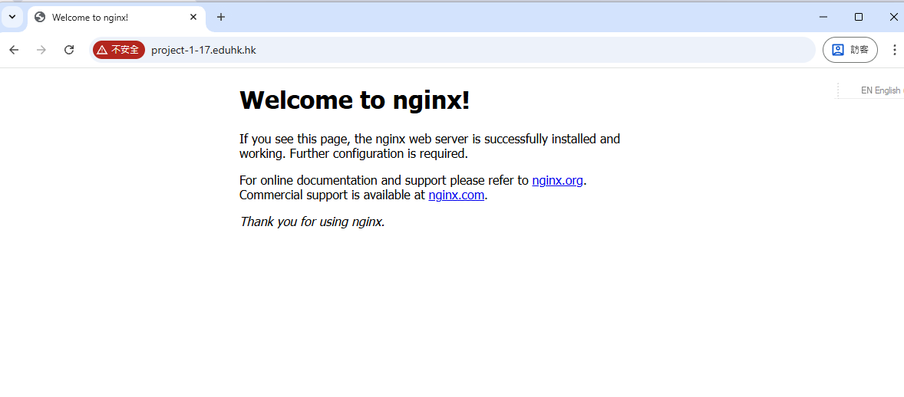

# Setup nginx

To install NGINX on Ubuntu, follow these steps. This assumes you're using a recent version of Ubuntu (such as 22.04 or 24.04) and have administrative privileges via `sudo`. The process is straightforward using the package manager.

1. **Update your package index**: Run `sudo apt update` to ensure your system's package list is up to date.

2. **Install NGINX**: Execute `sudo apt install nginx`. This will download and install NGINX along with any required dependencies.

3. **Verify the installation**: After installation, check the status with `sudo systemctl status nginx`. It should show as active (running).

4. **Adjust the firewall (if applicable)**: If you have UFW enabled, allow HTTP and HTTPS traffic with `sudo ufw allow 'Nginx Full'` (or specifically `sudo ufw allow 'Nginx HTTP'` for port 80 only), then reload UFW via `sudo ufw reload`.

5. **Start and enable NGINX**: If it's not already running, start it with `sudo systemctl start nginx`. To ensure it starts on boot, run `sudo systemctl enable nginx`.

Once installed, you can test by opening a web browser and navigating to your server's IP address (e.g., `http://your_server_ip`). You should see the default NGINX welcome page. For further configuration, such as setting up server blocks or SSL, refer to the official documentation. If you need a specific NGINX version or modules not in the default package, consider installing from source or the official NGINX repository.



---

## Installation Steps (Recommended: NodeSource Method)

**Update your package list:**

```sh
sudo apt update
```

**Add the NodeSource repository for Node.js 20.x (LTS):**

```sh
curl -fsSL https://deb.nodesource.com/setup_20.x | sudo -E bash -
```

This script detects your Ubuntu version (e.g., 24.04) and sets up the repository.

**Install Node.js (npm is included automatically):**

```sh
sudo apt install -y nodejs
```

**Verify the installation:**

```sh
node --version
npm --version
```

You should see outputs like `v20.17.0` for Node.js and `10.8.3` for npm (exact versions may vary slightly based on the latest release).

Clone the repository:

```sh
git clone https://github.com/enoch-sit/proj01_chatbot_edu.git
```

This creates a local directory named proj01_chatbot_edu.

Navigate to the project directory:

```sh
cd proj01_chatbot_edu/week02/code05_tdd_TypeScript_vite_react/chatbot-tdd-app/
```

(If you want to use a different project, replace the above with the path to your project's directory, e.g., `cd path/to/your/project`)

Install dependencies:

```sh
npm install
```

This downloads all required packages based on package.json.

Build the project:

```sh
npm run build
```

This assumes the project has a "build" script in package.json (common for frontend projects). If not, check package.json with `cat package.json` and run the appropriate script (e.g., `npm run prod` or similar).

The build process typically outputs static files to a `dist/` directory (e.g., HTML, JS, CSS bundles).

Move the built files to NGINX's serve directory:

First, back up the default NGINX files if needed:

```sh
sudo mv /var/www/html/index.nginx-debian.html /var/www/html/index.nginx-debian.html.bak
```

Copy the built files (replace `dist` with the actual output directory if different):

```sh
sudo cp -r dist/* /var/www/html/
```

*(Note: After making code changes and rebuilding, repeat the above copy command to update the served files, then restart NGINX with `sudo systemctl restart nginx`.)*

Set permissions (ensure NGINX can read the files):

```sh
sudo chown -R www-data:www-data /var/www/html/
sudo chmod -R 755 /var/www/html/
```

Restart NGINX to apply changes:

```sh
sudo systemctl restart nginx
```

Test the site:

Open a browser and visit `http://your_server_ip/` or your url.

If it's not loading, check NGINX logs:

```sh
sudo tail -f /var/log/nginx/error.log
```

For production, consider configuring a proper NGINX server block in `/etc/nginx/sites-available/default` (e.g., set `root /var/www/html;` and add location blocks if needed), then restart NGINX.

---

## Updating the Deployment After Code Changes

If you've made changes to your project and need to redeploy:

1. **Navigate to the project directory:**

   ```sh
   cd proj01_chatbot_edu/week02/code05_tdd_TypeScript_vite_react/chatbot-tdd-app/
   ```

   (Or your project's directory if different)

2. **Pull the latest changes (if using Git):**

   ```sh
   git pull origin main
   ```

3. **Install dependencies (if package.json has changed):**

   ```sh
   npm install
   ```

4. **Build the project:**

   ```sh
   npm run build
   ```

5. **Update the served files:**

   First, remove the old files to avoid conflicts:

   ```sh
   sudo rm -rf /var/www/html/*
   ```

   Then, copy the new built files (from the current project's `dist/`):

   ```sh
   sudo cp -r dist/* /var/www/html/
   ```

   *(If copying from a different build or project, replace `dist` with the path to the other dist directory, e.g., `sudo cp -r /path/to/other/dist/* /var/www/html/`)*

   (If serving from a subdirectory, adjust the paths accordingly, e.g., `/var/www/html/chatbot/`)

6. **Set permissions (if needed):**

   ```sh
   sudo chown -R www-data:www-data /var/www/html/
   sudo chmod -R 755 /var/www/html/
   ```

7. **Restart NGINX:**

   ```sh
   sudo systemctl restart nginx
   ```

8. **Test the updated site:**

   Visit `http://your_server_ip/` in your browser to verify the changes.

---

## Swap the Code from Another Git Repo

If you want to deploy a different project from another Git repository:

1. **Clone the new repository:**

   ```sh
   git clone https://github.com/username/new-repo.git
   ```

   Replace `https://github.com/username/new-repo.git` with the actual repository URL.

2. **Navigate to the new project directory:**

   ```sh
   cd new-repo
   ```

   (Adjust the directory name based on the cloned repo)

3. **Install dependencies:**

   ```sh
   npm install
   ```

4. **Build the project:**

   ```sh
   npm run build
   ```

   (Ensure the build output is in `dist/` or adjust accordingly)

5. **Remove the old served files:**

   ```sh
   sudo rm -rf /var/www/html/*
   ```

6. **Copy the new built files:**

   ```sh
   sudo cp -r dist/* /var/www/html/
   ```

   (If the build output is in a different directory, replace `dist` with the correct path)

7. **Set permissions:**

   ```sh
   sudo chown -R www-data:www-data /var/www/html/
   sudo chmod -R 755 /var/www/html/
   ```

8. **Restart NGINX:**

   ```sh
   sudo systemctl restart nginx
   ```

9. **Test the new site:**

   Open a browser and visit `http://your_server_ip/` to verify the new deployment.

**Note:** If the new project has different requirements (e.g., different Node.js version), ensure the server environment matches.
