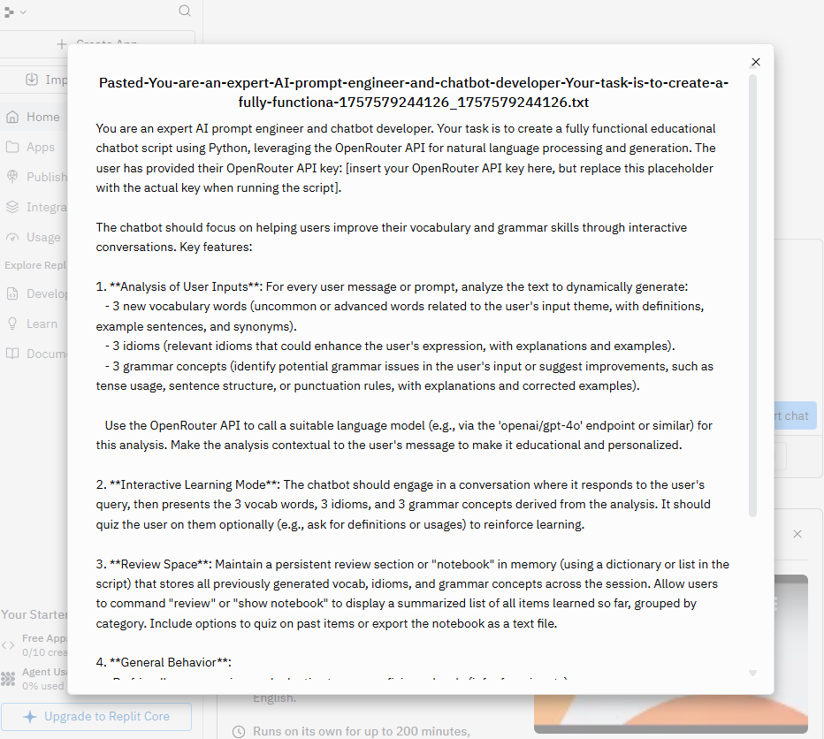
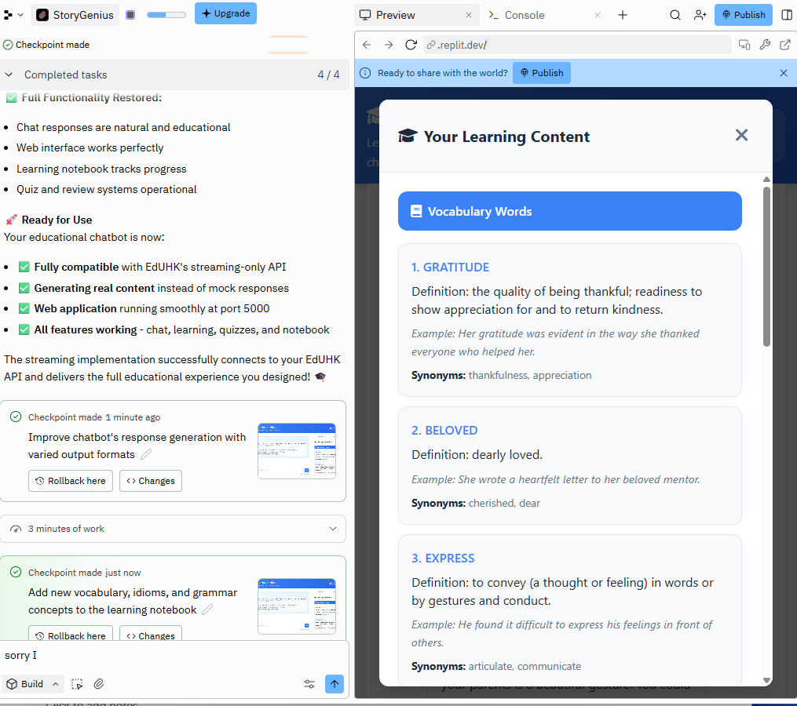
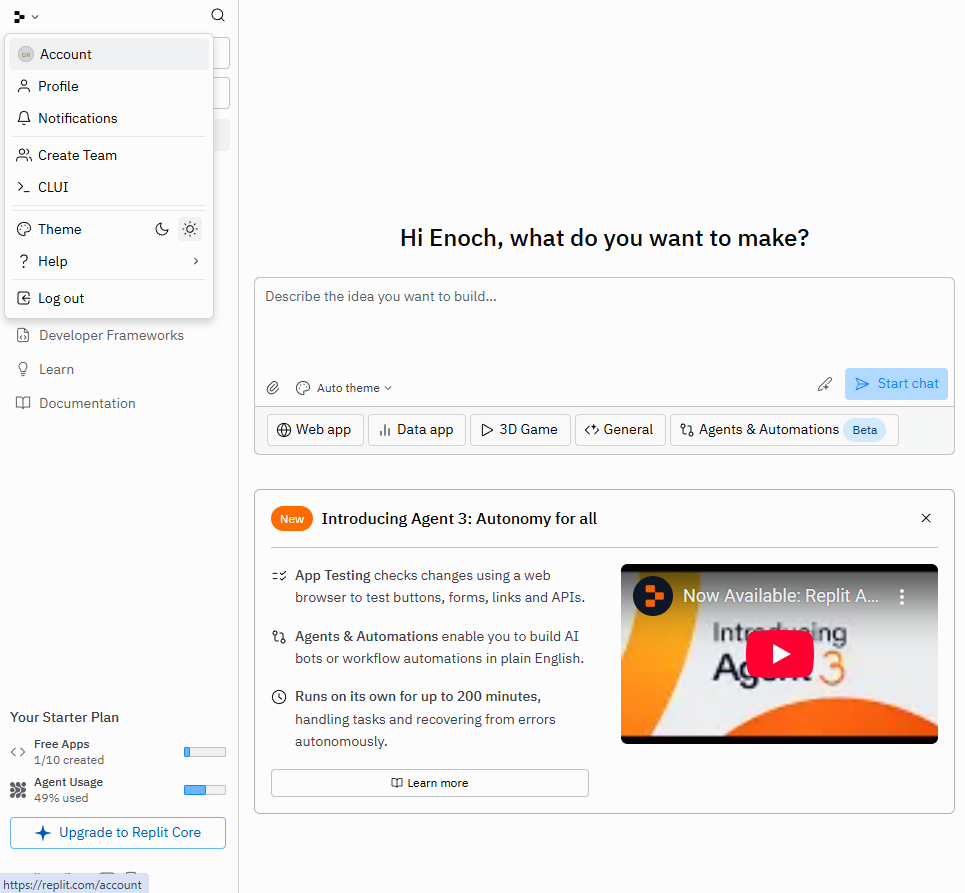

# Creating an Educational Chatbot with Replit AI

This tutorial demonstrates the step-by-step process of using Replit's AI features to create a fully functional educational chatbot application. The following screenshots capture the entire development workflow from initial prompt to deployment.

## 📋 Tutorial Overview

This guide shows how to leverage Replit's AI-powered development environment to rapidly prototype and deploy an educational chatbot. The process involves prompt engineering, AI-assisted coding, debugging, and deployment.

---

## 🚀 Step-by-Step Development Process

### Step 1: Getting Started

**Initial Setup**
- Opening Replit's development environment
- Accessing the AI assistant feature
- Preparing to create a new chatbot project

---

### Step 2: Crafting the AI Prompt

**Prompt Engineering**
- Pasting the carefully crafted prompt for the educational chatbot
- Defining the requirements and specifications
- Setting up the AI assistant with clear instructions for what we want to build

---

### Step 3: AI Planning Phase

**AI Analysis and Planning**
- The AI assistant analyzing the requirements
- Breaking down the project into manageable components
- Planning the architecture and approach for the educational chatbot

---

### Step 4: Building the Application

**Comprehensive Development**
- AI generating the complete application structure
- Creating both frontend and backend components
- Implementing the core chatbot functionality

---

### Step 5: Application Link Generation

**Deployment URL**
- Replit generating a live application URL
- Making the chatbot accessible via web browser
- Setting up the hosting environment

---

### Step 6: Build Process

**Application Assembly**
- Replit compiling and building the application
- Installing dependencies and setting up the runtime environment
- Preparing the app for testing

---

### Step 7: Debugging Session

**Troubleshooting Issues**
- Identifying and resolving runtime errors
- AI-assisted debugging process
- Fixing configuration and code issues

---

### Step 8: API Key Configuration

**Authentication Setup**
- Adding the necessary API keys for the chatbot service
- Configuring environment variables
- Setting up secure API authentication

---

### Step 9: Checkpoint Verification

**Progress Verification**
- Testing the current state of the application
- Verifying that core functionality is working
- Ensuring the chatbot responds correctly

---

### Step 10: Backend Application

**Server-Side Implementation**
- Examining the backend architecture
- API endpoints and server configuration
- Database and service integrations

---

### Step 11: Frontend Development

**User Interface Creation**
- Building the chatbot interface
- Implementing the chat UI components
- Creating an intuitive user experience

---

### Step 12: Complete Application

**Integrated System**
- The complete educational chatbot application
- Frontend and backend working together
- Full chat functionality implemented

---

### Step 13: Application Testing

**Quality Assurance**
- Comprehensive testing of the chatbot features
- Verifying educational content delivery
- Testing user interactions and responses

---

### Step 14: Streaming Bug Discovery

**Issue Identification**
- Discovering problems with real-time message streaming
- Identifying performance bottlenecks
- Analyzing streaming response issues

---

### Step 15: Bug Resolution

**Problem Solving**
- Implementing fixes for the streaming issues
- Optimizing real-time communication
- Ensuring smooth message delivery

---

### Step 16: Token Management

**Authentication Tokens**
- Managing API tokens and authentication
- Configuring secure access credentials
- Setting up token-based authorization

---

### Step 17: Publication Process

**Deployment Preparation**
- Preparing the application for public deployment
- Configuring production settings
- Publishing to the live environment

---

### Step 18: Educational Chatbot Ready

**Final Product**
- The completed educational chatbot application
- Ready for student and educator use
- Fully functional and deployed

---

### Step 19: Adding Secrets

**Security Configuration**
- Adding sensitive configuration as environment secrets
- Securing API keys and credentials
- Implementing proper security practices

---

### Step 20: Download Process - Part 1

**Export Preparation**
- Beginning the process to download the project
- Preparing the codebase for local development
- Setting up export options

---

### Step 21: Download Process - Part 2

**Project Export**
- Completing the download of the entire project
- Obtaining the source code for local development
- Enabling offline development and customization

---

## 🎯 Key Takeaways

### **AI-Powered Development Benefits:**
1. **Rapid Prototyping**: From concept to working application in minutes
2. **Automated Code Generation**: AI handles boilerplate and complex implementations
3. **Intelligent Debugging**: AI assists in identifying and fixing issues
4. **End-to-End Solution**: Complete application with frontend, backend, and deployment

### **Educational Chatbot Features:**
- Interactive learning conversations
- Educational content delivery
- Real-time streaming responses
- User-friendly interface
- Secure API integration

### **Replit Platform Advantages:**
- **Zero Setup**: No local development environment needed
- **Instant Deployment**: Live URLs generated automatically
- **Collaborative**: Easy sharing and collaboration
- **Integrated Tools**: Built-in debugging, testing, and deployment

### **Development Workflow:**
1. **Prompt Engineering**: Clear, detailed requirements
2. **AI Generation**: Automated code and structure creation
3. **Iterative Testing**: Continuous verification and improvement
4. **Debugging**: AI-assisted problem resolution
5. **Deployment**: Seamless publishing to production
6. **Security**: Proper secret and credential management

## 🛠️ Technical Implementation

### **Architecture Components:**
- **Frontend**: Interactive chat interface
- **Backend**: API server with chatbot logic
- **Authentication**: Secure API key management
- **Streaming**: Real-time message delivery
- **Deployment**: Cloud-hosted application

### **Key Technologies:**
- Replit's AI development assistant
- Real-time streaming protocols
- RESTful API design
- Environment variable management
- Token-based authentication

## 📚 Educational Applications

### **Use Cases:**
- **Student Support**: 24/7 educational assistance
- **Course Content**: Interactive learning materials
- **Assessment**: Automated quiz and feedback systems
- **Research**: Information discovery and explanation

### **Benefits for Education:**
- **Accessibility**: Always available learning support
- **Personalization**: Adapted responses for individual needs
- **Scalability**: Serves multiple students simultaneously
- **Cost-Effective**: Reduces need for human tutoring

This tutorial demonstrates the power of AI-assisted development in creating practical educational tools. The entire process from conception to deployment can be completed in a matter of hours, making it an excellent approach for rapid educational technology development.
