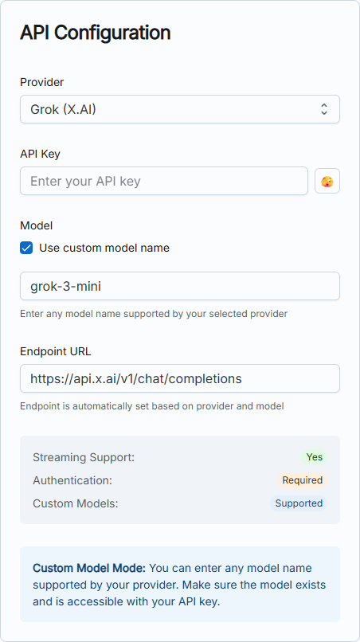
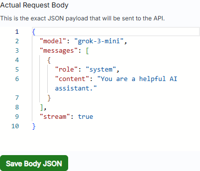
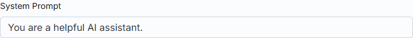
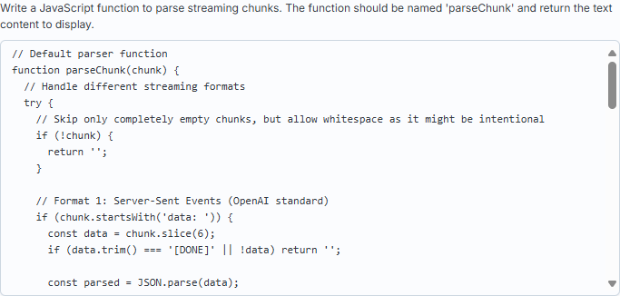
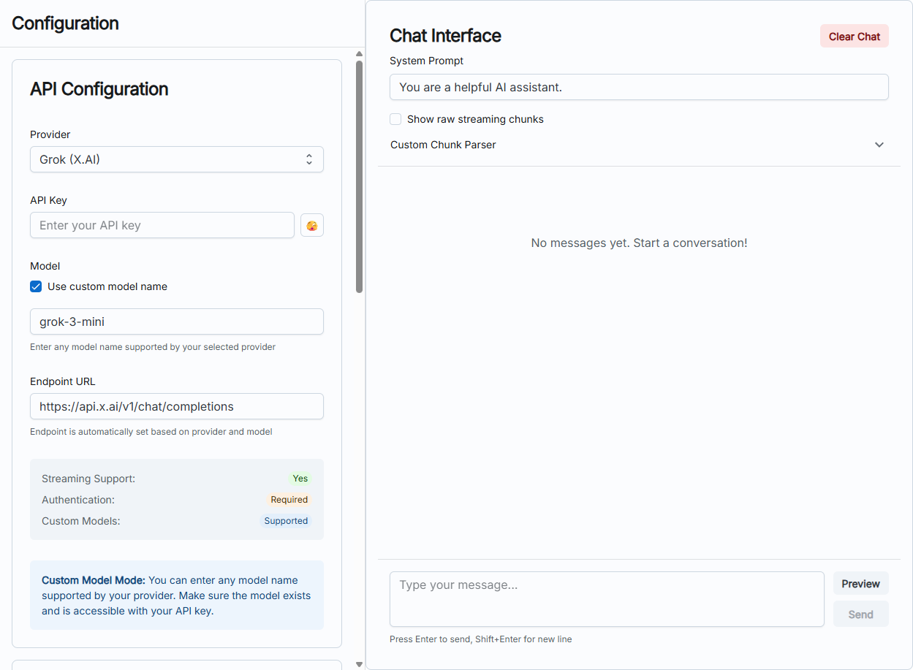

# Components of a Chatbot - Comprehensive Group Discussion Worksheet

**URL for Hands-on Practice**: <http://project-1-16.eduhk.hk/>

## Group Discussion Instructions

**Break into groups randomly (3-4 people per group)**

Each group should analyze the chatbot UI components and discuss the following questions. Use the screenshots below as reference and explore the live UI to understand each component.

---

## Discussion Topics

### 1. What is the Request Header?

**Group Task**: Examine the Request Headers section and discuss:

- What information is contained in HTTP headers?
- Why is "Content-Type: application/json" important?
- What other headers might be needed for authentication?
- How do headers help the API understand the request?


*API Configuration section showing provider settings*


*Request Headers showing Content-Type configuration*

**Key Points to Discuss**:

- Headers provide metadata about the request
- Authentication headers (like API keys) for security
- Content-Type tells the server what format the data is in
- CORS headers for browser-based requests

---

### 2. What is the Request Body?

**Group Task**: Analyze the Request Body JSON and discuss:

- What is the structure of the JSON payload?
- What does each field (model, messages, stream) represent?
- How are conversation messages structured?
- What is the role of the "system" message vs "user" messages?


*Request Body showing JSON payload structure*

**Key Points to Discuss**:

- JSON structure for API communication
- Message array containing conversation history
- Role-based message system (system, user, assistant)
- Parameters like "stream: true" for real-time responses
- Model specification ("grok-3-mini")

---

### 3. What is the System Prompt?

**Group Task**: Examine the System Prompt section and discuss:

- How does the system prompt influence AI behavior?
- What makes a good system prompt?
- How does it differ from user messages?
- What happens if you change the system prompt?


*System Prompt configuration area*

**Key Points to Discuss**:

- System prompts set the AI's personality and behavior
- They provide context and instructions for the AI
- Different from user messages - they're "invisible" to the conversation
- Can control response style, knowledge boundaries, and capabilities

---

### 4. What is the Parsing Function?

**Group Task**: Study the Custom Chunk Parser and discuss:

- What is streaming in AI responses?
- Why do we need to parse chunks of data?
- What are the different formats mentioned in the code?
- How does real-time parsing improve user experience?


*Custom Chunk Parser showing JavaScript parsing function*

The default parsing function:

```js
// Default parser function
function parseChunk(chunk) {
  // Handle different streaming formats
  try {
    // Skip only completely empty chunks, but allow whitespace as it might be intentional
    if (!chunk) {
      return '';
    }

    // Format 1: Server-Sent Events (OpenAI standard)
    if (chunk.startsWith('data: ')) {
      const data = chunk.slice(6);
      if (data.trim() === '[DONE]' || !data) return '';
      
      const parsed = JSON.parse(data);
      const choice = parsed.choices?.[0];
      
      if (choice?.delta) {
        // Regular content
        const content = choice.delta.content;
        if (content) {
          return content;
        }
      }
      
      return '';
    }
    
    // Format 2: Raw JSON chunks (some APIs)
    if (chunk.trim().startsWith('{') && chunk.trim().endsWith('}')) {
      const parsed = JSON.parse(chunk.trim());
      const choice = parsed.choices?.[0];
      
      if (choice?.delta) {
        // Grok thinking content (reasoning)
        const reasoning = choice.delta.reasoning_content;
        if (reasoning) {
          return '💭 ' + reasoning;
        }
        
        // Try multiple possible content paths
        return choice.delta.content || 
               parsed.delta?.content || 
               parsed.content || '';
      }
      
      return '';
    }
    
    // Format 3: Plain text chunks (Grok, some other APIs)
    // Only return if it's clearly text content, not JSON metadata
    if (chunk && typeof chunk === 'string' && 
        !chunk.includes('"object"') && !chunk.includes('"choices"')) {
      return chunk; // Don't trim here to preserve intentional spaces
    }
    
    return '';
  } catch (e) {
    console.warn('Parse error:', e);
    // If parsing fails and it's not JSON-like, return as plain text
    if (chunk && typeof chunk === 'string' && 
        !chunk.trim().startsWith('{') && !chunk.trim().startsWith('[')) {
      return chunk;
    }
    return '';
  }
}
```

- Copy the JS code and ask AI to explain the code

**Key Points to Discuss**:

- Streaming allows real-time response display
- Different APIs use different chunk formats
- Parser extracts meaningful content from raw data
- Error handling for malformed chunks
- Server-Sent Events (SSE) format vs JSON chunks

---

### 5. Advanced Discussion: Grok 3 Mini Thinking Process

**Group Task**: Research and discuss:

- What makes Grok 3 different from other AI models?
- How does the "reasoning_content" field work?
- What is the significance of the 💭 emoji in responses?
- How can seeing AI "thinking" help users?

**Key Points to Discuss**:

- Chain of thought reasoning in AI models
- Transparency in AI decision making
- Benefits of showing reasoning process
- Different AI architectures and capabilities

---

## Hands-On Activities

### Activity 1: Configuration Testing

1. Try changing the system prompt
2. Observe how it affects responses
3. Test different providers if available

### Activity 2: Header Analysis

1. Look at the actual headers generated
2. Try adding custom headers
3. Understand authentication requirements

### Activity 3: Body Structure

1. Examine the JSON structure
2. Try modifying parameters
3. Understand message formatting

### Activity 4: Parser Exploration

1. Look at the parsing function code
2. Understand different chunk formats
3. See how errors are handled

---

## Complete UI Overview Screenshots

### Initial View

This screenshot shows the top part of the chatbot UI, including the API Configuration section with Provider, API Key, Model, and Endpoint URL settings.



### After Scrolling

This screenshot shows the scrolled view, displaying the Actual Request Data section with Request Headers and Request Body in JSON format, along with the Chat Interface on the right.


---

## Self reflection Guidelines

You should reflect on the following:

1. **Your assigned component** (Headers, Body, System Prompt, or Parser)
2. **Key findings** from your discussion
3. **Live demonstration** using the UI
4. **One interesting insight** you discovered
5. **Questions** for the class
