# Complete Guide: Setting Up a RAG Agent with Flowise Document Store

## Overview

This comprehensive tutorial will guide you through setting up a **Retrieval-Augmented Generation (RAG) Agent** using Flowise with a document store. You'll learn how to:

- Create a new Document Store in Flowise
- Configure web scraping with Cheerio
- Set up Pinecone vector database
- Configure embeddings and record management
- Implement the complete RAG pipeline

## Prerequisites

- Flowise installed and running (see flowiseSetupGuide.md)
- Pinecone account (free tier available)
- Basic understanding of RAG concepts
- Target website or documents for scraping

## What is RAG (Retrieval-Augmented Generation)?

RAG combines the power of large language models with external knowledge retrieval. Instead of relying solely on pre-trained knowledge, RAG systems:

1. **Retrieve** relevant information from external sources
2. **Augment** the AI's context with this retrieved information
3. **Generate** more accurate and up-to-date responses

## Step-by-Step Tutorial

### Step 1: Create a New Document Store in Flowise

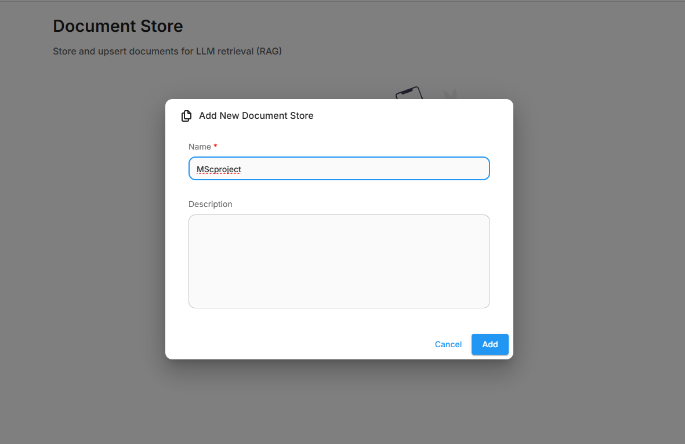

1. **Access Flowise Interface**
   - Open your Flowise installation in a web browser
   - Navigate to the main dashboard

2. **Create Document Store**
   - Look for the "Document Store" section
   - Click on **"+ New Document Store"** or similar option
   - This will open the document store configuration interface

**Key Points:**

- Document stores are the foundation of RAG systems
- They manage how documents are processed and stored
- Essential for creating knowledge bases from various sources

---

### Step 2: Configure Cheerio Web Scraper

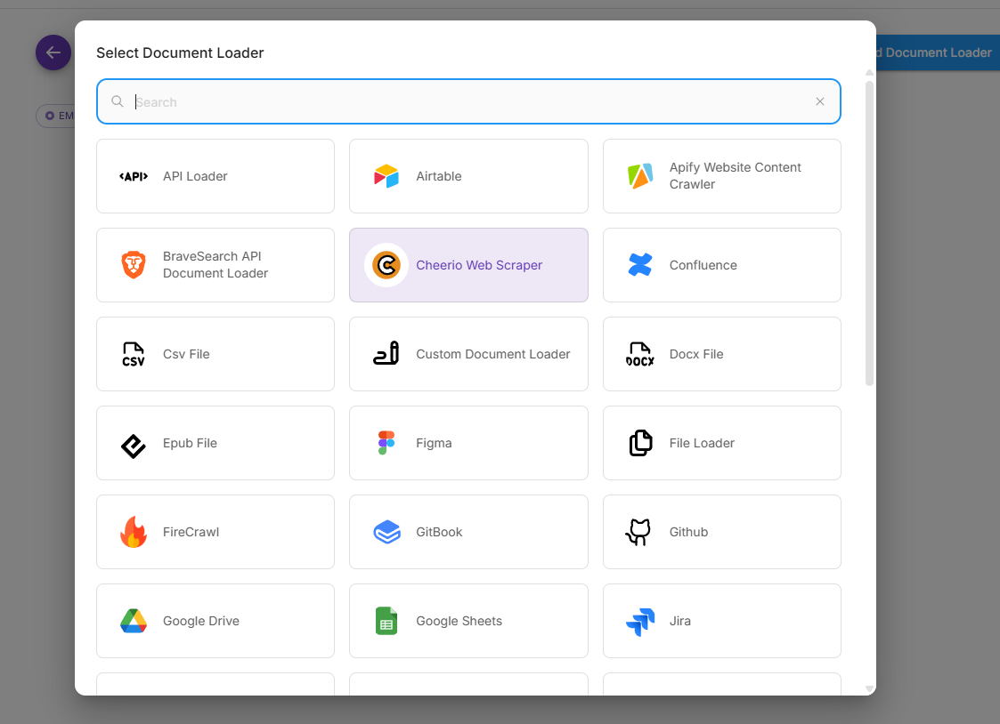

1. **Select Web Scraping Method**
   - Choose **"Cheerio Web Scraper"** as your data source
   - Cheerio is a server-side jQuery implementation perfect for web scraping

2. **Configure Scraper Settings**
   - Set up the scraper parameters
   - Configure selectors for content extraction
   - Define how the scraper should handle different HTML elements

**Why Cheerio?**

- Lightweight and fast
- Excellent for structured content extraction
- Works well with static websites
- Supports CSS selectors for precise content targeting

---

### Step 3: Set Up Web Crawling Parameters

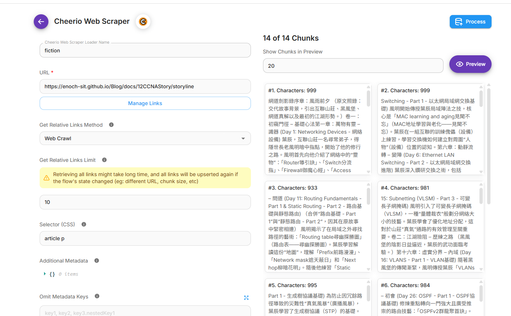

1. **Configure Crawling Settings**
   - **URL**: Enter the target website URL
   - **Crawl Depth**: Set how many levels deep to crawl
   - **Content Selectors**: Define which elements to extract
   - **Exclusion Rules**: Set patterns to avoid (ads, navigation, etc.)

2. **Advanced Options**
   - **Delay**: Set crawl delays to be respectful
   - **Headers**: Configure user agent and other headers
   - **Rate Limiting**: Prevent overwhelming the target server

**Best Practices:**

- Always respect robots.txt
- Use reasonable crawl delays
- Focus on content-rich pages
- Exclude navigation and advertising content

---

### Step 4: Create Pinecone Vector Database Index

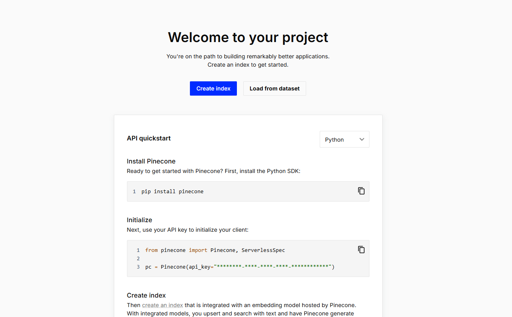

1. **Access Pinecone Console**
   - Log into your Pinecone account at [pinecone.io](https://pinecone.io)
   - Navigate to the indexes section

2. **Create New Index**
   - Click **"Create Index"**
   - Choose appropriate settings:
     - **Name**: Give your index a descriptive name
     - **Environment**: Select your preferred region
     - **Pod Type**: Choose based on your needs (p1.x1 for testing)

**Index Configuration:**

- **Dimension**: Will be set based on embedding model (typically 1536 for AWS Text embedding model)
- **Metric**: Usually "cosine" for text similarity
- **Pods**: Start with 1 pod for development

---

### Step 5: Configure Embedding Dimensions

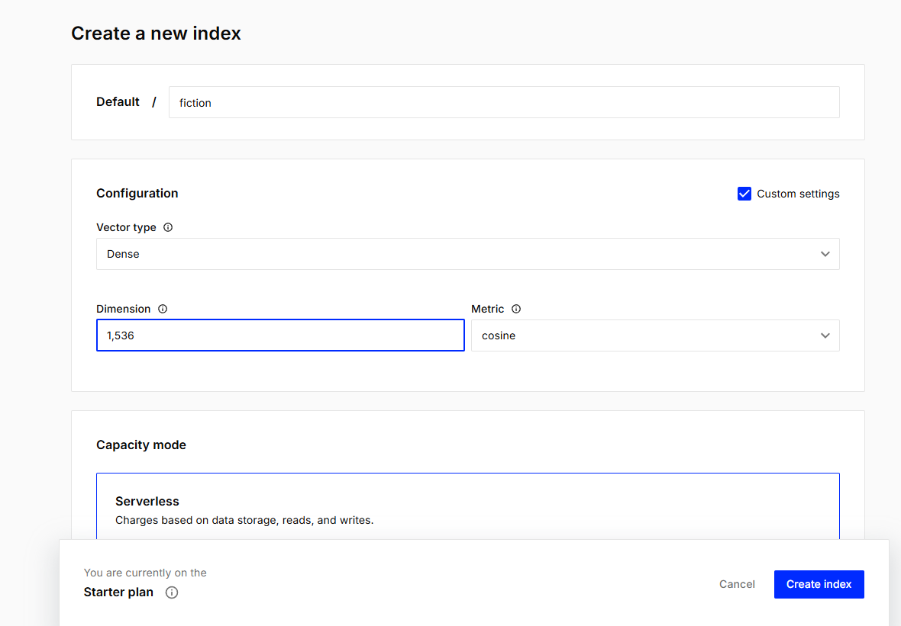

1. **Set Embedding Dimensions**
   - Configure the embedding dimension to **1536**
   - This matches OpenAI's text-embedding-ada-002 model
   - Ensure consistency between your embedding model and vector database

2. **Embedding Model Selection**
   - Choose your preferred embedding model
   - OpenAI Ada-002 is popular for its quality and speed
   - Ensure the dimensions match your Pinecone index

**Common Embedding Dimensions:**

- **OpenAI Ada-002**: 1536 dimensions
- **Sentence Transformers**: 384-768 dimensions
- **Cohere**: 4096 dimensions

---

### Step 6: Generate Pinecone API Key

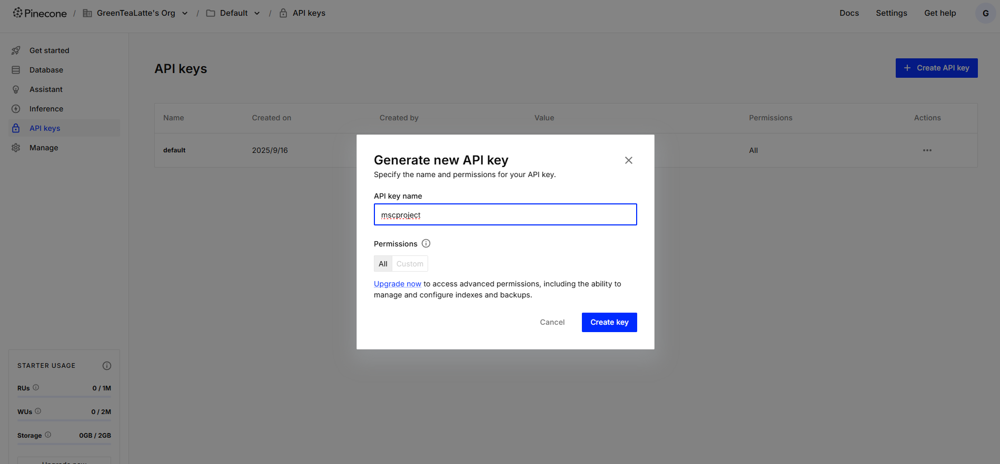

1. **Navigate to API Keys**
   - In Pinecone console, go to **"API Keys"** section
   - Click **"Create API Key"**

2. **Configure API Key**
   - **Name**: Give it a descriptive name (e.g., "flowise-rag-agent")
   - **Environment**: Select the same environment as your index
   - **Permissions**: Ensure it has read/write access to your index

3. **Save the Key**
   - **⚠️ Important**: Copy and save the API key immediately
   - Store it securely - you won't be able to see it again
   - Consider using environment variables for security

---

### Step 7: Add API Key to Flowise

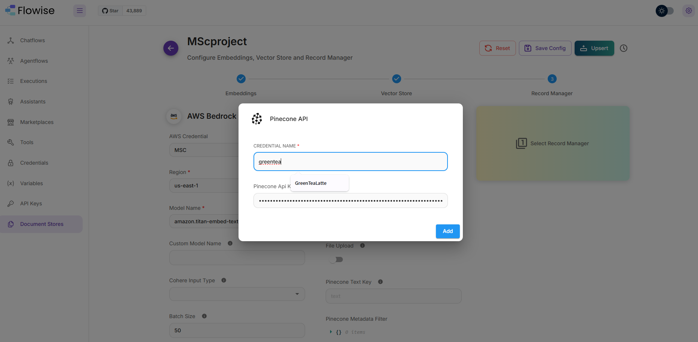

1. **Navigate to Pinecone Configuration**
   - Return to your Flowise document store setup
   - Find the Pinecone vector store configuration

2. **Enter API Credentials**
   - **API Key**: Paste your Pinecone API key
   - **Environment**: Enter your Pinecone environment (e.g., "us-east1-gcp")
   - **Index Name**: Enter the name of your created index

**Security Best Practices:**

- Never commit API keys to version control
- Use environment variables in production
- Regularly rotate API keys
- Monitor API usage

---

### Step 8: Configure Index Settings

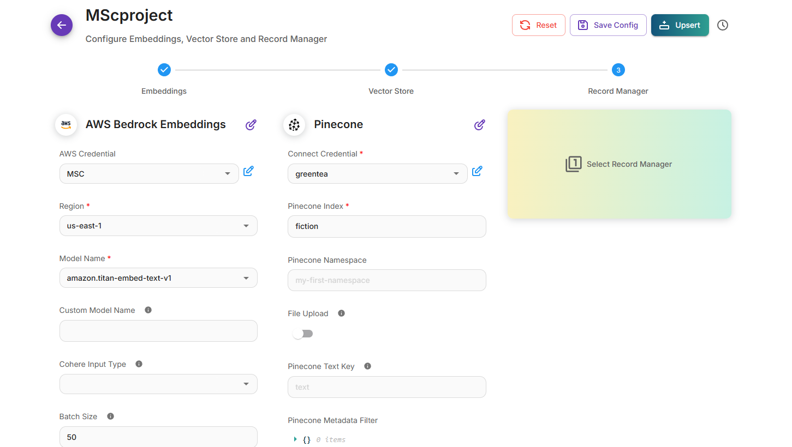

1. **Complete Index Configuration**
   - Verify all Pinecone settings are correct
   - **Index Name**: Confirm it matches your Pinecone index
   - **Namespace**: Optional, useful for organizing data
   - **Top K**: Number of similar documents to retrieve (typically 3-10)

2. **Vector Store Settings**
   - **Metadata**: Configure what metadata to store
   - **Text Key**: Field name for document content
   - **Filter**: Optional filters for specific document types

---

### Step 9: Set Up SQLite Record Manager

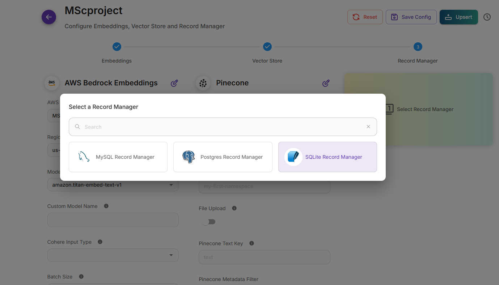

1. **Choose Record Manager**
   - Select **"SQLite Record Manager"**
   - This tracks which documents have been processed
   - Prevents duplicate processing and enables incremental updates

2. **Record Manager Benefits**
   - **Deduplication**: Prevents processing same content multiple times
   - **Incremental Updates**: Only processes new/changed content
   - **Cleanup**: Helps remove outdated content
   - **Tracking**: Maintains history of processed documents

**Why SQLite?**

- Lightweight and self-contained
- No additional database setup required
- Perfect for development and small-scale deployments
- Easy to backup and migrate

---

### Step 10: Configure Full Cleanup Mode

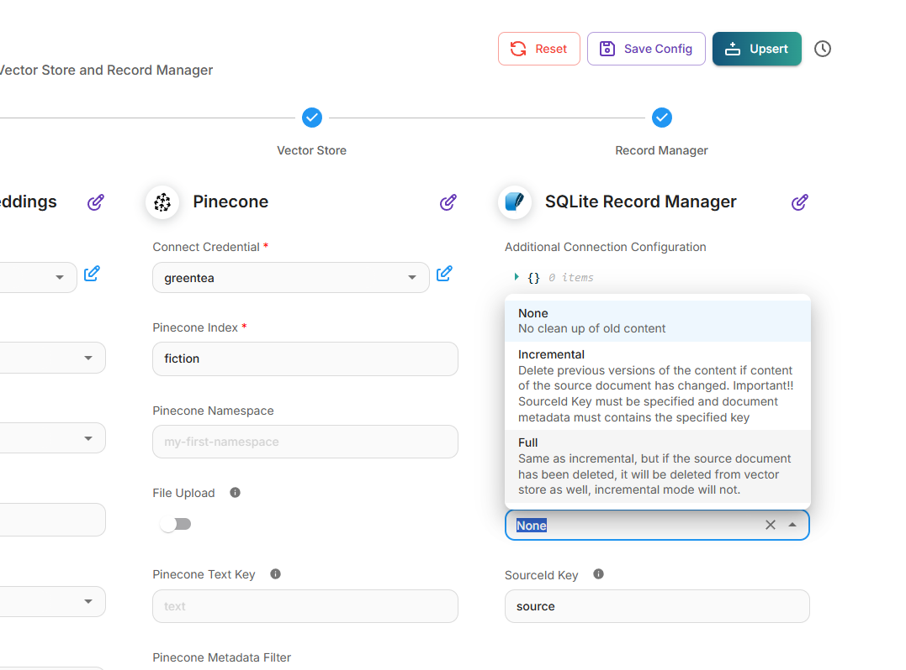

1. **Select Cleanup Strategy**
   - Choose **"Full Cleanup"** mode
   - This ensures old, outdated documents are removed
   - Maintains fresh, relevant content in your vector store

2. **Cleanup Options**
   - **Full**: Removes all records not in current batch
   - **Incremental**: Only removes explicitly marked records
   - **None**: Never removes records (accumulates over time)

**When to Use Full Cleanup:**

- ✅ Content changes frequently
- ✅ Want to prevent stale information
- ✅ Need complete content refresh
- ❌ Have very large, stable datasets
- ❌ Want to preserve historical versions

---

### Step 11: Execute the Upsert Operation

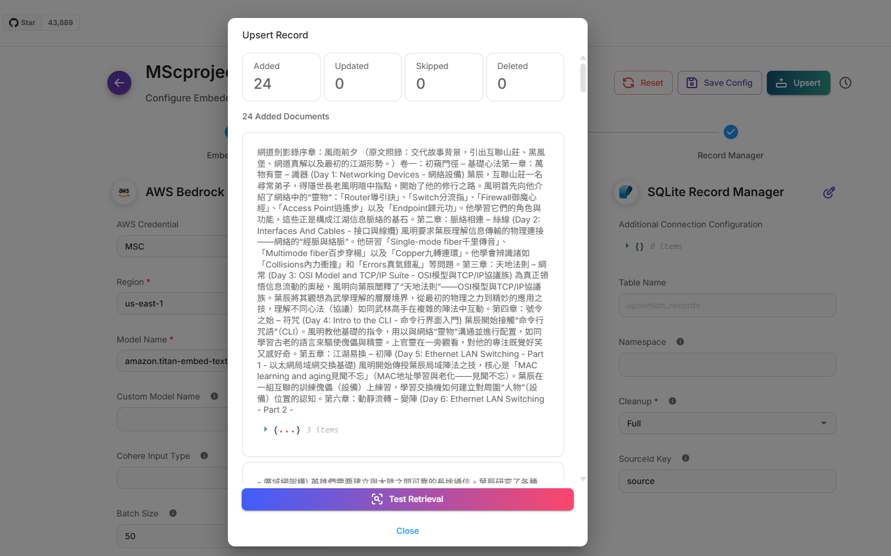

1. **Start the Upsert Process**
   - Click **"Upsert"** to begin processing
   - This will:
     - Scrape content from your target website
     - Convert text to embeddings
     - Store vectors in Pinecone
     - Update the record manager

2. **Monitor Progress**
   - Watch for processing status updates
   - Check logs for any errors or warnings
   - Verify documents are being processed correctly

**What Happens During Upsert:**

1. **Scraping**: Cheerio extracts content from web pages
2. **Chunking**: Large documents are split into smaller segments
3. **Embedding**: Text is converted to numerical vectors
4. **Storage**: Vectors are uploaded to Pinecone
5. **Recording**: Process is logged in SQLite record manager

---

## Testing Your RAG Agent

### Verify Document Store Setup

```bash
# Check Pinecone index stats
# You can do this through Pinecone console or API

# Verify SQLite record manager
# Check the created database file for processed records
```

### Create a Chat Flow

1. **Create New Chatflow**
   - Use your document store as knowledge base
   - Connect to your preferred LLM (Nova etc.)
   - Configure retrieval parameters

2. **Test Queries**
   - Ask questions related to your scraped content
   - Verify accurate retrieval and relevant responses
   - Check citation and source attribution

## Troubleshooting Common Issues

### Connection Problems


**Issue**: Cannot connect to Pinecone
**Solution**: 
- Verify API key is correct
- Check environment and region settings
- Ensure index name matches exactly


### Scraping Issues


**Issue**: No content being scraped
**Solution**:
- Verify target URL is accessible
- Check CSS selectors are correct
- Ensure robots.txt allows scraping
- Test with a simpler page first


### Embedding Problems


**Issue**: Dimension mismatch error
**Solution**:
- Ensure Pinecone index dimension matches embedding model
- Common dimensions: 1536 (OpenAI), 768 (many others)
- Recreate index with correct dimensions if needed


### Performance Issues


**Issue**: Slow upsert process
**Solution**:
- Reduce batch size
- Add delays between requests
- Consider upgrading Pinecone plan
- Optimize content selectors


## Best Practices

### Content Strategy

- **Quality over Quantity**: Focus on high-value, relevant content
- **Regular Updates**: Schedule periodic re-indexing
- **Content Curation**: Remove or filter low-quality content
- **Chunking Strategy**: Balance chunk size for context vs. precision

### Security

- **API Key Management**: Use environment variables
- **Access Control**: Limit API key permissions
- **Rate Limiting**: Respect service limits
- **Monitoring**: Track usage and costs

### Performance Optimization

- **Batch Processing**: Process documents in batches
- **Parallel Processing**: Use multiple workers when possible
- **Caching**: Cache frequently accessed embeddings
- **Index Optimization**: Regularly maintain and optimize indices

## Advanced Configuration

### Custom Embedding Models

```yaml
# Example configuration for custom embeddings
embedding:
  model: "sentence-transformers/all-MiniLM-L6-v2"
  dimension: 384
  batch_size: 32
```

### Advanced Chunking

```yaml
# Sophisticated chunking strategy
chunking:
  strategy: "recursive"
  chunk_size: 1000
  chunk_overlap: 200
  separators: ["\n\n", "\n", " ", ""]
```

### Metadata Enhancement

```yaml
# Rich metadata configuration
metadata:
  include:
    - url
    - title
    - date_scraped
    - content_type
    - word_count
  custom_fields:
    - department
    - priority_level
```

## Monitoring and Maintenance

### Regular Health Checks

1. **Vector Store Health**
   - Monitor index size and utilization
   - Check query performance metrics
   - Verify data freshness

2. **Content Quality**
   - Review retrieved content accuracy
   - Monitor user feedback
   - Update content sources as needed

3. **System Performance**
   - Track response times
   - Monitor resource usage
   - Optimize based on usage patterns

## Conclusion

You've successfully created a complete RAG Agent with Flowise! This setup provides:

- ✅ **Automated Web Scraping** with Cheerio
- ✅ **Vector Storage** with Pinecone
- ✅ **Embedding Management** with OpenAI
- ✅ **Record Tracking** with SQLite
- ✅ **Incremental Updates** with cleanup management

### Next Steps

1. **Expand Content Sources**: Add more websites or document types
2. **Optimize Retrieval**: Fine-tune similarity thresholds and result counts
3. **Enhance Metadata**: Add more contextual information
4. **Monitor Performance**: Set up analytics and monitoring
5. **Scale Up**: Consider production deployment strategies

### Additional Resources

- [Flowise Documentation](https://docs.flowiseai.com/)
- [Pinecone Best Practices](https://docs.pinecone.io/)
- [RAG System Design Patterns](https://docs.flowiseai.com/rag)
- [Vector Database Optimization](https://docs.pinecone.io/docs/overview)

---

## Happy Building! 🚀

*Remember: The key to a successful RAG system is high-quality, relevant content combined with proper retrieval configuration. Start simple and iterate based on user feedback and performance metrics.*