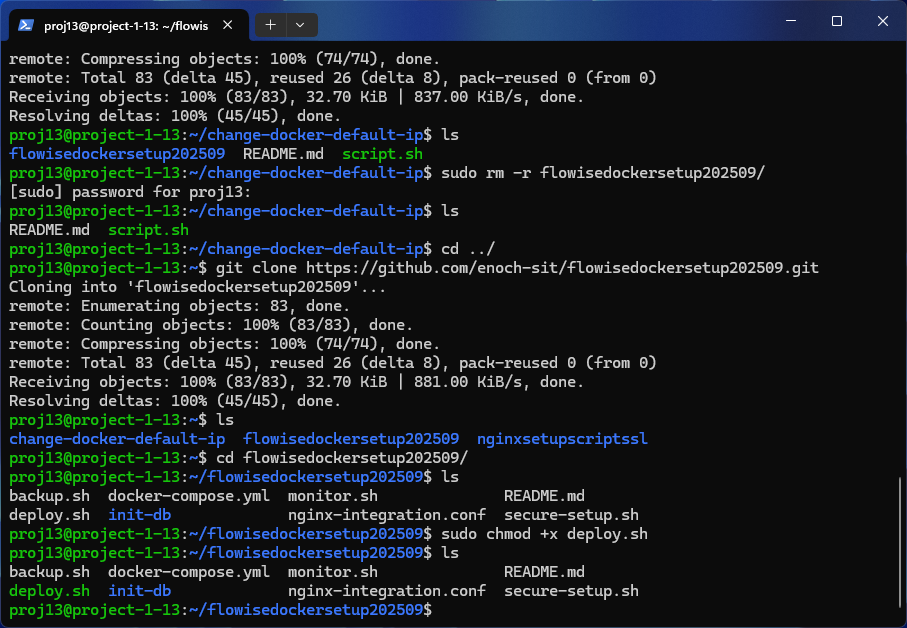
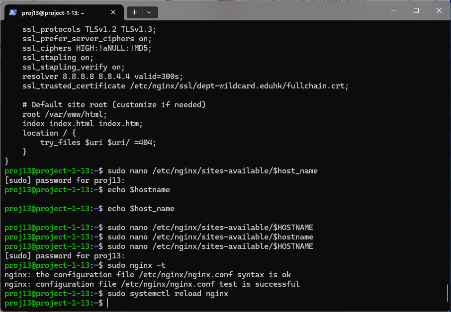

# Flowise Docker Setup Tutorial

This tutorial guides you through setting up Flowise using Docker, and configuring it to be served via Nginx.

## 1. SSH into your server

Connect to your server using SSH.

```bash
ssh proj13@project-1-13.eduhk.hk
```


## 2. Change Docker's Default IP Configuration

Clone the repository to change Docker's default IP, make the script executable, and run it.

```bash
git clone https://github.com/enoch-sit/change-docker-default-ip.git
cd change-docker-default-ip/
chmod +x script.sh
sudo ./script.sh
cd ..
```


## 3. Clone the Flowise Docker Setup Repository

Clone the repository containing the Flowise Docker setup.

```bash
git clone https://github.com/enoch-sit/flowisedockersetup202509.git
cd flowisedockersetup202509/
```




## 4. Check Port Availability and Stop Existing Services

Before deploying Flowise, ensure that port 3000 is free. If you have other Node.js applications running, for example with PM2, you should stop them.

```bash
# Check if any process is using port 3000
sudo lsof -i :3000

# List all processes managed by PM2
pm2 list

# Stop all PM2-managed processes
pm2 stop all

# Or, to delete them completely
pm2 delete all

# Stop all running Docker containers
sudo docker stop $(sudo docker ps -q)

# Or, if you want to stop and remove all containers
sudo docker stop $(sudo docker ps -q) && sudo docker rm $(sudo docker ps -aq)
```

## 5. Deploy Flowise

Make the deployment script executable and run it. This will generate passwords and start the Flowise and Postgres containers.

```bash
chmod +x deploy.sh
sudo ./deploy.sh
```


## 6. Verify Deployment

Check the container logs to ensure that the deployment was successful and Flowise is running.

```bash
docker-compose logs -f
```


## 7. Update Nginx Configuration

To expose Flowise through a domain or subdomain, configure Nginx to act as a reverse proxy. Edit your site's Nginx configuration file:

```bash
sudo nano /etc/nginx/sites-available/project-1-13.eduhk.hk
```

Add a `location` block to proxy requests to the Flowise container (running on port 3000 by default).

```nginx
client_max_body_size 100M;

location / {
    proxy_pass http://localhost:3000;
    proxy_set_header Host $host;
    proxy_set_header X-Real-IP $remote_addr;
    proxy_set_header X-Forwarded-For $proxy_add_x_forwarded_for;
    proxy_set_header X-Forwarded-Proto $scheme;
}
```


## 8. Test and Reload Nginx

Test the Nginx configuration and then reload it to apply the changes.

```bash
sudo nginx -t
sudo systemctl reload nginx
```



## 9. Get Credentials

View the `.env` file to get the `FLOWISE_USERNAME` and `FLOWISE_PASSWORD`.

```bash
sudo cat .env
```


## 10. Create Your Account

Open your browser and navigate to `https://project-1-13.eduhk.hk/organization-setup`. Use the `FLOWISE_USERNAME` and `FLOWISE_PASSWORD` from the `.env` file as the "Existing Username" and "Existing Password". Then create a new administrator account.


## 11. Finalize Flowise UI Setup

Sign up with your new account details.


## 12. Flowise is Ready

Congratulations! Your Flowise instance is now up and running, accessible through your domain.


