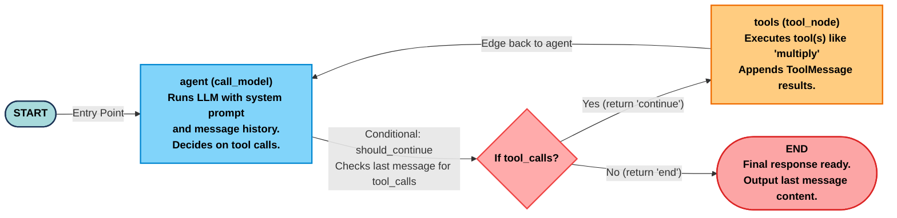

# Diagram

```mermaid
graph LR
    START([START]) -->|Entry Point| Agent["agent (call_model)<br>Runs LLM with system prompt<br>and message history.<br>Decides on tool calls."]
    Agent -->|Conditional: should_continue<br>Checks last message for tool_calls| Decision{If tool_calls?}
    Decision -->|"Yes (return 'continue')"| Tools["tools (tool_node)<br>Executes tool(s) like 'multiply'<br>Appends ToolMessage results."]
    Tools -->|Edge back to agent| Agent
    Decision -->|"No (return 'end')"| END([END<br>Final response ready.<br>Output last message content.])

    classDef start fill:#A8DADC,stroke:#1D3557,stroke-width:2px,color:#000,font-weight:bold;
    classDef agent fill:#81D4FA,stroke:#0288D1,stroke-width:2px,color:#000,font-weight:bold;
    classDef tools fill:#FFCC80,stroke:#EF6C00,stroke-width:2px,color:#000,font-weight:bold;
    classDef decision fill:#FFABAB,stroke:#EF4444,stroke-width:2px,color:#000,font-weight:bold;
    classDef endNode fill:#FCA5A5,stroke:#DC2626,stroke-width:2px,color:#000,font-weight:bold;

    class START start;
    class Agent agent;
    class Tools tools;
    class Decision decision;
    class END endNode;
```
