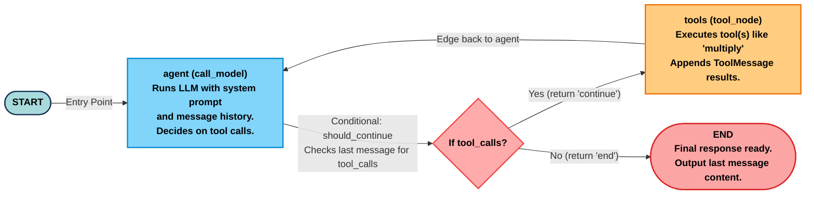

```py
from fastapi import FastAPI, Request
from fastapi.responses import HTMLResponse
from fastapi.staticfiles import StaticFiles
from pydantic import BaseModel
from langchain_core.messages import BaseMessage, SystemMessage, HumanMessage, ToolMessage
from langgraph.graph.message import add_messages
from langgraph.graph import StateGraph, END
from langchain_core.tools import tool
from langchain_aws import ChatBedrock
from langgraph.checkpoint.memory import MemorySaver
import json
```

---

# 📚 Comprehensive Guide to LangChain & LangGraph Concepts

This document provides detailed explanations of the key concepts used in the imports above, with references to the official LangChain and LangGraph GitHub repositories.

---

## 🔵 1. FastAPI Components

### `FastAPI`

- **Purpose**: Modern web framework for building APIs with Python
- **Use Case**: Creates the main application instance for handling HTTP requests
- **Example**:

```python
app = FastAPI()
```

### `Request`

- **Purpose**: Represents HTTP request data
- **Use Case**: Access request headers, body, query parameters, etc.

### `HTMLResponse`

- **Purpose**: Returns HTML content in HTTP responses
- **Use Case**: Serve web pages directly from FastAPI

### `StaticFiles`

- **Purpose**: Serves static files (CSS, JavaScript, images)
- **Use Case**: Mount static file directories to the application

---

## 🔵 2. Pydantic - `BaseModel`

### What is Pydantic?

- **Purpose**: Data validation and settings management using Python type annotations
- **BaseModel**: Base class for creating data models with automatic validation

### Use in LangGraph

```python
from pydantic import BaseModel

class ChatRequest(BaseModel):
    message: str
    thread_id: str
```

**Key Features**:

- ✅ Automatic type validation
- ✅ JSON serialization/deserialization
- ✅ Data conversion
- ✅ Clear error messages

---

## 🟢 3. LangChain Core Messages

### Reference: [`langchain_core.messages`](https://github.com/langchain-ai/langchain/tree/master/libs/core/langchain_core/messages)

### `BaseMessage`

**Source**: [base.py](https://github.com/langchain-ai/langchain/blob/master/libs/core/langchain_core/messages/base.py)

```python
class BaseMessage(Serializable):
    """Base abstract message class.
    
    Messages are the inputs and outputs of a chat model.
    """
    content: str | list[str | dict]  # The message content
    additional_kwargs: dict = Field(default_factory=dict)  # Extra data
    response_metadata: dict = Field(default_factory=dict)  # Response info
    type: str  # Message type identifier
    name: str | None = None  # Optional message name
    id: str | None = Field(default=None)  # Unique identifier
```

**Key Properties**:

- **`content`**: The actual message text or multimodal content
- **`additional_kwargs`**: Reserved for provider-specific data (e.g., tool calls)
- **`response_metadata`**: Response headers, token counts, model name
- **`type`**: Identifies message type for deserialization
- **`text`**: Property to extract text content (can be used as property or method)

### `SystemMessage`

**Purpose**: Represents system-level instructions to the AI model

```python
from langchain_core.messages import SystemMessage

system_msg = SystemMessage(
    content="You are a helpful AI assistant specializing in Python programming."
)
```

**Use Case**:

- Set AI behavior and personality
- Define constraints and rules
- Provide context or background information

### `HumanMessage`

**Purpose**: Represents user input/questions

```python
from langchain_core.messages import HumanMessage

user_msg = HumanMessage(
    content="How do I create a list in Python?"
)
```

**Use Case**:

- User queries
- Conversation turns
- Input prompts

### `ToolMessage`

**Purpose**: Represents the result of a tool/function call

```python
from langchain_core.messages import ToolMessage

tool_result = ToolMessage(
    content="The weather in New York is 72°F and sunny",
    tool_call_id="call_123"
)
```

**Use Case**:

- Return function execution results
- Provide tool outputs to the model
- Complete tool-calling workflows

### Message Architecture

```
BaseMessage (Abstract Base)
    ├── AIMessage (AI responses)
    ├── HumanMessage (User inputs)
    ├── SystemMessage (System instructions)
    ├── ToolMessage (Tool results)
    └── FunctionMessage (Deprecated - use ToolMessage)
```

---

## 🟢 4. LangGraph Graph Components

### Reference: [`langgraph.graph`](https://github.com/langchain-ai/langgraph/tree/master/libs/langgraph/langgraph/graph)

### `add_messages`

**Source**: [message.py](https://github.com/langchain-ai/langgraph/blob/master/libs/langgraph/langgraph/graph/message.py)

```python
def add_messages(
    left: Messages,
    right: Messages,
    *,
    format: Literal["langchain-openai"] | None = None,
) -> Messages:
    """Merges two lists of messages, updating existing messages by ID.
    
    By default, this ensures the state is "append-only", unless the
    new message has the same ID as an existing message.
    """
```

**Key Features**:

- ✅ **Message Merging**: Combines message lists intelligently
- ✅ **ID-based Updates**: Messages with same ID replace each other
- ✅ **Append-Only**: Default behavior adds new messages
- ✅ **RemoveMessage**: Support for message deletion

**Usage in State**:

```python
from typing import Annotated
from typing_extensions import TypedDict
from langgraph.graph.message import add_messages

class State(TypedDict):
    messages: Annotated[list, add_messages]
```

**Example Behavior**:

```python
# Basic usage
msgs1 = [HumanMessage(content="Hello", id="1")]
msgs2 = [AIMessage(content="Hi there!", id="2")]
result = add_messages(msgs1, msgs2)
# Result: [HumanMessage("Hello"), AIMessage("Hi there!")]

# Overwrite existing message
msgs1 = [HumanMessage(content="Hello", id="1")]
msgs2 = [HumanMessage(content="Hello again", id="1")]
result = add_messages(msgs1, msgs2)
# Result: [HumanMessage("Hello again")]
```

### `StateGraph`

**Source**: [state.py](https://github.com/langchain-ai/langgraph/blob/master/libs/langgraph/langgraph/graph/state.py)

```python
class StateGraph(Generic[StateT, ContextT, InputT, OutputT]):
    """A graph whose nodes communicate by reading and writing to a shared state.
    
    The signature of each node is State -> Partial<State>.
    """
    
    def __init__(
        self,
        state_schema: type[StateT],
        context_schema: type[ContextT] | None = None,
        *,
        input_schema: type[InputT] | None = None,
        output_schema: type[OutputT] | None = None,
    ) -> None:
        ...
```

**Core Concepts**:

1. **State Schema**: Defines the structure of shared state

```python
class State(TypedDict):
    messages: Annotated[list, add_messages]
    user_info: dict
    counter: int
```

2. **Nodes**: Functions that transform state

```python
def chatbot(state: State) -> dict:
    return {"messages": [("assistant", "Hello!")]}
```

3. **Edges**: Define execution flow

```python
builder = StateGraph(State)
builder.add_node("chatbot", chatbot_function)
builder.add_edge(START, "chatbot")
builder.add_edge("chatbot", END)
```

**State Reducers**:

- Each state key can have a reducer function
- Reducers determine how updates are merged
- Default: replace the value
- Common: `add_messages`, custom accumulators

**Example**:

```python
from typing import Annotated
from typing_extensions import TypedDict
from langgraph.graph import StateGraph, START, END

def reducer(a: list, b: int | None) -> list:
    if b is not None:
        return a + [b]
    return a

class State(TypedDict):
    x: Annotated[list, reducer]

graph = StateGraph(state_schema=State)

def node(state: State) -> dict:
    x = state["x"][-1]
    next_value = x * 2
    return {"x": next_value}

graph.add_node("A", node)
graph.set_entry_point("A")
graph.set_finish_point("A")
compiled = graph.compile()

result = compiled.invoke({"x": [1]})
# Result: {'x': [1, 2]}
```

### `END`

**Purpose**: Special constant marking graph termination

```python
from langgraph.graph import END

# After this node, the graph execution stops
builder.add_edge("final_node", END)
```

**Graph Execution Flow**:

```
START → Node1 → Node2 → Node3 → END
```

---

## 🟢 5. LangChain Core Tools - `@tool`

### Reference: [`langchain_core.tools`](https://github.com/langchain-ai/langchain/tree/master/libs/core/langchain_core/tools)

### `@tool` Decorator

**Source**: [simple.py](https://github.com/langchain-ai/langchain/blob/master/libs/core/langchain_core/tools/simple.py)

```python
from langchain_core.tools import tool

@tool
def search_web(query: str) -> str:
    """Search the web for information.
    
    Args:
        query: The search query string
        
    Returns:
        Search results as a string
    """
    # Implementation here
    return f"Results for: {query}"
```

**Key Features**:

- ✅ **Automatic Schema Generation**: Infers input/output schemas from type hints
- ✅ **Docstring as Description**: Uses function docstring for tool description
- ✅ **Type Safety**: Validates inputs based on type annotations
- ✅ **LLM Integration**: Provides schema for function calling

**Tool Class Structure**:

```python
class Tool(BaseTool):
    """Tool that takes in function or coroutine directly."""
    
    description: str = ""
    func: Callable[..., str] | None
    coroutine: Callable[..., Awaitable[str]] | None = None
```

**Advanced Usage**:

```python
from langchain_core.tools import tool
from langchain_core.runnables import RunnableConfig

@tool
def get_weather(
    city: str,
    config: RunnableConfig  # Optional: Access to runtime config
) -> dict:
    """Get current weather for a city.
    
    Args:
        city: Name of the city
        
    Returns:
        Weather information dictionary
    """
    return {
        "city": city,
        "temperature": 72,
        "conditions": "sunny"
    }
```

**Tool Binding to LLMs**:

```python
from langchain_aws import ChatBedrock

llm = ChatBedrock(model="anthropic.claude-3")
llm_with_tools = llm.bind_tools([search_web, get_weather])
```

---

## 🔵 6. LangChain AWS - `ChatBedrock`

### What is ChatBedrock?

- **Purpose**: Interface to Amazon Bedrock's foundation models
- **Provider**: AWS Bedrock service
- **Supported Models**: Claude, Llama, Titan, etc.

### Basic Usage

```python
from langchain_aws import ChatBedrock

llm = ChatBedrock(
    model_id="anthropic.claude-3-sonnet-20240229-v1:0",
    region_name="us-east-1",
    model_kwargs={
        "temperature": 0.7,
        "max_tokens": 1000
    }
)

response = llm.invoke("Hello, how are you?")
```

**Configuration Options**:

- **model_id**: Specific Bedrock model identifier
- **region_name**: AWS region
- **temperature**: Randomness (0-1)
- **max_tokens**: Maximum response length
- **credentials_profile_name**: AWS profile

---

## 🟢 7. LangGraph Checkpointing - `MemorySaver`

### Reference: [`langgraph.checkpoint.memory`](https://github.com/langchain-ai/langgraph/tree/master/libs/checkpoint/langgraph/checkpoint/memory)

### `MemorySaver` (formerly `InMemorySaver`)

**Source**: [**init**.py](https://github.com/langchain-ai/langgraph/blob/master/libs/checkpoint/langgraph/checkpoint/memory/__init__.py)

```python
class InMemorySaver(
    BaseCheckpointSaver[str],
    AbstractContextManager,
    AbstractAsyncContextManager
):
    """An in-memory checkpoint saver.
    
    This checkpoint saver stores checkpoints in memory using a defaultdict.
    
    Note:
        Only use `InMemorySaver` for debugging or testing purposes.
        For production use cases we recommend installing 
        langgraph-checkpoint-postgres and using PostgresSaver.
    """
```

**⚠️ Important Note**: `MemorySaver` is an alias for `InMemorySaver` - use **only for development/testing**!

### What is Checkpointing?

**Purpose**: Save and restore graph state at any point in execution

**Key Capabilities**:

1. **Persistence**: Save conversation history
2. **Time Travel**: Go back to previous states
3. **Human-in-the-Loop**: Pause for human approval
4. **Error Recovery**: Resume from failures

### Architecture

```python
# Storage Structure
storage: defaultdict[
    str,  # thread ID
    dict[str, dict[str, tuple[...]]]  # checkpoint NS -> checkpoint ID -> data
]

writes: defaultdict[
    tuple[str, str, str],  # (thread ID, checkpoint NS, checkpoint ID)
    dict[tuple[str, int], tuple[...]]  # (task ID, write idx) -> write data
]

blobs: dict[
    tuple[str, str, str, str | int | float],  # (thread ID, NS, channel, version)
    tuple[str, bytes],  # (type, serialized data)
]
```

### Usage Example

```python
from langgraph.checkpoint.memory import MemorySaver
from langgraph.graph import StateGraph

# Create checkpointer
memory = MemorySaver()

# Use with graph
graph = builder.compile(checkpointer=memory)

# Execute with thread ID for persistence
config = {"configurable": {"thread_id": "conversation-1"}}
response1 = graph.invoke({"messages": [("user", "Hi")]}, config)
response2 = graph.invoke({"messages": [("user", "Remember me?")]}, config)
# The graph remembers previous messages!
```

### Key Methods

#### `get_tuple(config)`

```python
def get_tuple(self, config: RunnableConfig) -> CheckpointTuple | None:
    """Get a checkpoint tuple from storage.
    
    If config contains checkpoint_id, retrieves that specific checkpoint.
    Otherwise, retrieves the latest checkpoint for the thread.
    """
```

#### `put(config, checkpoint, metadata, new_versions)`

```python
def put(
    self,
    config: RunnableConfig,
    checkpoint: Checkpoint,
    metadata: CheckpointMetadata,
    new_versions: ChannelVersions,
) -> RunnableConfig:
    """Save a checkpoint to storage."""
```

#### `list(config, filter, before, limit)`

```python
def list(
    self,
    config: RunnableConfig | None,
    *,
    filter: dict[str, Any] | None = None,
    before: RunnableConfig | None = None,
    limit: int | None = None,
) -> Iterator[CheckpointTuple]:
    """List checkpoints based on criteria."""
```

### Production Alternatives

For production use, consider:

- **PostgresSaver**: Database-backed persistence
- **RedisSaver**: Fast, distributed storage
- **LangSmith**: Managed cloud checkpointing

```python
# Production example
from langgraph.checkpoint.postgres import PostgresSaver

checkpointer = PostgresSaver(connection_string="postgresql://...")
graph = builder.compile(checkpointer=checkpointer)
```

---

## 🔵 8. JSON - `json`

### Standard Library Module

- **Purpose**: JSON encoding and decoding
- **Use Cases**:
  - Parse JSON from requests
  - Serialize Python objects to JSON
  - Store/load configuration

```python
import json

# Parse JSON string
data = json.loads('{"name": "John", "age": 30}')

# Convert to JSON string
json_str = json.dumps({"status": "success", "data": []})
```

---

## 🎯 Complete Integration Example

Here's how all these components work together:

```python
from fastapi import FastAPI
from pydantic import BaseModel
from langchain_core.messages import SystemMessage, HumanMessage
from langgraph.graph.message import add_messages
from langgraph.graph import StateGraph, END
from langchain_core.tools import tool
from langchain_aws import ChatBedrock
from langgraph.checkpoint.memory import MemorySaver
from typing import Annotated
from typing_extensions import TypedDict

# 1. Define tools
@tool
def get_weather(city: str) -> str:
    """Get weather for a city."""
    return f"Weather in {city}: 72°F, Sunny"

# 2. Initialize LLM
llm = ChatBedrock(model_id="anthropic.claude-3-sonnet")
llm_with_tools = llm.bind_tools([get_weather])

# 3. Define state
class State(TypedDict):
    messages: Annotated[list, add_messages]

# 4. Create graph nodes
def chatbot(state: State):
    return {"messages": [llm_with_tools.invoke(state["messages"])]}

def should_continue(state: State):
    last_message = state["messages"][-1]
    if last_message.tool_calls:
        return "tools"
    return END

@tool
class ToolNode:
    def __call__(self, state: State):
        # Execute tools and return results
        pass

# 5. Build graph
builder = StateGraph(State)
builder.add_node("chatbot", chatbot)
builder.add_node("tools", ToolNode())
builder.set_entry_point("chatbot")
builder.add_conditional_edges("chatbot", should_continue)
builder.add_edge("tools", "chatbot")

# 6. Add persistence
memory = MemorySaver()
graph = builder.compile(checkpointer=memory)

# 7. Create FastAPI endpoints
app = FastAPI()

class ChatRequest(BaseModel):
    message: str
    thread_id: str

@app.post("/chat")
async def chat(request: ChatRequest):
    config = {"configurable": {"thread_id": request.thread_id}}
    input_message = {"messages": [("user", request.message)]}
    
    response = graph.invoke(input_message, config)
    
    return {
        "response": response["messages"][-1].content,
        "thread_id": request.thread_id
    }
```

---

## 📚 Additional Resources

### Official Documentation

- **LangChain Core**: <https://github.com/langchain-ai/langchain>
- **LangGraph**: <https://github.com/langchain-ai/langgraph>
- **LangChain Docs**: <https://python.langchain.com/docs/>
- **LangGraph Docs**: <https://langchain-ai.github.io/langgraph/>

### Key Concepts to Explore

1. **Streaming**: Real-time response generation
2. **Subgraphs**: Nested graph structures
3. **Dynamic Routing**: Conditional execution paths
4. **Error Handling**: Retry policies and error recovery
5. **Monitoring**: LangSmith integration

---

*This guide is based on the official LangChain and LangGraph GitHub repositories (as of October 2025).*

```py
from langgraph.graph import START, END
from typing import Annotated
from typing_extensions import TypedDict
from langgraph.graph import StateGraph
from langgraph.graph.message import add_messages

class State(TypedDict):
    messages: Annotated[list, add_messages]  # List that appends messages
    
graph_builder = StateGraph(State)
def chatbot(state: State):
    last_msg = state["messages"][-1]["content"]  # Get last user message
    response = {"type": "ai", "content": f"Echo: {last_msg}"}  # Simple echo
    return {"messages": [response]}  # Add to state
graph_builder.add_node("chatbot", chatbot)
graph_builder.add_edge(START, "chatbot")
graph_builder.add_edge("chatbot", END)
```


