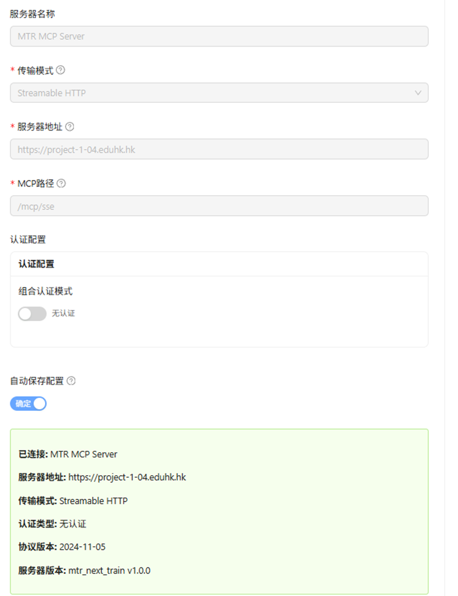
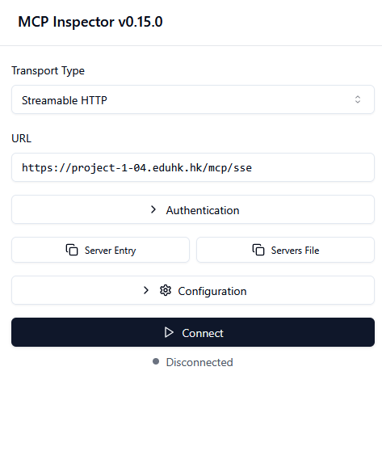
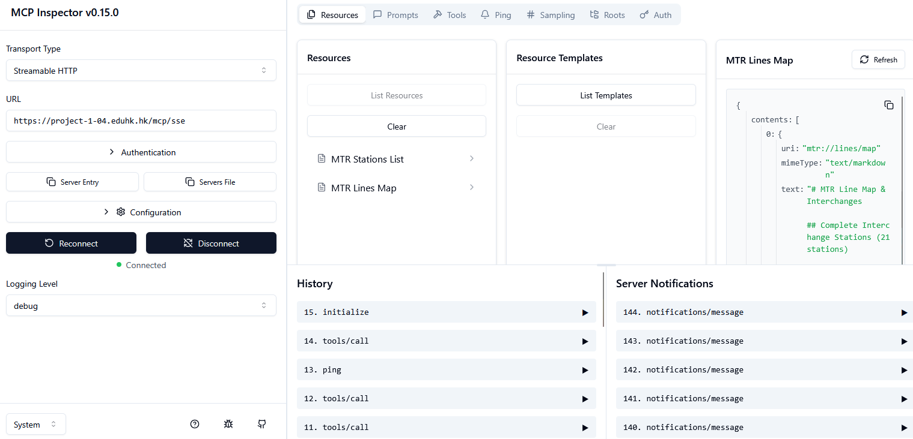

# Guide to Installing and Running MCP Inspector on Windows and Mac

## Introduction
MCP Inspector is a browser-based visual testing and debugging tool for Model Context Protocol (MCP) servers. It allows developers to interact with MCP servers, test resources, prompts, tools, and monitor notifications in an intuitive UI. The tool is built with Node.js and can be run directly using `npx` without a permanent installation, making it quick to set up. However, for development or repeated use, you can clone the repository and run it locally.

This guide covers multiple installation methods including:
1. Node.js-based installation (npx, Homebrew, GitHub)
2. **Chrome Extension** (MCP Security Inspector)

The process is largely cross-platform, with specific notes for Windows and macOS. MCP Inspector launches a local web UI (default port 6274) and a proxy server (default port 6277), which you access via your browser.

**Note:** MCP Inspector is primarily for developers working with MCP servers. If you're new to MCP, refer to the official documentation at [modelcontextprotocol.io](https://modelcontextprotocol.io) for more context.

## Prerequisites
Before installing or running MCP Inspector, ensure the following:
- **Node.js**: Version 22.7.5 or higher is required. Download and install from the official Node.js website (nodejs.org).
  - Verify installation: Open a terminal (Command Prompt on Windows or Terminal on macOS) and run `node -v`. It should output a version >= 22.7.5.
- **npm/npx**: These come bundled with Node.js. npx is used to run the tool without global installation.
- **Internet Access**: Required initially for downloading packages via npx or npm.
- **Browser**: A modern web browser like Chrome, Firefox, or Safari to access the UI.
- **Optional: Git**: If you plan to clone the GitHub repository for development.

No additional dependencies are needed, as the tool handles its own setup.

## Alternative Method: Chrome Extension (MCP Security Inspector)
For users who prefer a browser-based approach without Node.js installation, the MCP Security Inspector Chrome extension provides a lightweight alternative.

### Installation Steps
1. **Download from Chrome Web Store**:
   - Visit: [https://chromewebstore.google.com/detail/mcp-security-inspector/opajbcoflmgkjmjafchlgehgllbekgeo](https://chromewebstore.google.com/detail/mcp-security-inspector/opajbcoflmgkjmjafchlgehgllbekgeo)
   - Click "Add to Chrome" to install the extension

2. **Access the Extension**:
   - Click the extension icon in your Chrome toolbar
   - The inspector interface will open in a new tab or popup

3. **Configure MCP Server Connection**:
   - **Server Name**: Enter a descriptive name (e.g., "MTR MCP Server")
   - **Transport Mode**: Select "Streamable HTTP" from the dropdown
   - **Server Address**: Enter your MCP server URL (e.g., `https://project-1-04.eduhk.hk`)
   - **MCP Path**: Enter the endpoint path (e.g., `/mcp/sse`)
   - **Authentication**: Toggle "No Authentication" if not required
   - Click "Confirm" to establish connection



### Features
- **No Installation Required**: Works directly in Chrome without Node.js
- **Streamable HTTP Support**: Compatible with SSE and streaming endpoints
- **Visual Interface**: User-friendly UI for testing MCP servers
- **Real-Time Monitoring**: View server responses and protocol version
- **Cross-Platform**: Works on any OS with Chrome browser

### Advantages of Chrome Extension
- Instant access without command-line tools
- No port conflicts with local development
- Easy to share configurations
- Built-in browser security features
- Perfect for quick testing and demonstrations

### When to Use
- Quick MCP server testing without setup
- Educational environments (like EDUHK courses)
- Demonstrations and presentations
- Systems where Node.js installation is restricted
- Testing public MCP endpoints (like the EDUHK SSE endpoint)

## Prerequisites for Node.js Installation
Before installing or running MCP Inspector via Node.js, ensure the following:
- **Node.js**: Version 22.7.5 or higher is required. Download and install from the official Node.js website (nodejs.org).
  - Verify installation: Open a terminal (Command Prompt on Windows or Terminal on macOS) and run `node -v`. It should output a version >= 22.7.5.
- **npm/npx**: These come bundled with Node.js. npx is used to run the tool without global installation.
- **Internet Access**: Required initially for downloading packages via npx or npm.
- **Browser**: A modern web browser like Chrome, Firefox, or Safari to access the UI.
- **Optional: Git**: If you plan to clone the GitHub repository for development.

No additional dependencies are needed, as the tool handles its own setup.

## Setup and Installation on macOS
macOS setup is straightforward using Terminal. MCP Inspector can be run via npx for quick use or installed via Homebrew for a binary executable. For development, clone the repo.

### Method 1: Quick Run with npx (Recommended for Most Users)
1. Open Terminal (search for it in Spotlight or via Applications > Utilities).
2. Install Node.js if not already installed:
   - Download the macOS installer from nodejs.org and follow the prompts.
   - Alternatively, use a package manager like Homebrew: `brew install node` (first install Homebrew if needed: `/bin/bash -c "$(curl -fsSL https://raw.githubusercontent.com/Homebrew/install/HEAD/install.sh)"`).
3. Run the Inspector:
   ```
   npx @modelcontextprotocol/inspector
   ```
   - This downloads and launches the tool automatically.
   - Output will show the UI URL (e.g., `http://localhost:6274`) and a proxy server on port 6277.
4. Open the URL in your browser to access the Inspector UI.

### Method 2: Homebrew Installation (For CLI Convenience)
1. Install Homebrew if not present (see above).
2. Run:
   ```
   brew install mcp-inspector
   ```
3. Launch with:
   ```
   mcp-inspector
   ```
   - This is equivalent to the npx method but uses a locally installed binary.

### Method 3: From GitHub Repository (For Development)
1. Install Git if needed: `brew install git`.
2. Clone the repo:
   ```
   git clone https://github.com/modelcontextprotocol/inspector.git
   cd inspector
   ```
3. Install dependencies:
   ```
   npm install
   ```
4. Run in development mode:
   ```
   npm run dev
   ```
   - For co-development with the TypeScript SDK (if cloned separately): `npm run dev:sdk "cd ../typescript-sdk && npm run examples:simple-server:w"`.
5. For production: `npm run build && npm start`.
6. Access at `http://localhost:6274`.

### macOS-Specific Notes
- Paths: Use forward slashes (/) in commands.
- Permissions: If you encounter permission issues (e.g., with npm), use `sudo` sparingly or configure npm to use a user directory: `mkdir ~/.npm-global && npm config set prefix '~/.npm-global'`, then add to PATH.
- Firewall: macOS may prompt to allow Node.js network access—approve it.

## Setup and Installation on Windows
Windows uses Command Prompt or PowerShell. The process is similar to macOS but accounts for path differences and potential antivirus interference.

### Method 1: Quick Run with npx (Recommended for Most Users)
1. Open Command Prompt (search for "cmd" in the Start menu) or PowerShell.
2. Install Node.js if not already installed:
   - Download the Windows installer (.msi) from nodejs.org and run it.
   - During installation, select "Add to PATH" for easy access.
3. Run the Inspector:
   ```
   npx @modelcontextprotocol/inspector
   ```
   - This downloads and launches the tool.
   - Output will show the UI URL (e.g., `http://localhost:6274`) and proxy server on port 6277.
4. Open the URL in your browser.

### Method 2: From GitHub Repository (For Development)
1. Install Git for Windows from git-scm.com if needed.
2. Clone the repo:
   ```
   git clone https://github.com/modelcontextprotocol/inspector.git
   cd inspector
   ```
3. Install dependencies:
   ```
   npm install
   ```
4. Run in development mode:
   ```
   npm run dev:windows
   ```
   - Use this Windows-specific script to handle any platform quirks.
   - For co-development with SDK: Similar to macOS, adjust paths accordingly.
5. For production: `npm run build && npm start`.
6. Access at `http://localhost:6274`.

### Windows-Specific Notes
- Paths: Use backslashes (\) or forward slashes (/) in file paths; Node.js handles both.
- Environment Variables: Set via System Properties > Advanced > Environment Variables (e.g., for custom ports: `set CLIENT_PORT=8080` then run the command).
- Antivirus/Firewall: Windows Defender or third-party antivirus may block Node.js—add exceptions if prompted.
- PowerShell vs. Command Prompt: Both work, but PowerShell may require execution policy changes: `Set-ExecutionPolicy RemoteSigned`.
- No Homebrew equivalent; stick to npx or repo clone.

## Running MCP Inspector
Once set up:
1. Launch via npx or the repo scripts as above.
2. Customize if needed:
   - Pass arguments: `npx @modelcontextprotocol/inspector node path/to/server.js arg1 arg2`.
   - Environment variables: `npx @modelcontextprotocol/inspector -e KEY=VALUE node path/to/server.js`.
   - Custom ports: `CLIENT_PORT=8080 SERVER_PORT=9000 npx @modelcontextprotocol/inspector`.
3. Connect to an MCP server in the UI:
   - Use the connection pane to select transport (e.g., STDIO for local servers).
   - Test features in tabs: Resources, Prompts, Tools.
4. For inspecting NPM/PyPi servers: `npx @modelcontextprotocol/inspector npx @example/package args`.

## Testing with EDUHK SSE Endpoint
The EDUHK project provides a public SSE (Server-Sent Events) endpoint for testing real-time streaming capabilities with MCP Inspector:

### Endpoint Details
- **URL**: `https://project-1-04.eduhk.hk/mcp/sse`
- **Purpose**: Demonstrates streamable SSE responses for MCP integration
- **Use Case**: Testing real-time event streaming, LLM token streaming, and async notifications

⚠️ **Important**: Before accessing this endpoint, ensure you are connected to the EDUHK VPN. The endpoint is only accessible from within the university network or through VPN connection.

### Testing SSE with MCP Inspector
1. **Launch MCP Inspector** as described above
2. **Configure SSE Connection**:
   - In the Inspector UI, navigate to the connection settings
   - Select "HTTP/SSE" as the transport type
   - Enter the endpoint URL: `https://project-1-04.eduhk.hk/mcp/sse`
3. **Monitor Streaming Events**:
   - The Inspector will display incoming SSE events in real-time
   - Watch for event types: `message`, `token`, `completion`, or custom events
   - Observe the streaming behavior and latency
4. **Test Integration**:
   - Send requests through the Inspector's tool interface
   - Verify SSE responses appear in the notifications panel
   - Check for proper event parsing and display

### Using Node.js MCP Inspector with Streamable HTTP
When using the Node.js version of MCP Inspector (npx method), configure it for streamable HTTP:

1. **Launch MCP Inspector** (version 0.15.0 or higher)
2. **Configure Connection Settings**:
   - **Transport Type**: Select "Streamable HTTP" from the dropdown
   - **URL**: Enter `https://project-1-04.eduhk.hk/mcp/sse`
   - **Authentication**: Expand if needed, otherwise leave collapsed
   - **Server Entry/Servers File**: Optional configuration tabs
   - **Configuration**: Additional settings if required
3. **Connect**: Click the "Connect" button
4. **Monitor Status**: Watch for "Disconnected" → "Connected" status change



*Figure 1: MCP Inspector v0.15.0 configured for Streamable HTTP with EDUHK SSE endpoint at https://project-1-04.eduhk.hk/mcp/sse*

5. **After Connection**: Once connected, the Inspector will display available resources, prompts, and tools from the MCP server



*Figure 2: MCP Inspector successfully connected to https://project-1-04.eduhk.hk/mcp/sse showing server capabilities and available features*

### Streamable SSE Features
When working with streamable SSE endpoints like the EDUHK example:
- **Token-by-Token Streaming**: Observe LLM responses arriving incrementally
- **Event Types**: Different event types for control flow (start, data, end, error)
- **Reconnection Handling**: Test automatic reconnection on connection drops
- **Event Source API**: Compatible with browser EventSource API and FastAPI's EventSourceResponse
- **HTTPS Support**: Secure streaming over SSL/TLS

### Example Use Cases
1. **Real-Time Chat**: Testing chatbot responses with streaming tokens
2. **Progress Updates**: Monitoring long-running MCP tool executions
3. **Notifications**: Receiving async updates from MCP server operations
4. **Debugging**: Inspecting SSE message format and timing

### SSE Best Practices
- Ensure proper `Content-Type: text/event-stream` header
- Handle connection timeouts and implement retry logic
- Use heartbeat events to keep connections alive through proxies
- Format messages as `data: {content}\n\n` for compatibility
- Send `[DONE]` or similar signals to indicate stream completion

