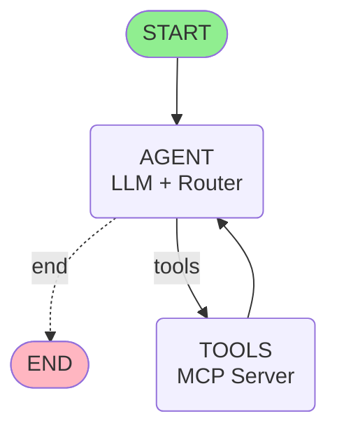

# MTR MCP Server - Complete Documentation

> **Last Updated:** October 21, 2025  
> **Version:** 3.0 (Full MCP Feature Set with Memory)

---

## 📑 Table of Contents

1. [Overview](#-overview)
2. [Quick Start](#-quick-start)
3. [MCP Protocol Understanding](#-mcp-protocol-understanding)
4. [Server Features](#-server-features)
5. [LangGraph Integration](#-langgraph-integration)
6. [System Prompt Guide](#-system-prompt-guide)
7. [LangSmith Observability](#-langsmith-observability)
8. [Architecture Visualization](#-architecture-visualization)
9. [Testing](#-testing)
10. [Development](#-development)

---

## 🎯 Overview

This project implements a production-ready **Model Context Protocol (MCP) server** for Hong Kong's MTR (Mass Transit Railway) system, integrated with **LangGraph agents** and **AWS Bedrock Nova Lite** for natural language interactions.

### What's Included

- ✅ **Full MCP Server** with Tools, Resources, and Prompts
- ✅ **LangGraph Agent** with conversation memory
- ✅ **Natural Language Processing** for 80+ MTR stations
- ✅ **Dual Tool Interface** (human-friendly + machine-readable)
- ✅ **Real-time MTR Data** from Hong Kong government API
- ✅ **LangSmith Integration** for observability
- ✅ **Complete Test Suite** with 6 test files

### Technologies

- **MCP Server**: FastMCP (Python)
- **LLM Framework**: LangGraph + LangChain
- **AI Model**: AWS Bedrock Nova Lite
- **Transport**: Server-Sent Events (SSE)
- **Memory**: MemorySaver (persistent conversations)

---

## 🚀 Quick Start

### 1. Installation

```powershell
# Clone or navigate to project directory
cd C:\Users\user\Documents\proj01_chatbot_edu\week08_MCP\mtr-mcp-example

# Activate virtual environment
.\.venv\Scripts\Activate.ps1

# Install dependencies
pip install -r requirements.txt
```

### 2. Environment Setup

Create `.env` file:

```bash
# AWS Bedrock Credentials
AWS_ACCESS_KEY_ID=your-aws-key
AWS_SECRET_ACCESS_KEY=your-aws-secret
AWS_REGION=us-east-1
BEDROCK_MODEL=amazon.nova-lite-v1:0

# MCP Server
MCP_SERVER_URL=http://localhost:8000/sse

# LangSmith (Optional - for observability)
LANGCHAIN_TRACING_V2=true
LANGCHAIN_API_KEY=your-langsmith-api-key
LANGCHAIN_PROJECT=mtr-demo
```

### 3. Start MCP Server

```powershell
python mcp_server.py
```

Expected output:
```
============================================================
🚀 Starting MCP Server
============================================================
📡 SSE Endpoint: http://127.0.0.1:8000/sse
🔍 MCP Inspector: Use http://127.0.0.1:8000/sse
⚠️  Note: http://127.0.0.1:8000 (without /sse) will give 404
============================================================
INFO:     Started server process [71940]
INFO:     Uvicorn running on http://127.0.0.1:8000
```

### 4. Run LangGraph Demo

In a new terminal:

```powershell
# Demo with conversation history
python langgraph_demo_with_history.py

# Demo with full MCP features + memory
python langgraph_demo_full_mcp.py
```

---

## 📘 MCP Protocol Understanding

### What is MCP?

**Model Context Protocol (MCP)** is an open protocol that standardizes how AI applications connect to external data sources and tools. It enables LLMs to securely interact with APIs, databases, and services through a unified interface.

### Core Concepts

MCP defines three types of features that servers can expose:

#### 1. **Tools** (Model-Controlled)

Functions that your LLM can actively call and decides when to use them based on user requests.

| Feature | Who Controls | Example |
|---------|--------------|---------|
| **Tools** | AI Model | Search flights, Send messages, Create calendar events |

**Protocol Operations:**
- `tools/list` - Discover available tools
- `tools/call` - Execute a specific tool

**Example in MTR Server:**
```python
@mcp.tool()
def get_next_train_schedule(line: str, sta: str, lang: str = "EN") -> str:
    """Get MTR train schedule (human-friendly)"""
    # Returns formatted text with emojis
```

**User asks:** "When is the next train?"  
**AI decides:** Call `get_next_train_schedule` tool  
**Result:** Real-time train data

#### 2. **Resources** (Application-Controlled)

Passive data sources that provide read-only access to information for context.

| Feature | Who Controls | Example |
|---------|--------------|---------|
| **Resources** | Application | Retrieve documents, Access knowledge bases, Read calendars |

**Protocol Operations:**
- `resources/list` - List available resources
- `resources/read` - Retrieve resource contents

**Example in MTR Server:**
```python
@mcp.resource("mtr://stations/list")
def get_station_list() -> str:
    """Complete list of all MTR stations with codes"""
    # Returns markdown formatted station reference
```

**Usage Flow:**
1. Application reads `mtr://stations/list`
2. Provides station context to AI
3. AI uses context for better responses

#### 3. **Prompts** (User-Controlled)

Pre-built instruction templates that users explicitly invoke for common tasks.

| Feature | Who Controls | Example |
|---------|--------------|---------|
| **Prompts** | User | Plan a vacation, Summarize meetings, Draft an email |

**Protocol Operations:**
- `prompts/list` - Discover available prompts
- `prompts/get` - Retrieve prompt details

**Example in MTR Server:**
```python
@mcp.prompt()
def plan_mtr_journey(origin: str, destination: str) -> str:
    """Prompt: Plan MTR journey between two stations"""
    return f"""Help me plan an MTR journey from {origin} to {destination}...
    Please:
    1. Use the mtr://lines/map resource to find the route
    2. Check next trains using get_next_train_schedule
    3. Provide step-by-step directions"""
```

**User Experience:**
- User selects "Plan MTR Journey" prompt
- Fills parameters: Origin="TKO", Destination="Central"
- AI receives complete instructions
- AI uses Resources + Tools to complete task

### How Features Work Together

**Complete Journey Planning Example:**

```
1. USER invokes "plan_mtr_journey" prompt
   └─> Parameters: origin="TKO", destination="Central"

2. PROMPT provides instructions
   └─> "Use mtr://lines/map resource"
   └─> "Check trains with get_next_train_schedule"

3. APPLICATION retrieves resources
   └─> Reads mtr://lines/map
   └─> Context: TKO is on TKL, Central on ISL/TWL

4. AI MODEL uses tools
   └─> Calls get_next_train_schedule(line="TKL", sta="TKO")
   └─> Gets: "Next train in 2 minutes"

5. AI responds with complete journey plan
```

---

## ✨ Server Features

### MCP Features Implemented

Our MTR server implements the **complete MCP specification**:

| Feature Type | Count | Examples |
|--------------|-------|----------|
| **Tools** | 2 | `get_next_train_schedule`, `get_next_train_structured` |
| **Resources** | 2 | `mtr://stations/list`, `mtr://lines/map` |
| **Prompts** | 3 | `check_next_train`, `plan_mtr_journey`, `compare_stations` |

### Tool 1: `get_next_train_schedule` (Human-Friendly)

**Purpose:** Display train schedules in readable format for end users

**Input:**
```json
{
  "line": "Airport Express",        // or "AEL"
  "sta": "Hong Kong",                // or "HOK"
  "lang": "EN"                       // or "TC" (optional)
}
```

**Output Example:**
```
📝 Resolved line: 'Airport Express' → 'AEL'
📝 Resolved station: 'Hong Kong' → 'HOK'

🚇 MTR Train Schedule for AEL-HOK
🕐 Current Time: 2025-10-21 11:27:12
============================================================

ℹ️  Direction Guide:
   🔼 UPBOUND = Trains toward outer/peripheral stations
   🔽 DOWNBOUND = Trains toward central/city stations

🔼 UPBOUND Trains:
------------------------------------------------------------
  1. 🚆 Platform 1 → AWE - 7 minutes (arrives 11:34:00)
  2. 🚆 Platform 1 → AWE - 17 minutes (arrives 11:44:00)

🔽 DOWNBOUND Trains: No trains scheduled

============================================================
✅ Status: Normal operation
```

**Features:**
- ✅ Resolution tracking (shows name → code conversions)
- ✅ Direction guide included
- ✅ Platform numbers
- ✅ Countdown in minutes
- ✅ Exact arrival times
- ✅ Service status

### Tool 2: `get_next_train_structured` (Machine-Readable)

**Purpose:** Provide structured JSON for programmatic agents

**Input:**
```json
{
  "line": "TKL",
  "sta": "Tseung Kwan O",
  "lang": "EN"
}
```

**Output Schema:**
```json
{
  "resolved_line": "TKL",
  "resolved_station": "TKO",
  "timestamp": "2025-10-21 11:27:12",
  "up": [
    {
      "dest": "LHP",
      "ttnt": "0",
      "plat": "1",
      "time": "2025-10-21 11:27:12"
    }
  ],
  "down": [
    {
      "dest": "NOP",
      "ttnt": "1",
      "plat": "2",
      "time": "2025-10-21 11:28:12"
    }
  ],
  "error": null,
  "suggestions": []
}
```

**Agent Usage Pattern:**
```python
# Get structured data
data = await session.call_tool(
    "get_next_train_structured",
    arguments={"line": "TKL", "sta": "TKO"}
)
payload = json.loads(data.content[0].text)

# Extract next train
if payload["up"]:
    next_train = payload["up"][0]
    if int(next_train["ttnt"]) < 3:
        print(f"Hurry! Train leaving in {next_train['ttnt']} min!")
```

### Natural Language Support

**80+ Stations with Fuzzy Matching**

- ✅ Full station names: `"Tseung Kwan O"` → `"TKO"`
- ✅ Line names: `"Airport Express"` → `"AEL"`
- ✅ Station codes: `"TKO"`, `"HOK"`, `"ADM"`
- ✅ Case-insensitive: `"hong kong"` works
- ✅ Fuzzy matching: `"Tseng Kwan O"` (typo) → `"TKO"`

**All 10 MTR Lines Supported:**

| Line Code | Name | Stations | Example Stations |
|-----------|------|----------|------------------|
| **TKL** | Tseung Kwan O | 8 | TKO, LHP, POA, NOP |
| **AEL** | Airport Express | 5 | HOK, KOW, AIR, AWE |
| **ISL** | Island Line | 17 | KET, ADM, CEN, CHW |
| **TCL** | Tung Chung Line | 8 | HOK, OLY, TSY, TUC |
| **TML** | Tuen Ma Line | 27 | WKS, DIH, HOM, TUM |
| **EAL** | East Rail Line | 16 | ADM, UNI, SHS, LMC |
| **SIL** | South Island Line | 5 | ADM, OCP, SOH |
| **TWL** | Tsuen Wan Line | 16 | TST, MOK, LAK, TSW |
| **KTL** | Kwun Tong Line | 17 | WHA, YMT, DIH, TIK |
| **DRL** | Disneyland | 2 | SUN, DIS |

---

## 🤖 LangGraph Integration

### Two Demo Versions

#### 1. `langgraph_demo_with_history.py`

**Focus:** Demonstrates conversation memory and multi-turn context

**Features:**
- ✅ MemorySaver for persistent conversations
- ✅ Thread-based conversation tracking
- ✅ Context references ("that station", "the same line")
- ✅ 1 MCP tool integration
- ✅ 4-turn conversation demo

**Use Case:** Building chatbots with memory

#### 2. `langgraph_demo_full_mcp.py`

**Focus:** Showcases complete MCP protocol + memory

**Features:**
- ✅ All 3 MCP feature types (Tools, Resources, Prompts)
- ✅ 2 tools (human + machine)
- ✅ 2 resources (station list + network map)
- ✅ 3 prompts (check, plan, compare)
- ✅ MemorySaver for conversation history
- ✅ 5-turn conversation demo with context awareness

**Use Case:** Learning MCP + building advanced agents

### Agent Architecture

```
User Query (Natural Language)
    ↓
System Prompt Injected (MTR context)
    ↓
Agent (Nova Lite) + System Context
    ↓
Decision: Need to call tool?
    ├─ YES → Call MCP Tool
    │         ↓
    │      Tool Execution (MTR API)
    │         ↓
    │      Return to Agent with results
    │         ↓
    │      Format Response
    └─ NO → Generate final response
    ↓
User-Friendly Answer
    ↓
Save to Memory (for next turn)
```

### Conversation Flow with Memory

**Example Multi-turn Interaction:**

```python
# Turn 1
User: "When is the next train at Tseung Kwan O?"
Agent: [Calls tool] "Next train in 3 minutes to LOHAS Park"
Memory: Saves "Tseung Kwan O" context

# Turn 2 (references previous)
User: "What about the other direction?"
Agent: [Uses memory to know "Tseung Kwan O"]
       [Calls tool with opposite direction]
       "Next train in 5 minutes to North Point"

# Turn 3
User: "Compare it with Hong Kong station"
Agent: [Remembers TKO from Turn 1]
       [Calls tool for HOK]
       [Compares both results]
```

---

## 📝 System Prompt Guide

### What Was Enhanced

The LangGraph demos include a **comprehensive system prompt** that transforms the agent from a generic AI into a specialized MTR assistant.

### System Prompt Components

#### 1. **Role Definition**
```
You are a helpful Hong Kong MTR train assistant with access to:
- Real-time train schedules through the MTR API
- Complete station and line information
- Conversation memory for context
```

#### 2. **Tool Usage Instructions**
```
When using tools, provide:
1. line: MTR line code (TKL, AEL, TCL, etc.)
2. sta: Station code (TKO, HOK, CEN, etc.)
3. lang: EN for English or TC for Traditional Chinese
```

#### 3. **Complete Station Reference**

Lists all 10 MTR lines with station codes:

```
Tseung Kwan O Line (TKL): TKO, LHP, HAH, POA, YAT, TIK, NOP, QUB
Airport Express (AEL): HOK, KOW, TSY, AIR, AWE
Island Line (ISL): KET, ADM, CEN, CHW, TIN, CAB, NOP, QUB, ...
```

#### 4. **Response Guidelines**
```
When you receive train data:
- Summarize key information clearly
- Mention minutes until arrival
- Include destination and platform number
- Alert users to service delays
- Be conversational and helpful
- Use context from previous messages
```

#### 5. **Memory Instructions**
```
Remember context from previous messages:
- When users refer to "that station"
- When asked about "the same line"
- When comparing with "the first station I asked about"
```

### Impact Comparison

**Without System Prompt:**
- ❌ Agent might hallucinate station codes
- ❌ Unclear response format
- ❌ No MTR domain knowledge
- ❌ Can't handle natural language queries

**With System Prompt:**
- ✅ Understands MTR system structure
- ✅ Knows all valid line/station codes
- ✅ Consistent, helpful responses
- ✅ Handles natural language: "Hong Kong station on Airport Express"
- ✅ Uses conversation history effectively

### Example Interaction

**User Query:**
```
"I'm at Hong Kong station. When does the next Airport Express train arrive?"
```

**Agent Processing (guided by system prompt):**
1. Recognizes "Hong Kong station" → HOK
2. Recognizes "Airport Express" → AEL
3. Calls: `mtr_train_schedule(line="AEL", sta="HOK", lang="EN")`
4. Receives data
5. Formats response following prompt guidelines

**Agent Response:**
```
The next Airport Express train at Hong Kong station will arrive in 3 minutes.
- Destination: Airport (AIR)
- Arrival Time: 15:23
- Platform: 1

The train after that arrives in 13 minutes.
```

---

## 📊 LangSmith Observability

### What is LangSmith?

**LangSmith** is a platform for building production-grade LLM applications. It enables you to **debug, test, evaluate, and monitor** AI applications built on any LLM framework.

### Three Core Pillars

#### 1. 🔍 **Observability** (Tracing & Monitoring)

Track every step of your LLM application:

- **Tracing**: Every LLM call, tool invocation, retrieval
- **Dashboards**: RPS, error rates, costs
- **Alerts**: Get notified of issues
- **Production Monitoring**: Real-world usage patterns

**Why it matters:**
> LLMs are non-deterministic, making them tricky to debug. LangSmith provides LLM-native observability.

#### 2. ✅ **Evaluations** (Testing & Validation)

Build and test with quality datasets:

- **Dataset Creation**: Build test sets from production
- **Automated Evaluators**: Correctness, hallucination detection
- **Custom Evaluators**: Write your own metrics
- **Human Feedback**: Annotation queues
- **A/B Testing**: Compare approaches

#### 3. 📝 **Prompt Engineering** (Iteration & Versioning)

Manage prompts like code:

- **Prompt Hub**: Centralized storage
- **Playground**: Interactive testing
- **Version Control**: Automatic tracking
- **Collaboration**: Share with team
- **Programmatic Access**: Use via API

### Integration with This Project

**Enable LangSmith in 3 lines:**

```python
import os
os.environ["LANGCHAIN_TRACING_V2"] = "true"
os.environ["LANGCHAIN_API_KEY"] = "your-api-key"

# That's it! All runs are now traced
```

**What You See:**

```
📍 Run: "When is the next train?"
├─ 🤖 Agent Node (Nova Lite)
│  ├─ Input: HumanMessage("When is the next train?")
│  ├─ LLM Call: amazon.nova-lite-v1:0
│  │  ├─ Tokens: 150 input, 80 output
│  │  ├─ Cost: $0.0002
│  │  └─ Latency: 1.2s
│  └─ Output: ToolCall(get_train_schedule, {...})
│
├─ 🔧 Tools Node (MCP Call)
│  ├─ Tool: get_train_schedule
│  ├─ Result: "Next train in 3 minutes..."
│  └─ Latency: 0.5s
│
└─ 🤖 Agent Node (Final Response)
   └─ Total Time: 2.1s
```

**Insights:**
- ✅ What happened (full trace)
- ✅ Why it happened (LLM reasoning)
- ✅ How long it took (per-step latency)
- ✅ How much it cost (token usage)
- ✅ What went wrong (errors)

### Educational Value

**For Teaching:**
- Students see inside the "black box"
- Visual traces show agent decision-making
- Understand cost/latency trade-offs
- Learn debugging techniques

**Before LangSmith:**
```
Teacher: "The agent calls the MCP server."
Student: "How do I know it actually did that?"
Teacher: "Trust me." 😅
```

**With LangSmith:**
```
Teacher: "Let's look at the trace."
Student: "Oh! I can see it called get_train_schedule 
          with line='TKL' and sta='TKO'!"
Student: "This makes so much sense now!" 🎓
```

---

## 🎨 Architecture Visualization

### LangGraph Flow Diagram



### Node Descriptions

#### 🎬 **START**
- Entry point for conversations
- Initializes empty message history
- Routes to AGENT node

#### 🤖 **AGENT** (Core Decision Maker)
- **Model**: AWS Bedrock Nova Lite
- **Responsibilities**:
  - Process user messages
  - Access conversation history
  - Decide: Call tools OR provide final answer
- **System Prompt**: Guides MTR assistant behavior
- **Memory**: Full conversation context

#### 🔧 **TOOLS** (Action Executor)
- **MCP Server Integration**: Real-time MTR API
- **Available Tools**:
  - `get_next_train_schedule` (human-friendly)
  - `get_next_train_structured` (machine-readable)
- **Always loops back to AGENT** for processing

#### 🏁 **END**
- Final response generated
- State saved to memory
- Ready for next message

### Edge Descriptions

**START → AGENT** (Direct)
- Always executed at start

**AGENT → TOOLS** (Conditional)
- When: LLM decides tool call needed
- Condition: `should_continue() == "tools"`

**TOOLS → AGENT** (Loop)
- After tool completion
- Carries `ToolMessage` results

**AGENT → END** (Conditional)
- When: No more tools needed
- Condition: `should_continue() == "end"`

### Memory Architecture

```
Thread ID: "demo-conversation"
├── Message 1: HumanMessage
├── Message 2: AIMessage (with tool_calls)
├── Message 3: ToolMessage (results)
├── Message 4: AIMessage (final response)
├── Message 5: HumanMessage (follow-up)
└── ... (continues)
```

**Benefits:**
- ✅ Context retention across turns
- ✅ Reference previous queries
- ✅ Compare results
- ✅ No repeated information needed

---

## 🧪 Testing

### Test Suite (6 Files)

| Test File | Purpose | Status |
|-----------|---------|--------|
| `test_01_bedrock.py` | AWS Bedrock connection | ✅ PASSED |
| `test_02_agent.py` | Simple agent with add_messages | ✅ PASSED |
| `test_03_mcp.py` | MCP server connection | ✅ PASSED |
| `test_04_natural_language.py` | Station/line resolution | ✅ PASSED |
| `test_05_complete_features.py` | Full feature test | ✅ PASSED |
| `test_06_decoder_structured.py` | Structured JSON tool | ✅ PASSED |

### Running Tests

```powershell
# Individual tests
python test_01_bedrock.py
python test_02_agent.py
python test_03_mcp.py

# Full demos
python langgraph_demo_with_history.py
python langgraph_demo_full_mcp.py
```

### Latest Test Results

```
✅ test_06_decoder_structured.py

📊 Structured Output Schema:
  ├─ resolved_line: TKL
  ├─ resolved_station: TKO
  ├─ timestamp: 2025-10-21 11:27:12
  ├─ up: 4 trains
  ├─ down: 4 trains
  ├─ error: None
  └─ suggestions: []

🔼 First Upbound Train:
  ├─ dest: LHP
  ├─ ttnt: 0 minutes (DEPARTING NOW)
  ├─ plat: 1
  └─ time: 2025-10-21 11:27:12

✅ All tests PASSED
```

---

## 🔧 Development

### Project Structure

```
mtr-mcp-example/
├── mcp_server.py                      # MCP server with Tools/Resources/Prompts
├── langgraph_demo_with_history.py     # LangGraph + Memory demo
├── langgraph_demo_full_mcp.py         # Full MCP features + Memory demo
├── requirements.txt                   # Dependencies
├── .env                               # Environment variables
├── test_01_bedrock.py                 # AWS Bedrock test
├── test_02_agent.py                   # Basic agent test
├── test_03_mcp.py                     # MCP connection test
├── test_04_natural_language.py        # NL resolution test
├── test_05_complete_features.py       # Complete feature test
├── test_06_decoder_structured.py      # Structured tool test
├── README.md                          # This file (unified documentation)
└── .venv/                             # Virtual environment
```

### Code Organization (mcp_server.py)

```python
mcp_server.py
├─ STATION_NAMES dict (80+ stations)
├─ LINE_NAMES dict (10 lines)
├─ resolve_station_code() - Name/code conversion
├─ resolve_line_code() - Line name/code conversion
├─ format_train_schedule() - Human-friendly formatting
├─ @mcp.tool() get_next_train_schedule - Human tool
├─ @mcp.tool() get_next_train_structured - Machine tool
├─ @mcp.resource() mtr://stations/list - Station reference
├─ @mcp.resource() mtr://lines/map - Network map
├─ @mcp.prompt() check_next_train - Quick check prompt
├─ @mcp.prompt() plan_mtr_journey - Journey planning prompt
├─ @mcp.prompt() compare_stations - Station comparison prompt
└─ main() - FastMCP SSE server on port 8000
```

### Dependencies

```
# Core
requests==2.31.0        # MTR API calls
mcp==1.18.0             # MCP server framework
httpx-sse==0.4.3        # SSE transport

# LangChain/LangGraph
langchain-aws           # AWS Bedrock integration
langgraph              # Agent framework
langchain-core         # Core components

# Standard library
difflib                # Fuzzy matching
datetime               # Timestamps
json                   # JSON handling
```

### Adding New Stations

```python
# In STATION_NAMES dict
"new station name": "NST",
"nst": "NST",
```

### Adding New Lines

```python
# In LINE_NAMES dict
"new line": "NLN",
"nln": "NLN",
```

### Debugging

```python
# Add print statements
def resolve_station_code(station_input: str) -> str:
    normalized = station_input.lower().strip()
    print(f"DEBUG: Resolving '{station_input}' → '{normalized}'")
    # ... rest of function
```

---

## 📚 Key Learnings

### Why Two Tools?

**Human Tool (`get_next_train_schedule`):**
- End users need explanations
- Visual formatting helps readability
- Emojis improve engagement
- Resolution tracking builds trust

**Machine Tool (`get_next_train_structured`):**
- Agents need structured data for logic
- JSON schema enables validation
- Separate up/down arrays simplify parsing
- Error/suggestions enable retry logic

### Why Fuzzy Matching?

- Users make typos ("Tseng" vs "Tseung")
- Mobile autocorrect issues
- Different romanizations
- Accessibility (speech-to-text errors)
- Better user experience (80% similarity threshold)

### Why Both Names AND Codes?

- **Codes** (TKO, HOK): Official MTR identifiers, API requirements
- **Names** ("Tseung Kwan O"): Natural language UX
- **Resolution**: Best of both worlds - natural input, structured API calls

### Why Direction Guide?

User research showed:
- "Upbound" is confusing without context
- Direction varies by line (not universal "north/south")
- First-time MTR users need explanation
- Reduces follow-up questions

### Why Complete System Prompt?

Transforms generic AI into specialized assistant:
- Domain knowledge embedded
- Tool usage guidance
- Response consistency
- Natural language understanding
- Memory awareness

---

## 🎯 Next Steps

### Optional Enhancements

#### 1. **Bilingual Support**
- [ ] Add simultaneous English + Traditional Chinese
- [ ] Station names in both languages
- [ ] Localized error messages

#### 2. **Caching**
- [ ] Cache API responses (5-second TTL)
- [ ] Reduce load on government API
- [ ] Faster response times

#### 3. **Advanced Features**
- [ ] Station proximity search ("nearest station to...")
- [ ] Fare calculation between stations
- [ ] Line status/incidents from MTR feed
- [ ] Service disruption alerts

#### 4. **Documentation**
- [ ] Mermaid diagrams for architecture
- [ ] Postman collection for API testing
- [ ] Video walkthrough
- [ ] Integration guides for other frameworks

#### 5. **Testing**
- [ ] Unit tests for resolvers
- [ ] Integration tests for MCP
- [ ] Load testing for server
- [ ] Mock API responses for offline testing

---

## 📖 Further Reading

### Official Documentation

- **MCP Specification**: https://spec.modelcontextprotocol.io/
- **LangChain**: https://python.langchain.com/
- **LangGraph**: https://langchain-ai.github.io/langgraph/
- **LangSmith**: https://docs.smith.langchain.com/
- **AWS Bedrock**: https://docs.aws.amazon.com/bedrock/

### Project-Specific

All documentation is now consolidated in this README:
- ~~whatismcp.md~~ → See [MCP Protocol Understanding](#-mcp-protocol-understanding)
- ~~MCP_FEATURES.md~~ → See [Server Features](#-server-features)
- ~~MCP_SERVER_SUMMARY.md~~ → See [Overview](#-overview)
- ~~SYSTEM_PROMPT_GUIDE.md~~ → See [System Prompt Guide](#-system-prompt-guide)
- ~~LANGSMITH_OVERVIEW.md~~ → See [LangSmith Observability](#-langsmith-observability)
- ~~graph_mermaid.md~~ → See [Architecture Visualization](#-architecture-visualization)

---

## 🎉 Summary

This project demonstrates a **complete, production-ready MCP server** integrated with **LangGraph agents** for natural language interactions with Hong Kong's MTR system.

### What Makes It Special

✅ **Full MCP Compliance**: Tools, Resources, Prompts  
✅ **Conversation Memory**: Multi-turn context awareness  
✅ **Natural Language**: 80+ stations with fuzzy matching  
✅ **Dual Interfaces**: Human-friendly + machine-readable  
✅ **Real-time Data**: Live MTR schedules from HK gov API  
✅ **Observability**: LangSmith integration  
✅ **Educational**: Complete documentation and tests  
✅ **Production-Ready**: Error handling, logging, validation  

### Technologies Demonstrated

- Model Context Protocol (MCP)
- LangGraph agentic workflows
- AWS Bedrock Nova Lite
- LangChain framework
- FastMCP server
- Server-Sent Events (SSE)
- MemorySaver for persistence
- LangSmith observability

### Perfect For

- 🎓 Learning MCP and LangGraph
- 🏗️ Building production LLM apps
- 👥 Teaching AI agent development
- 🔧 Prototyping conversational AI
- 📊 Understanding observability

---

**Last Updated:** October 21, 2025  
**Version:** 3.0  
**License:** MIT (if applicable)  
**Maintainer:** Your Name/Team

---

*All previous markdown files have been consolidated into this comprehensive README for easier navigation and maintenance.*
