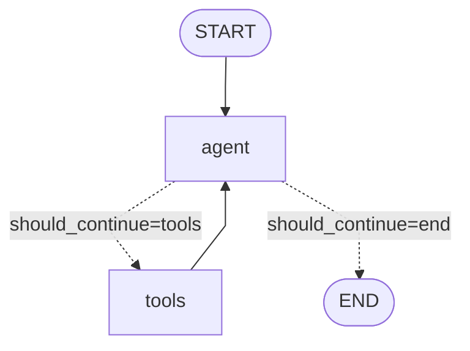

# LangGraph Visualization Guide

## Overview

LangGraph provides multiple ways to visualize your agent workflow. This is incredibly useful for:
- 🔍 Understanding the flow of your agent
- 🐛 Debugging complex routing logic
- 📖 Documenting your architecture
- 🎓 Teaching others how your agent works

---

## Method 1: Run the Visualization Script (Easiest)

```bash
# Activate virtual environment
.venv\Scripts\activate

# Run the visualization script
python visualize_graph.py
```

This will generate:
1. **graph_mermaid.txt** - Mermaid diagram code
2. **graph_diagram.png** - Visual PNG image (if graphviz installed)
3. **Console output** - ASCII art and component breakdown

---

## Method 2: Mermaid Diagram (No Dependencies)

### Generate Mermaid Code

Add this to any LangGraph script:

```python
# After compiling your graph
app = workflow.compile(checkpointer=memory)

# Generate Mermaid diagram
mermaid_code = app.get_graph().draw_mermaid()
print(mermaid_code)
```

### Visualize Online

1. Copy the Mermaid code output
2. Go to https://mermaid.live/
3. Paste the code
4. See your graph visualized!

### Example Output



---

## Method 3: PNG Image (Requires Graphviz)

### Install Graphviz

**Option A: Using uv (Recommended)**
```bash
uv pip install pygraphviz
```

**Option B: System-level install**
1. Download Graphviz from https://graphviz.org/download/
2. Install and add to PATH
3. Install Python bindings:
   ```bash
   uv pip install pygraphviz
   ```

### Generate PNG

```python
# Generate PNG bytes
png_data = app.get_graph().draw_mermaid_png()

# Save to file
with open("graph_diagram.png", "wb") as f:
    f.write(png_data)

print("✓ Saved to: graph_diagram.png")
```

### View in Jupyter Notebook

```python
from IPython.display import Image, display

png_data = app.get_graph().draw_mermaid_png()
display(Image(png_data))
```

---

## Method 4: Inspect in Code

### Get Graph Structure

```python
graph = app.get_graph()

# Get all nodes
print("Nodes:", graph.nodes.keys())

# Get all edges
print("Edges:", graph.edges)

# Get entry point
print("Entry:", graph.entry_point)
```

### Example Output

```
Nodes: dict_keys(['agent', 'tools', '__start__', '__end__'])
Edges: [('__start__', 'agent'), ('tools', 'agent')]
Entry: __start__
```

---

## Understanding the Visualization

### Our LangGraph Structure

```
┌─────────────────┐
│  START (Entry)  │
└────────┬────────┘
         │
         ▼
┌─────────────────┐
│     agent       │  ◄─────┐
│  (Call Model)   │        │
└────────┬────────┘        │
         │                 │
         ▼                 │
┌─────────────────┐        │
│ should_continue │        │
│   (Decision)    │        │
└────┬───────┬────┘        │
     │       │             │
tools│       │ end         │
     │       │             │
     ▼       ▼             │
┌────────┐  END            │
│ tools  │                 │
│(Execute│                 │
│ Tools) │                 │
└────┬───┘                 │
     │                     │
     └─────────────────────┘
```

### Component Breakdown

#### Nodes (Rectangles)
- **`agent`** - Calls AWS Bedrock Nova Lite with bound tools
- **`tools`** - Executes MCP tool calls (get_train_schedule)

#### Edges (Arrows)
- **Solid arrows** - Direct transitions
- **Dashed arrows** - Conditional transitions based on `should_continue`

#### Decision Points (Diamond)
- **`should_continue`** - Routes based on whether tool_calls are present

#### Special Nodes (Ovals)
- **`__start__`** - Entry point for the graph
- **`__end__`** - Terminal node

---

## Real-World Execution Flow

### Example: "When is the next train at Tseung Kwan O?"

```
1. START
   ↓
2. agent (Nova Lite receives query)
   ↓ [Decides: Need to call tool]
3. should_continue → "tools"
   ↓
4. tools (Call MCP get_train_schedule)
   ↓
5. agent (Nova Lite formats response with data)
   ↓ [Decides: No more tools needed]
6. should_continue → "end"
   ↓
7. END (Return response to user)
```

### State Changes During Execution

```python
# Initial state
{"messages": [HumanMessage("When is next train?")]}

# After agent node (tool call)
{"messages": [
    HumanMessage("When is next train?"),
    AIMessage(tool_calls=[...])
]}

# After tools node
{"messages": [
    HumanMessage("When is next train?"),
    AIMessage(tool_calls=[...]),
    ToolMessage(content="Train data...")
]}

# After agent node (final response)
{"messages": [
    HumanMessage("When is next train?"),
    AIMessage(tool_calls=[...]),
    ToolMessage(content="Train data..."),
    AIMessage(content="The next train arrives in 3 minutes...")
]}
```

---

## Advanced: Custom Styling

### Mermaid Theme Customization

```python
mermaid_code = app.get_graph().draw_mermaid()

# Add custom styling
styled_mermaid = f"""
%%{{init: {{'theme':'dark', 'themeVariables': {{'primaryColor':'#1e88e5'}}}}}}%%
{mermaid_code}
"""

print(styled_mermaid)
```

### Available Themes
- `default` - Standard colors
- `dark` - Dark mode
- `forest` - Green theme
- `neutral` - Minimal styling

---

## Comparing Graph Types

### Simple Graph (No Tools)
```
START → agent → END
```

### Agent Graph (With Tools)
```
START → agent ⇄ tools → END
         ↓
        END
```

### Multi-Agent Graph
```
START → planner → executor → reviewer → END
         ↓          ↓          ↓
        END        END        END
```

---

## Troubleshooting

### Issue: "draw_mermaid_png() failed"

**Solution 1**: Use Mermaid text output instead
```python
# Instead of PNG
mermaid_code = app.get_graph().draw_mermaid()
print(mermaid_code)
```

**Solution 2**: Install graphviz system-wide
- Windows: Download from https://graphviz.org/download/
- macOS: `brew install graphviz`
- Linux: `sudo apt install graphviz`

### Issue: "No module named 'pygraphviz'"

```bash
uv pip install pygraphviz
```

### Issue: Graph looks too complex

**Simplify by hiding internal nodes:**
```python
# Only show high-level flow
graph = app.get_graph()
print(f"Entry: {graph.entry_point}")
print(f"Main nodes: {[n for n in graph.nodes if not n.startswith('__')]}")
```

---

## Best Practices

### 1. Generate During Development
```python
# Add to your script
if __name__ == "__main__":
    app = build_graph()
    
    # Save diagram for reference
    mermaid = app.get_graph().draw_mermaid()
    with open("ARCHITECTURE.md", "w") as f:
        f.write(f"# Agent Architecture\n\n```mermaid\n{mermaid}\n```")
```

### 2. Include in Documentation
- Add visualization to README
- Use Mermaid in GitHub (renders automatically)
- Generate PNG for presentations

### 3. Version Control
```bash
# Track architecture changes
git add graph_diagram.png ARCHITECTURE.md
git commit -m "docs: update agent architecture diagram"
```

### 4. Compare Before/After Refactoring
```python
# Before refactor
old_mermaid = app_v1.get_graph().draw_mermaid()

# After refactor  
new_mermaid = app_v2.get_graph().draw_mermaid()

# Compare visually
```

---

## Quick Reference Commands

```bash
# Generate visualization
python visualize_graph.py

# View Mermaid online
# Copy output → https://mermaid.live/

# View PNG
start graph_diagram.png  # Windows
open graph_diagram.png   # macOS
xdg-open graph_diagram.png  # Linux
```

---

## Further Reading

- 📖 LangGraph Visualization Docs: https://langchain-ai.github.io/langgraph/how-tos/visualization/
- 🎨 Mermaid Live Editor: https://mermaid.live/
- 🔧 Graphviz Installation: https://graphviz.org/download/
- 📊 LangGraph Examples: https://github.com/langchain-ai/langgraph/tree/main/examples

---

## Summary

| Method | Pros | Cons | Best For |
|--------|------|------|----------|
| **Mermaid Text** | No dependencies, works online | Manual visualization | Quick checks |
| **PNG Image** | Professional, shareable | Requires graphviz | Presentations |
| **ASCII Art** | Works everywhere | Less precise | Terminal output |
| **Code Inspection** | Programmatic access | No visual | Debugging |

**Recommended**: Start with Mermaid text → View on mermaid.live → Install graphviz later for PNG if needed.
