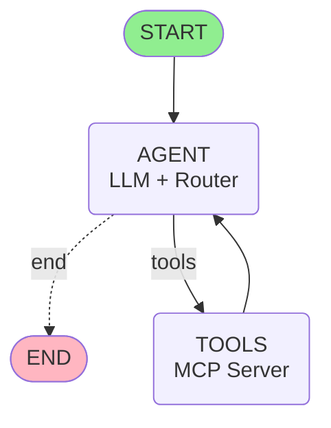

# LangGraph Architecture Visualization

## 🔄 Interactive Mermaid Diagram



## 📊 Flow Description

### **Nodes:**

#### 🎬 **START**

- Entry point for any conversation
- Initializes the agent state with empty message history
- Automatically routes to the AGENT node

#### 🤖 **AGENT** (Core Decision Maker)

- **Model**: AWS Bedrock Nova Lite
- **Responsibilities**:
  - Receives user messages
  - Processes conversation history from MemorySaver
  - Decides whether to:
    - Call MCP tools (route to TOOLS)
    - Provide final response (route to END)
- **System Prompt**: Guides behavior as MTR assistant
- **Memory**: Maintains full conversation context

#### 🔧 **TOOLS** (Action Executor)

- **MCP Server Integration**: Connects to MTR API
- **Available Tool**: `get_next_train_schedule`
- **Parameters**:
  - `line`: MTR line code (TKL, AEL, TCL, etc.)
  - `sta`: Station code (TKO, HOK, etc.)
  - `lang`: EN or TC
- **Returns**: Real-time train schedule data
- **Flow**: Always loops back to AGENT for processing

#### 🏁 **END**

- Final response generated
- Conversation state saved to memory
- Ready for next user message

---

## 🔀 Edge Descriptions

### **START → AGENT**

- Type: Direct edge
- Always executed at conversation start

### **AGENT → TOOLS** (Conditional)

- Type: Conditional edge
- Triggered when: LLM decides a tool call is needed
- Condition: `should_continue() == "tools"`
- Example: User asks "When is next train at TKO?"

### **TOOLS → AGENT** (Loop Back)

- Type: Direct edge
- Always executed after tool completion
- Carries tool results as `ToolMessage`
- Allows multi-tool calls if needed

### **AGENT → END** (Conditional)

- Type: Conditional edge
- Triggered when: No more tools needed
- Condition: `should_continue() == "end"`
- Final AI response is returned

---

## 💾 Memory Architecture

### **MemorySaver Checkpointer**

```
Thread ID: "demo-conversation"
├── Message 1: HumanMessage
├── Message 2: AIMessage (with tool_calls)
├── Message 3: ToolMessage (results)
├── Message 4: AIMessage (final response)
├── Message 5: HumanMessage (follow-up)
└── ... (continues)
```

**Key Benefits**:

- ✅ Context retention across multiple turns
- ✅ Reference to "that station" or "the same line"
- ✅ Compare previous and current results
- ✅ No need to repeat information

---

## 🎯 Example Flow

### **Turn 1: Initial Query**

```
User: "When is the next train at Tseung Kwan O?"

START → AGENT (decides tool needed)
     → TOOLS (calls get_next_train_schedule)
     → AGENT (formats response)
     → END (returns "Next train in 3 minutes to LOHAS Park")
```

### **Turn 2: Follow-up (Using Memory)**

```
User: "What about the other direction?"

START → AGENT (remembers "Tseung Kwan O" from Turn 1)
     → TOOLS (calls with TKO but different direction)
     → AGENT (compares with previous)
     → END (returns "Next train in 5 minutes to North Point")
```

---

## 🏗️ ASCII Diagram

```
    ┌─────────────┐
    │   START     │
    └──────┬──────┘
           │
           ▼
    ┌─────────────┐
    │   AGENT     │◄───────────┐
    │  (LLM +     │            │
    │   Router)   │            │
    │             │            │
    │  • Decides  │            │
    │  • Routes   │            │
    │  • Remembers│            │
    └──────┬──────┘            │
           │                   │
           ├─[tools]──┐        │
           │          │        │
           │          ▼        │
           │   ┌─────────────┐ │
           │   │   TOOLS     │─┘
           │   │ (MCP Server)│
           │   │             │
           │   │ • Fetches   │
           │   │ • Returns   │
           │   └─────────────┘
           │
           │[end]
           ▼
    ┌─────────────┐
    │    END      │
    └─────────────┘
```

---

## 🧠 Technical Details

### **State Schema**

```python
class AgentState(TypedDict):
    messages: Annotated[list, "The messages in the conversation"]
```

### **Graph Configuration**

- **Checkpointer**: `MemorySaver()` (in-memory storage)
- **Thread ID**: `"demo-conversation"` (configurable)
- **Entry Point**: `agent` node
- **Conditional Logic**: `should_continue()` function

### **LLM Configuration**

```python
ChatBedrock(
    model_id="amazon.nova-lite-v1:0",
    region_name="us-east-1",
    temperature=0.7,
    max_tokens=5000
)
```

---

## 🎨 How to View This Diagram

### Option 1: VS Code Markdown Preview

1. Open this file in VS Code
2. Press `Ctrl+Shift+V` (Windows) or `Cmd+Shift+V` (Mac)
3. Mermaid diagrams render automatically!

### Option 2: Mermaid Live Editor

1. Copy the mermaid code block above
2. Go to <https://mermaid.live/>
3. Paste and see interactive diagram

### Option 3: GitHub

- Push this file to GitHub
- GitHub automatically renders Mermaid diagrams

---

## 📚 Key Takeaways

1. **Stateful Agent**: Memory persists across turns
2. **Tool Integration**: MCP server provides real data
3. **Conditional Routing**: LLM decides when to use tools
4. **Loop Architecture**: Can call tools multiple times
5. **Context Awareness**: References previous conversation
