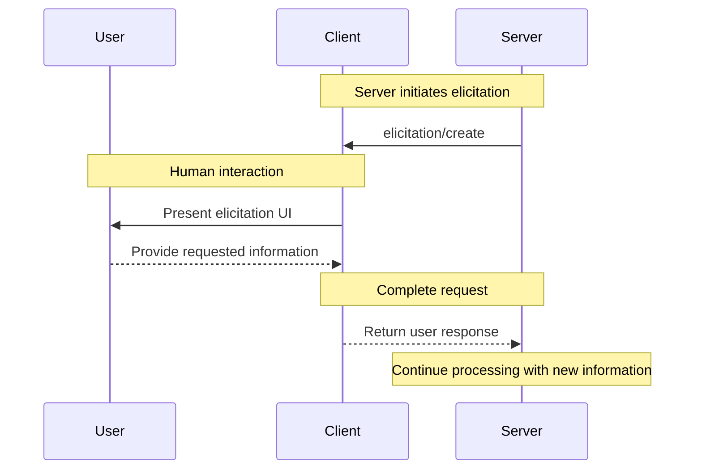
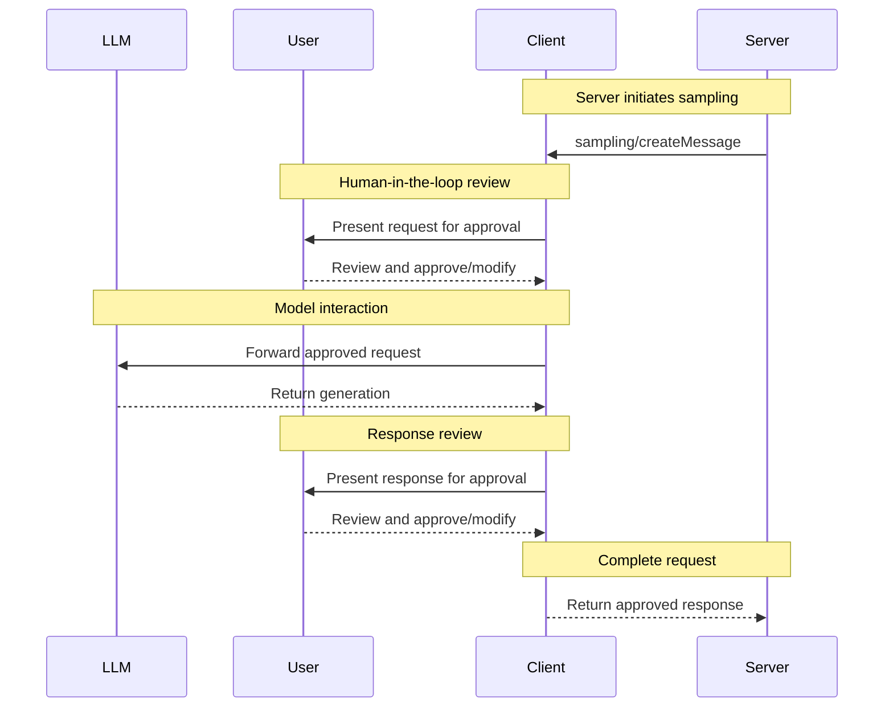

# Understanding MCP servers

MCP servers are programs that expose specific capabilities to AI applications through standardized protocol interfaces.

Common examples include file system servers for document access, database servers for data queries, GitHub servers for code management, Slack servers for team communication, and calendar servers for scheduling.

## Core Server Features

Servers provide functionality through three building blocks:

| Feature       | Explanation                                                                                                                                                                             | Examples                                                           | Who controls it |
| ------------- | --------------------------------------------------------------------------------------------------------------------------------------------------------------------------------------- | ------------------------------------------------------------------ | --------------- |
| **Tools**     | Functions that your LLM can actively call, and decides when to use them based on user requests. Tools can write to databases, call external APIs, modify files, or trigger other logic. | Search flights<br />Send messages<br />Create calendar events      | Model           |
| **Resources** | Passive data sources that provide read-only access to information for context, such as file contents, database schemas, or API documentation.                                           | Retrieve documents<br />Access knowledge bases<br />Read calendars | Application     |
| **Prompts**   | Pre-built instruction templates that tell the model to work with specific tools and resources.                                                                                          | Plan a vacation<br />Summarize my meetings<br />Draft an email     | User            |

We will use a hypothetical scenario to demonstrate the role of each of these features, and show how they can work together.

### Tools

Tools enable AI models to perform actions. Each tool defines a specific operation with typed inputs and outputs. The model requests tool execution based on context.

#### How Tools Work

Tools are schema-defined interfaces that LLMs can invoke. MCP uses JSON Schema for validation. Each tool performs a single operation with clearly defined inputs and outputs. Tools may require user consent prior to execution, helping to ensure users maintain control over actions taken by a model.

**Protocol operations:**

| Method       | Purpose                  | Returns                                |
| ------------ | ------------------------ | -------------------------------------- |
| `tools/list` | Discover available tools | Array of tool definitions with schemas |
| `tools/call` | Execute a specific tool  | Tool execution result                  |

**Example tool definition:**

```typescript  theme={null}
{
  name: "searchFlights",
  description: "Search for available flights",
  inputSchema: {
    type: "object",
    properties: {
      origin: { type: "string", description: "Departure city" },
      destination: { type: "string", description: "Arrival city" },
      date: { type: "string", format: "date", description: "Travel date" }
    },
    required: ["origin", "destination", "date"]
  }
}
```

#### Example: Travel Booking

Tools enable AI applications to perform actions on behalf of users. In a travel planning scenario, the AI application might use several tools to help book a vacation:

**Flight Search**

```
searchFlights(origin: "NYC", destination: "Barcelona", date: "2024-06-15")
```

Queries multiple airlines and returns structured flight options.

**Calendar Blocking**

```
createCalendarEvent(title: "Barcelona Trip", startDate: "2024-06-15", endDate: "2024-06-22")
```

Marks the travel dates in the user's calendar.

**Email notification**

```
sendEmail(to: "team@work.com", subject: "Out of Office", body: "...")
```

Sends an automated out-of-office message to colleagues.

#### User Interaction Model

Tools are model-controlled, meaning AI models can discover and invoke them automatically. However, MCP emphasizes human oversight through several mechanisms.

For trust and safety, applications can implement user control through various mechanisms, such as:

* Displaying available tools in the UI, enabling users to define whether a tool should be made available in specific interactions
* Approval dialogs for individual tool executions
* Permission settings for pre-approving certain safe operations
* Activity logs that show all tool executions with their results

### Resources

Resources provide structured access to information that the AI application can retrieve and provide to models as context.

#### How Resources Work

Resources expose data from files, APIs, databases, or any other source that an AI needs to understand context. Applications can access this information directly and decide how to use it - whether that's selecting relevant portions, searching with embeddings, or passing it all to the model.

Each resource has a unique URI (like `file:///path/to/document.md`) and declares its MIME type for appropriate content handling. They declare MIME types for appropriate content handling and support two discovery patterns:

* **Direct Resources** - fixed URIs that point to specific data. Example: `calendar://events/2024` - returns calendar availability for 2024
* **Resource Templates** - dynamic URIs with parameters for flexible queries. Example:
  * `travel://activities/{city}/{category}` - returns activities by city and category
  * `travel://activities/barcelona/museums` - returns all museums in Barcelona

Resource Templates include metadata such as title, description, and expected MIME type, making them discoverable and self-documenting.

**Protocol operations:**

| Method                     | Purpose                         | Returns                                |
| -------------------------- | ------------------------------- | -------------------------------------- |
| `resources/list`           | List available direct resources | Array of resource descriptors          |
| `resources/templates/list` | Discover resource templates     | Array of resource template definitions |
| `resources/read`           | Retrieve resource contents      | Resource data with metadata            |
| `resources/subscribe`      | Monitor resource changes        | Subscription confirmation              |

#### Example: Getting Travel Planning Context

Continuing with the travel planning example, resources provide the AI application with access to relevant information:

* **Calendar data** (`calendar://events/2024`) - Checks user availability
* **Travel documents** (`file:///Documents/Travel/passport.pdf`) - Accesses important documents
* **Previous itineraries** (`trips://history/barcelona-2023`) - References past trips and preferences

The AI application retrieves these resources and decides how to process them, whether selecting a subset of data using embeddings or keyword search, or passing raw data directly to the model.

In this case, it provides calendar data, weather information, and travel preferences to the model, enabling it to check availability, look up weather patterns, and reference past travel preferences.

**Resource Template Examples:**

```json  theme={null}
{
  "uriTemplate": "weather://forecast/{city}/{date}",
  "name": "weather-forecast",
  "title": "Weather Forecast",
  "description": "Get weather forecast for any city and date",
  "mimeType": "application/json"
}

{
  "uriTemplate": "travel://flights/{origin}/{destination}",
  "name": "flight-search",
  "title": "Flight Search",
  "description": "Search available flights between cities",
  "mimeType": "application/json"
}
```

These templates enable flexible queries. For weather data, users can access forecasts for any city/date combination. For flights, they can search routes between any two airports. When a user has input "NYC" as the `origin` airport and begins to input "Bar" as the `destination` airport, the system can suggest "Barcelona (BCN)" or "Barbados (BGI)".

#### Parameter Completion

Dynamic resources support parameter completion. For example:

* Typing "Par" as input for `weather://forecast/{city}` might suggest "Paris" or "Park City"
* Typing "JFK" for `flights://search/{airport}` might suggest "JFK - John F. Kennedy International"

The system helps discover valid values without requiring exact format knowledge.

#### User Interaction Model

Resources are application-driven, giving them flexibility in how they retrieve, process, and present available context. Common interaction patterns include:

* Tree or list views for browsing resources in familiar folder-like structures
* Search and filter interfaces for finding specific resources
* Automatic context inclusion or smart suggestions based on heuristics or AI selection
* Manual or bulk selection interfaces for including single or multiple resources

Applications are free to implement resource discovery through any interface pattern that suits their needs. The protocol doesn't mandate specific UI patterns, allowing for resource pickers with preview capabilities, smart suggestions based on current conversation context, bulk selection for including multiple resources, or integration with existing file browsers and data explorers.

### Prompts

Prompts provide reusable templates. They allow MCP server authors to provide parameterized prompts for a domain, or showcase how to best use the MCP server.

#### How Prompts Work

Prompts are structured templates that define expected inputs and interaction patterns. They are user-controlled, requiring explicit invocation rather than automatic triggering. Prompts can be context-aware, referencing available resources and tools to create comprehensive workflows. Similar to resources, prompts support parameter completion to help users discover valid argument values.

**Protocol operations:**

| Method         | Purpose                    | Returns                               |
| -------------- | -------------------------- | ------------------------------------- |
| `prompts/list` | Discover available prompts | Array of prompt descriptors           |
| `prompts/get`  | Retrieve prompt details    | Full prompt definition with arguments |

#### Example: Streamlined Workflows

Prompts provide structured templates for common tasks. In the travel planning context:

**"Plan a vacation" prompt:**

```json  theme={null}
{
  "name": "plan-vacation",
  "title": "Plan a vacation",
  "description": "Guide through vacation planning process",
  "arguments": [
    { "name": "destination", "type": "string", "required": true },
    { "name": "duration", "type": "number", "description": "days" },
    { "name": "budget", "type": "number", "required": false },
    { "name": "interests", "type": "array", "items": { "type": "string" } }
  ]
}
```

Rather than unstructured natural language input, the prompt system enables:

1. Selection of the "Plan a vacation" template
2. Structured input: Barcelona, 7 days, \$3000, \["beaches", "architecture", "food"]
3. Consistent workflow execution based on the template

#### User Interaction Model

Prompts are user-controlled, requiring explicit invocation. The protocol gives implementers freedom to design interfaces that feel natural within their application. Key principles include:

* Easy discovery of available prompts
* Clear descriptions of what each prompt does
* Natural argument input with validation
* Transparent display of the prompt's underlying template

Applications typically expose prompts through various UI patterns such as:

* Slash commands (typing "/" to see available prompts like /plan-vacation)
* Command palettes for searchable access
* Dedicated UI buttons for frequently used prompts
* Context menus that suggest relevant prompts

## Bringing Servers Together

The real power of MCP emerges when multiple servers work together, combining their specialized capabilities through a unified interface.

### Example: Multi-Server Travel Planning

Consider a personalized AI travel planner application, with three connected servers:

* **Travel Server** - Handles flights, hotels, and itineraries
* **Weather Server** - Provides climate data and forecasts
* **Calendar/Email Server** - Manages schedules and communications

#### The Complete Flow

1. **User invokes a prompt with parameters:**

   ```json  theme={null}
   {
     "prompt": "plan-vacation",
     "arguments": {
       "destination": "Barcelona",
       "departure_date": "2024-06-15",
       "return_date": "2024-06-22",
       "budget": 3000,
       "travelers": 2
     }
   }
   ```

2. **User selects resources to include:**
   * `calendar://my-calendar/June-2024` (from Calendar Server)
   * `travel://preferences/europe` (from Travel Server)
   * `travel://past-trips/Spain-2023` (from Travel Server)

3. **AI processes the request using tools:**

   The AI first reads all selected resources to gather context - identifying available dates from the calendar, learning preferred airlines and hotel types from travel preferences, and discovering previously enjoyed locations from past trips.

   Using this context, the AI then executes a series of Tools:

   * `searchFlights()` - Queries airlines for NYC to Barcelona flights
   * `checkWeather()` - Retrieves climate forecasts for travel dates

   The AI then uses this information to create the booking and following steps, requesting approval from the user where necessary:

   * `bookHotel()` - Finds hotels within the specified budget
   * `createCalendarEvent()` - Adds the trip to the user's calendar
   * `sendEmail()` - Sends confirmation with trip details

**The result:** Through multiple MCP servers, the user researched and booked a Barcelona trip tailored to their schedule. The "Plan a Vacation" prompt guided the AI to combine Resources (calendar availability and travel history) with Tools (searching flights, booking hotels, updating calendars) across different servers—gathering context and executing the booking. A task that could've taken hours was completed in minutes using MCP.

# MCP clients

# Understanding MCP clients

MCP clients are instantiated by host applications to communicate with particular MCP servers. The host application, like Claude.ai or an IDE, manages the overall user experience and coordinates multiple clients. Each client handles one direct communication with one server.

Understanding the distinction is important: the *host* is the application users interact with, while *clients* are the protocol-level components that enable server connections.

## Core Client Features

In addition to making use of context provided by servers, clients may provide several features to servers. These client features allow server authors to build richer interactions.

| Feature         | Explanation                                                                                                                                                                                       | Example                                                                                                                                |
| --------------- | ------------------------------------------------------------------------------------------------------------------------------------------------------------------------------------------------- | -------------------------------------------------------------------------------------------------------------------------------------- |
| **Sampling**    | Sampling allows servers to request LLM completions through the client, enabling an agentic workflow. This approach puts the client in complete control of user permissions and security measures. | A server for booking travel may send a list of flights to an LLM and request that the LLM pick the best flight for the user.           |
| **Roots**       | Roots allow clients to specify which directories servers should focus on, communicating intended scope through a coordination mechanism.                                                          | A server for booking travel may be given access to a specific directory, from which it can read a user's calendar.                     |
| **Elicitation** | Elicitation enables servers to request specific information from users during interactions, providing a structured way for servers to gather information on demand.                               | A server booking travel may ask for the user's preferences on airplane seats, room type or their contact number to finalise a booking. |

### Elicitation

Elicitation enables servers to request specific information from users during interactions, creating more dynamic and responsive workflows.

#### Overview

Elicitation provides a structured way for servers to gather necessary information on demand. Instead of requiring all information up front or failing when data is missing, servers can pause their operations to request specific inputs from users. This creates more flexible interactions where servers adapt to user needs rather than following rigid patterns.

**Elicitation flow:**



The flow enables dynamic information gathering. Servers can request specific data when needed, users provide information through appropriate UI, and servers continue processing with the newly acquired context.

**Elicitation components example:**

```typescript  theme={null}
{
  method: "elicitation/requestInput",
  params: {
    message: "Please confirm your Barcelona vacation booking details:",
    schema: {
      type: "object",
      properties: {
        confirmBooking: {
          type: "boolean",
          description: "Confirm the booking (Flights + Hotel = $3,000)"
        },
        seatPreference: {
          type: "string",
          enum: ["window", "aisle", "no preference"],
          description: "Preferred seat type for flights"
        },
        roomType: {
          type: "string",
          enum: ["sea view", "city view", "garden view"],
          description: "Preferred room type at hotel"
        },
        travelInsurance: {
          type: "boolean",
          default: false,
          description: "Add travel insurance ($150)"
        }
      },
      required: ["confirmBooking"]
    }
  }
}
```

#### Example: Holiday Booking Approval

A travel booking server demonstrates elicitation's power through the final booking confirmation process. When a user has selected their ideal vacation package to Barcelona, the server needs to gather final approval and any missing details before proceeding.

The server elicits booking confirmation with a structured request that includes the trip summary (Barcelona flights June 15-22, beachfront hotel, total \$3,000) and fields for any additional preferences—such as seat selection, room type, or travel insurance options.

As the booking progresses, the server elicits contact information needed to complete the reservation. It might ask for traveler details for flight bookings, special requests for the hotel, or emergency contact information.

#### User Interaction Model

Elicitation interactions are designed to be clear, contextual, and respectful of user autonomy:

**Request presentation**: Clients display elicitation requests with clear context about which server is asking, why the information is needed, and how it will be used. The request message explains the purpose while the schema provides structure and validation.

**Response options**: Users can provide the requested information through appropriate UI controls (text fields, dropdowns, checkboxes), decline to provide information with optional explanation, or cancel the entire operation. Clients validate responses against the provided schema before returning them to servers.

**Privacy considerations**: Elicitation never requests passwords or API keys. Clients warn about suspicious requests and let users review data before sending.

### Roots

Roots define filesystem boundaries for server operations, allowing clients to specify which directories servers should focus on.

#### Overview

Roots are a mechanism for clients to communicate filesystem access boundaries to servers. They consist of file URIs that indicate directories where servers can operate, helping servers understand the scope of available files and folders. While roots communicate intended boundaries, they do not enforce security restrictions. Actual security must be enforced at the operating system level, via file permissions and/or sandboxing.

**Root structure:**

```json  theme={null}
{
  "uri": "file:///Users/agent/travel-planning",
  "name": "Travel Planning Workspace"
}
```

Roots are exclusively filesystem paths and always use the `file://` URI scheme. They help servers understand project boundaries, workspace organization, and accessible directories. The roots list can be updated dynamically as users work with different projects or folders, with servers receiving notifications through `roots/list_changed` when boundaries change.

#### Example: Travel Planning Workspace

A travel agent working with multiple client trips benefits from roots to organize filesystem access. Consider a workspace with different directories for various aspects of travel planning.

The client provides filesystem roots to the travel planning server:

* `file:///Users/agent/travel-planning` - Main workspace containing all travel files
* `file:///Users/agent/travel-templates` - Reusable itinerary templates and resources
* `file:///Users/agent/client-documents` - Client passports and travel documents

When the agent creates a Barcelona itinerary, well-behaved servers respect these boundaries—accessing templates, saving the new itinerary, and referencing client documents within the specified roots. Servers typically access files within roots by using relative paths from the root directories or by utilizing file search tools that respect the root boundaries.

If the agent opens an archive folder like `file:///Users/agent/archive/2023-trips`, the client updates the roots list via `roots/list_changed`.

For a complete implementation of a server that respects roots, see the [filesystem server](https://github.com/modelcontextprotocol/servers/tree/main/src/filesystem) in the official servers repository.

#### Design Philosophy

Roots serve as a coordination mechanism between clients and servers, not a security boundary. The specification requires that servers "SHOULD respect root boundaries," and not that they "MUST enforce" them, because servers run code the client cannot control.

Roots work best when servers are trusted or vetted, users understand their advisory nature, and the goal is preventing accidents rather than stopping malicious behavior. They excel at context scoping (telling servers where to focus), accident prevention (helping well-behaved servers stay in bounds), and workflow organization (such as managing project boundaries automatically).

#### User Interaction Model

Roots are typically managed automatically by host applications based on user actions, though some applications may expose manual root management:

**Automatic root detection**: When users open folders, clients automatically expose them as roots. Opening a travel workspace allows the client to expose that directory as a root, helping servers understand which itineraries and documents are in scope for the current work.

**Manual root configuration**: Advanced users can specify roots through configuration. For example, adding `/travel-templates` for reusable resources while excluding directories with financial records.

### Sampling

Sampling allows servers to request language model completions through the client, enabling agentic behaviors while maintaining security and user control.

#### Overview

Sampling enables servers to perform AI-dependent tasks without directly integrating with or paying for AI models. Instead, servers can request that the client—which already has AI model access—handle these tasks on their behalf. This approach puts the client in complete control of user permissions and security measures. Because sampling requests occur within the context of other operations—like a tool analyzing data—and are processed as separate model calls, they maintain clear boundaries between different contexts, allowing for more efficient use of the context window.

**Sampling flow:**



The flow ensures security through multiple human-in-the-loop checkpoints. Users review and can modify both the initial request and the generated response before it returns to the server.

**Request parameters example:**

```typescript  theme={null}
{
  messages: [
    {
      role: "user",
      content: "Analyze these flight options and recommend the best choice:\n" +
               "[47 flights with prices, times, airlines, and layovers]\n" +
               "User preferences: morning departure, max 1 layover"
    }
  ],
  modelPreferences: {
    hints: [{
      name: "claude-3-5-sonnet"  // Suggested model
    }],
    costPriority: 0.3,      // Less concerned about API cost
    speedPriority: 0.2,     // Can wait for thorough analysis
    intelligencePriority: 0.9  // Need complex trade-off evaluation
  },
  systemPrompt: "You are a travel expert helping users find the best flights based on their preferences",
  maxTokens: 1500
}
```

#### Example: Flight Analysis Tool

Consider a travel booking server with a tool called `findBestFlight` that uses sampling to analyze available flights and recommend the optimal choice. When a user asks "Book me the best flight to Barcelona next month," the tool needs AI assistance to evaluate complex trade-offs.

The tool queries airline APIs and gathers 47 flight options. It then requests AI assistance to analyze these options: "Analyze these flight options and recommend the best choice: \[47 flights with prices, times, airlines, and layovers] User preferences: morning departure, max 1 layover."

The client initiates the sampling request, allowing the AI to evaluate trade-offs—like cheaper red-eye flights versus convenient morning departures. The tool uses this analysis to present the top three recommendations.

#### User Interaction Model

While not a requirement, sampling is designed to allow human-in-the-loop control. Users can maintain oversight through several mechanisms:

**Approval controls**: Sampling requests may require explicit user consent. Clients can show what the server wants to analyze and why. Users can approve, deny, or modify requests.

**Transparency features**: Clients can display the exact prompt, model selection, and token limits, allowing users to review AI responses before they return to the server.

**Configuration options**: Users can set model preferences, configure auto-approval for trusted operations, or require approval for everything. Clients may provide options to redact sensitive information.

**Security considerations**: Both clients and servers must handle sensitive data appropriately during sampling. Clients should implement rate limiting and validate all message content. The human-in-the-loop design ensures that server-initiated AI interactions cannot compromise security or access sensitive data without explicit user consent.

# MCP Server

# Understanding MCP servers

MCP servers are programs that expose specific capabilities to AI applications through standardized protocol interfaces.

Common examples include file system servers for document access, database servers for data queries, GitHub servers for code management, Slack servers for team communication, and calendar servers for scheduling.

## Core Server Features

Servers provide functionality through three building blocks:

| Feature       | Explanation                                                                                                                                                                             | Examples                                                           | Who controls it |
| ------------- | --------------------------------------------------------------------------------------------------------------------------------------------------------------------------------------- | ------------------------------------------------------------------ | --------------- |
| **Tools**     | Functions that your LLM can actively call, and decides when to use them based on user requests. Tools can write to databases, call external APIs, modify files, or trigger other logic. | Search flights<br />Send messages<br />Create calendar events      | Model           |
| **Resources** | Passive data sources that provide read-only access to information for context, such as file contents, database schemas, or API documentation.                                           | Retrieve documents<br />Access knowledge bases<br />Read calendars | Application     |
| **Prompts**   | Pre-built instruction templates that tell the model to work with specific tools and resources.                                                                                          | Plan a vacation<br />Summarize my meetings<br />Draft an email     | User            |

We will use a hypothetical scenario to demonstrate the role of each of these features, and show how they can work together.

### Tools

Tools enable AI models to perform actions. Each tool defines a specific operation with typed inputs and outputs. The model requests tool execution based on context.

#### How Tools Work

Tools are schema-defined interfaces that LLMs can invoke. MCP uses JSON Schema for validation. Each tool performs a single operation with clearly defined inputs and outputs. Tools may require user consent prior to execution, helping to ensure users maintain control over actions taken by a model.

**Protocol operations:**

| Method       | Purpose                  | Returns                                |
| ------------ | ------------------------ | -------------------------------------- |
| `tools/list` | Discover available tools | Array of tool definitions with schemas |
| `tools/call` | Execute a specific tool  | Tool execution result                  |

**Example tool definition:**

```typescript  theme={null}
{
  name: "searchFlights",
  description: "Search for available flights",
  inputSchema: {
    type: "object",
    properties: {
      origin: { type: "string", description: "Departure city" },
      destination: { type: "string", description: "Arrival city" },
      date: { type: "string", format: "date", description: "Travel date" }
    },
    required: ["origin", "destination", "date"]
  }
}
```

#### Example: Travel Booking

Tools enable AI applications to perform actions on behalf of users. In a travel planning scenario, the AI application might use several tools to help book a vacation:

**Flight Search**

```
searchFlights(origin: "NYC", destination: "Barcelona", date: "2024-06-15")
```

Queries multiple airlines and returns structured flight options.

**Calendar Blocking**

```
createCalendarEvent(title: "Barcelona Trip", startDate: "2024-06-15", endDate: "2024-06-22")
```

Marks the travel dates in the user's calendar.

**Email notification**

```
sendEmail(to: "team@work.com", subject: "Out of Office", body: "...")
```

Sends an automated out-of-office message to colleagues.

#### User Interaction Model

Tools are model-controlled, meaning AI models can discover and invoke them automatically. However, MCP emphasizes human oversight through several mechanisms.

For trust and safety, applications can implement user control through various mechanisms, such as:

* Displaying available tools in the UI, enabling users to define whether a tool should be made available in specific interactions
* Approval dialogs for individual tool executions
* Permission settings for pre-approving certain safe operations
* Activity logs that show all tool executions with their results

### Resources

Resources provide structured access to information that the AI application can retrieve and provide to models as context.

#### How Resources Work

Resources expose data from files, APIs, databases, or any other source that an AI needs to understand context. Applications can access this information directly and decide how to use it - whether that's selecting relevant portions, searching with embeddings, or passing it all to the model.

Each resource has a unique URI (like `file:///path/to/document.md`) and declares its MIME type for appropriate content handling. They declare MIME types for appropriate content handling and support two discovery patterns:

* **Direct Resources** - fixed URIs that point to specific data. Example: `calendar://events/2024` - returns calendar availability for 2024
* **Resource Templates** - dynamic URIs with parameters for flexible queries. Example:
  * `travel://activities/{city}/{category}` - returns activities by city and category
  * `travel://activities/barcelona/museums` - returns all museums in Barcelona

Resource Templates include metadata such as title, description, and expected MIME type, making them discoverable and self-documenting.

**Protocol operations:**

| Method                     | Purpose                         | Returns                                |
| -------------------------- | ------------------------------- | -------------------------------------- |
| `resources/list`           | List available direct resources | Array of resource descriptors          |
| `resources/templates/list` | Discover resource templates     | Array of resource template definitions |
| `resources/read`           | Retrieve resource contents      | Resource data with metadata            |
| `resources/subscribe`      | Monitor resource changes        | Subscription confirmation              |

#### Example: Getting Travel Planning Context

Continuing with the travel planning example, resources provide the AI application with access to relevant information:

* **Calendar data** (`calendar://events/2024`) - Checks user availability
* **Travel documents** (`file:///Documents/Travel/passport.pdf`) - Accesses important documents
* **Previous itineraries** (`trips://history/barcelona-2023`) - References past trips and preferences

The AI application retrieves these resources and decides how to process them, whether selecting a subset of data using embeddings or keyword search, or passing raw data directly to the model.

In this case, it provides calendar data, weather information, and travel preferences to the model, enabling it to check availability, look up weather patterns, and reference past travel preferences.

**Resource Template Examples:**

```json  theme={null}
{
  "uriTemplate": "weather://forecast/{city}/{date}",
  "name": "weather-forecast",
  "title": "Weather Forecast",
  "description": "Get weather forecast for any city and date",
  "mimeType": "application/json"
}

{
  "uriTemplate": "travel://flights/{origin}/{destination}",
  "name": "flight-search",
  "title": "Flight Search",
  "description": "Search available flights between cities",
  "mimeType": "application/json"
}
```

These templates enable flexible queries. For weather data, users can access forecasts for any city/date combination. For flights, they can search routes between any two airports. When a user has input "NYC" as the `origin` airport and begins to input "Bar" as the `destination` airport, the system can suggest "Barcelona (BCN)" or "Barbados (BGI)".

#### Parameter Completion

Dynamic resources support parameter completion. For example:

* Typing "Par" as input for `weather://forecast/{city}` might suggest "Paris" or "Park City"
* Typing "JFK" for `flights://search/{airport}` might suggest "JFK - John F. Kennedy International"

The system helps discover valid values without requiring exact format knowledge.

#### User Interaction Model

Resources are application-driven, giving them flexibility in how they retrieve, process, and present available context. Common interaction patterns include:

* Tree or list views for browsing resources in familiar folder-like structures
* Search and filter interfaces for finding specific resources
* Automatic context inclusion or smart suggestions based on heuristics or AI selection
* Manual or bulk selection interfaces for including single or multiple resources

Applications are free to implement resource discovery through any interface pattern that suits their needs. The protocol doesn't mandate specific UI patterns, allowing for resource pickers with preview capabilities, smart suggestions based on current conversation context, bulk selection for including multiple resources, or integration with existing file browsers and data explorers.

### Prompts

Prompts provide reusable templates. They allow MCP server authors to provide parameterized prompts for a domain, or showcase how to best use the MCP server.

#### How Prompts Work

Prompts are structured templates that define expected inputs and interaction patterns. They are user-controlled, requiring explicit invocation rather than automatic triggering. Prompts can be context-aware, referencing available resources and tools to create comprehensive workflows. Similar to resources, prompts support parameter completion to help users discover valid argument values.

**Protocol operations:**

| Method         | Purpose                    | Returns                               |
| -------------- | -------------------------- | ------------------------------------- |
| `prompts/list` | Discover available prompts | Array of prompt descriptors           |
| `prompts/get`  | Retrieve prompt details    | Full prompt definition with arguments |

#### Example: Streamlined Workflows

Prompts provide structured templates for common tasks. In the travel planning context:

**"Plan a vacation" prompt:**

```json  theme={null}
{
  "name": "plan-vacation",
  "title": "Plan a vacation",
  "description": "Guide through vacation planning process",
  "arguments": [
    { "name": "destination", "type": "string", "required": true },
    { "name": "duration", "type": "number", "description": "days" },
    { "name": "budget", "type": "number", "required": false },
    { "name": "interests", "type": "array", "items": { "type": "string" } }
  ]
}
```

Rather than unstructured natural language input, the prompt system enables:

1. Selection of the "Plan a vacation" template
2. Structured input: Barcelona, 7 days, \$3000, \["beaches", "architecture", "food"]
3. Consistent workflow execution based on the template

#### User Interaction Model

Prompts are user-controlled, requiring explicit invocation. The protocol gives implementers freedom to design interfaces that feel natural within their application. Key principles include:

* Easy discovery of available prompts
* Clear descriptions of what each prompt does
* Natural argument input with validation
* Transparent display of the prompt's underlying template

Applications typically expose prompts through various UI patterns such as:

* Slash commands (typing "/" to see available prompts like /plan-vacation)
* Command palettes for searchable access
* Dedicated UI buttons for frequently used prompts
* Context menus that suggest relevant prompts

## Bringing Servers Together

The real power of MCP emerges when multiple servers work together, combining their specialized capabilities through a unified interface.

### Example: Multi-Server Travel Planning

Consider a personalized AI travel planner application, with three connected servers:

* **Travel Server** - Handles flights, hotels, and itineraries
* **Weather Server** - Provides climate data and forecasts
* **Calendar/Email Server** - Manages schedules and communications

#### The Complete Flow

1. **User invokes a prompt with parameters:**

   ```json  theme={null}
   {
     "prompt": "plan-vacation",
     "arguments": {
       "destination": "Barcelona",
       "departure_date": "2024-06-15",
       "return_date": "2024-06-22",
       "budget": 3000,
       "travelers": 2
     }
   }
   ```

2. **User selects resources to include:**
   * `calendar://my-calendar/June-2024` (from Calendar Server)
   * `travel://preferences/europe` (from Travel Server)
   * `travel://past-trips/Spain-2023` (from Travel Server)

3. **AI processes the request using tools:**

   The AI first reads all selected resources to gather context - identifying available dates from the calendar, learning preferred airlines and hotel types from travel preferences, and discovering previously enjoyed locations from past trips.

   Using this context, the AI then executes a series of Tools:

   * `searchFlights()` - Queries airlines for NYC to Barcelona flights
   * `checkWeather()` - Retrieves climate forecasts for travel dates

   The AI then uses this information to create the booking and following steps, requesting approval from the user where necessary:

   * `bookHotel()` - Finds hotels within the specified budget
   * `createCalendarEvent()` - Adds the trip to the user's calendar
   * `sendEmail()` - Sends confirmation with trip details

**The result:** Through multiple MCP servers, the user researched and booked a Barcelona trip tailored to their schedule. The "Plan a Vacation" prompt guided the AI to combine Resources (calendar availability and travel history) with Tools (searching flights, booking hotels, updating calendars) across different servers—gathering context and executing the booking. A task that could've taken hours was completed in minutes using MCP.
