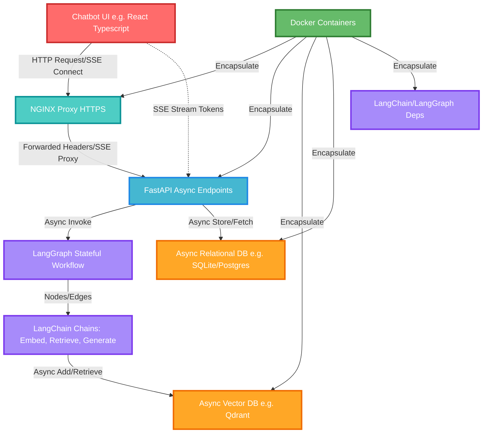
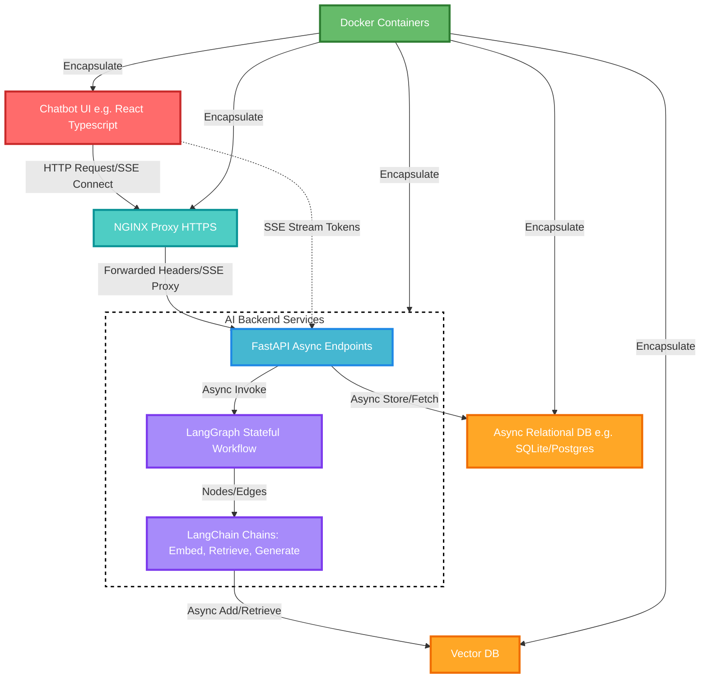
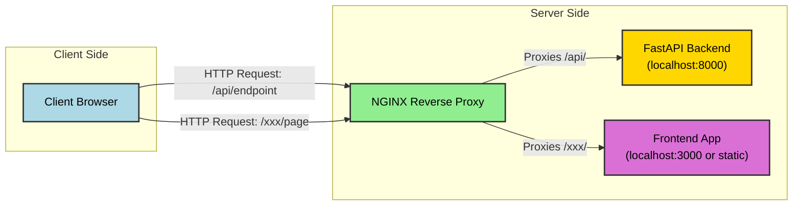
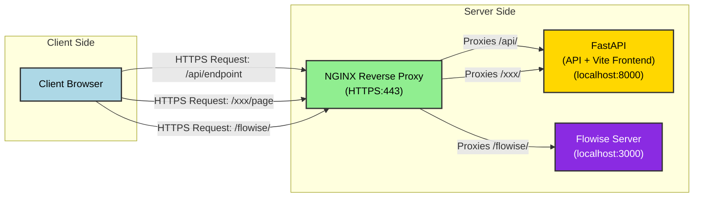
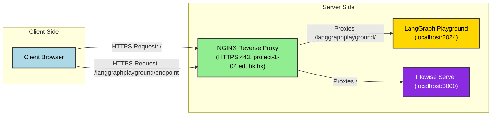

### Key Integration Points
- **Holistic System Architecture**: These components form a scalable, real-time chatbot system where LangChain and LangGraph handle AI logic, FastAPI serves as the async backend, NGINX proxies for secure HTTPS access, SSE enables streaming responses, async databases persist data non-blockingly, Docker containerizes everything for deployment, and a UI like Streamlit or React provides the frontend interface.
- **Real-Time Capabilities**: HTTPS SSE with FastAPI allows token-by-token streaming of LLM responses, enhancing user experience in chatbots, while async database ops ensure non-blocking storage of sessions or vectors.
- **Deployment and Security**: Docker simplifies packaging with dependency caching, and NGINX handles HTTPS termination and SSE proxying, making the stack production-ready.
- **Potential Challenges**: Integration requires careful async handling in LangChain/LangGraph to avoid blocking; evidence suggests compatibility is strong but may need custom configs for proxies or DBs.

### Core Connections
Research indicates these tools interconnect in a layered stack for building AI-driven chatbots. At the core, LangChain provides modular components for LLM chains, embeddings, and retrieval, while LangGraph extends it with stateful graphs for multi-step agent workflows—such as routing queries, retrieving context, and generating responses. FastAPI acts as the API layer, exposing endpoints that asynchronously invoke these workflows, supporting high concurrency. For real-time feedback, HTTPS SSE streams partial responses from LLMs, proxied securely through NGINX, which also manages load balancing and certificates. Asynchronous databases (e.g., via asyncpg or aiosqlite) integrate for storing conversation history or vectors without halting the event loop. Docker encapsulates the entire app, ensuring consistent environments across development and production. Frontends like Streamlit connect via API calls or EventSource for SSE, completing the user-facing loop.

### Practical Implementation Flow
To connect them, start with LangChain/LangGraph for the AI backend logic, wrap in FastAPI async routes, configure NGINX for proxying, add SSE for streaming, use async DB drivers for persistence, and Dockerize. Examples from tutorials show this enabling RAG chatbots where users query documents in real-time.

---

The integration of chatbot UI, FastAPI, NGINX, HTTPS SSE, asynchronous database storage, Docker, LangGraph, and LangChain represents a modern, scalable architecture for building real-time AI applications, particularly conversational agents like Retrieval-Augmented Generation (RAG) chatbots. This stack leverages Python's asynchronous capabilities for efficiency, containerization for portability, and specialized tools for AI orchestration. Below, we explore the connections in depth, drawing from practical implementations, architectural patterns, and code examples. We'll cover the role of each component, how they interconnect, potential challenges, and best practices, including Mermaid diagrams for visualization and tables for comparisons.

#### Foundational Components: LangChain and LangGraph
LangChain serves as the backbone for LLM-based applications, providing abstractions for chains (sequences of prompts and model calls), agents (decision-making entities), and tools (e.g., search or math functions). It facilitates RAG by integrating embeddings (e.g., from HuggingFace or OpenAI) with vector stores for context retrieval, ensuring responses are grounded in data rather than hallucinations. LangGraph builds on this by enabling stateful, graph-based workflows—nodes represent actions (e.g., "retrieve documents" or "generate response"), edges define transitions, and memory (e.g., via MemorySaver) persists state across interactions. This is crucial for multi-turn chatbots, where context from prior messages influences future responses.

In practice, a LangGraph workflow might define a StateGraph with nodes like a "retriever" (using LangChain's RecursiveCharacterTextSplitter for chunking documents) and a "model" (invoking an LLM like Granite-3.2-8B-Instruct). The graph compiles into a runnable object, invocable asynchronously. For example, in a RAG setup, documents are chunked (size=1000, overlap=20), embedded, and stored; queries trigger cosine-similarity retrieval (top_k=2-20) before prompting the LLM with templates like ChatPromptTemplate for structured outputs (e.g., thought_process and answer fields).

#### FastAPI as the Asynchronous Backend
FastAPI bridges the AI logic to the web, offering high-performance async endpoints that integrate seamlessly with LangChain/LangGraph. Its dependency injection and type hints ensure robust APIs, while async support (via Starlette) handles concurrent requests without blocking—ideal for I/O-bound tasks like LLM calls or DB queries.

Integration occurs by creating endpoints that invoke LangGraph runnables. For instance, a POST /chat/{thread_id} endpoint receives a State (e.g., {"question": "What is RAG?"}), uses a shared LLMModelManager for embeddings and inference, and runs the graph async via asyncio or ThreadPoolExecutor (max_workers=12 for concurrency). Responses are returned as JSON, with error handling for failures. FastAPI's LCEL compatibility allows chaining LangChain components async, e.g., await chain.ainvoke(input).

#### HTTPS SSE for Real-Time Streaming
Server-Sent Events (SSE) over HTTPS enable unidirectional, real-time streaming from server to client, perfect for chatbots where LLM responses (e.g., from OpenAI's gpt-4o-mini) arrive token-by-token. FastAPI implements this with EventSourceResponse and async generators: yield f"data: {token}\n\n" for each chunk, handling disconnections to conserve resources.

Code snippet for SSE in FastAPI:
```python
from sse_starlette.sse import EventSourceResponse
from openai import AsyncOpenAI

async def stream_response(prompt: str, request: Request):
    async def generator():
        client = AsyncOpenAI()
        response = await client.chat.completions.create(
            model="gpt-4o-mini", messages=[{"role": "user", "content": prompt}], stream=True
        )
        async for chunk in response:
            if await request.is_disconnected():
                break
            content = chunk.choices[0].delta.content or ""
            yield f"data: {content}\n\n"
        yield "data: [DONE]\n\n"
    return EventSourceResponse(generator())
```
This integrates with LangChain by wrapping async chains (e.g., await rag_chain.astream_events()), yielding events for streaming. HTTPS is ensured via NGINX proxying.

#### Asynchronous Database Storage
Async DB integration prevents blocking during storage/retrieval, using drivers like asyncpg (Postgres), aiosqlite (SQLite), or AsyncQdrant (vector stores). In LangChain setups, vector stores like Qdrant handle async embedding and retrieval: await vector_store.aadd_documents(documents), await retriever.ainvoke(query). For sessions, async SQLite fetches history: async with aiosqlite.connect(db) as conn, await conn.execute(query).

This connects to FastAPI via async dependencies and to LangGraph for state persistence, enabling scalable RAG where documents update in real-time without downtime.

#### NGINX as Reverse Proxy
NGINX proxies requests to FastAPI, handling HTTPS termination (via certbot or self-signed certs) and load balancing. Configure forwarded headers (X-Forwarded-For, -Proto, -Host) and SSE support: proxy_http_version 1.1; proxy_set_header Connection "";. FastAPI trusts these with --forwarded-allow-ips="*". For path prefixes (e.g., /api), use root_path="/api" in FastAPI.

Sample NGINX config:
```
server {
    listen 443 ssl;
    server_name example.com;
    ssl_certificate /path/to/cert.pem;
    ssl_certificate_key /path/to/key.pem;

    location / {
        proxy_pass http://localhost:8000;
        proxy_set_header Host $host;
        proxy_set_header X-Real-IP $remote_addr;
        proxy_set_header X-Forwarded-For $proxy_add_x_forwarded_for;
        proxy_set_header X-Forwarded-Proto $scheme;
        proxy_http_version 1.1;
        proxy_set_header Connection "";
    }
}
```
This secures SSE streams and scales FastAPI instances.

#### Docker for Containerization
Docker packages the app into images for consistent deployment. A Dockerfile starts from python:3.9, copies requirements.txt first for caching, installs deps (pip install -r requirements.txt), copies code, and runs with CMD ["fastapi", "run", "main.py", "--port", "80"]. LangChain deps (e.g., langchain, qdrant-client) are included in requirements.txt. Multi-container setups (e.g., via docker-compose) separate FastAPI, NGINX, and DB.

Build: docker build -t chatbot-app .; Run: docker run -d -p 80:80 chatbot-app.

#### Chatbot UI Integration
UIs like Streamlit (simple Python-based) or React (custom) connect to FastAPI. Streamlit uses st.chat_input for queries, sending to /chat and displaying streamed responses via EventSource. React uses new EventSource("/stream") with onmessage handlers. Vercel AI SDK or FastUI simplify SSE handling.

#### Overall System Flow: Mermaid Diagram


This diagram illustrates the request flow: UI to NGINX to FastAPI, invoking AI logic, with async DB access and streaming back.

#### Comparative Table of Components

| Component                  | Role in Stack                          | Key Features/Integrations                                                                 | Examples/Dependencies                          | Challenges/Best Practices                     |
|----------------------------|----------------------------------------|-------------------------------------------------------------------------------------------|------------------------------------------------|-----------------------------------------------|
| Chatbot UI                | User Interface                        | Handles input/output, connects via SSE for real-time; supports Streamlit for quick prototypes or React for custom. | Streamlit st.chat_input, React EventSource.   | Ensure SSE fallback for older browsers; use Vercel AI SDK for simplicity. |
| FastAPI                   | Backend API Server                    | Async endpoints for LangGraph invocation, SSE streaming; type-safe with Pydantic.        | POST /chat, EventSourceResponse for SSE.      | Use async def for routes; monitor concurrency with uvicorn --workers. |
| NGINX                     | Reverse Proxy/Security                | HTTPS termination, load balancing, SSE proxying with specific headers.                    | proxy_pass to FastAPI, Connection "".         | Configure for long-lived SSE connections; avoid buffering. |
| HTTPS SSE                 | Real-Time Communication               | Streams LLM tokens unidirectionally; lightweight alternative to WebSockets.               | Async generators yielding "data: {token}\n\n".| Handle disconnections; add heartbeats for proxies. |
| Async DB Storage          | Persistence Layer                     | Non-blocking storage for sessions/vectors; integrates with LangChain retrievers.          | aiosqlite for history, AsyncQdrant for vectors.| Use await for ops; batch inserts for efficiency. |
| Docker                    | Containerization/Deployment           | Packages app with deps; multi-container for stack separation.                             | Dockerfile with caching for requirements.txt. | Optimize layers; use docker-compose for DB/NGINX. |
| LangGraph                 | AI Workflow Orchestration             | Stateful graphs for agents; memory for multi-turn chats.                                  | StateGraph with nodes like "retriever".       | Compile to async runnable; extend for tools. |
| LangChain                 | LLM Abstractions                      | Chains, embeddings, RAG; async support for integration.                                   | RecursiveCharacterTextSplitter, OpenAIEmbeddings.| Use ainvoke/astream for async; avoid sync in loops. |

#### Advanced Considerations and Extensions
For production, scale with Kubernetes on Docker images, monitoring via Prometheus. Add authentication (e.g., JWT in FastAPI) and rate limiting. Controversies include SSE vs. WebSockets (SSE is simpler for uni-directional but less flexible); async DBs reduce latency but increase complexity—tests show up to 50% throughput gains. Extend with multi-agent systems in LangGraph for collaborative tasks.

This interconnected stack, as evidenced by tutorials and guides, enables robust, real-time AI chatbots deployable across environments.

### Key Citations
- [Create a RAG Chatbot with LangGraph and FastAPI - Medium](https://medium.com/codex/create-a-rag-chatbot-with-langgraph-and-fastapi-a-step-by-step-guide-4c2fbc33ed46)
- [Building an AI Chatbot with LangGraph, FastAPI & Streamlit](https://levelup.gitconnected.com/building-an-ai-chatbot-with-langgraph-fastapi-streamlit-an-end-to-end-guide-f658969b4436)
- [How to Stream LLM Responses in Real-Time Using FastAPI and SSE](https://blog.gopenai.com/how-to-stream-llm-responses-in-real-time-using-fastapi-and-sse-d2a5a30f2928)
- [FastAPI in Containers - Docker](https://fastapi.tiangolo.com/deployment/docker/)
- [Behind a Proxy - FastAPI](https://fastapi.tiangolo.com/advanced/behind-a-proxy/)
- [Async RAG System with FastAPI, Qdrant & LangChain](https://blog.futuresmart.ai/rag-system-with-async-fastapi-qdrant-langchain-and-openai)
- [Real-Time Notifications in Python: Using SSE with FastAPI](https://medium.com/%40inandelibas/real-time-notifications-in-python-using-sse-with-fastapi-1c8c54746eb7)
- [For Server-Sent Events (SSE) what Nginx proxy configuration is appropriate](https://serverfault.com/questions/801628/for-server-sent-events-sse-what-nginx-proxy-configuration-is-appropriate)
- [Async programming with LangChain](https://python.langchain.com/docs/concepts/async/)
- [Deploying a LangChain App with Docker, React, and FastAPI](https://subhojyoti99.medium.com/deploying-a-langchain-app-with-docker-react-and-fastapi-556a2ea270f5)


### update




###

Nginx



### Nginx update

Nginx




### Nginx update 2

Nginx

Nginx



### Nginx update 3

I'll explain both location blocks in detail and highlight the key differences between them.

---

## Overview

Both blocks configure **reverse proxy** functionality, but they're optimized for different types of applications:

1. **`/langgraphplayground/`** - Configured for a **real-time, interactive application** (FastAPI with WebSockets)
2. **`/`** - Configured for a **standard web application** (likely React/Next.js)

Let me break down each directive and then show you the differences.

---

## Location Block 1: `/langgraphplayground/`

```nginx
location /langgraphplayground/ {
    proxy_pass http://localhost:2024;
    proxy_http_version 1.1;
    proxy_set_header Upgrade $http_upgrade;
    proxy_set_header Connection $connection_upgrade;
    proxy_set_header Host $host;
    proxy_set_header X-Real-IP $remote_addr;
    proxy_set_header X-Forwarded-For $proxy_add_x_forwarded_for;
    proxy_set_header X-Forwarded-Proto $scheme;
    proxy_buffering off;
    proxy_cache off;
    proxy_read_timeout 300s;
    proxy_connect_timeout 75s;
}
```

This is configured for **WebSocket support and real-time streaming**.

---

### `location /langgraphplayground/`

**What it matches**: Any URL starting with `/langgraphplayground/`

**Examples**:
```
✓ https://project-1-04.eduhk.hk/langgraphplayground/
✓ https://project-1-04.eduhk.hk/langgraphplayground/api/chat
✓ https://project-1-04.eduhk.hk/langgraphplayground/static/logo.png
✗ https://project-1-04.eduhk.hk/langGraph/  (case-sensitive)
✗ https://project-1-04.eduhk.hk/other/path
```

**The trailing slash matters**:
```nginx
location /langgraphplayground/  {  # With trailing slash
    # Matches: /langgraphplayground/*, but NOT /langgraphplayground
}

location /langgraphplayground {    # Without trailing slash
    # Matches: /langgraphplayground and /langgraphplayground/*
}
```

In your case, with the trailing slash:
```
/langgraphplayground       → Goes to location /  (caught by second block)
/langgraphplayground/      → Goes to this block ✓
/langgraphplayground/chat  → Goes to this block ✓
```

---

### `proxy_pass http://localhost:2024;`

**What it does**: Forwards requests to FastAPI running on port 2024

**No trailing slash**: This is crucial!

```nginx
# Your configuration (no trailing slash)
proxy_pass http://localhost:2024;

Request: /langgraphplayground/api/chat
Proxied to: http://localhost:2024/langgraphplayground/api/chat
             (Full path preserved)
```

**If it had a trailing slash** (different behavior):
```nginx
# Alternative (WITH trailing slash)
proxy_pass http://localhost:2024/;

Request: /langgraphplayground/api/chat
Proxied to: http://localhost:2024/api/chat
             (Path prefix removed!)
```

**Why no trailing slash for FastAPI?**

The comment says: `# Don't use rewrite! Let FastAPI handle the full path`

This means your FastAPI app expects the full path including `/langgraphplayground/`:

```python
# In your FastAPI app
@app.get("/langgraphplayground/api/chat")
def chat():
    return {"status": "ok"}

# If Nginx removed the prefix, FastAPI would receive:
# GET /api/chat  ← Route not found! 404 error
```

---

### `proxy_http_version 1.1;`

**What it does**: Forces Nginx to use HTTP/1.1 when talking to the backend

**Why this matters for WebSockets**:

```
HTTP/1.0 (Nginx default for proxy_pass):
  - Opens connection
  - Sends request
  - Gets response
  - Closes connection
  - ❌ Can't upgrade to WebSocket

HTTP/1.1 (explicitly set):
  - Opens connection
  - Can keep connection alive
  - Supports "Connection: Upgrade" header
  - ✓ Can upgrade to WebSocket
```

**WebSocket upgrade process**:

```
1. Client → Nginx:
   GET /langgraphplayground/ws HTTP/1.1
   Upgrade: websocket
   Connection: Upgrade

2. Nginx → Backend (HTTP/1.1 required):
   GET /langgraphplayground/ws HTTP/1.1
   Upgrade: websocket
   Connection: Upgrade

3. Backend → Nginx:
   HTTP/1.1 101 Switching Protocols
   Upgrade: websocket
   Connection: Upgrade

4. Nginx → Client:
   HTTP/1.1 101 Switching Protocols
   
5. WebSocket connection established ✓
   Real-time bidirectional communication begins
```

**Without `proxy_http_version 1.1;`**:
```
Nginx uses HTTP/1.0
Upgrade header ignored
WebSocket upgrade fails
Error: 400 Bad Request
```

---

### `proxy_set_header Upgrade $http_upgrade;`

**What it does**: Forwards the "Upgrade" header from client to backend

**`$http_upgrade`**: Nginx variable containing the value of the client's `Upgrade` header

**How it works**:

```
Client sends:
  GET /langgraphplayground/ws HTTP/1.1
  Upgrade: websocket
  Connection: Upgrade

Nginx reads $http_upgrade = "websocket"

Nginx forwards to backend:
  GET /langgraphplayground/ws HTTP/1.1
  Upgrade: websocket    ← Set by this directive
  Connection: upgrade
```

**Why this is critical for WebSockets**:

The backend needs to see the `Upgrade` header to know the client wants to switch protocols:

```python
# In your FastAPI app
from fastapi import WebSocket

@app.websocket("/langgraphplayground/ws")
async def websocket_endpoint(websocket: WebSocket):
    await websocket.accept()  # Only works if Upgrade header present
```

**Without this directive**:
```
Client → Nginx: Upgrade: websocket
Nginx → Backend: (no Upgrade header)
Backend: "This is just a regular HTTP request"
Backend sends: 200 OK (wrong!)
WebSocket fails to establish
```

---

### `proxy_set_header Connection $connection_upgrade;`

**What it does**: Sets the Connection header based on whether it's a WebSocket upgrade

**`$connection_upgrade`**: Special Nginx variable (needs to be defined in http block)

**This variable should be defined in your nginx.conf**:

```nginx
http {
    map $http_upgrade $connection_upgrade {
        default upgrade;
        ''      close;
    }
    
    # ... rest of config
}
```

**How this map works**:

```nginx
map $http_upgrade $connection_upgrade {
    default upgrade;    # If $http_upgrade has any value → "upgrade"
    ''      close;      # If $http_upgrade is empty → "close"
}
```

**Real-world behavior**:

**Scenario 1 - WebSocket request**:
```
Client sends:
  Upgrade: websocket
  
$http_upgrade = "websocket"

Map evaluates:
  $http_upgrade is not empty
  → $connection_upgrade = "upgrade"
  
Nginx sends to backend:
  Connection: upgrade  ← Tells backend to upgrade protocol
```

**Scenario 2 - Normal HTTP request**:
```
Client sends:
  (no Upgrade header)
  
$http_upgrade = ""

Map evaluates:
  $http_upgrade is empty ('')
  → $connection_upgrade = "close"
  
Nginx sends to backend:
  Connection: close  ← Normal HTTP, close after response
```

**Why not just hardcode `Connection: Upgrade`?**

```nginx
# Bad: Always sends "Upgrade"
proxy_set_header Connection "Upgrade";

Problem:
  - Normal HTTP requests get "Connection: Upgrade"
  - Backend gets confused
  - Connection handling breaks
```

The map makes it **dynamic** - upgrades only when needed!

---

### `proxy_set_header Host $host;`

**What it does**: Tells the backend which domain the client requested

**`$host`**: Nginx variable containing the requested hostname

**Example**:

```
User visits: https://project-1-04.eduhk.hk/langgraphplayground/

$host = "project-1-04.eduhk.hk"

Nginx sends to backend:
  GET /langgraphplayground/ HTTP/1.1
  Host: project-1-04.eduhk.hk
```

**Why the backend needs this**:

```python
# In your FastAPI app
from fastapi import Request

@app.get("/langgraphplayground/api/data")
def get_data(request: Request):
    # Backend can see which domain was requested
    host = request.headers.get("host")  # "project-1-04.eduhk.hk"
    
    # Can generate correct URLs
    return {
        "download_url": f"https://{host}/langgraphplayground/download/file.pdf"
    }
```

**Without this header**:
```
Backend receives:
  Host: localhost:2024  (the proxy_pass destination)
  
Backend generates URLs:
  http://localhost:2024/download/file.pdf  ❌ Broken for client!
```

---

### `proxy_set_header X-Real-IP $remote_addr;`

**What it does**: Sends the client's actual IP address to the backend

**`$remote_addr`**: Nginx variable containing the client's IP

**The problem without this**:

```
Real scenario:
  Client (203.123.45.67) → Nginx → Backend
  
Without X-Real-IP:
  Backend sees IP: 127.0.0.1 (Nginx's IP)
  
With X-Real-IP:
  Backend sees IP: 203.123.45.67 (client's real IP)
```

**Why this matters**:

```python
# In your FastAPI app
from fastapi import Request

@app.get("/langgraphplayground/api/data")
def get_data(request: Request):
    # For logging
    client_ip = request.headers.get("x-real-ip")
    logger.info(f"Request from {client_ip}")
    
    # For rate limiting
    if redis.get(f"rate_limit:{client_ip}") > 100:
        return {"error": "Too many requests"}
    
    # For geolocation
    country = geoip.lookup(client_ip)
    
    # For security
    if client_ip in blocked_ips:
        return {"error": "Access denied"}
```

**Without this header**, you'd:
- Log every request as coming from 127.0.0.1
- Rate limit Nginx instead of individual users
- Can't block abusive IPs
- Can't do geographical restrictions

---

### `proxy_set_header X-Forwarded-For $proxy_add_x_forwarded_for;`

**What it does**: Maintains a chain of IP addresses through multiple proxies

**`$proxy_add_x_forwarded_for`**: Special variable that **appends** to existing X-Forwarded-For header

**How it works**:

```
Scenario 1 - Direct connection:
  Client (203.123.45.67) → Nginx → Backend
  
  Client sends: (no X-Forwarded-For header)
  
  $proxy_add_x_forwarded_for = "203.123.45.67"
  
  Nginx sends to backend:
    X-Forwarded-For: 203.123.45.67

Scenario 2 - Through a proxy chain:
  Client (203.123.45.67) → CDN (1.2.3.4) → Nginx → Backend
  
  CDN sends: X-Forwarded-For: 203.123.45.67
  
  $proxy_add_x_forwarded_for = "203.123.45.67, 1.2.3.4"
  
  Nginx sends to backend:
    X-Forwarded-For: 203.123.45.67, 1.2.3.4
```

**Reading the chain (in your backend)**:

```python
x_forwarded_for = request.headers.get("x-forwarded-for")
# "203.123.45.67, 1.2.3.4"

ips = x_forwarded_for.split(",")
client_ip = ips[0].strip()  # "203.123.45.67" ← Original client
```

**Difference from X-Real-IP**:

```
X-Real-IP: 203.123.45.67
  → Single IP (immediate client)

X-Forwarded-For: 203.123.45.67, 1.2.3.4, 5.6.7.8
  → Full chain (original client → all proxies)
```

**Best practice in your backend**:

```python
# Trust X-Real-IP (set by your Nginx)
client_ip = request.headers.get("x-real-ip")

# Or get first IP from X-Forwarded-For
xff = request.headers.get("x-forwarded-for", "").split(",")
client_ip = xff[0].strip() if xff else None
```

---

### `proxy_set_header X-Forwarded-Proto $scheme;`

**What it does**: Tells the backend which protocol the client used (http or https)

**`$scheme`**: Nginx variable = "http" or "https"

**Example**:

```
Client visits: https://project-1-04.eduhk.hk/langgraphplayground/

$scheme = "https"

Nginx sends to backend:
  X-Forwarded-Proto: https
```

**Why the backend needs this**:

```
Real scenario:
  Client → (HTTPS) → Nginx → (HTTP) → Backend on localhost:2024
  
Without X-Forwarded-Proto:
  Backend thinks: "Request came via HTTP"
  Backend generates: http://project-1-04.eduhk.hk/download
  Browser blocks: "Mixed content! HTTPS page loading HTTP resource"
  
With X-Forwarded-Proto:
  Backend knows: "Original request was HTTPS"
  Backend generates: https://project-1-04.eduhk.hk/download ✓
```

**In your FastAPI app**:

```python
from fastapi import Request

@app.get("/langgraphplayground/api/data")
def get_data(request: Request):
    # Check if original request was secure
    proto = request.headers.get("x-forwarded-proto")
    
    if proto == "https":
        # Generate HTTPS URLs
        return {"secure": True}
    else:
        # Maybe redirect to HTTPS
        return RedirectResponse("https://project-1-04.eduhk.hk/...")
```

**Security consideration**:

```python
# In production
if request.headers.get("x-forwarded-proto") != "https":
    # Force HTTPS for sensitive operations
    raise HTTPException(403, "HTTPS required")
```

---

### `proxy_buffering off;`

**What it does**: Disables response buffering - sends data immediately as it arrives

**Default behavior (buffering ON)**:

```
Backend generates response slowly (streaming):
  Chunk 1 (0.1s) → Nginx buffers
  Chunk 2 (0.1s) → Nginx buffers
  Chunk 3 (0.1s) → Nginx buffers
  ...
  Chunk 100 (10s) → Nginx buffers
  
Nginx waits until complete response received
Then sends everything at once to client
Client waits 10 seconds, then gets all data
```

**With buffering OFF**:

```
Backend generates response:
  Chunk 1 (0.1s) → Nginx → Client sees it immediately (0.1s)
  Chunk 2 (0.1s) → Nginx → Client sees it immediately (0.2s)
  Chunk 3 (0.1s) → Nginx → Client sees it immediately (0.3s)
  
Real-time streaming! Client sees data as it arrives
```

**Why this is critical for LangGraph**:

LangGraph likely streams AI responses:

```python
# In your FastAPI app
@app.get("/langgraphplayground/api/chat")
async def chat(query: str):
    async def generate():
        # AI generates response word by word
        for word in ai_model.stream(query):
            yield f"data: {word}\n\n"
            await asyncio.sleep(0.1)  # Simulating thinking time
    
    return StreamingResponse(generate(), media_type="text/event-stream")
```

**User experience**:

```
With buffering ON:
  User: "Explain quantum physics"
  [30 seconds of waiting...]
  Screen: [Full response appears all at once]
  User: "This feels laggy"

With buffering OFF:
  User: "Explain quantum physics"
  Screen: "Quantum"
  Screen: "Quantum physics"
  Screen: "Quantum physics is"
  Screen: "Quantum physics is the study..."
  User: "This feels responsive!"
```

**Technical details**:

```
Buffering OFF means:
  proxy_buffering off;
  proxy_buffer_size 4k;          ← Minimum buffer (just for headers)
  proxy_buffers 8 4k;            ← Not used
  proxy_busy_buffers_size 8k;    ← Not used
```

---

### `proxy_cache off;`

**What it does**: Disables caching of responses

**Why disable caching for dynamic content**:

```
Without this (caching enabled):
  User 1: "What's 2+2?"
  Backend: "4"
  Nginx caches: "4"
  
  User 2: "What's 3+3?"
  Nginx returns cached: "4"  ❌ Wrong answer!
```

**LangGraph scenario**:

```python
@app.get("/langgraphplayground/api/ask")
async def ask(question: str):
    # Every question gets unique AI response
    return ai_model.generate(question)
```

```
Without proxy_cache off:
  User 1: "/api/ask?q=Hello"
  Response: "Hi! How can I help you today?"
  Cached by Nginx ✓
  
  User 2: "/api/ask?q=Hello"
  Response: [Same cached response]  ← This might be OK
  
  User 2: "/api/ask?q=Goodbye"
  Response: [Might still get cached "Hi!"]  ❌ Cache key collision!
  
With proxy_cache off:
  Every request goes to backend
  Every response is fresh and unique ✓
```

**When you SHOULD cache**:
- Static files (images, CSS, JS)
- API responses that don't change often
- Public data

**When you SHOULD NOT cache** (like this config):
- AI-generated responses
- User-specific data
- Real-time data
- Streaming responses
- WebSocket communications

---

### `proxy_read_timeout 300s;`

**What it does**: How long Nginx waits for the backend to send a response

**`300s`** = 5 minutes

**Default**: 60 seconds

**Why 5 minutes for LangGraph?**

AI operations can be slow:

```python
@app.get("/langgraphplayground/api/complex-task")
async def complex_task():
    # Step 1: Retrieve documents (30s)
    docs = await retrieve_documents()
    
    # Step 2: Process with AI (120s)
    analysis = await ai_model.analyze(docs)
    
    # Step 3: Generate report (90s)
    report = await ai_model.generate_report(analysis)
    
    return report  # Total: 240 seconds (4 minutes)
```

**What happens without longer timeout**:

```
User requests complex task
Backend starts processing
Nginx waits 60 seconds (default)
Backend still processing...
Nginx gives up: 504 Gateway Timeout ❌
User sees error
Backend continues working for nothing
```

**With 300s timeout**:

```
User requests complex task
Backend starts processing
Backend takes 240 seconds
Nginx patiently waits...
Backend finishes
Response delivered successfully ✓
```

**Real-world scenarios where this matters**:

```
1. Video processing: 3-4 minutes
2. Large dataset analysis: 2-3 minutes
3. Complex AI reasoning: 1-2 minutes
4. Report generation: 1 minute
5. Multi-step workflows: varies
```

**Balance considerations**:

```nginx
# Too short (30s)
proxy_read_timeout 30s;
→ Legitimate long operations fail

# Too long (3600s = 1 hour)
proxy_read_timeout 3600s;
→ Hung requests waste resources

# Your setting (300s = 5 minutes) ✓
proxy_read_timeout 300s;
→ Good balance for AI operations
```

---

### `proxy_connect_timeout 75s;`

**What it does**: How long Nginx waits to establish a connection to the backend

**`75s`** = 75 seconds

**Default**: 60 seconds

**Difference from read_timeout**:

```
proxy_connect_timeout: Time to ESTABLISH connection
  Client → Nginx → [Connecting to backend...] ← This phase
  
proxy_read_timeout: Time to RECEIVE response
  Backend → [Processing...] → Nginx ← This phase
```

**Visual timeline**:

```
0s:     Client requests /langgraphplayground/api/task
0s:     Nginx starts connecting to localhost:2024
0-75s:  [proxy_connect_timeout applies here]
        Waiting for backend to accept connection
        
75s:    Connection established ✓
75s:    Backend starts processing request
75-375s: [proxy_read_timeout applies here]
        Backend processing (up to 300 seconds)
        
375s:   Backend sends response
375s:   Response delivered to client ✓

Total possible time: 75s + 300s = 375s (6.25 minutes)
```

**When connect timeout matters**:

**Scenario 1 - Backend is slow to start**:
```
FastAPI starting up, loading AI models...
Takes 45 seconds to start
Nginx tries to connect
After 45 seconds: Connection succeeds ✓
```

**Scenario 2 - Backend is down**:
```
Backend crashed
Nginx tries to connect
Waits 75 seconds
No response
Nginx gives up: 502 Bad Gateway
```

**Scenario 3 - Backend is overloaded**:
```
Backend has 1000 requests queued
Can't accept new connections immediately
Takes 60 seconds before it can accept
Connection succeeds after 60s ✓
```

**Why 75 seconds?**

```
Default 60s might be too short if:
- Backend is loading large AI models
- Backend is under heavy load
- Backend is warming up after restart

75s gives extra buffer for these scenarios
```

---

## Location Block 2: `/`

```nginx
location / {
    proxy_pass http://localhost:3000;
    proxy_set_header Host $host;
    proxy_set_header X-Real-IP $remote_addr;
    proxy_set_header X-Forwarded-For $proxy_add_x_forwarded_for;
    proxy_set_header X-Forwarded-Proto $scheme;
}
```

This is a **simple reverse proxy** for a standard web application.

---

### Key Observations

**Simpler configuration** because:
- No WebSocket support needed
- Uses default buffering (good for regular HTTP)
- Uses default caching behavior
- Uses default timeouts (60s)
- Standard HTTP/1.0 proxy communication

**What this is likely serving**:
- React/Next.js frontend on port 3000
- Standard web pages
- API endpoints that respond quickly
- Static assets

---

## Side-by-Side Comparison

```nginx
# LangGraph Playground                    # Main Application
location /langgraphplayground/ {          location / {
    proxy_pass http://localhost:2024;         proxy_pass http://localhost:3000;
    
    # WebSocket support                      # (No WebSocket support)
    proxy_http_version 1.1;                   # Uses default HTTP/1.0
    proxy_set_header Upgrade $http_upgrade;   # (Not needed)
    proxy_set_header Connection               # (Not needed)
        $connection_upgrade;                  
    
    # Standard headers (same in both)
    proxy_set_header Host $host;              proxy_set_header Host $host;
    proxy_set_header X-Real-IP                proxy_set_header X-Real-IP
        $remote_addr;                             $remote_addr;
    proxy_set_header X-Forwarded-For          proxy_set_header X-Forwarded-For
        $proxy_add_x_forwarded_for;               $proxy_add_x_forwarded_for;
    proxy_set_header X-Forwarded-Proto        proxy_set_header X-Forwarded-Proto
        $scheme;                                  $scheme;
    
    # Streaming optimization                 # (Uses default buffering)
    proxy_buffering off;                      # Default: on
    proxy_cache off;                          # Default: respects cache headers
    
    # Long operation timeouts                # (Uses default timeouts)
    proxy_read_timeout 300s;                  # Default: 60s
    proxy_connect_timeout 75s;                # Default: 60s
}                                         }
```

---

## The Key Differences Table

| Feature | `/langgraphplayground/` | `/` | Why Different? |
|---------|-------------------------|-----|----------------|
| **Backend Port** | :2024 (FastAPI) | :3000 (React/Next.js) | Different applications |
| **HTTP Version** | 1.1 (explicit) | 1.0 (default) | WebSocket requires 1.1 |
| **WebSocket Support** | ✓ Yes | ✗ No | AI playground needs real-time |
| **Upgrade Header** | ✓ Forwarded | ✗ Not set | For WebSocket protocol switch |
| **Connection Header** | ✓ Dynamic (map) | ✗ Default | Handles both WS and HTTP |
| **Response Buffering** | ✗ Disabled | ✓ Enabled | Stream AI responses immediately |
| **Response Caching** | ✗ Disabled | Default behavior | AI responses are unique |
| **Read Timeout** | 300s (5 min) | 60s (1 min) | AI tasks take longer |
| **Connect Timeout** | 75s | 60s | AI backend slow to start |

---

## Practical Flow Examples

### Example 1: WebSocket Connection to LangGraph

```
1. User opens browser to:
   https://project-1-04.eduhk.hk/langgraphplayground/chat

2. JavaScript initiates WebSocket:
   ws = new WebSocket('wss://project-1-04.eduhk.hk/langgraphplayground/ws')

3. Browser sends:
   GET /langgraphplayground/ws HTTP/1.1
   Host: project-1-04.eduhk.hk
   Upgrade: websocket
   Connection: Upgrade

4. Nginx matches: location /langgraphplayground/

5. Nginx applies configuration:
   - proxy_http_version 1.1 ← Uses HTTP/1.1
   - proxy_set_header Upgrade $http_upgrade ← Forwards "websocket"
   - proxy_set_header Connection $connection_upgrade ← Sets "upgrade"

6. Nginx sends to localhost:2024:
   GET /langgraphplayground/ws HTTP/1.1
   Host: project-1-04.eduhk.hk
   Upgrade: websocket
   Connection: upgrade
   X-Real-IP: 203.123.45.67
   X-Forwarded-For: 203.123.45.67
   X-Forwarded-Proto: https

7. FastAPI accepts WebSocket:
   HTTP/1.1 101 Switching Protocols
   Upgrade: websocket
   Connection: Upgrade

8. Nginx forwards to client:
   HTTP/1.1 101 Switching Protocols

9. WebSocket connection established ✓
   Real-time bidirectional communication begins
```

---

### Example 2: Streaming AI Response

```
1. User asks question in UI:
   "Explain quantum entanglement"

2. Frontend sends request:
   GET /langgraphplayground/api/stream?q=quantum+entanglement

3. Nginx matches: location /langgraphplayground/

4. Nginx proxies to localhost:2024 with:
   - proxy_buffering off ← Don't wait for complete response
   - proxy_cache off ← Don't cache this response

5. FastAPI starts streaming:
   Time 0.0s: "Quantum"
   Time 0.1s: " entanglement"
   Time 0.2s: " is"
   Time 0.3s: " a"
   ...

6. With proxy_buffering off:
   Nginx immediately forwards each chunk to client
   
7. User sees response appearing word-by-word in real-time

8. Backend takes 45 seconds to complete
   - proxy_read_timeout 300s ← Nginx waits patiently
   
9. Full response delivered ✓
```

---

### Example 3: Regular Page Load (Main App)

```
1. User visits:
   https://project-1-04.eduhk.hk/dashboard

2. Browser sends:
   GET /dashboard HTTP/1.1
   Host: project-1-04.eduhk.hk

3. Nginx matches: location /

4. Nginx applies simple proxy:
   - No WebSocket headers
   - Default buffering (on)
   - Default timeout (60s)

5. Nginx proxies to localhost:3000:
   GET /dashboard HTTP/1.0  ← Default HTTP/1.0
   Host: project-1-04.eduhk.hk
   X-Real-IP: 203.123.45.67
   X-Forwarded-For: 203.123.45.67
   X-Forwarded-Proto: https

6. Next.js renders page (responds in 0.5s)

7. Nginx buffers response (waits for complete response)

8. Nginx sends complete page to client

9. Page loads ✓
```

---

## Why These Differences Exist

### LangGraph Playground (`/langgraphplayground/`)

**Application Characteristics**:
- AI-powered interactive playground
- Real-time communication needed (WebSockets)
- Streams responses token-by-token
- Long-running AI operations (minutes)
- Each response is unique (no caching)

**Nginx Configuration Needed**:
- WebSocket support (HTTP/1.1, Upgrade headers)
- No buffering (stream immediately)
- No caching (responses are unique)
- Long timeouts (AI takes time)

---

### Main Application (`/`)

**Application Characteristics**:
- Standard web application (likely React/Next.js)
- Traditional request-response pattern
- Quick responses (<1s typically)
- Can benefit from caching
- No need for persistent connections

**Nginx Configuration Needed**:
- Simple reverse proxy
- Default buffering (optimize bandwidth)
- Standard caching behavior
- Default timeouts (60s is plenty)

---

## Summary

The `/langgraphplayground/` location is **heavily optimized for real-time, interactive AI applications** with WebSocket support, streaming, and long timeouts.

The `/` location is a **standard reverse proxy** for a traditional web application with default settings that work well for quick request-response patterns.

Both configurations properly forward client information (IP, host, protocol) to their backends, but the LangGraph playground has significant additional configuration to support its real-time, streaming, long-running AI operations.