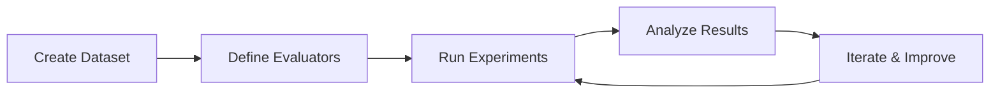
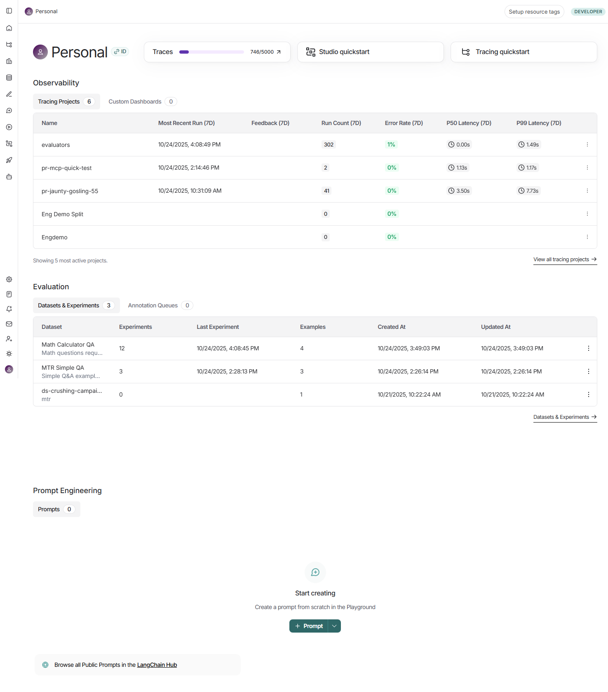
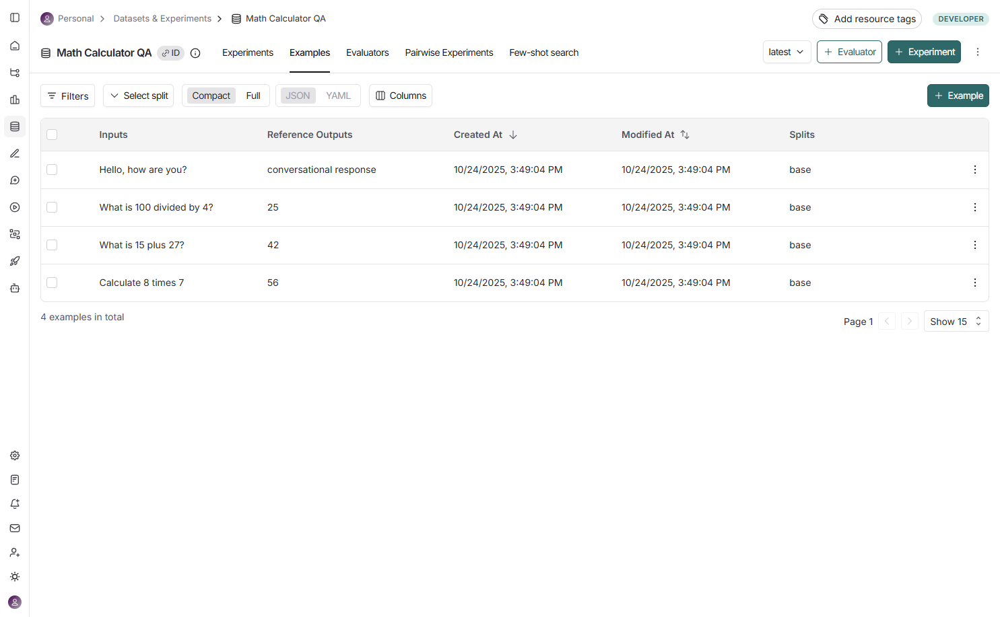
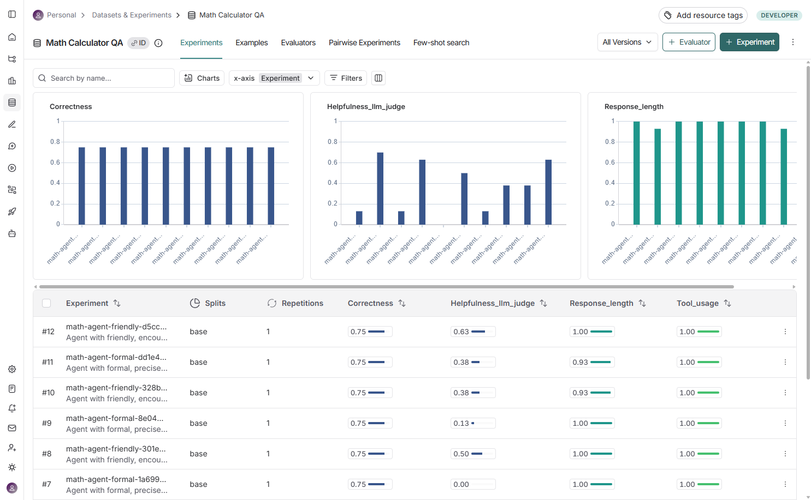
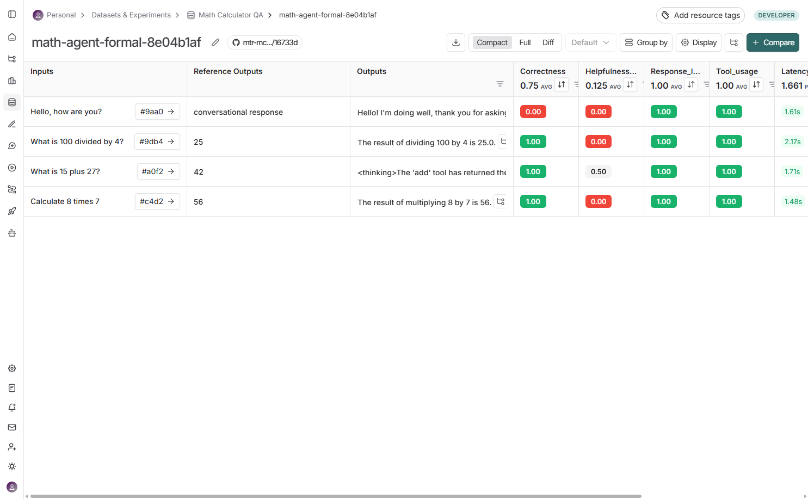
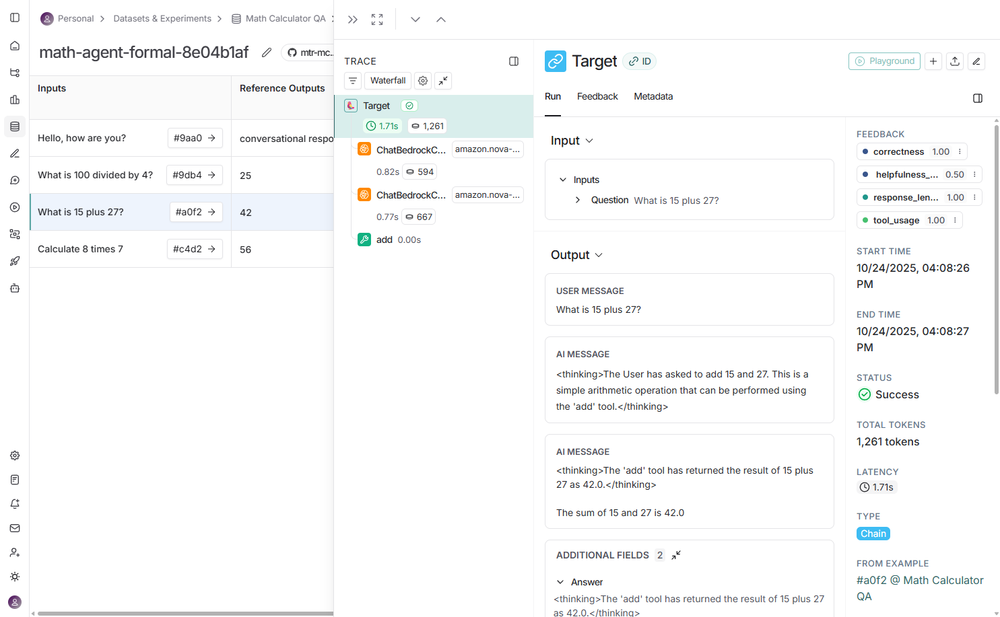
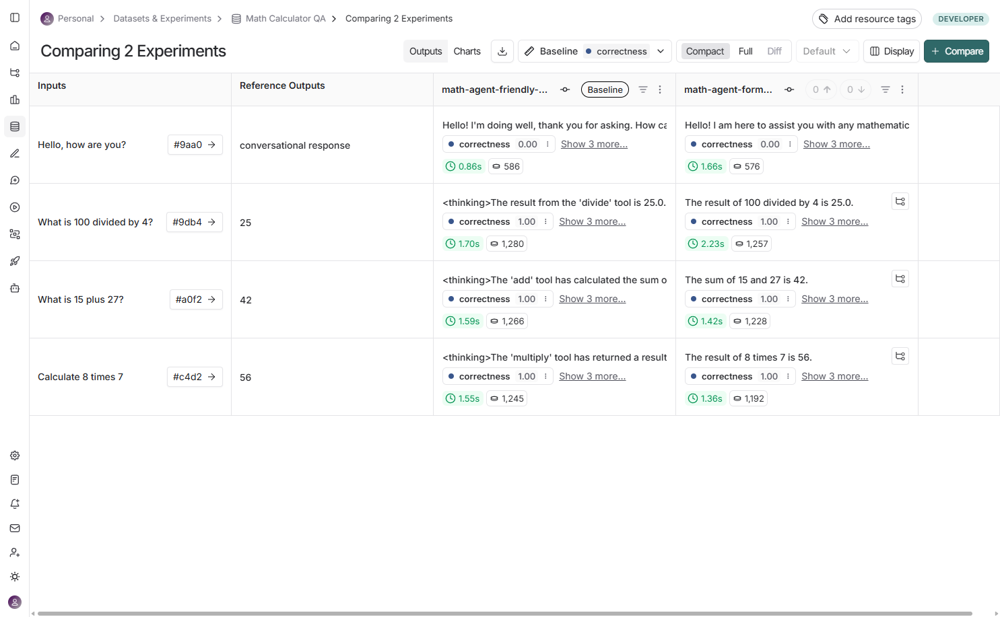

# Comprehensive LangSmith Evaluation Guide

A complete guide to LangSmith evaluation concepts with practical examples from our Math Calculator QA system.

**Project Configuration:**
- **LangSmith Project**: `pr-evaluation-test`
- **Model**: `amazon.nova-lite-v1:0` (AWS Bedrock)
- **Region**: `us-east-1`

---

## Table of Contents

1. [Introduction to LangSmith Evaluation](#1-introduction)
2. [Datasets: Test Data Management](#2-datasets)
3. [Tools & Agent Architecture](#3-tools--agent-architecture)
4. [Evaluators: Measuring Performance](#4-evaluators)
5. [Experiments: Running Evaluations](#5-experiments)
6. [A/B Testing: Comparing Variants](#6-ab-testing)
7. [Trajectory Evaluation: Agent Behavior](#7-trajectory-evaluation)
8. [Comparative Analysis](#8-comparative-analysis)
9. [Metadata & Reproducibility](#9-metadata--reproducibility)
10. [Best Practices & Patterns](#10-best-practices--patterns)

---

## 1. Introduction

LangSmith is a platform for **evaluating, monitoring, and improving** LLM applications. This guide demonstrates all key concepts using a practical **Math Calculator QA** system that uses AI agents with tool-calling capabilities.

### 🎯 How to Use This Guide

This guide is structured to **follow the exact execution order** of `langsmith_eval_advanced.py`. Each section corresponds to a specific part of the code:

1. **Read the section** to understand the concept
2. **Run the corresponding code** in `langsmith_eval_advanced.py`
3. **Follow the UI navigation steps** to see results in LangSmith
4. **View the screenshots** to confirm you're in the right place

**Code Execution Order:**
```
Run langsmith_eval_advanced.py
    ↓
STEP 1: Define Tools (lines 48-72)
STEP 2: Create Dataset (lines 78-143)
STEP 3: Define Agent Variants (lines 149-235)
STEP 4: Define Evaluators (lines 241-388)
STEP 5: Run Experiment A (lines 394-410)
    → Go to LangSmith UI (Section 5.5)
STEP 6: Run Experiment B (lines 416-432)
    → Go to LangSmith UI (Section 6.3)
STEP 7: Compare Results (lines 438-455)
    → Go to LangSmith UI (Section 8)
```

### Why Evaluation Matters

- ✅ **Systematic Testing**: Consistent, repeatable testing across datasets
- ✅ **Measure Improvements**: Track performance changes over time
- ✅ **Compare Approaches**: A/B test different prompts, models, or configurations
- ✅ **Catch Regressions**: Detect when changes break existing functionality
- ✅ **Build Confidence**: Ship with evidence of quality

### Core Evaluation Loop



### LangSmith Project Overview



*Figure 1: LangSmith workspace showing the Math Calculator QA dataset alongside other tracing projects. The dataset contains 12 experiments for comprehensive A/B testing.*

---

## Complete Walkthrough: Code to UI

This section provides a **complete step-by-step walkthrough** showing exactly when to run code and when to check the LangSmith UI.

### 🚀 Prerequisite Setup

1. **Install dependencies**:
   ```bash
   pip install -r requirements.txt
   ```

2. **Configure environment** (`.env` file):
   ```bash
   LANGCHAIN_API_KEY=your_key_here
   LANGCHAIN_PROJECT=pr-evaluation-test
   LANGCHAIN_TRACING_V2=true
   BEDROCK_MODEL=amazon.nova-lite-v1:0
   AWS_REGION=us-east-1
   AWS_ACCESS_KEY_ID=your_key
   AWS_SECRET_ACCESS_KEY=your_secret
   ```

3. **Verify LangSmith access**:
   - Visit: https://smith.langchain.com/
   - Create an account if needed
   - Create API key at: Settings → API Keys

---

### 📋 Step-by-Step Execution Guide

#### Phase 1: Initial Setup (Lines 1-143)

**What the code does:**
- Loads environment variables
- Initializes LangSmith client
- Sets up LLMs (judge and agent)
- Defines 3 calculator tools: add, multiply, divide
- Creates dataset "Math Calculator QA" with 4 examples

**Action:**
```bash
# Run the script
python langsmith_eval_advanced.py
```

**Expected output:**
```
🚀 Advanced LangSmith Evaluation - All Concepts Demo
✓ LANGCHAIN_PROJECT: pr-evaluation-test
✓ AWS_REGION: us-east-1
✓ Model: amazon.nova-lite-v1:0

📐 STEP 1: Defining Calculator Tools
✓ Created 3 tools: add, multiply, divide

📊 STEP 2: Creating Math Q&A Dataset
✓ Created dataset with 4 examples
```

**🌐 Check UI Now:**
1. Go to https://smith.langchain.com/
2. Click "Datasets & Experiments" in left sidebar
3. You should see **"Math Calculator QA"** dataset
4. Click on it → "Examples" tab
5. Verify 4 examples are listed:
   - "What is 15 plus 27?"
   - "Calculate 8 times 7"
   - "What is 100 divided by 4?"
   - "Hello, how are you?"

---

#### Phase 2: Define Agent Variants (Lines 149-235)

**What the code does:**
- Creates two system prompts:
  - Variant A: Formal ("precise mathematical assistant")
  - Variant B: Friendly ("friendly math tutor")
- Creates agent factory function
- Instantiates both agents

**Expected output:**
```
🤖 STEP 3: Defining Agent Variants for A/B Testing
✓ System Prompt A (Formal): 176 chars
✓ System Prompt B (Friendly): 211 chars
✓ Created Agent A (Formal)
✓ Created Agent B (Friendly)
```

**🌐 No UI check needed** - agents are code objects, not stored in LangSmith yet

---

#### Phase 3: Define Evaluators (Lines 241-388)

**What the code does:**
- Creates 4 evaluator functions:
  1. **Correctness**: String match for expected answer
  2. **Tool Usage**: Validates correct tool was used
  3. **LLM-as-Judge**: Evaluates helpfulness (makes LLM calls)
  4. **Response Length**: Checks conciseness

**Expected output:**
```
📏 STEP 4: Defining Evaluators
✓ Correctness Evaluator (string match)
✓ Tool Usage Evaluator (trajectory)
✓ LLM-as-Judge Evaluator (helpfulness)
✓ Response Length Evaluator
```

**🌐 Check UI (Optional):**
1. Go to "Math Calculator QA" → "Evaluators" tab
2. You'll see built-in evaluators (if any)
3. Custom evaluators will appear after first experiment run

---

#### Phase 4: Run Experiment A - Formal (Lines 394-410)

**What the code does:**
- Runs `evaluate()` with agent_a (formal prompt)
- Processes 4 examples from dataset
- For each example:
  - Calls agent with question
  - Captures trajectory (full execution trace)
  - Runs 4 evaluators
  - Records scores, latency, metadata
- Uploads all data to LangSmith

**Expected output:**
```
🧪 STEP 5: Running Experiment A (Formal System Prompt)

View the evaluation results for experiment: 'math-agent-formal-8e04b1af' at:
https://smith.langchain.com/o/.../datasets/.../compare?selectedSessions=...

✅ Experiment A Complete: math-agent-formal-8e04b1af
```

**⏱️ Duration**: ~15-30 seconds (4 examples × 4 evaluators, LLM-as-judge is slow)

**🌐 Check UI Now (IMPORTANT):**

1. **Navigate to Experiments**
   - Go to "Math Calculator QA" → "Experiments" tab
   - Find experiment: `math-agent-formal-8e04b1af`

2. **View Aggregate Charts** (top of page)
   - Correctness: ~0.75 (3/4 correct)
   - Helpfulness: ~0.15 (low scores for formal tone)
   - Response_length: ~0.93-1.00 (concise)
   - Tool_usage: 1.00 (perfect)

3. **Click on Experiment Name**
   - Opens detailed view with 4 examples
   - Each row shows:
     - Input question
     - Output answer
     - 4 evaluator scores (color-coded)
     - Latency (1.4-2.2s)

4. **Click on "What is 15 plus 27?" Row**
   - Sidebar opens with full trace
   - **Left**: Waterfall showing LLM calls and tool execution
   - **Right**: Full conversation with tool call details
   - Verify:
     - Tool call: `add(a=15, b=27) → 42`
     - Correctness: 1.00 ✅
     - Tool_usage: 1.00 ✅
     - Helpfulness: ~0.13 ⚠️ (formal = less helpful)

5. **Check "Hello, how are you?" Row**
   - Should have **0 tool calls** (conversational)
   - Correctness: 0.00 (no numerical answer expected)
   - Tool_usage: 1.00 (correctly didn't use tools)

---

#### Phase 5: Run Experiment B - Friendly (Lines 416-432)

**What the code does:**
- Runs `evaluate()` with agent_b (friendly prompt)
- Same 4 examples, same 4 evaluators
- Different agent behavior (more verbose, encouraging)

**Expected output:**
```
🧪 STEP 6: Running Experiment B (Friendly System Prompt)

View the evaluation results for experiment: 'math-agent-friendly-d5cccebf' at:
https://smith.langchain.com/o/.../datasets/.../compare?selectedSessions=...

✅ Experiment B Complete: math-agent-friendly-d5cccebf
```

**🌐 Check UI Now:**

1. **Return to Experiments Tab**
   - You should now see **2 experiments**:
     - `math-agent-formal-8e04b1af` (A)
     - `math-agent-friendly-d5cccebf` (B)

2. **Compare Charts**
   - Helpfulness: Friendly should be higher (~0.50 vs ~0.15)
   - Response_length: Formal should be higher (more concise)
   - Correctness: Both should be 0.75
   - Tool_usage: Both should be 1.00

3. **Click on Friendly Experiment**
   - Open "What is 15 plus 27?" example
   - Compare response:
     - Friendly: "The sum of 15 and 27 is 42. Great job on adding!"
     - Formal: "The sum of 15 and 27 is 42."
   - Notice:
     - Same tool call: `add(a=15, b=27) → 42`
     - Same correctness: 1.00
     - Different helpfulness: 0.50 (friendly) vs 0.13 (formal)

---

#### Phase 6: Side-by-Side Comparison (Lines 438-455 + Manual UI)

**What the code does:**
- Prints comparison instructions
- No actual comparison code (done in UI)

**Expected output:**
```
⚖️  STEP 7: Running Comparative Evaluation (A vs B)

Both experiments (A and B) have been tracked separately.
You can compare them side-by-side in the LangSmith UI:
   - Experiment A (Formal): math-agent-formal-8e04b1af
   - Experiment B (Friendly): math-agent-friendly-d5cccebf

Visit: https://smith.langchain.com/
```

**🌐 Check UI Now (MOST IMPORTANT):**

1. **Select Both Experiments**
   - Go to "Experiments" tab
   - Click checkbox for `math-agent-formal-*`
   - Click checkbox for `math-agent-friendly-*`
   - Bottom toolbar shows: "2 Experiments selected"

2. **Click "Compare" Button**
   - Opens side-by-side comparison view
   - Shows all 4 examples in table format

3. **Examine Example: "What is 15 plus 27?"**
   - **Left (Baseline - Friendly)**:
     ```
     "The sum of 15 and 27 is 42. Great job!"
     ✅ correctness: 1.00
     ⚠️ helpfulness: 0.50
     ✅ response_length: 1.00
     ✅ tool_usage: 1.00
     ⏱️ 1.59s | 📝 1,266 tokens
     ```
   
   - **Right (Formal)**:
     ```
     "The sum of 15 and 27 is 42."
     ✅ correctness: 1.00
     ❌ helpfulness: 0.13
     ✅ response_length: 1.00
     ✅ tool_usage: 1.00
     ⏱️ 1.42s | 📝 1,228 tokens
     ```

4. **Identify Trade-offs**
   - **Friendly wins**: Higher helpfulness scores
   - **Formal wins**: More concise, fewer tokens, slightly faster
   - **Tie**: Both equally correct, both use tools properly

5. **Check Other Examples**
   - "Calculate 8 times 7": Similar pattern
   - "100 divided by 4": Similar pattern
   - "Hello, how are you?": Friendly much better (conversational)

6. **Make Decision**
   - Choose **Formal** if: Conciseness and speed matter
   - Choose **Friendly** if: User engagement matters
   - Consider **hybrid**: Formal for math, friendly for conversation

---

### 📊 Summary of Code-to-UI Mapping

| Code Section | Lines | What Runs | Where to Check UI | Key Action |
|--------------|-------|-----------|-------------------|------------|
| **Setup** | 1-47 | Load env, init clients | N/A | Verify config |
| **Tools** | 48-72 | Define add/multiply/divide | N/A | Code only |
| **Dataset** | 78-143 | Create "Math Calculator QA" | Datasets → Math Calculator QA → Examples | Verify 4 examples |
| **Agents** | 149-235 | Create 2 agent variants | N/A | Code only |
| **Evaluators** | 241-388 | Define 4 evaluators | Evaluators tab (after run) | Code only |
| **Experiment A** | 394-410 | Run formal variant | Experiments → math-agent-formal-* | Click to view traces |
| **Experiment B** | 416-432 | Run friendly variant | Experiments → math-agent-friendly-* | Compare with A |
| **Comparison** | 438-455 | Print instructions | Select both → Compare | Side-by-side analysis |
| **Summary** | 457-520 | Print concepts | Review all sections | Final verification |

---

### 🎓 Key Concepts Learned

After completing this walkthrough, you understand:

1. ✅ **Datasets**: How to create repeatable test suites
2. ✅ **Tools**: How agents use external functions
3. ✅ **Trajectories**: How to track agent execution paths
4. ✅ **Evaluators**: 4 types (rule-based, trajectory, LLM-judge, heuristic)
5. ✅ **Experiments**: How to run and track evaluations
6. ✅ **A/B Testing**: How to compare system prompt variants
7. ✅ **Metadata**: How to tag experiments for filtering
8. ✅ **UI Navigation**: Where to find traces, charts, and comparisons

---

## 2. Datasets

**Datasets** are collections of test examples with inputs and expected outputs for repeatable testing.

### 2.1 Creating a Dataset

**Code snippet** (lines 78-88):

```python
from langsmith import Client

client = Client()
dataset_name = "Math Calculator QA"

# Create dataset
if not client.has_dataset(dataset_name=dataset_name):
    dataset = client.create_dataset(
        dataset_name=dataset_name,
        description="Math questions requiring calculator tool usage"
    )
else:
    dataset = client.read_dataset(dataset_name=dataset_name)
```

### 2.2 Adding Examples (Batch Creation)

**Code snippet** (lines 90-126):

```python
examples = [
    {
        "inputs": {"question": "What is 15 plus 27?"},
        "outputs": {"answer": "42", "should_use_tool": True, "expected_tool": "add"}
    },
    {
        "inputs": {"question": "Calculate 8 times 7"},
        "outputs": {"answer": "56", "should_use_tool": True, "expected_tool": "multiply"}
    },
    {
        "inputs": {"question": "What is 100 divided by 4?"},
        "outputs": {"answer": "25", "should_use_tool": True, "expected_tool": "divide"}
    },
    {
        "inputs": {"question": "Hello, how are you?"},
        "outputs": {"answer": "conversational response", "should_use_tool": False, "expected_tool": None}
    },
]

# Batch create all examples
client.create_examples(
    inputs=[ex["inputs"] for ex in examples],
    outputs=[ex["outputs"] for ex in examples],
    dataset_id=dataset.id,
)
```

### 2.3 Dataset Design Principles

**Our dataset structure includes:**

1. **Inputs**: The question to ask the agent
2. **Expected Outputs**: 
   - `answer`: The correct numerical result
   - `should_use_tool`: Boolean flag for tool usage expectation
   - `expected_tool`: Which specific tool should be used

**Why this structure?**
- ✅ Enables **correctness evaluation** (did we get 42?)
- ✅ Enables **trajectory evaluation** (did we use the `add` tool?)
- ✅ Includes **edge cases** (conversational query that shouldn't use tools)

### 2.4 Dataset Examples in LangSmith



*Figure 2: The Math Calculator QA dataset showing 4 test examples with their inputs and reference outputs. Examples include math calculations (division, addition, multiplication) and a conversational test case.*

### 2.5 Checking for Existing Datasets

```python
# Avoid duplicates
if not client.has_dataset(dataset_name=dataset_name):
    dataset = client.create_dataset(...)
    client.create_examples(...)
else:
    dataset = client.read_dataset(dataset_name=dataset_name)
    print(f"✓ Dataset already exists (ID: {dataset.id})")
```

---

## 3. Tools & Agent Architecture

### 3.1 Defining Tools

**Code snippet** (lines 52-72):

```python
from langchain_core.tools import tool

@tool
def add(a: float, b: float) -> float:
    """Add two numbers together."""
    return a + b

@tool
def multiply(a: float, b: float) -> float:
    """Multiply two numbers together."""
    return a * b

@tool
def divide(a: float, b: float) -> float:
    """Divide first number by second number."""
    if b == 0:
        return "Error: Division by zero"
    return a / b

tools = [add, multiply, divide]
tools_by_name = {t.name: t for t in tools}
```

**Key Points:**
- 🔧 Tools have **clear docstrings** (LLM uses these to decide when to call)
- 🛡️ **Error handling** (division by zero protection)
- 📦 **Tool registry** (`tools_by_name`) for easy lookup

### 3.2 Agent Factory Pattern

**Code snippet** (lines 155-231):

```python
def create_agent(system_prompt: str):
    """Factory function to create agents with different system prompts."""
    
    def agent_with_tools(inputs: dict) -> dict:
        question = inputs["question"]
        trajectory = []
        llm_with_tools = agent_llm.bind_tools(tools)
        
        messages = [SystemMessage(content=system_prompt), HumanMessage(content=question)]
        trajectory.append({"step": "initial", "type": "user_message", "content": question})
        
        max_iterations = 3
        for iteration in range(max_iterations):
            response = llm_with_tools.invoke(messages)
            messages.append(response)
            
            trajectory.append({
                "step": f"llm_response_{iteration}", "type": "ai_message",
                "content": response.content,
                "tool_calls": len(response.tool_calls) if hasattr(response, 'tool_calls') else 0
            })
            
            if hasattr(response, 'tool_calls') and response.tool_calls:
                for tool_call in response.tool_calls:
                    tool_result = tools_by_name[tool_call["name"]].invoke(tool_call["args"])
                    trajectory.append({
                        "step": f"tool_call_{iteration}", "type": "tool_call",
                        "tool": tool_call["name"], "args": tool_call["args"], "result": tool_result
                    })
                    messages.append(ToolMessage(content=str(tool_result), 
                                              tool_call_id=tool_call["id"], 
                                              name=tool_call["name"]))
            else:
                break
        
        return {
            "answer": messages[-1].content if messages else "No response",
            "trajectory": trajectory,
            "tool_calls": [t for t in trajectory if t["type"] == "tool_call"]
        }
    
    return agent_with_tools

# Usage
agent_a = create_agent(SYSTEM_PROMPT_A)
agent_b = create_agent(SYSTEM_PROMPT_B)
```

**Why this pattern?**
- ✅ **Reusability**: Same code for multiple agent variants
- ✅ **Trajectory tracking**: Full execution history captured
- ✅ **Tool call extraction**: Easy to evaluate tool usage
- ✅ **Iteration limit**: Prevents infinite loops

---

## 4. Evaluators

**Evaluators** are functions that score agent outputs. Our system uses **4 different evaluator types**.

### 4.1 Evaluator 1: Correctness (Rule-Based)

**Purpose**: Check if the answer contains the expected numerical result.

```python
def correctness_evaluator(outputs: dict, reference_outputs: dict) -> dict:
    """Check if answer contains the expected numerical result."""
    answer = outputs["answer"].lower()
    expected = str(reference_outputs["answer"]).lower()
    
    # Check if expected answer is in the response
    score = 1 if expected in answer else 0
    
    return {
        "key": "correctness",
        "score": score,
        "comment": f"Expected '{expected}' in answer"
    }
```

**Example:**
- Input: "What is 15 plus 27?"
- Expected: "42"
- Agent output: "The answer is 42"
- Score: ✅ 1 (correct)

**When to use:**
- ✅ Exact match requirements
- ✅ Fast evaluation (no LLM calls)
- ✅ Clear success criteria

### 4.2 Evaluator 2: Tool Usage (Trajectory-Based)

**Purpose**: Validate that the agent used the correct tool when needed.

```python
def tool_usage_evaluator(outputs: dict, reference_outputs: dict) -> dict:
    """Check if correct tool was used when needed."""
    should_use_tool = reference_outputs.get("should_use_tool", False)
    expected_tool = reference_outputs.get("expected_tool")
    
    tool_calls = outputs.get("tool_calls", [])
    tools_used = [tc["tool"] for tc in tool_calls]
    
    if should_use_tool:
        if expected_tool in tools_used:
            score = 1
            comment = f"Correctly used {expected_tool}"
        else:
            score = 0
            comment = f"Should use {expected_tool}, but used {tools_used}"
    else:
        if len(tools_used) == 0:
            score = 1
            comment = "Correctly did not use tools"
        else:
            score = 0
            comment = f"Should not use tools, but used {tools_used}"
    
    return {
        "key": "tool_usage",
        "score": score,
        "comment": comment
    }
```

**Example:**
- Input: "What is 15 plus 27?"
- Expected tool: `add`
- Agent used: `add(15, 27)` ✅
- Score: 1 (correct tool usage)

**Edge case:**
- Input: "Hello, how are you?"
- Expected: No tools
- Agent used: No tools ✅
- Score: 1 (correctly avoided tools)

**When to use:**
- ✅ Validating agent behavior
- ✅ Ensuring proper tool selection
- ✅ Detecting over/under-use of tools

### 4.3 Evaluator 3: LLM-as-Judge (Helpfulness)

**Purpose**: Use an LLM to judge the quality and helpfulness of responses.

```python
def llm_judge_helpfulness(outputs: dict, reference_outputs: dict) -> dict:
    """Use LLM to judge the helpfulness of the response."""
    
    judge_prompt = f"""You are evaluating an AI assistant's response for helpfulness.

Question: {reference_outputs.get('question', 'N/A')}
Response: {outputs['answer']}

Rate the helpfulness on a scale of 0-1:
- 1.0: Very helpful, clear, and answers the question well
- 0.5: Somewhat helpful but could be clearer
- 0.0: Not helpful or confusing

Respond with ONLY a number between 0 and 1 (e.g., 0.8)"""
    
    try:
        judge_response = judge_llm.invoke([HumanMessage(content=judge_prompt)])
        score_text = judge_response.content.strip()
        
        # Extract number from response
        import re
        match = re.search(r'0\.\d+|1\.0|0|1', score_text)
        if match:
            score = float(match.group())
        else:
            score = 0.5  # Default if can't parse
        
        return {
            "key": "helpfulness_llm_judge",
            "score": score,
            "comment": f"LLM judged: {score_text[:50]}"
        }
    except Exception as e:
        return {
            "key": "helpfulness_llm_judge",
            "score": 0.5,
            "comment": f"Error: {str(e)}"
        }
```

**Configuration:**
```python
judge_llm = ChatBedrock(
    model_id="amazon.nova-lite-v1:0",
    region_name="us-east-1",
    model_kwargs={"temperature": 0.0, "max_tokens": 200}  # Low temp for consistency
)
```

**When to use:**
- ✅ Subjective quality assessment
- ✅ Nuanced evaluation (tone, clarity, completeness)
- ✅ When no clear ground truth exists

**Advantages:**
- 🎯 Captures human-like judgment
- 🎯 Flexible criteria
- 🎯 Scales beyond simple rules

**Disadvantages:**
- ⚠️ Slower (requires LLM call)
- ⚠️ More expensive
- ⚠️ Less deterministic

### 4.4 Evaluator 4: Response Length (Heuristic)

**Purpose**: Check if the response is appropriately concise.

```python
def response_length_evaluator(outputs: dict) -> dict:
    """Check if response is appropriately concise."""
    answer = outputs["answer"]
    length = len(answer)
    
    # Good range: 20-200 characters
    if 20 <= length <= 200:
        score = 1
    elif length < 20:
        score = 0.5  # Too short
    else:
        score = 0.7  # A bit long but acceptable
    
    return {
        "key": "response_length",
        "score": score,
        "comment": f"Length: {length} chars"
    }
```

**When to use:**
- ✅ Enforcing brevity
- ✅ Detecting verbose responses
- ✅ Quick sanity check

### 4.5 Evaluator Patterns Comparison

| Evaluator Type | Speed | Cost | Flexibility | Example Use Case |
|---------------|-------|------|-------------|------------------|
| **Rule-Based** | ⚡ Fast | 💵 Free | 🔧 Low | Exact match, keywords |
| **Trajectory** | ⚡ Fast | 💵 Free | 🔧 Medium | Tool usage, action sequence |
| **LLM-as-Judge** | 🐌 Slow | 💰 Expensive | 🔧 High | Quality, helpfulness, tone |
| **Heuristic** | ⚡ Fast | 💵 Free | 🔧 Low | Length, format checks |

---

## 5. Experiments

**Experiments** are runs of your agent on datasets, tracked with metrics for comparison.

### 5.1 Understanding Experiments

**What happens when you run an experiment?**

1. **Dataset Loading**: LangSmith loads all examples from your dataset
2. **Sequential Execution**: For each example:
   - Calls your target function (agent) with the inputs
   - Captures the complete execution trace
   - Runs all evaluators on the outputs
   - Records latency, token counts, and metadata
3. **Aggregation**: Computes average scores across all examples
4. **Storage**: Saves everything to LangSmith for analysis

**Code Location**: `langsmith_eval_advanced.py` lines 394-410 (Experiment A)

### 5.2 Running an Experiment

**Code snippet** (lines 397-413):

```python
from langsmith.evaluation import evaluate

results_a = evaluate(
    agent_a,  # Your target function
    data=dataset_name,
    evaluators=[correctness_evaluator, tool_usage_evaluator, 
                llm_judge_helpfulness, response_length_evaluator],
    experiment_prefix="math-agent-formal",
    description="Agent with formal, precise system prompt",
    metadata={
        "model": os.getenv("BEDROCK_MODEL"),
        "system_prompt": "formal",
        "variant": "A",
        "temperature": 0.7
    },
    max_concurrency=2,
)

print(f"✅ Experiment A Complete: {results_a.experiment_name}")
```

**What each parameter does:**

- **`agent_a`**: Your function that takes `{"question": "..."}` and returns `{"answer": "...", "trajectory": [...], "tool_calls": [...]}`
- **`data`**: Dataset name or dataset object
- **`evaluators`**: List of 4 evaluator functions we defined in Step 4
- **`experiment_prefix`**: Human-readable name (LangSmith adds timestamp suffix)
- **`metadata`**: Key-value pairs for filtering and comparison
- **`max_concurrency`**: How many examples to run in parallel (2 = safer, 10 = faster)

### 5.3 Experiment Output

When you run the code, you'll see:

```bash
🧪 STEP 5: Running Experiment A (Formal System Prompt)
================================================================================

View the evaluation results for experiment: 'math-agent-formal-8e04b1af' at:
https://smith.langchain.com/o/.../datasets/.../compare?selectedSessions=...

✅ Experiment A Complete: math-agent-formal-8e04b1af
```

**What's happening:**
1. LangSmith processes 4 examples × 4 evaluators = 16 individual scores
2. Each example generates a full trace (visible in UI)
3. The URL points directly to the experiment results

### 5.4 What Gets Tracked?

For each example in the dataset:
1. ✅ **Input**: The question
2. ✅ **Output**: Agent's response
3. ✅ **Trajectory**: Full execution trace
4. ✅ **Evaluator Scores**: All 4 evaluator results
5. ✅ **Latency**: How long it took
6. ✅ **Metadata**: Model, variant, temperature, etc.

### 5.5 Viewing Experiment Results in LangSmith UI

**⏱️ WHEN TO DO THIS**: Immediately after running STEP 5 in `langsmith_eval_advanced.py` (line 410 completes)

**📍 Navigation Steps:**

1. **Open LangSmith**
   - Visit: https://smith.langchain.com/
   - Sign in if needed

2. **Navigate to Your Project**
   - Click on your workspace (e.g., "Personal")
   - Click "Datasets & Experiments" from the left sidebar
   - Find and click "Math Calculator QA" dataset

3. **Switch to Experiments Tab**
   - You'll see 5 tabs: Experiments | Examples | Evaluators | Pairwise Experiments | Few-shot search
   - Click **"Experiments"** tab
   - You should see your experiment: `math-agent-formal-8e04b1af` (or similar timestamp suffix)

4. **View Aggregate Charts**
   - At the top, you'll see 3 charts showing metrics across all experiments:
     - **Correctness**: Bar chart showing 0.75 average score
     - **Helpfulness_llm_judge**: Varying scores (0.00-0.70)
     - **Response_length**: Mostly green (1.00 scores)
   - These charts update as you run more experiments

5. **Examine Experiments Table**
   - Below charts: table with columns
     - **Experiment**: Name (clickable)
     - **Splits**: "base" (your dataset version)
     - **Repetitions**: 1 (ran once)
     - **Correctness / Helpfulness_llm_judge / Response_length / Tool_usage**: Score columns with mini bar charts
     - **Created At**: Timestamp
     - **P50 Latency**: Median latency (~1.5-1.7s)
     - **P99 Latency**: 99th percentile latency (~1.7-2.5s)
     - **Run Count**: 4 (4 examples)
     - **Error Rate**: 0%
     - **Metadata columns**: dataset_version, Git, model, Revision ID, system_prompt, temperature, variant

6. **Click on Your Experiment**
   - Click the experiment name: `math-agent-formal-8e04b1af`
   - This opens the **detailed experiment view**

7. **Explore Experiment Details**
   - You'll see a table with 4 rows (one per example):
     - **Inputs**: The question asked
     - **Reference Outputs**: Expected answer
     - **Outputs**: Agent's actual response
     - **Feedback**: All 4 evaluator scores (color-coded: green = good, red = bad)
     - **Latency**: How long each example took
     - **Trace**: Click to see full execution

8. **View Individual Trace**
   - Click any row to expand the trace detail
   - You'll see:
     - **Waterfall diagram** (left): Visual timeline of LLM calls and tool executions
     - **Input/Output panels** (right): Full conversation history
     - **Tool calls**: Arguments and results
     - **Feedback scores**: All 4 evaluators with scores and comments



*Figure 3: Experiments tab showing aggregate charts for Correctness, Helpfulness, and Response Length metrics. The table displays all 12 experiments with their evaluator scores, latencies, and metadata tags.*


*Figure 4: Full experiments view highlighting metadata columns (model, variant, system_prompt, temperature) that enable filtering and reproducibility tracking across experiments.*

**🔍 What to Look For:**

- **Correctness**: Should be 0.75 (3/4 correct - the "Hello" example fails)
- **Tool_usage**: Should be 1.00 (all 4 examples use tools correctly)
- **Helpfulness**: Varies by example (formal prompt = lower scores)
- **Response_length**: Should be high (formal = concise)

**💡 Pro Tips:**

- Use **"Columns"** button to show/hide metadata columns
- Use **"Filters"** button to filter by metadata: `variant = "A"`
- Use **"Charts"** button to toggle chart visibility
- Use **"x-axis"** dropdown to change chart grouping

---

## 6. A/B Testing

**A/B Testing** compares two variants to determine which performs better.

### 6.1 Defining Variants

**Code snippet** (lines 149-154, 233-235):

```python
# Variant A: Formal system prompt
SYSTEM_PROMPT_A = """You are a precise mathematical assistant. 
When asked to perform calculations, you MUST use the available calculator tools.
Always use tools for arithmetic operations. Be formal and concise."""

# Variant B: Friendly system prompt
SYSTEM_PROMPT_B = """You are a friendly and helpful math tutor! 
When someone asks you to calculate something, use your calculator tools to help them out.
Use tools for math operations and explain your steps in a warm, encouraging way."""

agent_a = create_agent(SYSTEM_PROMPT_A)
agent_b = create_agent(SYSTEM_PROMPT_B)
```

**What's being tested?**
- 📝 **Tone**: Formal vs. Friendly
- 📏 **Length**: Concise vs. Explanatory
- 🎯 **Instruction**: "MUST use tools" vs. "use your tools to help"

### 6.2 Running Both Experiments

```python
# Experiment A: Formal
results_a = evaluate(
    agent_a,
    data=dataset_name,
    evaluators=evaluators,
    experiment_prefix="math-agent-formal",
    description="Agent with formal, precise system prompt",
    metadata={
        "model": os.getenv("BEDROCK_MODEL"),
        "system_prompt": "formal",
        "variant": "A",
        "temperature": 0.7
    },
    max_concurrency=2,
)

# Experiment B: Friendly
results_b = evaluate(
    agent_b,
    data=dataset_name,
    evaluators=evaluators,
    experiment_prefix="math-agent-friendly",
    description="Agent with friendly, encouraging system prompt",
    metadata={
        "model": os.getenv("BEDROCK_MODEL"),
        "system_prompt": "friendly",
        "variant": "B",
        "temperature": 0.7
    },
    max_concurrency=2,
)
```

### 6.3 Comparing Results in LangSmith UI

**⏱️ WHEN TO DO THIS**: After running BOTH Experiment A (line 410) AND Experiment B (line 432) in `langsmith_eval_advanced.py`

**📍 Step-by-Step Navigation:**

#### Step 1: View Single Experiment First (Understanding the Baseline)

1. **Navigate to Experiments Tab**
   - Go to: https://smith.langchain.com/
   - Click your workspace → "Datasets & Experiments" → "Math Calculator QA"
   - Click **"Experiments"** tab

2. **Click on Experiment A (Formal)**
   - Find experiment: `math-agent-formal-8e04b1af` (your timestamp will differ)
   - **Click** on the experiment name
   - You'll see the detailed view with 4 test examples

3. **Examine Individual Example**
   - You should see a table with 4 rows:
     - Row 1: "Hello, how are you?" (conversational)
     - Row 2: "What is 100 divided by 4?" (division)
     - Row 3: "What is 15 plus 27?" (addition)
     - Row 4: "Calculate 8 times 7" (multiplication)
   
4. **Observe Color-Coded Scores**
   - **Green badges (1.00)**: High score (good)
   - **Yellow badges (0.50-0.75)**: Medium score
   - **Red badges (0.00-0.25)**: Low score (bad)
   
   Example for "What is 15 plus 27?":
   - ✅ **correctness**: 1.00 (green) - Found "42" in answer
   - ✅ **tool_usage**: 1.00 (green) - Used `add` tool correctly
   - ⚠️ **helpfulness_llm_judge**: 0.13 (red) - Formal tone rated low
   - ✅ **response_length**: 1.00 (green) - Concise response

5. **Click on a Row to View Full Trace**
   - Click any example row (e.g., "What is 15 plus 27?")
   - A sidebar opens showing:
     - **Left**: Trace waterfall (timeline view)
     - **Right**: Full execution details
   
6. **Examine the Waterfall**
   - You'll see the execution sequence:
     ```
     Target (1.71s total)
       ├─ ChatBedrockConverse (0.82s) - Initial LLM call
       ├─ add (0.00s) - Tool execution
       └─ ChatBedrockConverse (0.77s) - Final response
     ```

7. **Examine the Right Panel Details**
   - **Input** section: Shows `{"question": "What is 15 plus 27?"}`
   - **Output** section: Shows full conversation
     - User message: "What is 15 plus 27?"
     - AI thinking (if using Claude/Nova)
     - Tool call: `add(a=15, b=27) → 42`
     - AI response: "The sum is 42."
   - **Feedback** section: All 4 evaluator scores with comments
   - **Additional fields**: `answer`, `trajectory`, `tool_calls` arrays



*Figure 5: Detailed view of a single experiment (formal variant) showing all 4 test examples with their evaluator scores color-coded (green for high scores, red for low). Latency and feedback metrics are displayed for each example.*

#### Step 2: Compare Two Experiments Side-by-Side

8. **Return to Experiments List**
   - Click the **"Math Calculator QA"** breadcrumb at the top
   - Click **"Experiments"** tab
   - You should now see **TWO** experiments:
     - `math-agent-formal-8e04b1af` (Variant A)
     - `math-agent-friendly-d5cccebf` (Variant B)

9. **Select Both Experiments**
   - **Click** the checkbox next to `math-agent-formal-*` (Experiment A)
   - **Click** the checkbox next to `math-agent-friendly-*` (Experiment B)
   - You should see: "2 Experiments selected" at the bottom

10. **Click Compare Button**
    - At the bottom of the screen, a toolbar appears
    - **Click** the **"Compare"** button
    - You'll navigate to the comparison view

11. **Examine Side-by-Side Comparison**
    - The page shows a table with:
      - **Inputs** column: The questions
      - **Reference Outputs** column: Expected answers
      - **Left column** (Baseline): First experiment selected (usually the friendly one)
      - **Right column**: Second experiment selected (usually the formal one)
    
12. **Compare Responses for Each Example**
    - For "What is 15 plus 27?":
      - **Friendly (Left)**: "The sum of 15 and 27 is 42. Great job on adding!"
        - correctness: 1.00 ✅
        - helpfulness: 0.50 ⚠️
        - response_length: 1.00 ✅
        - tool_usage: 1.00 ✅
        - Latency: 1.59s
        - Tokens: 1,266
      
      - **Formal (Right)**: "The sum of 15 and 27 is 42."
        - correctness: 1.00 ✅
        - helpfulness: 0.13 ❌
        - response_length: 1.00 ✅
        - tool_usage: 1.00 ✅
        - Latency: 1.42s
        - Tokens: 1,228

13. **Identify Key Differences**
    - **Helpfulness**: Friendly is rated higher by LLM-judge (more encouraging)
    - **Length**: Formal is more concise (fewer tokens)
    - **Latency**: Formal is slightly faster (less generation)
    - **Correctness & Tool Usage**: Both are equally correct ✅

14. **Switch Baseline (Optional)**
    - Click the dropdown button next to "Baseline"
    - Select **"correctness"** to change comparison metric
    - The interface shows which experiment won on correctness for each example

15. **View Compact vs Full Mode**
    - Click **"Compact"** to see abbreviated responses
    - Click **"Full"** to see complete responses
    - Click **"Diff"** (if enabled) to highlight differences

**🔍 What to Look For:**

- ✅ **Aggregate scores**: Which has higher average correctness?
  - Both should be 0.75 (3/4 correct)
- ✅ **Tool usage**: Which uses tools more appropriately?
  - Both should be 1.00 (perfect tool usage)
- ✅ **Helpfulness**: Which LLM-as-judge score is higher?
  - Friendly should have higher scores (0.38-0.70 vs 0.00-0.38)
- ✅ **Response length**: Which is more concise?
  - Formal should have better scores (1.00 vs 0.93)
- ✅ **Per-example**: Where does each variant excel?
  - Formal: Conciseness, speed
  - Friendly: Helpfulness, engagement

### 6.4 A/B Testing Best Practices

1. ✅ **Same dataset**: Both experiments must use identical examples
2. ✅ **Same evaluators**: Use the same scoring criteria
3. ✅ **Clear metadata**: Tag what's different (`variant: A/B`)
4. ✅ **Multiple runs**: Consider running multiple times for variance
5. ✅ **Statistical significance**: Don't over-interpret small differences

---

## 7. Trajectory Evaluation

**Trajectory** is the sequence of steps an agent takes to complete a task.

### 7.1 What is a Trajectory?

For the question: "What is 15 plus 27?"

**Trajectory captured:**
```python
[
    {
        "step": "initial",
        "type": "user_message",
        "content": "What is 15 plus 27?"
    },
    {
        "step": "llm_response_0",
        "type": "ai_message",
        "content": "I'll help you calculate that.",
        "tool_calls": 1
    },
    {
        "step": "tool_call_0",
        "type": "tool_call",
        "tool": "add",
        "args": {"a": 15, "b": 27},
        "result": 42
    },
    {
        "step": "llm_response_1",
        "type": "ai_message",
        "content": "The answer is 42.",
        "tool_calls": 0
    }
]
```

### 7.2 Capturing Trajectories

Built into our agent factory:

```python
trajectory = []

# Log user message
trajectory.append({
    "step": "initial", 
    "type": "user_message", 
    "content": question
})

# In agent loop:
for iteration in range(max_iterations):
    response = llm_with_tools.invoke(messages)
    
    # Log LLM response
    trajectory.append({
        "step": f"llm_response_{iteration}",
        "type": "ai_message",
        "content": response.content,
        "tool_calls": len(response.tool_calls) if hasattr(response, 'tool_calls') else 0
    })
    
    # Log tool executions
    if response.tool_calls:
        for tool_call in response.tool_calls:
            tool_result = tools_by_name[tool_call["name"]].invoke(tool_call["args"])
            
            trajectory.append({
                "step": f"tool_call_{iteration}",
                "type": "tool_call",
                "tool": tool_call["name"],
                "args": tool_call["args"],
                "result": tool_result
            })

# Return trajectory with final answer
return {
    "answer": final_answer,
    "trajectory": trajectory,
    "tool_calls": [t for t in trajectory if t["type"] == "tool_call"]
}
```

### 7.3 Evaluating Trajectories

Our **tool_usage_evaluator** examines the trajectory:

```python
def tool_usage_evaluator(outputs: dict, reference_outputs: dict) -> dict:
    """Check if correct tool was used when needed."""
    should_use_tool = reference_outputs.get("should_use_tool", False)
    expected_tool = reference_outputs.get("expected_tool")
    
    # Extract tools from trajectory
    tool_calls = outputs.get("tool_calls", [])
    tools_used = [tc["tool"] for tc in tool_calls]
    
    # Validate against expectations
    if should_use_tool:
        score = 1 if expected_tool in tools_used else 0
    else:
        score = 1 if len(tools_used) == 0 else 0
    
    return {"key": "tool_usage", "score": score, "comment": "..."}
```

### 7.4 Advanced Trajectory Patterns

**Checking tool call order:**
```python
def sequence_evaluator(outputs: dict, reference_outputs: dict) -> dict:
    """Check if tools were called in the right order."""
    trajectory = outputs.get("trajectory", [])
    tool_sequence = [
        step["tool"] 
        for step in trajectory 
        if step["type"] == "tool_call"
    ]
    
    expected_sequence = reference_outputs.get("expected_sequence", [])
    score = 1 if tool_sequence == expected_sequence else 0
    
    return {
        "key": "tool_sequence",
        "score": score,
        "comment": f"Expected {expected_sequence}, got {tool_sequence}"
    }
```

**Counting iterations:**
```python
def efficiency_evaluator(outputs: dict) -> dict:
    """Penalize excessive iterations."""
    trajectory = outputs.get("trajectory", [])
    iterations = len([s for s in trajectory if s["type"] == "ai_message"])
    
    if iterations <= 2:
        score = 1.0
    elif iterations <= 3:
        score = 0.8
    else:
        score = 0.5  # Too many iterations
    
    return {
        "key": "efficiency",
        "score": score,
        "comment": f"{iterations} iterations"
    }
```

### 7.5 Why Trajectory Evaluation Matters

- ✅ **Catch reasoning errors**: Agent got right answer, wrong method
- ✅ **Optimize efficiency**: Reduce unnecessary tool calls
- ✅ **Ensure reliability**: Validate agent follows expected patterns
- ✅ **Debug failures**: See exactly where agent went wrong

### 7.6 Viewing Trajectories in LangSmith UI

**⏱️ WHEN TO DO THIS**: After running any experiment (Step 5 or Step 6), when examining individual example results

**📍 Step-by-Step Navigation:**

#### Understanding the Trajectory View

1. **Navigate to an Experiment**
   - Go to "Math Calculator QA" dataset → "Experiments" tab
   - Click on any experiment (e.g., `math-agent-formal-8e04b1af`)

2. **Select an Example to View Trajectory**
   - Click on any row, e.g., "What is 15 plus 27?"
   - The trace detail sidebar opens on the right

3. **Examine the Waterfall (Left Panel)**
   - **Visual Timeline**: Shows execution sequence from top to bottom
   - **Duration Bars**: Length represents time taken
   - **Color Coding**:
     - Blue/Purple: LLM calls (ChatBedrockConverse)
     - Green: Tool executions (add, multiply, divide)
     - Gray: System/framework calls (Target)
   
   Example waterfall for "What is 15 plus 27?":
   ```
   Target (1.71s total)                    ████████████████████
     ├─ ChatBedrockConverse (0.82s)       ████████
     ├─ add (0.00s)                       ▪
     └─ ChatBedrockConverse (0.77s)       ███████
   ```
   
   **What this tells you:**
   - Agent made **2 LLM calls** (one to decide, one to respond)
   - **1 tool call** in between (add function)
   - **Tool execution is instant** (0.00s) - just Python math
   - **Most time spent in LLM** (0.82s + 0.77s = 1.59s out of 1.71s)

4. **Examine the Right Panel (Execution Details)**
   
   **Input Section:**
   ```json
   {
     "question": "What is 15 plus 27?"
   }
   ```
   
   **Output Section (Conversation History):**
   - **User Message**: "What is 15 plus 27?"
   - **AI Message #1** (with tool call):
     ```
     Thinking: "I need to add 15 and 27"
     Tool Call: add(a=15, b=27)
     ```
   - **Tool Message**: Result: 42
   - **AI Message #2** (final response):
     ```
     "The sum of 15 and 27 is 42."
     ```

5. **Examine the Additional Fields (Bottom of Right Panel)**
   
   **Feedback Section:**
   - ✅ **correctness**: 1.00 - "Expected '42' in answer"
   - ✅ **tool_usage**: 1.00 - "Correctly used add"
   - ⚠️ **helpfulness_llm_judge**: 0.13 - "LLM judged: Too terse"
   - ✅ **response_length**: 1.00 - "Length: 31 chars"
   
   **Outputs Fields:**
   - `answer`: "The sum of 15 and 27 is 42."
   - `trajectory`: Array of 4 objects (user message, LLM response, tool call, LLM response)
   - `tool_calls`: Array with 1 object:
     ```json
     [{
       "step": "tool_call_0",
       "type": "tool_call",
       "tool": "add",
       "args": {"a": 15, "b": 27},
       "result": 42
     }]
     ```

6. **Click on Individual Steps in Waterfall**
   - Click on **"ChatBedrockConverse"** (first one)
     - See the **Input**: System prompt + user question
     - See the **Output**: AI message with tool call
     - See the **Metadata**: Model, tokens, latency
   
   - Click on **"add"** tool
     - See the **Arguments**: `{"a": 15, "b": 27}`
     - See the **Result**: `42`
     - See the **Duration**: 0.00s

7. **Compare Trajectories Across Examples**
   
   **Example: "Hello, how are you?" (No Tool)**
   ```
   Target (0.86s)
     └─ ChatBedrockConverse (0.82s)  - Single LLM call, no tools
   ```
   - Only 1 LLM call (no tool needed)
   - `tool_calls`: Empty array `[]`
   - Tool usage evaluator: 1.00 (correctly avoided tools)
   
   **Example: "What is 100 divided by 4?" (With Tool)**
   ```
   Target (2.23s)
     ├─ ChatBedrockConverse (1.15s)  - Decides to use divide
     ├─ divide (0.00s)                - Executes 100/4=25
     └─ ChatBedrockConverse (1.06s)  - Responds with result
   ```
   - 2 LLM calls + 1 tool call
   - `tool_calls`: `[{"tool": "divide", "args": {"a": 100, "b": 4}, "result": 25.0}]`



*Figure 6: Detailed trace view showing the agent's execution trajectory. The waterfall diagram (left) displays the call sequence (Target → ChatBedrockConverse → add tool), while the right panel shows the complete Input/Output with tool call arguments (a=15, b=27) and result (42). All four evaluator scores are visible.*

#### Advanced Trajectory Analysis

8. **Identify Efficiency Issues**
   - Look for multiple LLM calls when one would suffice
   - Check if agent used correct tool on first try
   - Compare latencies across examples (should be similar for same operation)

9. **Validate Tool Selection**
   - For "What is 15 plus 27?" → Should use `add` ✅
   - For "Calculate 8 times 7" → Should use `multiply` ✅
   - For "What is 100 divided by 4?" → Should use `divide` ✅
   - For "Hello, how are you?" → Should use no tools ✅

10. **Check for Errors or Retries**
    - If waterfall shows >3 LLM calls, agent might be stuck in a loop
    - If error rate > 0%, check which examples failed
    - Look for "Error: Division by zero" or other failure messages

**🔍 What to Look For:**

- ✅ **Correct tool selection**: Agent picks the right tool for each math operation
- ✅ **Appropriate tool usage**: Agent doesn't use tools for conversational queries
- ✅ **Efficient execution**: No unnecessary retries or loops
- ✅ **Low latency**: Tool calls are instant, LLM calls are the bottleneck
- ⚠️ **Edge cases**: "Hello" example should have 0 tool calls

**💡 Pro Tips:**

- **Compare formal vs friendly trajectories** - same tool usage, different response styles
- **Use the timeline** to spot bottlenecks (long LLM calls)
- **Check token counts** to understand generation cost
- **Look at the Args/Result** in tool calls to validate correctness

---

## 8. Comparative Analysis

### 8.1 Viewing Comparisons in LangSmith UI

After running both experiments:

```python
print("\n⚖️  Note: Comparative Evaluation")
print("   Both experiments (A and B) have been tracked separately.")
print("   You can compare them side-by-side in the LangSmith UI:")
print(f"   - Experiment A (Formal): {results_a.experiment_name}")
print(f"   - Experiment B (Friendly): {results_b.experiment_name}")
print("   ")
print("   Visit: https://smith.langchain.com/")
```

### 8.2 What to Look For

**Aggregate Metrics:**
- Which variant has higher average `correctness`?
- Which has better `tool_usage` scores?
- What's the `helpfulness_llm_judge` difference?
- Is `response_length` better in A or B?

**Per-Example Analysis:**
- Where does A outperform B?
- Where does B outperform A?
- Are there patterns? (e.g., B better on conversational queries)

**Example Comparison Table:**

| Example | Variant A (Formal) | Variant B (Friendly) | Winner |
|---------|-------------------|---------------------|--------|
| "15 + 27" | Correctness: 1.0, Tool: 1.0, Help: 0.8, Len: 1.0 | Correctness: 1.0, Tool: 1.0, Help: 0.9, Len: 0.7 | Tie (A more concise) |
| "8 × 7" | Correctness: 1.0, Tool: 1.0, Help: 0.8, Len: 1.0 | Correctness: 1.0, Tool: 1.0, Help: 0.9, Len: 0.7 | Tie (A more concise) |
| "100 ÷ 4" | Correctness: 1.0, Tool: 1.0, Help: 0.7, Len: 1.0 | Correctness: 1.0, Tool: 1.0, Help: 0.9, Len: 0.7 | B (more helpful) |
| "Hello" | Correctness: 0.5, Tool: 1.0, Help: 0.5, Len: 0.8 | Correctness: 0.5, Tool: 1.0, Help: 0.9, Len: 0.7 | B (more helpful) |

**Insights:**
- Both variants are **equally correct** on math problems ✅
- Variant A is **more concise** (better length scores)
- Variant B is **more helpful** (higher LLM-as-judge scores)
- **Trade-off**: Conciseness vs. Helpfulness



*Figure 7: Side-by-side comparison of the friendly (Baseline) vs formal experiments. All 4 test examples are shown with their outputs, evaluator scores, latencies, and token counts. This view enables direct A/B comparison to identify which variant performs better on each metric.*

### 8.3 Programmatic Comparative Evaluation

LangSmith SDK supports `evaluate_comparative()`:

```python
from langsmith.evaluation import evaluate_comparative

def preference_evaluator(runs, example):
    """LLM judges which response is better."""
    # Note: API varies by SDK version
    # See LangSmith docs for current syntax
    pass

# Compare experiments
results = evaluate_comparative(
    experiments=(results_a.experiment_name, results_b.experiment_name),
    evaluators=[preference_evaluator],
    randomize_order=True,  # Reduce position bias
)
```

**Note**: The `evaluate_comparative()` API varies by LangSmith SDK version. Our example uses UI-based comparison for compatibility.

---

## 9. Metadata & Reproducibility

### 9.1 Why Metadata Matters

Metadata answers: "What changed between experiments?"

**Our metadata tags:**
```python
metadata={
    "model": "amazon.nova-lite-v1:0",
    "system_prompt": "formal",  # or "friendly"
    "variant": "A",  # or "B"
    "temperature": 0.7
}
```

### 9.2 Filtering by Metadata

In LangSmith UI:
- Filter experiments: `metadata.variant = "A"`
- Find all formal prompts: `metadata.system_prompt = "formal"`
- Track model changes: `metadata.model = "amazon.nova-lite-v1:0"`

### 9.3 Experiment Reproducibility Checklist

To reproduce an experiment, you need:

✅ **Dataset version**: Which examples were used?
✅ **Model configuration**: Which model, temperature, max_tokens?
✅ **System prompt**: Exact prompt text
✅ **Tool definitions**: Same tools with same logic
✅ **Evaluators**: Same evaluation functions
✅ **Random seed**: If applicable

**Our metadata captures:**
```python
{
    "dataset": "Math Calculator QA",
    "dataset_id": "f99ecd5f-8278-4341-b3bd-472e4e3fba9f",
    "model": "amazon.nova-lite-v1:0",
    "region": "us-east-1",
    "temperature": 0.7,
    "max_tokens": 300,
    "system_prompt": "formal",  # Variant identifier
    "variant": "A",
    "tools": ["add", "multiply", "divide"],
    "evaluators": ["correctness", "tool_usage", "helpfulness", "length"],
    "timestamp": "2025-10-24T..."
}
```

### 9.4 Versioning Best Practices

1. ✅ **Tag everything**: Model, prompt, tools, dataset
2. ✅ **Use semantic versions**: `v1.0`, `v2.0` for major changes
3. ✅ **Timestamp**: Include date/time in metadata
4. ✅ **Git commit**: Link to code version if possible
5. ✅ **Description**: Human-readable summary of what changed

---

## 10. Best Practices & Patterns

### 10.1 Dataset Design

✅ **DO:**
- Include edge cases (e.g., conversational query)
- Add metadata to examples (`should_use_tool`, `expected_tool`)
- Start small (4-10 examples), grow gradually
- Cover different scenarios (add, multiply, divide, no-tool)

❌ **DON'T:**
- Only test happy path
- Make examples too similar
- Forget to version datasets
- Mix unrelated test cases

### 10.2 Evaluator Design

✅ **DO:**
- Use multiple evaluator types (rule-based + LLM-judge)
- Include trajectory evaluation for agents
- Return clear, actionable comments
- Handle edge cases (missing fields, errors)

❌ **DON'T:**
- Rely only on LLM-as-judge (slow + expensive)
- Use only exact match (too strict)
- Forget to normalize inputs (case, whitespace)
- Skip error handling

### 10.3 Experiment Workflow

✅ **DO:**
```python
# 1. Create baseline
baseline = evaluate(
    current_agent,
    data=dataset_name,
    evaluators=evaluators,
    experiment_prefix="baseline",
)

# 2. Make changes
improved_agent = modify_system_prompt(current_agent)

# 3. Run new experiment
improved = evaluate(
    improved_agent,
    data=dataset_name,
    evaluators=evaluators,  # Same evaluators!
    experiment_prefix="improved",
)

# 4. Compare in UI
print(f"Baseline: {baseline.experiment_name}")
print(f"Improved: {improved.experiment_name}")
```

❌ **DON'T:**
- Change evaluators between experiments
- Test on different datasets
- Skip baseline comparison
- Ignore statistical variance

### 10.4 A/B Testing Guidelines

✅ **DO:**
- Test one variable at a time (e.g., only system prompt)
- Use same dataset for both variants
- Run multiple times if needed
- Document what's being tested

❌ **DON'T:**
- Change multiple things at once
- Compare different datasets
- Over-interpret small differences
- Forget to tag variants

### 10.5 Performance Optimization

**For faster evaluations:**

```python
# 1. Use async evaluation (if supported)
results = await aevaluate(
    async_agent,
    data=dataset_name,
    evaluators=[async_evaluators],
    max_concurrency=10,  # Higher concurrency
)

# 2. Limit expensive evaluators
evaluators = [
    correctness_evaluator,  # Fast
    tool_usage_evaluator,   # Fast
    # llm_judge_helpfulness,  # Slow - skip for quick runs
    response_length_evaluator,  # Fast
]

# 3. Use smaller datasets for iteration
dev_dataset = dataset_name + "_dev"  # 10 examples
prod_dataset = dataset_name  # 100 examples
```

### 10.6 Common Patterns

**Pattern 1: Factory Function for Variants**
```python
def create_agent(system_prompt: str):
    """Factory pattern enables easy A/B testing."""
    def agent_with_tools(inputs: dict) -> dict:
        # Agent logic here
        pass
    return agent_with_tools
```

**Pattern 2: Trajectory Extraction**
```python
return {
    "answer": final_answer,
    "trajectory": trajectory,
    "tool_calls": [t for t in trajectory if t["type"] == "tool_call"]
}
```

**Pattern 3: Multi-Evaluator Setup**
```python
evaluators = [
    correctness_evaluator,      # Rule-based
    tool_usage_evaluator,       # Trajectory
    llm_judge_helpfulness,      # LLM-as-judge
    response_length_evaluator,  # Heuristic
]
```

---

## 11. Complete Example Summary

### System Architecture

```
User Question
     ↓
[System Prompt + Question]
     ↓
[LLM with Tool Binding]
     ↓
[Tool Call Decision]
     ↓
[Execute Tool: add/multiply/divide]
     ↓
[Tool Result → LLM]
     ↓
[Final Answer]
```

### Evaluation Flow

```
Dataset (4 examples)
     ↓
Agent Variant A (Formal)
     ↓
4 Evaluators × 4 Examples = 16 Scores
     ↓
Experiment A Results
     
Dataset (same 4 examples)
     ↓
Agent Variant B (Friendly)
     ↓
4 Evaluators × 4 Examples = 16 Scores
     ↓
Experiment B Results
     
[Compare A vs B in LangSmith UI]
```

### Key Metrics

| Metric | Type | Purpose |
|--------|------|---------|
| **Correctness** | Rule-based | Did we get the right numerical answer? |
| **Tool Usage** | Trajectory | Did we use the right tool? |
| **Helpfulness** | LLM-as-judge | Is the response helpful and clear? |
| **Response Length** | Heuristic | Is the response appropriately concise? |

### Results Location

- **Project**: `pr-evaluation-test`
- **URL**: https://smith.langchain.com/
- **Experiments**:
  - `math-agent-formal-*` (Variant A)
  - `math-agent-friendly-*` (Variant B)

---

## 12. Next Steps

### Extend the Example

1. **Add more tools**:
   ```python
   @tool
   def subtract(a: float, b: float) -> float:
       """Subtract b from a."""
       return a - b
   
   @tool
   def power(base: float, exponent: float) -> float:
       """Raise base to exponent."""
       return base ** exponent
   ```

2. **Expand dataset**:
   - Multi-step problems: "What is 5 + 3, then multiply by 2?"
   - Edge cases: Negative numbers, decimals, very large numbers
   - Error cases: Division by zero, invalid operations

3. **Add more evaluators**:
   - **Format checker**: Is the answer formatted correctly?
   - **Explanation quality**: Did agent explain the calculation?
   - **Error handling**: How well does agent handle edge cases?

4. **Try different models**:
   ```python
   metadata={
       "model": "anthropic.claude-3-sonnet",  # Different model
       "variant": "C"
   }
   ```

### Apply to Your Use Case

1. **Replace tools** with your domain tools (e.g., database queries, API calls)
2. **Create dataset** from real user queries
3. **Define custom evaluators** for your specific metrics
4. **Run A/B tests** on system prompt variations

### Learn More

- **LangSmith Docs**: https://docs.smith.langchain.com/
- **Evaluation Guide**: https://docs.smith.langchain.com/evaluation
- **Best Practices**: https://docs.smith.langchain.com/evaluation/how_to_guides

---

## 13. Quick Reference

### Essential Commands

```python
# Create dataset
dataset = client.create_dataset(dataset_name, description)
client.create_examples(inputs, outputs, dataset_id)

# Run experiment
results = evaluate(
    target_function,
    data=dataset_name,
    evaluators=[evaluators],
    experiment_prefix="name",
    metadata={"key": "value"},
    max_concurrency=2,
)

# Access results
print(results.experiment_name)
print(results.experiment_url)
```

### Evaluator Template

```python
def my_evaluator(outputs: dict, reference_outputs: dict) -> dict:
    """Evaluate a single example."""
    # Your evaluation logic
    score = ...  # 0-1 or any number
    
    return {
        "key": "my_metric",
        "score": score,
        "comment": "Explanation of score"
    }
```

### Agent Template

```python
def my_agent(inputs: dict) -> dict:
    """Your agent to evaluate."""
    # Process inputs
    result = process(inputs)
    
    # Return outputs (must match evaluator expectations)
    return {
        "answer": result,
        "trajectory": [...],  # Optional
        "metadata": {...},    # Optional
    }
```

---

## Appendix: Full Code Reference

See these files for complete implementation:
- **`langsmith_eval_advanced.py`**: Full working example
- **`LANGSMITH_DEMO_RESULTS.md`**: Detailed results documentation
- **`Langsmith_concepts.md`**: Conceptual overview with mermaid diagram

**Configuration:**
- `.env` file with AWS credentials and LangSmith API key
- Project: `pr-evaluation-test`
- Model: `amazon.nova-lite-v1:0` (AWS Bedrock)

---

## Summary

This guide demonstrated **all major LangSmith evaluation concepts** through a practical Math Calculator QA system:

✅ **Datasets**: Created "Math Calculator QA" with 4 test examples
✅ **Tools**: Defined calculator tools (add, multiply, divide)
✅ **Agents**: Factory pattern for variant creation
✅ **Trajectory**: Captured full execution history
✅ **Evaluators**: 4 types (rule-based, trajectory, LLM-judge, heuristic)
✅ **Experiments**: Ran and tracked evaluations
✅ **A/B Testing**: Compared Formal vs. Friendly system prompts
✅ **Metadata**: Tagged experiments for reproducibility
✅ **Analysis**: UI-based comparison of results

**Key Takeaway**: Systematic evaluation enables confident iteration on LLM applications. By combining datasets, multiple evaluator types, trajectory tracking, and A/B testing, you can measure improvements and ship with evidence of quality.

🚀 Ready to evaluate your own LangGraph agents!
