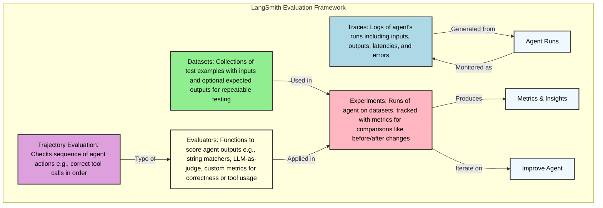

# LangSmith Evaluation Tutorial

This tutorial demonstrates LangSmith's evaluation capabilities with practical examples using MCP (Model Context Protocol) integration.

## Quick Start Example

```python
import os
from dotenv import load_dotenv

# Load environment variables
load_dotenv()

# LangSmith is already configured via .env:
# LANGCHAIN_TRACING_V2=true
# LANGCHAIN_API_KEY=lsv2_pt_...
# LANGCHAIN_PROJECT=pr-mcp-quick-test

from typing import Annotated, Sequence
from fastapi import FastAPI, Request
from fastapi.responses import HTMLResponse
from fastapi.staticfiles import StaticFiles
from pydantic import BaseModel
from langchain_core.messages import BaseMessage, SystemMessage, HumanMessage, ToolMessage
from langgraph.graph.message import add_messages
from langgraph.graph import StateGraph, END
from langchain_core.tools import tool
from langchain_aws import ChatBedrock
from langgraph.checkpoint.memory import MemorySaver
import json

# Serving Static files
app = FastAPI()
app.mount("/static", StaticFiles(directory="static", html=True), name="static")

# LLM: AWS Nova Lite via Bedrock
llm = ChatBedrock(
    model_id=os.getenv("BEDROCK_MODEL", "amazon.nova-lite-v1:0"),
    region_name=os.getenv("AWS_REGION", "us-east-1")
)

# Simple tool
@tool
def multiply(a: int, b: int) -> int:
    """Multiply two numbers."""
    return a * b

tools = [multiply]
llm = llm.bind_tools(tools)
tools_by_name = {tool.name: tool for tool in tools}

# State
class AgentState(dict):
    messages: Annotated[Sequence[BaseMessage], add_messages]

# Nodes
def tool_node(state: AgentState):
    outputs = []
    for tool_call in state["messages"][-1].tool_calls:
        tool_result = tools_by_name[tool_call["name"]].invoke(tool_call["args"])
        outputs.append(ToolMessage(content=json.dumps(tool_result), name=tool_call["name"], tool_call_id=tool_call["id"]))
    return {"messages": outputs}

def call_model(state: AgentState):
    system_prompt = SystemMessage("You are a helpful AI. Use tools if needed.")
    response = llm.invoke([system_prompt] + state["messages"])
    return {"messages": [response]}

# Condition
def should_continue(state: AgentState):
    last_message = state["messages"][-1]
    if not last_message.tool_calls:
        return "end"
    return "continue"

# Graph
workflow = StateGraph(state_schema=AgentState)
workflow.add_node("agent", call_model)
workflow.add_node("tools", tool_node)
workflow.set_entry_point("agent")
workflow.add_conditional_edges("agent", should_continue, {"continue": "tools", "end": END})
workflow.add_edge("tools", "agent")
memory = MemorySaver()
graph = workflow.compile(checkpointer=memory)

class ChatInput(BaseModel):
    message: str
    thread_id: str = "1"  # Default for simplicity

# Frontend calling these endpoints
@app.get("/", response_class=HTMLResponse)
async def root(request: Request):
    return HTMLResponse(open("static/index.html").read())

@app.post("/chat")
async def chat(input: ChatInput):
    config = {"configurable": {"thread_id": input.thread_id}}
    state = {"messages": [HumanMessage(content=input.message)]}
    result = graph.invoke(state, config)
    return {"response": result["messages"][-1].content}
```

---

## Core Evaluation Concepts

### 1. **Datasets**
Collections of test examples with inputs and optional expected outputs for repeatable testing.

### 2. **Evaluators** 
Functions to score agent outputs using:
- String matchers
- LLM-as-judge
- Custom metrics (correctness, tool usage, etc.)

### 3. **Experiments**
Runs of your agent on datasets, tracked with metrics for comparison.

### 4. **Trajectory Evaluation**
For agents: check the sequence of actions (tool calls) taken.

---

## Improved Evaluation Framework

### Key Improvements Over Basic Setup

1. **Async Evaluation** - Better performance with `aevaluate()`
2. **Comparative Evaluation** - Compare experiments with `evaluate_comparative()`
3. **Agent Trajectory Tracking** - Validate tool usage sequences
4. **Summary Evaluators** - Aggregate metrics across datasets
5. **Dataset Versioning** - Track dataset changes over time
6. **Metadata Tracking** - Tag experiments with model versions, prompts, etc.

---

## 1. Creating Datasets

Datasets store evaluation examples with inputs and expected outputs.

```python
from langsmith import Client

client = Client()

# Create dataset
dataset_name = "MTR Simple QA"
dataset = client.create_dataset(
    dataset_name=dataset_name,
    description="Simple Q&A examples for MTR"
)

# Batch create examples (modern approach)
examples = [
    {
        "inputs": {"question": "What is MTR?"},
        "outputs": {"answer": "Mass Transit Railway"}
    },
    {
        "inputs": {"question": "How many lines?"},
        "outputs": {"answer": "10 lines"}
    },
]

client.create_examples(
    inputs=[ex["inputs"] for ex in examples],
    outputs=[ex["outputs"] for ex in examples],
    dataset_id=dataset.id,
)
```

### Dataset Versioning

```python
# Tag dataset version
client.update_dataset(
    dataset_id=dataset.id,
    metadata={"version": "v1.0", "date": "2025-10-24"}
)

# Evaluate on specific version
from langsmith.evaluation import evaluate

results = evaluate(
    target_function,
    data=client.list_examples(dataset_name=dataset_name, as_of="2025-10-24"),
    evaluators=[evaluators],
)
```

---

## 2. Defining Evaluators

### Row-Level Evaluators

Evaluate individual examples:

#### 3. **Defining Evaluators**
   Use built-in or custom evaluators to score outputs.

   - **String Evaluator** (e.g., for correctness):
     ```python
     from langsmith.evaluation import LangChainStringEvaluator

     # Scores based on criteria like "correctness" using an LLM judge
     correctness_evaluator = LangChainStringEvaluator(
         "labeled_score_string",
         config={
             "criteria": {
                 "correctness": "Is the response factually correct compared to the reference?"
             },
             "normalize_by": 10  # Score out of 10
         },
         prepare_data=lambda run, example: {
             "prediction": run.outputs["messages"][-1].content,
             "reference": example.outputs["output"] if example.outputs else "",
             "input": run.inputs["messages"][0].content
         }
     )
     ```

   - **Custom Evaluator** (e.g., check if tool was called):
     ```python
     from langsmith.evaluation import EvaluatorType, run_evaluator

     @run_evaluator
     def tool_usage_evaluator(run, example):
         # Check if tool was called when expected
         tool_calls = [msg for msg in run.outputs["messages"] if isinstance(msg, ToolMessage)]
         expected_tool_use = "multiply" in example.inputs["messages"][0].content.lower()
         score = 1 if (len(tool_calls) > 0) == expected_tool_use else 0
         return {"key": "tool_usage_correct", "score": score, "comment": "Checks correct tool invocation"}
     ```

   - **Trajectory Evaluator** (for agent paths):
     LangSmith supports evaluating the full sequence of agent actions (e.g., model -> tool -> model).

     ```python
     from langsmith.evaluation import evaluate_trajectory

     # Use in evaluate() below
     ```

```python
from langsmith.evaluation import evaluate

def my_target(inputs: dict) -> dict:
    """Your system to evaluate."""
    response = llm.invoke(inputs["question"])
    return {"answer": response.content}

# Run evaluation
results = evaluate(
    my_target,
    data=dataset_name,
    evaluators=[exact_match, is_concise],
    experiment_prefix="baseline-v1",
    description="First baseline evaluation",
    metadata={
        "model": "amazon.nova-lite-v1:0",
        "temperature": 0.0,
    },
    max_concurrency=4,
)
```

### Async Evaluation (Recommended)

Better performance with concurrency:

```python
from langsmith import aevaluate

async def async_target(inputs: dict) -> dict:
    """Async version of your system."""
    response = await async_llm.ainvoke(inputs["question"])
    return {"answer": response.content}

# Run async evaluation
results = await client.aevaluate(
    async_target,
    data=dataset_name,
    evaluators=[evaluators],
    max_concurrency=10,  # Higher concurrency
    experiment_prefix="async-baseline",
)
```

### Comparative Evaluation

Compare two experiments:

```python
from langsmith.evaluation import evaluate_comparative

# First, run two experiments
exp1 = evaluate(target_v1, data=dataset_name, evaluators=[...])
exp2 = evaluate(target_v2, data=dataset_name, evaluators=[...])

# Then compare with pairwise evaluator
def preference_evaluator(inputs: dict, runs: list) -> dict:
    """LLM judges which output is better."""
    # runs[0] is from exp1, runs[1] is from exp2
    prompt = f"Question: {inputs['question']}\nA: {runs[0].outputs['answer']}\nB: {runs[1].outputs['answer']}\nWhich is better?"
    # Use LLM to judge...
    return {"key": "preference", "scores": [0.3, 0.7]}  # B is better

results = evaluate_comparative(
    experiments=(exp1.experiment_name, exp2.experiment_name),
    evaluators=[preference_evaluator],
    randomize_order=True,  # Reduce bias
)
```

### Repetitions for Statistical Significance

```python
results = evaluate(
    target,
    data=dataset_name,
    evaluators=[evaluators],
    num_repetitions=3,  # Run each example 3 times
)
```

---

## 4. Practical Example

See `langsmith_eval_example.py` for a complete working example that:

1. ✅ Creates a dataset with MTR Q&A examples
2. ✅ Defines multiple evaluators (exact_match, keywords, concise)
3. ✅ Runs evaluation with metadata tracking
4. ✅ Displays results and scores

Run it with:
```bash
python langsmith_eval_example.py
```

---

## 5. Advanced Patterns

### Multi-Turn Simulation

For conversational agents:

```python
from openevals import run_multiturn_simulation, create_llm_simulated_user

user = create_llm_simulated_user(
    system="You are asking about MTR trains",
    model="openai:gpt-4o-mini",
)

result = run_multiturn_simulation(
    app=your_agent,
    user=user,
    max_turns=5,
    trajectory_evaluators=[satisfaction_evaluator],
)
```

### Agent Trajectory Tracking

Track intermediate steps:

```python
async def run_agent_with_trajectory(inputs: dict) -> dict:
    """Run agent and track tool calls."""
    trajectory = []
    
    async for event in graph.astream(inputs, stream_mode="debug"):
        if event["type"] == "task":
            trajectory.append(event["payload"]["name"])
    
    return {"trajectory": trajectory, "response": final_response}
```

---

## 6. Best Practices

### ✅ Do's

1. **Tag experiments** with metadata (model, version, prompt)
2. **Use async evaluation** for better performance
3. **Run multiple repetitions** for variance analysis
4. **Compare experiments** to measure improvements
5. **Track dataset versions** over time

### ❌ Don'ts

1. Don't evaluate without baselines
2. Don't ignore edge cases in datasets
3. Don't use only exact match evaluators
4. Don't skip metadata tracking

---

## 7. LangSmith UI Features

After running evaluations, visit https://smith.langchain.com/ to:

- 📊 **Compare experiments** side-by-side
- 🔍 **View detailed traces** of each run
- 📈 **Analyze aggregate metrics** across datasets
- 🏷️ **Filter by metadata** (model, version, etc.)
- 💬 **Add human feedback** to improve evaluators

---

## 8. Summary

LangSmith's evaluation framework provides:

✅ **Systematic testing** with datasets and evaluators
✅ **Experiment tracking** to measure improvements
✅ **Comparative analysis** between different versions
✅ **Async support** for better performance
✅ **Agent-specific** trajectory and tool evaluation
✅ **Metadata tracking** for reproducibility

### Quick Reference

| Feature | Code |
|---------|------|
| Create dataset | `client.create_dataset()` |
| Add examples | `client.create_examples()` |
| Run evaluation | `evaluate(target, data, evaluators)` |
| Async evaluation | `await aevaluate(...)` |
| Compare experiments | `evaluate_comparative((exp1, exp2), ...)` |
| Track metadata | `metadata={"model": "...", "version": "..."}` |

---

# Langsmith

