# Tutorial: Integrating LangSmith with Flowise Agent Flow

This tutorial will guide you through the process of integrating LangSmith tracing and monitoring with your Flowise agent flow.

## Table of Contents
1. [Prerequisites](#prerequisites)
2. [Setting up LangSmith](#setting-up-langsmith)
3. [Configuring Flowise](#configuring-flowise)
4. [Testing the Integration](#testing-the-integration)

---

## Prerequisites

- A LangSmith account
- A running Flowise instance
- An existing agent flow in Flowise

---

## Setting up LangSmith

### Step 1: Login to LangSmith

Navigate to [https://smith.langchain.com](https://smith.langchain.com) and log in to your account.

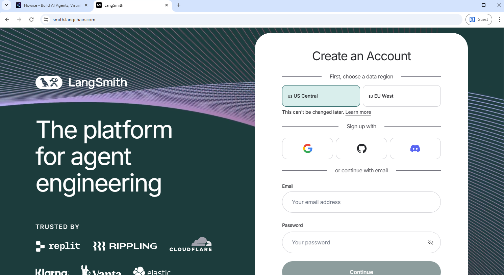

### Step 2: Access Your Dashboard

After logging in, you'll see your personal dashboard with an overview of your tracing projects.

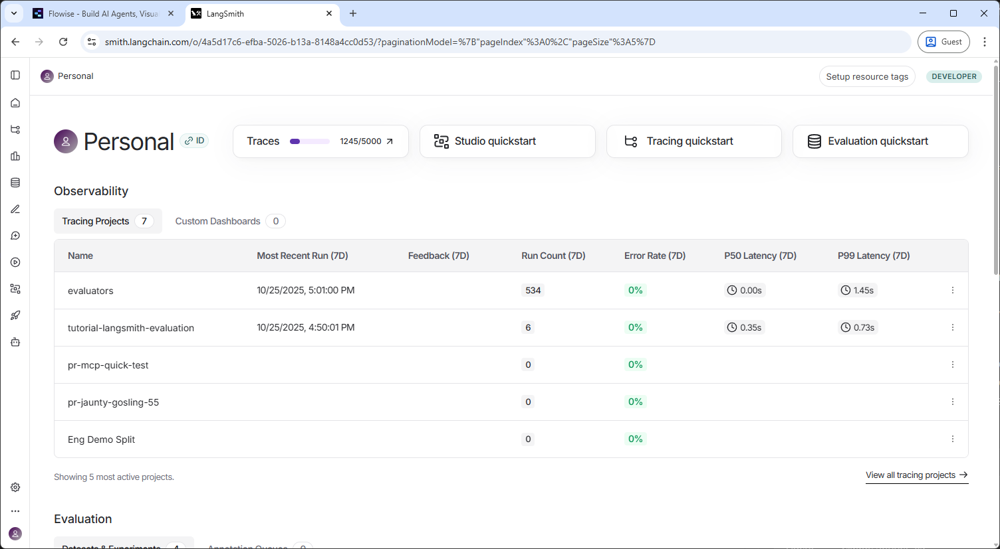

### Step 3: Expand the Navigation Panel

Click on the expand icon to view the full navigation menu.

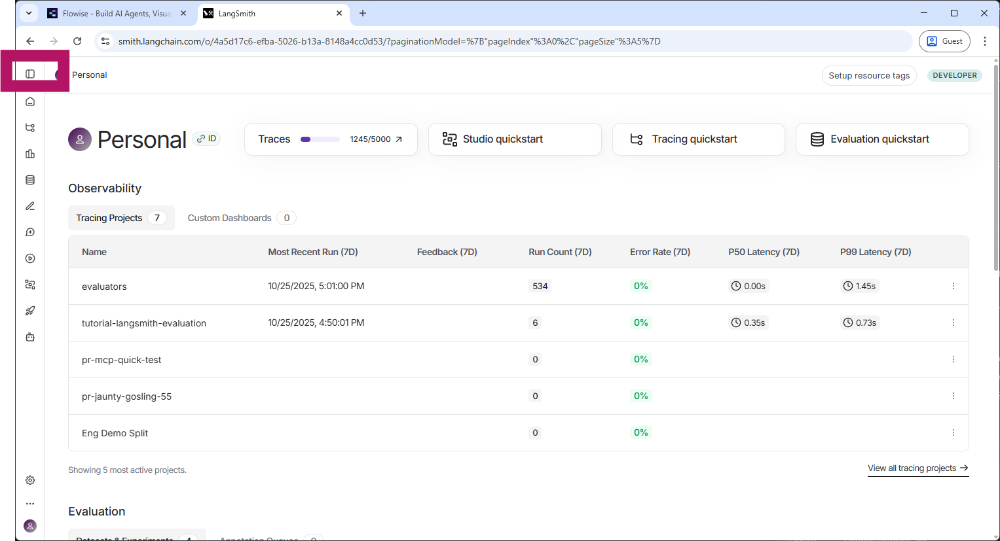

### Step 4: Create a New Tracing Project

1. Click on **"Tracing Projects"** in the left sidebar
2. Click the **"+ New Project"** button

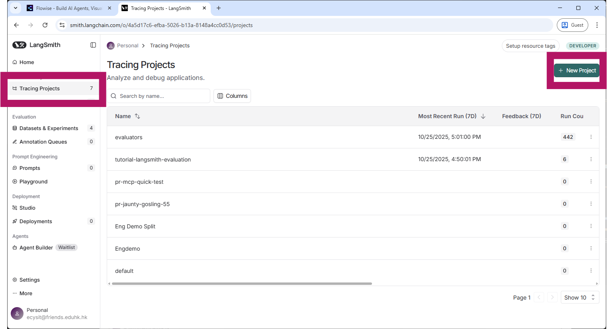

### Step 5: Generate API Key

Click on the **"Generate API Key"** button to create a new API key for your project.

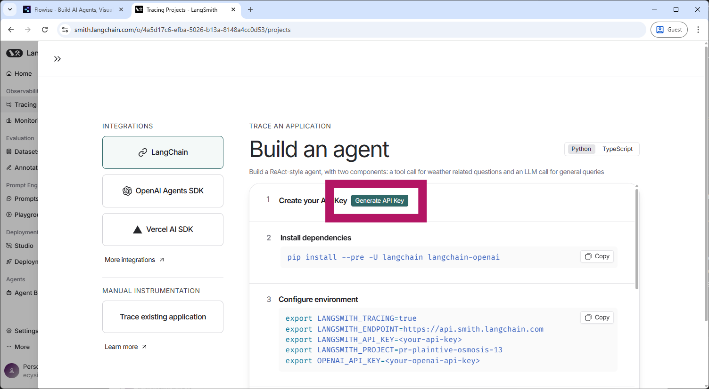

### Step 6: Copy the API Key

Once generated, copy the LangSmith API key. You'll need this to configure Flowise.

**Important:** Store this API key securely. You won't be able to see it again after closing this dialog.

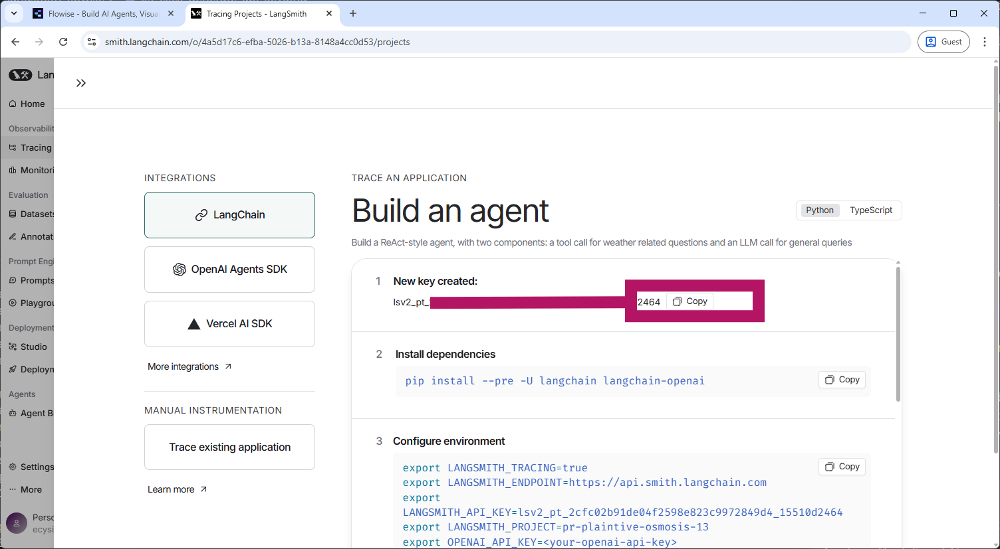

---

## Configuring Flowise

### Step 7: Open Your Agent Flow

In Flowise, open the agent flow where you want to enable LangSmith tracing.

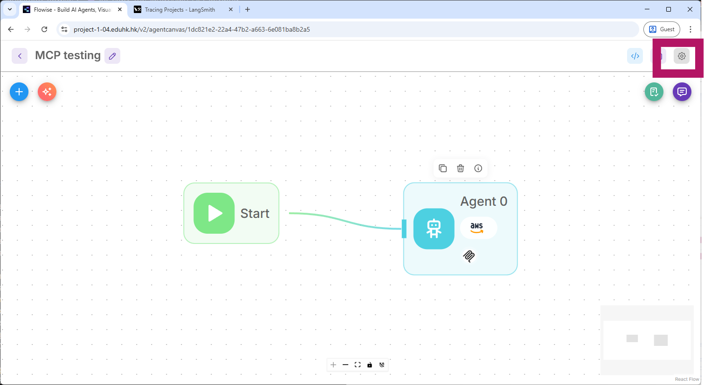

### Step 8: Access Flow Settings

Click on the **Settings** icon (gear icon) in the top right corner of your flow.

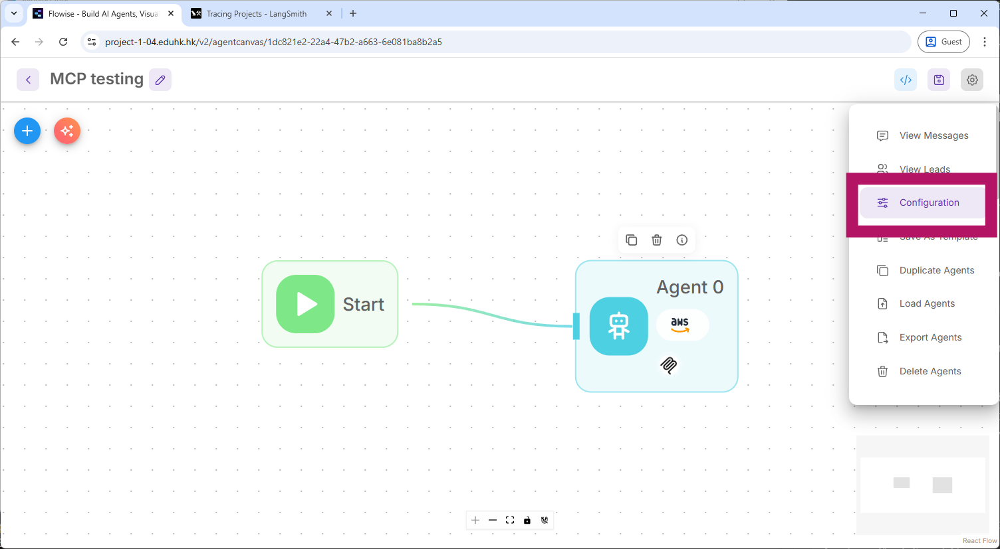

### Step 9: Navigate to Analyze Chatflow

1. Click on the **"Analyse Chatflow"** tab
2. Click on the dropdown menu to configure tracing options

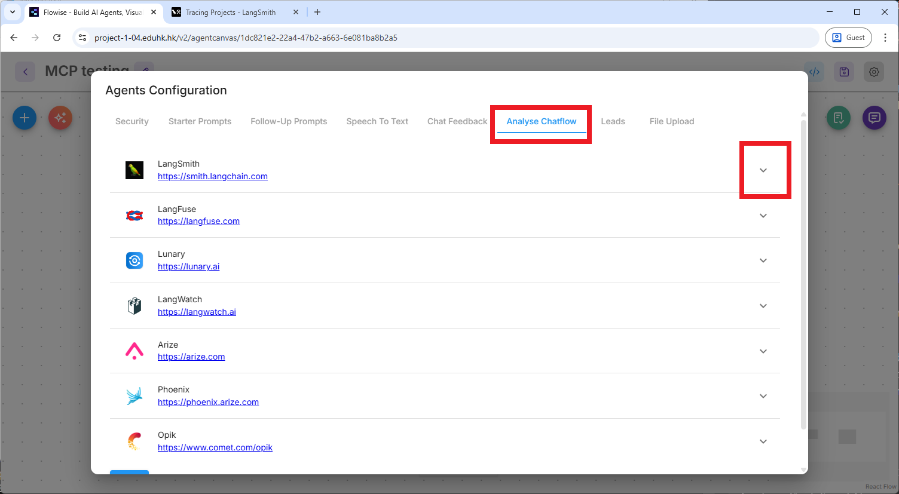

### Step 10: Select LangSmith

From the dropdown menu, select **"LangSmith"** as your tracing provider.

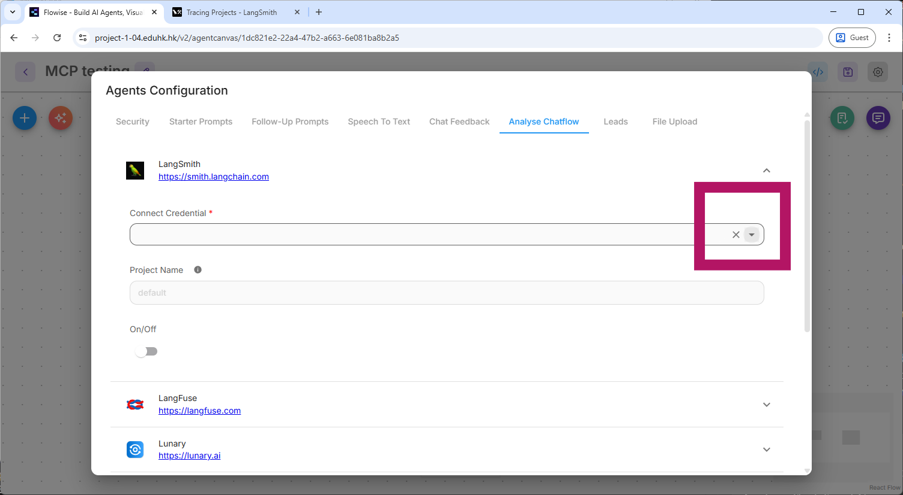

### Step 11: Create New Credential

Click on **"Create New"** to add your LangSmith API credentials.

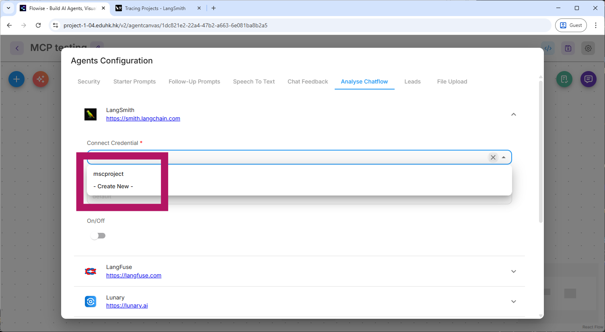

### Step 12: Input Credentials

In the credential dialog:
1. **Credential Name**: Enter a descriptive name (e.g., "mscproject")
2. **API Key**: Paste the LangSmith API key you copied in Step 6
3. **Endpoint**: The default endpoint should be `https://api.smith.langchain.com`
4. Click **"Add"** to save the credential

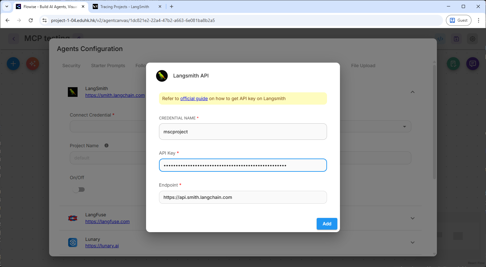

### Step 13: Configure Project Settings

1. Select the credential you just created from the dropdown (e.g., "mscproject")
2. **Project Name**: Enter a name for tracking this flow in LangSmith
3. Toggle the switch to **On** to enable LangSmith tracing

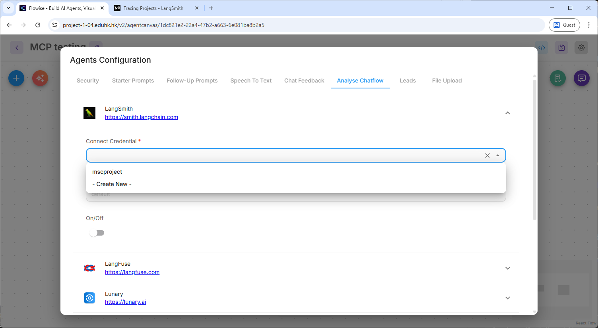

### Step 14: Save Configuration

Scroll down and click the **"Save"** button to apply all changes.

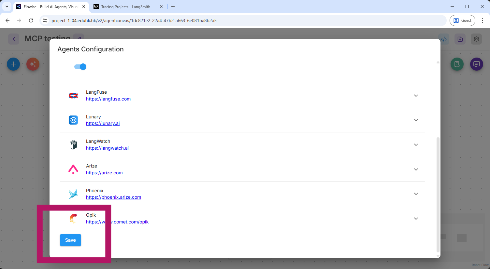

---

## Testing the Integration

After saving your configuration:

1. Test your Flowise agent flow by sending a few test messages
2. Return to your LangSmith dashboard at [https://smith.langchain.com](https://smith.langchain.com)
3. Navigate to your tracing project
4. You should now see traces appearing for each interaction with your Flowise agent

---

## Troubleshooting

### Common Issues

**Issue:** Traces not appearing in LangSmith
- Verify that the API key is correct
- Ensure the project name in Flowise matches the one in LangSmith
- Check that tracing is toggled "On" in Flowise settings
- Confirm the endpoint URL is correct: `https://api.smith.langchain.com`

**Issue:** Authentication errors
- Regenerate your API key in LangSmith
- Update the credential in Flowise with the new key

**Issue:** Missing data in traces
- Ensure all nodes in your Flowise flow support LangSmith tracing
- Check that you've saved the configuration after making changes

---

## Benefits of LangSmith Integration

✅ **Full Observability**: Track every interaction with your agent flow  
✅ **Performance Monitoring**: Monitor latency and identify bottlenecks  
✅ **Debugging**: View detailed traces to troubleshoot issues  
✅ **Usage Analytics**: Understand how your agent is being used  
✅ **Error Tracking**: Quickly identify and diagnose errors

---

## Additional Resources

- [LangSmith Documentation](https://docs.smith.langchain.com)
- [Flowise Documentation](https://docs.flowiseai.com)
- [LangChain Documentation](https://python.langchain.com/docs/get_started/introduction)

---

## Conclusion

You have successfully integrated LangSmith with your Flowise agent flow! You can now monitor, trace, and analyze all interactions with your AI agent through the LangSmith dashboard.

For advanced configuration options and evaluation features, refer to the official LangSmith documentation.
