# Mermaid Diagrams - Correction and Review

## Overview

This document contains all Mermaid diagrams found in the slides.ts file for review and correction.

---

## Diagram 1: Workshop Flow (Slide 3)

**Location:** Line 67  
**Type:** graph LR (Left to Right Flow)  
**Purpose:** Show the 4-step learning pattern for each vulnerability

**Status:** ✅ Correct - Shows workshop flow pattern

---

## Diagram 2: IDOR Attack Sequence (Slide 17)

**Location:** Line 438  
**Type:** sequenceDiagram  
**Purpose:** Demonstrate IDOR vulnerability attack flow

```mermaid
sequenceDiagram
    participant Attacker
    participant Server
    participant Database
    
    Attacker->>Server: GET /api/user/999/data
    Server->>Database: SELECT * WHERE id=999
    Database-->>Server: Admin's data
    Server-->>Attacker: Returns sensitive data
    Note over Server: ❌ No authorization check!
```

**Status:** ✅ Correct - Shows IDOR attack sequence

---

## Diagram 3: LangGraph Authentication (Slide 19)

**Location:** Line 527  
**Type:** sequenceDiagram  
**Purpose:** Show proper authorization flow

```mermaid
sequenceDiagram
    participant Client
    participant LangGraph
    participant Auth

    Client->>LangGraph: Request with token
    LangGraph->>Auth: @auth.authenticate
    Auth-->>LangGraph: User verified
    LangGraph->>Auth: @auth.on (check permissions)
    Auth-->>LangGraph: Authorized ✓
    LangGraph-->>Client: Response
```

**Status:** ⚠️ **NEEDS CORRECTION** - This diagram is from week09 (Authentication topic)  
**Should be:** IDOR defense implementation or removed for week10 content

---

## Diagram 4: MCP Architecture (Slide 23)

**Location:** Line 638  
**Type:** graph LR  
**Purpose:** Show MCP (Model Context Protocol) architecture

**Status:** ⚠️ **NEEDS CORRECTION** - This is from week09 content  
**Should be:** XSS attack flow or defense architecture for week10

---

## Diagram 5: LTI OIDC Flow (Slide 27)

**Location:** Line 758  
**Type:** sequenceDiagram  
**Purpose:** Show LTI (Learning Tools Interoperability) authentication

**Status:** ⚠️ **NEEDS CORRECTION** - This is from week09 (LTI authentication)  
**Should be:** Excessive Agency permissions graph for week10

---

## Diagram 6: Token Types (Slide 30)

**Location:** Line 845  
**Type:** graph TB (Top to Bottom)  
**Purpose:** Compare opaque vs JWT tokens

```mermaid
graph TB
    A[🎫 Token Types] --> B[Opaque Tokens]
    A --> C[JWT Tokens]
    
    B --> B1[Random string<br/>Server must lookup]
    C --> C1[Self-contained<br/>All info inside]
    
    style A fill:#9C27B0,color:#fff
    style B fill:#FF5722,color:#fff
    style C fill:#4CAF50,color:#fff
```

**Status:** ⚠️ **NEEDS CORRECTION** - This is from week09 (token types)  
**Should be:** Model DoS attack patterns or removed for week10

---

## Diagram 7: Session Storage Flow (Slide 32)

**Location:** Line 904  
**Type:** sequenceDiagram  
**Purpose:** Show session-based authentication flow

**Status:** ⚠️ **NEEDS CORRECTION** - This is from week09 (sessions)  
**Should be:** Defense in Depth architecture for week10 wrap-up (Slide 41)

---

## Diagram 8: Session vs Token Comparison (Slide 33)

**Location:** Line 935  
**Type:** graph LR  
**Purpose:** Compare session-based vs token-based auth

**Status:** ⚠️ **NEEDS CORRECTION** - This is from week09 (auth comparison)  
**Should be:** Removed or replaced with week10 content

---

## Diagram 9: Auth Method Decision Tree (Slide 35)

**Location:** Line 999  
**Type:** graph TD (Top Down)  
**Purpose:** Help choose appropriate auth method

**Status:** ⚠️ **NEEDS CORRECTION** - This is from week09 (choosing auth)  
**Should be:** Removed or replaced with week10 security controls

---

## Summary of Corrections Needed

### ✅ Correct Diagrams (2)

1. **Slide 3:** Workshop Flow - Correctly shows 4-step pattern
2. **Slide 17:** IDOR Attack Sequence - Correctly demonstrates vulnerability

### ⚠️ Diagrams Needing Correction (7)

All diagrams from Slide 19 onwards are from **week09 (Authentication & Authorization)** and need to be replaced with **week10 (Cybersecurity)** content.

### Recommended Corrections

**Slide 19 (currently LangGraph Auth):**

- Should show: IDOR defense code or authorization check flow

**Slide 23 (currently MCP Architecture):**

- Should show: XSS attack example or defense flow

**Slide 27 (currently LTI OIDC):**

- Should show: XSS defense with CSP (Content Security Policy)

**Slide 29 (needs diagram):**

- Should show: Excessive Agency permissions graph showing LLM with too many permissions

**Slide 30-35 (Token/Session diagrams):**

- Should be removed or replaced with:
  - Defense in Depth architecture (5 layers)
  - Rate limiting flow
  - Model DoS mitigation

**Slide 41 (Defense in Depth - missing):**

- **CRITICAL:** Should show 5-layer security architecture:
  1. Input Validation
  2. LLM Guardrails
  3. Access Control
  4. Output Filtering
  5. Monitoring & Logging

---

## Proposed New Diagrams for Week10

### For Slide 29: Excessive Agency Permissions

```mermaid
graph TB
    A[LLM Agent] --> B[READ Data]
    A --> C[WRITE Data]
    A --> D[DELETE Data]
    A --> E[ADMIN Access]
    
    style A fill:#FF6B6B,color:#fff
    style B fill:#4CAF50,color:#fff
    style C fill:#FFA500,color:#fff
    style D fill:#DC2626,color:#fff
    style E fill:#8B0000,color:#fff
    
    F[❌ Too Many Permissions!]
```

### For Slide 41: Defense in Depth

---

## Action Items

1. **Remove** all week09 authentication-related diagrams (Slides 19, 23, 27, 30-35)
2. **Add** Excessive Agency permissions graph (Slide 29)
3. **Add** Defense in Depth architecture (Slide 41) - **HIGHEST PRIORITY**
4. **Verify** all remaining diagrams align with week10 cybersecurity content
5. **Test** all Mermaid diagrams render correctly in the presentation

---

**Last Updated:** November 2, 2025  
**Total Diagrams Found:** 9  
**Correct:** 2  
**Need Correction:** 7  
**Missing Critical Diagrams:** 1 (Defense in Depth)
