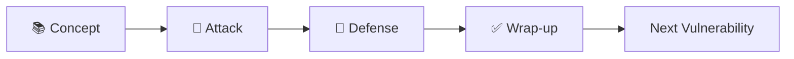
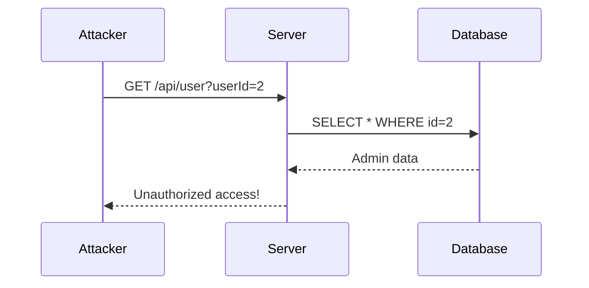
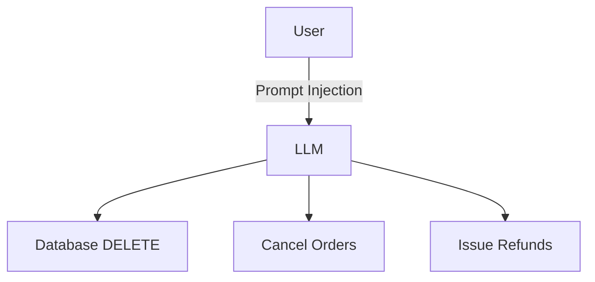
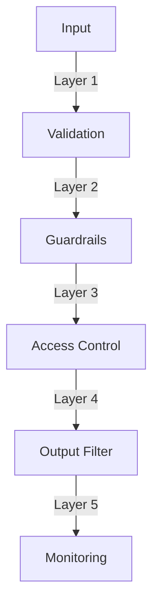

# Week 10 Presentation Implementation Plan

## 🎯 Objective

Create an interactive presentation for the Chatbot Cybersecurity Workshop that follows a structured 4-step flow for each vulnerability:

1. **Introduce Concept** - What is the vulnerability?
2. **Allow Student to Hack** - Red Team attack challenge (5-7 minutes hands-on)
3. **Teach How to Defend** - Blue Team defense implementation
4. **Wrap Up** - Key takeaways and transition

## 📋 Current Status

### ✅ Completed

- Week09 presentation structure copied to week10/presentation/
- PRESENTATION-GUIDE.md created with comprehensive overview
- Project structure set up (React + TypeScript + Vite)
- All components ready (SlideView, CodeBlock, MermaidDiagram)

### 🔄 In Progress

- Creating slides.ts with vulnerability content

### ⏳ To Do

- Complete all 12 vulnerability slide sets
- Test presentation flow
- Add Mermaid diagrams for complex concepts
- Review timing for 3-hour workshop

## 🗂️ Presentation Structure

### Part 1: Introduction (3 slides, ~10 minutes)

1. **Title Slide** - Workshop overview
2. **Workshop Objectives** - What students will learn
3. **Flow Explanation** - 4-step pattern with visual diagram

### Part 2: Core Vulnerabilities (6 × 6 slides each = 36 slides, ~150 minutes)

Each vulnerability follows this 6-slide pattern:

#### Vulnerability 1: Prompt Injection (Slides 4-9)

- Slide 4: **Concept Introduction** - What is prompt injection?
- Slide 5: **How It Works** - Code example/diagram
- Slide 6: **🔴 Red Team Challenge** - Attack exercise (5 min)
- Slide 7: **🔵 Defense Strategy** - Protection techniques
- Slide 8: **🔵 Defense Code** - Implementation
- Slide 9: **✅ Wrap-up** - Key takeaways

#### Vulnerability 2: Data Leakage (Slides 10-15)

- Same 6-slide pattern

#### Vulnerability 3: IDOR (Slides 16-21)

- Same 6-slide pattern

#### Vulnerability 4: XSS (Slides 22-27)

- Same 6-slide pattern

#### Vulnerability 5: Excessive Agency (Slides 28-33)

- Same 6-slide pattern

#### Vulnerability 6: Model DoS (Slides 34-39)

- Same 6-slide pattern

### Part 3: Additional Vulnerabilities Overview (1 slide, ~5 minutes)

- Slide 40: **Brief overview** of remaining 6 vulnerabilities
  - System Prompt Leakage
  - Multi-Turn Jailbreaking
  - RAG Database Manipulation
  - Training Data Extraction
  - SQL Injection
  - Command Injection

### Part 4: Comprehensive Wrap-up (8 slides, ~20 minutes)

- Slide 41: **Defense in Depth Strategy** - 5-layer architecture diagram
- Slide 42: **Essential Security Controls** - Checklist
- Slide 43: **OWASP LLM Top 10** - Complete list with coverage mapping
- Slide 44: **Security Tools & Resources** - Garak, PromptBench, etc.
- Slide 45: **What You've Learned** - Summary
- Slide 46: **Next Steps** - Continued learning paths
- Slide 47: **Ethical Hacking Reminder** - Important warnings
- Slide 48: **Thank You & Questions** - Closing

**Total: 48 slides for 3-hour workshop**

## 🎨 Design Specifications

### Color Coding System

```typescript
// Slide backgrounds by type:
- Red (#DC2626):   Red Team attack slides
- Blue (#059669):  Blue Team defense slides  
- Blue (#3B82F6):  Concept introduction slides
- Purple (#8B5CF6): Wrap-up/summary slides
- Yellow (#F59E0B): Warning/important slides
```

### Content Types Per Slide

1. **Bullets** - Main talking points
2. **BulletPoint Interface** - point + subtext for detailed explanations
3. **Code Snippets** - Actual attack/defense code examples
4. **Mermaid Diagrams** - Flow charts, sequence diagrams, architecture

## ⏱️ Timing Breakdown

### 3-Hour Workshop (180 minutes)

- **Introduction**: 10 minutes (slides 1-3)
- **6 Vulnerabilities**: 150 minutes (25 min each)
  - Concept intro: 5 min
  - Red Team attack: 7 min (hands-on)
  - Blue Team defense: 7 min
  - Wrap-up: 2 min
  - Discussion/Q&A: 4 min
- **Overview of 6 more**: 5 minutes (slide 40)
- **Comprehensive wrap-up**: 15 minutes (slides 41-48)

### 5-Hour Extended Workshop (300 minutes)

- Same structure but cover all 12 vulnerabilities
- 12 × 25 min = 300 min total
- Add breaks between vulnerabilities

## 📝 Content Guidelines

### For Each Vulnerability Slide Set

#### Slide A: Concept (Blue #3B82F6)

```typescript
{
  title: "Vulnerability X: [Name]",
  bullets: [
    { point: "What is it?", subtext: "Clear definition" },
    { point: "Why it matters", subtext: "Impact explanation" },
    { point: "OWASP Mapping", subtext: "LLM01-LLM10 reference" }
  ],
  backgroundColor: "#3B82F6"
}
```

#### Slide B: How It Works

- Code example OR Mermaid diagram
- Step-by-step explanation
- Real-world context

#### Slide C: Red Team (Red #DC2626)

```typescript
{
  title: "🔴 RED TEAM: [Vulnerability] Attack",
  bullets: [
    "⏱️ Time: 5-7 minutes",
    "🎯 Goal: [Specific objective]",
    "💡 Try: [Attack pattern 1]",
    "💡 Try: [Attack pattern 2]",
    "📝 Document your findings!"
  ],
  backgroundColor: "#DC2626"
}
```

#### Slide D: Defense Strategy (Blue #059669)

```typescript
{
  title: "🔵 BLUE TEAM: Defend Against [Vulnerability]",
  bullets: [
    { point: "Technique 1", subtext: "How it works" },
    { point: "Technique 2", subtext: "Implementation" },
    { point: "Technique 3", subtext: "Best practice" }
  ],
  backgroundColor: "#059669"
}
```

#### Slide E: Defense Code (Blue #059669)

- Complete working code example
- Comments explaining security controls
- Before/after comparison if helpful

#### Slide F: Wrap-up (Purple #8B5CF6)

```typescript
{
  title: "✅ [Vulnerability]: Key Takeaways",
  bullets: [
    "🎯 Main point about the vulnerability",
    "🔴 What attackers can do",
    "🔵 How to defend",
    "⚠️ Critical warning",
    "📚 OWASP reference"
  ]
}
```

## 🔧 Technical Implementation

### File Structure

```
week10/presentation/
├── src/
│   ├── data/
│   │   ├── slides.ts          ← Main content file (TO CREATE)
│   │   └── slides-template.ts ← Week09 reference
│   ├── components/
│   │   ├── SlideView.tsx      ✅ Ready
│   │   ├── CodeBlock.tsx      ✅ Ready
│   │   └── MermaidDiagram.tsx ✅ Ready
│   ├── App.tsx                ✅ Ready
│   └── main.tsx               ✅ Ready
├── PRESENTATION-GUIDE.md      ✅ Created
├── plan.md                    ✅ This file
└── package.json               ✅ Ready
```

### Slide Data Structure

```typescript
export interface Slide {
  id: number;
  title: string;
  bullets: (string | BulletPoint)[];
  mermaidDiagram?: string;
  codeSnippet?: {
    language: string;
    code: string;
  };
  backgroundColor?: string;
  textColor?: string;
}
```

## 📊 Mermaid Diagrams to Include

### 1. Workshop Flow (Slide 3)



### 2. IDOR Attack Sequence (Slide 17)



### 3. Excessive Agency (Slide 29)



### 4. Defense in Depth (Slide 41)



## 🎓 Learning Objectives

By the end of this presentation, students will be able to:

1. ✅ Identify 12 critical chatbot vulnerabilities
2. ✅ Execute Red Team attacks using browser tools
3. ✅ Implement Blue Team defenses with code
4. ✅ Understand OWASP Top 10 for LLM Applications
5. ✅ Apply defense-in-depth security strategies
6. ✅ Use security testing tools (conceptually)

## 🚀 Implementation Steps

### Phase 1: Create Core Content ⏳

1. Generate slides 1-3 (Introduction)
2. Generate slides 4-9 (Prompt Injection)
3. Generate slides 10-15 (Data Leakage)
4. Generate slides 16-21 (IDOR)
5. Generate slides 22-27 (XSS)
6. Generate slides 28-33 (Excessive Agency)
7. Generate slides 34-39 (Model DoS)

### Phase 2: Wrap-up Content ⏳

8. Generate slide 40 (Additional vulnerabilities)
9. Generate slides 41-48 (Comprehensive wrap-up)

### Phase 3: Review & Test ⏳

10. Review all code examples for accuracy
11. Test Mermaid diagrams render correctly
12. Verify timing fits 3-hour workshop
13. Check color consistency

### Phase 4: Documentation ⏳

14. Update PRESENTATION-GUIDE.md with final slide numbers
15. Create facilitator notes for each slide
16. Add speaker notes if needed

## 📌 Key Principles

1. **Hands-on First** - Students learn by doing (Red Team challenges)
2. **Clear Pattern** - Same 6-slide structure for consistency
3. **Practical Code** - Every defense has working implementation
4. **Visual Learning** - Diagrams for complex concepts
5. **Ethical Focus** - Constant reminders about responsible use

## 🎯 Success Metrics

- ✅ All 48 slides created
- ✅ Each vulnerability has complete 6-slide set
- ✅ All code examples are syntactically correct
- ✅ Mermaid diagrams render properly
- ✅ Timing fits workshop duration
- ✅ Color coding is consistent
- ✅ Content aligns with workshop materials

## 📚 Reference Materials

- `week10/exercises/red-team-challenges.md` - Attack details
- `week10/exercises/blue-team-defenses.md` - Defense implementations
- `week10/ADVANCED-CONCEPTS.md` - Deep technical content
- `week10/QUICK-REFERENCE.md` - Quick lookup guide
- `week09/presentation/src/data/slides.ts` - Template reference

## 🔄 Next Actions

1. ✅ Create plan.md (this file)
2. ⏳ Create slides-overview.md
3. ⏳ Implement slides.ts with all 48 slides
4. ⏳ Test presentation locally
5. ⏳ Review with workshop materials for consistency

---

**Created**: November 2, 2025
**Status**: Planning Phase Complete, Ready for Implementation
